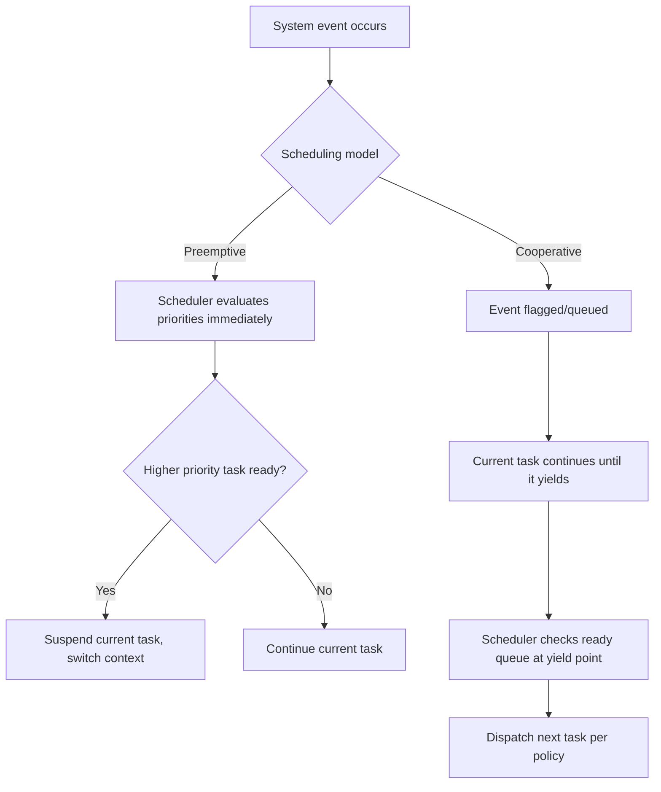

## Preemptive vs Cooperative Multitasking

### Overview

Preemptive and cooperative multitasking represent two fundamentally different answers to the same question: when does control switch from one task to another? In preemptive multitasking, the scheduler can forcibly interrupt a running task at almost any point to run something more urgent. In cooperative multitasking, a task keeps the CPU until it explicitly gives it up. This distinction shapes nearly everything downstream in an embedded system's design — synchronization strategy, worst-case latency analysis, stack usage, and even how bugs manifest and get debugged.

### Preemptive Multitasking

In a preemptive scheme, the scheduler (typically driven by a periodic timer tick interrupt, plus event-driven preemption) can suspend a running task at essentially any instruction boundary and switch to a different, higher-priority task that has become ready.

- Context switch can occur **asynchronously** relative to the interrupted task's code — the task has no control over when it happens
- Requires saving and restoring full CPU context (general-purpose registers, program counter, stack pointer, and on some architectures floating-point/DSP state) on every switch
- Guarantees that a high-priority, time-critical task gets the CPU quickly regardless of what a lower-priority task is doing, subject to any critical sections that temporarily disable preemption

**Example (illustrating preemption in FreeRTOS):**

```c
void vHighPriorityTask(void *pv) {
    for (;;) {
        wait_for_urgent_event();
        handle_urgent_event();   // preempts vLowPriorityTask immediately
    }
}

void vLowPriorityTask(void *pv) {
    for (;;) {
        do_long_running_work();  // can be interrupted at any point
        vTaskDelay(pdMS_TO_TICKS(10));
    }
}
```

If `vLowPriorityTask` is mid-execution inside `do_long_running_work()` when the urgent event occurs, the scheduler suspends it immediately (subject to any critical section it may be inside) and runs `vHighPriorityTask`.

### Cooperative Multitasking

In a cooperative scheme, a task runs until it voluntarily calls a yield, sleep, or blocking function that hands control back to the scheduler. The scheduler never forcibly interrupts a task mid-execution.

- Context switches only occur at well-defined, task-chosen points
- A task that never yields — due to an infinite loop, a bug, or a computation that takes longer than expected — will starve every other task in the system indefinitely
- Because switches only happen at known points, shared data accessed only outside those yield points does not need explicit locking against other tasks (though it may still need protection against ISRs)

**Example (cooperative task yielding explicitly):**

```c
void task_a(void) {
    for (;;) {
        do_a_chunk_of_work();
        scheduler_yield();   // explicit handoff — only place a switch can occur
    }
}

void task_b(void) {
    for (;;) {
        do_another_chunk();
        scheduler_yield();
    }
}
```

If `do_a_chunk_of_work()` accidentally enters an infinite loop or blocks without yielding, `task_b` never runs again until a watchdog reset.

### Core Trade-Off Comparison

| Dimension | Preemptive | Cooperative |
| --- | --- | --- |
| Responsiveness to urgent events | High — bounded by preemption latency | Low — bounded by longest non-yielding stretch |
| Synchronization complexity | Higher — shared data needs mutexes/critical sections | Lower — natural mutual exclusion between yield points |
| Risk from misbehaving task | Contained to that task's priority level | Can hang entire system indefinitely |
| Context-switch overhead | Present on every scheduler tick and preemption event | Only at explicit yield calls |
| Stack usage per task | Each task needs enough stack for its own worst case at any suspension point | Similar, but suspension points are limited to yield calls, sometimes simplifying worst-case analysis |
| Determinism/analyzability | Well-established analysis techniques (RMS, response-time analysis) | Simpler reasoning about data races, but weaker latency guarantees |
| Implementation complexity | Higher — full context save/restore, priority management | Lower — often just a function-call-based dispatch |

### Preemption and Data Race Hazards

Preemptive multitasking introduces a hazard that cooperative multitasking largely avoids by construction: a task can be interrupted in the middle of a non-atomic operation on shared data.

```c
// Shared global — hazard under preemption
volatile uint32_t counter = 0;

void increment_counter(void) {
    counter++;   // read-modify-write: NOT atomic on most architectures
}
```

If a high-priority task preempts a low-priority task between the read and write of `counter++`, and the high-priority task also modifies `counter`, an update can be lost. Under cooperative scheduling, as long as `increment_counter()` never calls yield internally, this specific hazard does not occur from other tasks (though it can still occur from an ISR).

**Mitigation approaches under preemptive scheduling:**

- Mutexes or critical sections around shared-data access
- Atomic operations/intrinsics where the architecture supports them
- Disabling interrupts briefly for very short critical sections (with care, since this adds to worst-case interrupt latency)

### Preemption Latency Diagram

<svg xmlns="http://www.w3.org/2000/svg" viewBox="0 0 800 300">
\<style\>
.box { fill: #f4f4f4; stroke: #333; stroke-width: 1.5; }
.box2 { fill: #e8f0fe; stroke: #333; stroke-width: 1.5; }
.box3 { fill: #fdecea; stroke: #333; stroke-width: 1.5; }
.label { font-family: sans-serif; font-size: 12px; fill: #111; }
.title { font-family: sans-serif; font-size: 14px; fill: #111; font-weight: bold; }
\</style\>
<text x="20" y="24" class="title">Preemptive vs Cooperative Timeline (svg_diagram)</text>

<text x="20" y="55" class="label">Preemptive:</text>

<rect x="120" y="40" width="180" height="30" class="box" />

<text x="130" y="60" class="label">Low-priority task running</text>

<rect x="300" y="40" width="80" height="30" class="box3" />

<text x="310" y="60" class="label">Preempted</text>

<rect x="380" y="40" width="140" height="30" class="box2" />

<text x="390" y="60" class="label">High-priority runs</text>

<rect x="520" y="40" width="180" height="30" class="box" />

<text x="530" y="60" class="label">Low-priority resumes</text>

<text x="20" y="115" class="label">Cooperative:</text>

<rect x="120" y="100" width="260" height="30" class="box" />

<text x="130" y="120" class="label">Task A runs until yield (no interruption)</text>

<rect x="380" y="100" width="260" height="30" class="box2" />

<text x="390" y="120" class="label">Task B runs after yield point</text>

<text x="20" y="170" class="label">Key difference:</text>

<text x="40" y="195" class="label">Preemptive switch can occur mid-execution, at any point</text>

<text x="40" y="215" class="label">Cooperative switch only occurs at explicit yield calls</text>

<text x="40" y="240" class="label">A long-running or stuck task in cooperative mode blocks all others</text>

</svg>

### Hybrid Approaches

Many practical embedded systems blend the two models rather than choosing purely one:

- **Preemptive scheduler with cooperative behavior at equal priority**: tasks at the same priority level may run cooperatively (round-robin only at yield points) while still being preemptible by higher-priority tasks
- **Run-to-completion within an event-driven cooperative framework, layered under a preemptive ISR level**: ISRs preempt everything, but the task-level logic itself runs cooperatively (a common pattern in event-loop-based embedded frameworks)
- **Time-triggered cooperative scheduling**: tasks are cooperatively scheduled but dispatched based on a precomputed static schedule tied to a timer, giving much of the determinism benefit of preemption without its synchronization complexity — common in some automotive and avionics designs



### When Cooperative Multitasking Is a Reasonable Choice

- Very memory-constrained targets where the overhead of full context-switch state (especially per-task stacks) is unaffordable
- Systems where all tasks are trusted, well-behaved, and have bounded, well-understood execution times (reducing the "one bad task hangs everything" risk)
- Simpler debugging model desired: since context switches only occur at known points, reasoning about program state at those points is more tractable, and race conditions on shared data (between tasks, not ISRs) are structurally eliminated
- Legacy or simple systems where preemptive scheduling's synchronization overhead isn't justified by the actual concurrency needs

### When Preemptive Multitasking Is Necessary

- Any system with a genuine hard real-time requirement where a low-priority, potentially long-running task must not be able to delay a critical high-priority task
- Systems integrating third-party or less-trusted code/libraries where a hang in one component must not be able to freeze the whole system
- Systems with many independent, asynchronous event sources at different urgency levels, where cooperative yielding would require pervasively inserting yield calls throughout otherwise unrelated code

### Interrupts as a Special Case

Regardless of whether task-level scheduling is preemptive or cooperative, interrupt service routines are inherently preemptive relative to task-level code on essentially all embedded architectures — an ISR will interrupt whatever task-level code (cooperative or not) is currently running, up to the limits of interrupt priority and masking configuration. This means even a purely cooperative task scheduler still requires ISR-safe data sharing techniques (disabling interrupts, using atomic operations, or ISR-safe queues) for any data touched by both an ISR and task-level code.

### Key Points

- Preemptive multitasking allows the scheduler to interrupt a task at nearly any point, giving strong responsiveness guarantees for high-priority work at the cost of synchronization complexity
- Cooperative multitasking only switches at explicit yield points, simplifying reasoning about shared task-level data but risking total system stall if a task fails to yield
- Preemption introduces real data race hazards on shared resources that must be explicitly managed with mutexes, critical sections, or atomics
- Hybrid models (preemptive ISR level over cooperative task level, or time-triggered cooperative scheduling) are common and often capture benefits of both approaches
- ISRs are preemptive relative to task code regardless of the task-level scheduling model chosen, so ISR-safe synchronization is required either way

### Related Topics

- Priority inversion and priority inheritance protocols
- Critical section and interrupt-disable design patterns
- RTOS mutex, semaphore, and atomic primitive selection
- Time-triggered architecture design for safety-critical systems
- Stack sizing and worst-case stack usage analysis per task
- Watchdog timer design for detecting stalled cooperative tasks