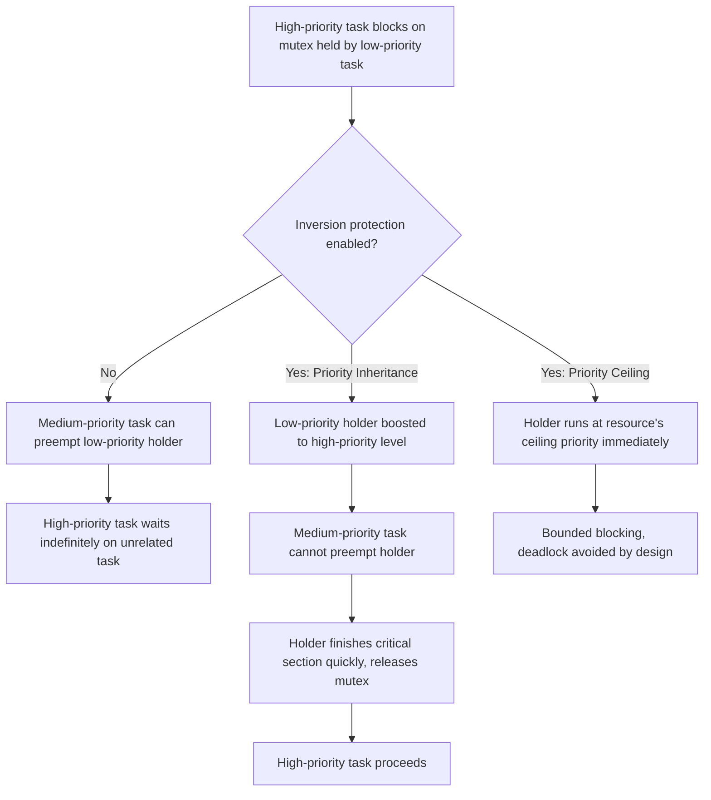

## Task Priorities and Priority Inversion

### Overview

Task priority assignment determines which task runs when multiple tasks are simultaneously ready in a preemptive RTOS. Getting priority assignment right is necessary but not sufficient for correct real-time behavior — priority inversion is a subtle, well-documented failure mode where the priority ordering that the scheduler is supposed to enforce gets effectively defeated by resource sharing between tasks of different priorities. Understanding both topics together is essential, since priority inversion analysis is what turns a priority assignment from a hopeful guess into a provable guarantee.

### Assigning Task Priorities

- **Rate Monotonic assignment**: higher frequency (shorter period) tasks get higher priority — a well-studied, analyzable policy for periodic task sets
- **Deadline Monotonic assignment**: shorter relative deadline gets higher priority, generalizing Rate Monotonic to cases where deadline is not equal to period
- **Criticality-based assignment**: safety-critical tasks (fault monitoring, watchdog service, safety interlocks) are often given priority independent of, or overriding, pure timing-based schemes, since a missed deadline on a safety function may be unacceptable regardless of its period
- **Practical/empirical assignment**: in less formally analyzed systems, priorities are sometimes assigned based on engineering judgment and iterative testing rather than a formal policy — this is workable for simple systems but scales poorly and is harder to certify

**Example (typical priority layout in an embedded control system):**

```c
#define PRIORITY_SAFETY_MONITOR   (configMAX_PRIORITIES - 1)  // highest
#define PRIORITY_MOTOR_CONTROL    (configMAX_PRIORITIES - 2)
#define PRIORITY_COMMUNICATION    (configMAX_PRIORITIES - 3)
#define PRIORITY_LOGGING          (configMAX_PRIORITIES - 4)
#define PRIORITY_UI               (tskIDLE_PRIORITY + 1)       // lowest above idle
```

This ordering reflects both timing (motor control is more time-critical than UI updates) and criticality (safety monitoring overrides pure frequency-based ranking).

### What Priority Inversion Is

Priority inversion occurs when a high-priority task is forced to wait for a low-priority task, indirectly, for longer than the direct resource-holding time alone would explain — typically because an unrelated medium-priority task is allowed to run in the interim.

**The classic three-task scenario:**

1. Low-priority task (L) acquires a shared mutex
2. High-priority task (H) becomes ready and attempts to acquire the same mutex — it blocks, waiting for L to release it
3. Medium-priority task (M), which does not need the mutex at all, becomes ready and preempts L (since M has higher priority than L)
4. M runs for an arbitrary duration, during which H — despite being the highest-priority ready task in the system — makes no progress at all, because L (the only task that can unblock H) is not even running

**Example (unprotected mutex leading to inversion):**

```c
// Low priority task
void vLowPriorityTask(void *pv) {
    for (;;) {
        xSemaphoreTake(xSharedMutex, portMAX_DELAY);
        access_shared_resource();     // L holds mutex here
        xSemaphoreGive(xSharedMutex);
    }
}

// High priority task
void vHighPriorityTask(void *pv) {
    for (;;) {
        xSemaphoreTake(xSharedMutex, portMAX_DELAY);  // blocks if L holds it
        access_shared_resource();
        xSemaphoreGive(xSharedMutex);
    }
}

// Medium priority task — needs no mutex, but can starve L (and thus H)
void vMediumPriorityTask(void *pv) {
    for (;;) {
        do_unrelated_cpu_bound_work();  // preempts L freely
    }
}
```

Without a priority inversion protection mechanism, `vMediumPriorityTask` can run indefinitely while `vHighPriorityTask` waits, even though `vHighPriorityTask` has strictly higher priority than `vMediumPriorityTask`.

### Priority Inversion Timeline

<svg xmlns="http://www.w3.org/2000/svg" viewBox="0 0 800 340">
\<style\>
.box { fill: #f4f4f4; stroke: #333; stroke-width: 1.5; }
.box2 { fill: #e8f0fe; stroke: #333; stroke-width: 1.5; }
.box3 { fill: #fdecea; stroke: #333; stroke-width: 1.5; }
.label { font-family: sans-serif; font-size: 12px; fill: #111; }
.title { font-family: sans-serif; font-size: 14px; fill: #111; font-weight: bold; }
\</style\>
<text x="20" y="24" class="title">Unbounded Priority Inversion (svg_diagram)</text>

<text x="20" y="60" class="label">H (high):</text>

<rect x="380" y="45" width="60" height="25" class="box3" />

<text x="388" y="62" class="label">BLOCKED</text>

<rect x="440" y="45" width="220" height="25" class="box3" />

<text x="450" y="62" class="label">still blocked (waiting on L)</text>

<text x="20" y="110" class="label">M (medium):</text>

<rect x="440" y="95" width="220" height="25" class="box2" />

<text x="450" y="112" class="label">Runs freely, preempts L</text>

<text x="20" y="160" class="label">L (low):</text>

<rect x="120" y="145" width="80" height="25" class="box" />

<text x="128" y="162" class="label">Holds mutex</text>

<rect x="200" y="145" width="180" height="25" class="box3" />

<text x="210" y="162" class="label">Preempted by M (not running)</text>

<text x="20" y="220" class="label">Without inheritance:</text>

<text x="40" y="245" class="label">H waits far longer than L's actual resource hold time</text>

<text x="40" y="265" class="label">M — which has nothing to do with the shared resource — is the cause</text>

<text x="40" y="290" class="label">Duration of inversion is theoretically unbounded if more M-like tasks exist</text>

</svg>

### Priority Inheritance Protocol

The most widely implemented mitigation in commercial RTOS kernels (FreeRTOS mutexes, POSIX PTHREAD_PRIO_INHERIT, VxWorks, most others).

- When H blocks on a mutex held by L, L's priority is temporarily boosted to H's priority for the duration it holds that mutex
- This prevents M from preempting L, since L now runs at H's (higher) priority
- Once L releases the mutex, its priority reverts to its original level, and H (now unblocked) proceeds

**Bounding the inversion duration:** with priority inheritance, the maximum time H can be blocked is bounded by the longest critical section (mutex hold time) among all lower-priority tasks that can lock a mutex H also needs — not by the potentially unbounded runtime of unrelated medium-priority tasks.

### Priority Ceiling Protocol

A stricter, more structured alternative to plain priority inheritance.

- Each mutex is assigned a **priority ceiling**: the highest priority of any task that will ever lock it
- A task acquiring the mutex immediately runs at that ceiling priority, not just when another task blocks on it
- Additional property: under the **Immediate Priority Ceiling Protocol**, a task can only acquire a resource if its own priority is higher than the ceiling of any currently locked resource — this structure also prevents deadlock from circular resource acquisition, which plain priority inheritance does not guarantee on its own

[Inference] Priority ceiling protocols are generally considered to provide tighter, more easily analyzable worst-case blocking bounds than basic priority inheritance, at the cost of requiring the ceiling values to be correctly computed in advance for every shared resource — a design-time analysis burden that increases with system complexity.

### Comparison of Inversion Mitigations

| Protocol | Boost Timing | Deadlock Prevention | Analysis Complexity |
| --- | --- | --- | --- |
| No protection | N/A | No | Unbounded worst case |
| Priority Inheritance | Only when a higher-priority task actually blocks | Not inherently | Moderate |
| Priority Ceiling (immediate) | Immediately upon lock acquisition | Yes (in correctly configured systems) | Higher (requires ceiling computation) |

### Detecting Priority Inversion in Practice

- **RTOS-aware debuggers and trace tools**: many commercial debug tools (Percepio Tracealyzer, SEGGER SystemView, RTOS-aware trace in Lauterbach/IAR/Keil) can visualize task state transitions over time, making inversion patterns visible as unexpectedly long blocked periods on high-priority tasks
- **Symptom pattern**: a high-priority task missing its deadline or exhibiting unusually variable latency, correlated with activity on an unrelated medium-priority task, is a strong indicator worth investigating
- **Static analysis / schedulability review**: response-time analysis that explicitly accounts for blocking time (see Response-Time Analysis) can reveal inversion risk at design time, before it manifests as a field or test failure

### Notable Real-World Case: Mars Pathfinder

[Unverified] The Mars Pathfinder mission's 1997 in-flight software resets are widely cited in embedded systems literature as a real-world priority inversion incident, where a low-priority meteorological data-gathering task held a mutex needed by a high-priority bus-management task, and an unrelated medium-priority task caused extended inversion, eventually triggering a watchdog reset; the exact technical details and public statements about the incident have been described in various secondary sources with some variation in specifics, so primary NASA/JPL post-incident documentation should be consulted for a fully authoritative account.



### Design Practices to Minimize Inversion Risk

- Keep critical sections (mutex hold durations) as short as possible — the shorter the hold time, the smaller the worst-case inversion bound even without inheritance
- Prefer RTOS primitives with built-in priority inheritance support over raw semaphores without inheritance, where mutual exclusion is the actual intent
- Minimize the number of distinct priority levels sharing a given resource, since worst-case blocking analysis grows more complex as more priority levels can contend for the same lock
- Where feasible, avoid resource sharing across widely different priority/criticality levels altogether — a dedicated communication mechanism (message passing) can sometimes eliminate the shared-mutex pattern entirely
- Include priority inversion scenarios explicitly in schedulability analysis and worst-case timing test plans rather than relying solely on empirical testing to surface it, since inversion is timing- and load-dependent and may not appear in every test run

### Key Points

- Task priority assignment (Rate Monotonic, Deadline Monotonic, or criticality-based) establishes the intended execution order, but does not by itself guarantee that order will hold under resource contention
- Priority inversion arises when a high-priority task is indirectly delayed by lower-priority tasks via a shared resource, with an unrelated medium-priority task as the actual mechanism of the delay
- Priority inheritance bounds the inversion to the holding task's critical section length; priority ceiling protocols go further, also addressing deadlock
- RTOS-aware tracing tools are the most practical means of detecting inversion empirically; response-time analysis can predict its risk at design time
- Keeping critical sections short and minimizing cross-priority resource sharing are the most effective preventative design practices

### Related Topics

- Response-time analysis and worst-case blocking time calculation
- RTOS-aware tracing and visualization tools (Tracealyzer, SystemView)
- Deadlock detection and avoidance in embedded resource sharing
- Rate Monotonic and Deadline Monotonic scheduling theory
- Message-passing vs. shared-memory synchronization design patterns
- Watchdog timer configuration for detecting stalled high-priority tasks