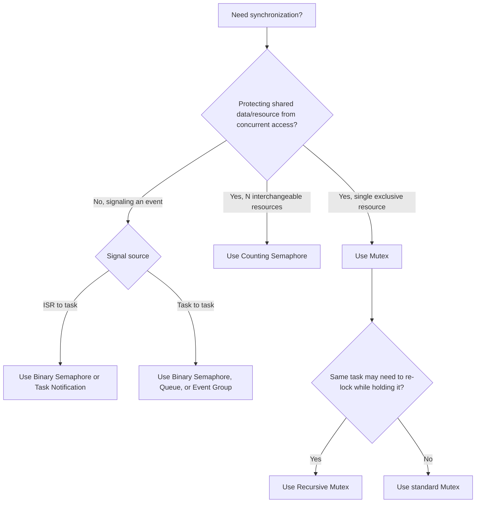

## Semaphores and Mutexes

### Overview

Semaphores and mutexes are the fundamental synchronization primitives used to coordinate access to shared resources and to communicate between tasks and interrupt service routines in embedded RTOS environments. Although they are frequently used interchangeably in casual conversation, they solve distinct problems and have different semantics, correct usage patterns, and failure modes. Choosing the wrong primitive for a given synchronization problem is one of the most common sources of subtle concurrency bugs in embedded firmware.

### Mutexes (Mutual Exclusion)

A mutex protects a shared resource by ensuring only one task can hold it at a time.

- **Ownership**: a mutex has a concept of ownership — the task that locks it is the only task that may unlock it
- **Purpose**: mutual exclusion of a shared resource (a data structure, a peripheral, a buffer) — not signaling or event notification
- **Priority inheritance support**: most RTOS mutex implementations (as distinct from generic binary semaphores) support priority inheritance to bound priority inversion
- **Recursive variants**: some RTOS kernels offer recursive mutexes, allowing the same task to lock it multiple times (nested critical sections) without deadlocking itself, with unlocks required to match lock count

**Example (FreeRTOS mutex protecting shared data):**

```c
SemaphoreHandle_t xDataMutex;

void vTaskA(void *pv) {
    for (;;) {
        if (xSemaphoreTake(xDataMutex, portMAX_DELAY) == pdTRUE) {
            modify_shared_data();
            xSemaphoreGive(xDataMutex);
        }
    }
}

void vTaskB(void *pv) {
    for (;;) {
        if (xSemaphoreTake(xDataMutex, portMAX_DELAY) == pdTRUE) {
            read_shared_data();
            xSemaphoreGive(xDataMutex);
        }
    }
}
```

Both tasks must acquire the same mutex before touching `shared_data`, guaranteeing exclusive access regardless of scheduling order.

### Semaphores

A semaphore is a counter-based signaling primitive with no inherent concept of ownership.

#### Binary Semaphores

- Take only values 0 or 1
- Used for **signaling** between tasks, or between an ISR and a task — fundamentally different intent from a mutex, even though implementations sometimes share underlying code
- No ownership: the task or ISR that "gives" the semaphore does not need to be the one that "takes" it — this is precisely what makes it suitable for ISR-to-task signaling

**Example (binary semaphore signaling from ISR to task):**

```c
SemaphoreHandle_t xDataReadySemaphore;

void ADC_IRQHandler(void) {
    BaseType_t xHigherPriorityTaskWoken = pdFALSE;
    read_adc_into_buffer();
    xSemaphoreGiveFromISR(xDataReadySemaphore, &xHigherPriorityTaskWoken);
    portYIELD_FROM_ISR(xHigherPriorityTaskWoken);
}

void vProcessingTask(void *pv) {
    for (;;) {
        xSemaphoreTake(xDataReadySemaphore, portMAX_DELAY);
        process_adc_buffer();   // runs only after ISR signals data ready
    }
}
```

The ISR never "owns" the semaphore in the way a task owns a mutex — it simply signals an event, and any waiting task can respond.

#### Counting Semaphores

- Maintain a count that can range from 0 up to a defined maximum, incremented on "give" and decremented on "take"
- Used to manage a pool of interchangeable resources (e.g., a fixed number of DMA channels, buffer slots, or connection handles) rather than a single exclusive resource
- Also used to track multiple pending events of the same type (e.g., counting how many interrupts have occurred since the processing task last ran)

**Example (counting semaphore managing a buffer pool):**

```c
#define NUM_BUFFERS 4
SemaphoreHandle_t xBufferPoolSemaphore;  // initialized to count = NUM_BUFFERS

void *acquire_buffer(void) {
    if (xSemaphoreTake(xBufferPoolSemaphore, portMAX_DELAY) == pdTRUE) {
        return get_free_buffer_from_pool();
    }
    return NULL;
}

void release_buffer(void *buf) {
    return_buffer_to_pool(buf);
    xSemaphoreGive(xBufferPoolSemaphore);
}
```

### Mutex vs. Semaphore: The Core Distinction

| Aspect | Mutex | Binary Semaphore | Counting Semaphore |
| --- | --- | --- | --- |
| Primary purpose | Mutual exclusion | Event signaling | Resource pool / event counting |
| Ownership concept | Yes — locker must unlock | No | No |
| Priority inheritance | Typically yes | Typically no (implementation-dependent) | Typically no |
| ISR-safe give/take | Take from ISR generally discouraged/unsupported | Give from ISR common; take from ISR rare | Give from ISR common |
| Typical use | Protecting shared data/peripheral | ISR-to-task or task-to-task signaling | Managing N interchangeable resources |

[Inference] The lack of ownership tracking in semaphores is precisely why they are unsuitable substitutes for mutexes in mutual-exclusion scenarios requiring priority inheritance — since the RTOS has no record of which task to boost, a semaphore used as a makeshift mutex generally cannot receive the priority inversion protection a true mutex implementation provides. This should be confirmed against the specific RTOS's documentation, since implementations vary.

### Common Misuse Pattern: Semaphore as Mutex

```c
// Anti-pattern: using a binary semaphore where a real mutex is needed
SemaphoreHandle_t xBinarySem;  // created as a binary semaphore, not a mutex

void vTaskA(void *pv) {
    xSemaphoreTake(xBinarySem, portMAX_DELAY);
    access_shared_resource();
    xSemaphoreGive(xBinarySem);
}
```

This can function correctly for basic mutual exclusion in simple cases, but forfeits priority inheritance protection and any deadlock-detection support the RTOS's dedicated mutex type may provide. Most RTOS documentation explicitly recommends using the dedicated mutex API when the intent is mutual exclusion, reserving binary semaphores for signaling.

### Deadlock Risk with Multiple Mutexes

Acquiring multiple mutexes in different orders across different tasks is a classic deadlock pattern.

```c
// Task 1
xSemaphoreTake(xMutexA, portMAX_DELAY);
xSemaphoreTake(xMutexB, portMAX_DELAY);
// ... work ...
xSemaphoreGive(xMutexB);
xSemaphoreGive(xMutexA);

// Task 2 — acquires in the OPPOSITE order
xSemaphoreTake(xMutexB, portMAX_DELAY);
xSemaphoreTake(xMutexA, portMAX_DELAY);   // deadlock risk if Task 1 holds A, waiting for B
// ...
```

If Task 1 holds `xMutexA` and waits for `xMutexB`, while Task 2 holds `xMutexB` and waits for `xMutexA`, neither task can proceed — a classic circular-wait deadlock.

**Mitigation**: enforce a strict, consistent global lock ordering across the entire codebase (always acquire `xMutexA` before `xMutexB`, everywhere), or use a priority ceiling protocol that structurally prevents this pattern.

### Synchronization Primitive Selection Diagram



### ISR-Safe Usage Considerations

- Most RTOS kernels provide separate "FromISR" variants of semaphore/queue APIs (e.g., `xSemaphoreGiveFromISR`) because the standard blocking API is not safe to call from interrupt context
- Taking a mutex from within an ISR is generally unsupported or strongly discouraged, since blocking (waiting) is not a valid operation for an ISR — mutexes are fundamentally a task-level construct
- A common and correct pattern is: ISR gives a binary/counting semaphore or sends to a queue; the corresponding task, running at appropriate priority, takes/receives it and performs the actual processing — deferring real work out of interrupt context

### Task Notifications as a Lightweight Alternative

Many modern RTOS kernels (e.g., FreeRTOS task notifications) provide a lighter-weight signaling mechanism than a full semaphore object for the common case of a single task waiting on a single event source.

- Avoids the memory overhead of a separate semaphore object, since the notification value is built into the task control block
- [Inference] Generally faster than an equivalent semaphore give/take pair in kernels that support this optimization, since it avoids the queue/semaphore object's internal structures — though the exact performance difference depends on the specific RTOS implementation and should be measured rather than assumed for a hard real-time budget

### Common Pitfalls

- **Forgetting to release a mutex on an error path**: an early `return` or exception path that skips `xSemaphoreGive()` leaves the mutex permanently locked, hanging every subsequent task that needs it
- **Taking a mutex from an ISR**: unsupported on most kernels and a common source of subtle, hard-to-reproduce faults if attempted anyway
- **Using a semaphore's count for data itself**: a counting semaphore signals that *an event occurred N times*, not the value of any associated data; passing actual data still requires a queue or shared buffer alongside the semaphore
- **Long critical sections**: holding a mutex across a lengthy operation (including one that might block, like a slow peripheral transaction) increases worst-case blocking time for every higher-priority task that needs the same resource
- **Priority inversion from semaphore misuse**: using a plain binary semaphore instead of a real mutex for mutual exclusion forfeits priority inheritance, reintroducing the priority inversion hazard even in an otherwise well-designed priority scheme

### Key Points

- Mutexes provide mutual exclusion with ownership and (typically) priority inheritance; semaphores provide signaling or resource-pool counting with no ownership concept
- Binary semaphores and mutexes are not interchangeable despite superficial similarity — using a semaphore where mutual exclusion with inversion protection is needed is a common and consequential mistake
- Counting semaphores are the right tool for managing a fixed pool of N interchangeable resources or for tallying multiple pending events
- ISR-to-task signaling should use ISR-safe semaphore/queue variants, deferring actual processing to task context rather than performing it in the ISR
- Multiple-mutex deadlock is prevented by enforcing consistent lock ordering or using a priority ceiling protocol
- Task notifications offer a lighter-weight alternative to semaphores for simple single-task signaling scenarios on RTOS kernels that support them

### Related Topics

- Priority inversion and priority inheritance/ceiling protocols
- RTOS queues and message-passing design patterns
- ISR-safe programming techniques and deferred interrupt processing
- Deadlock detection and lock-ordering discipline
- RTOS task notifications and lightweight event flags
- Watchdog and timeout strategies for detecting stuck mutex holders