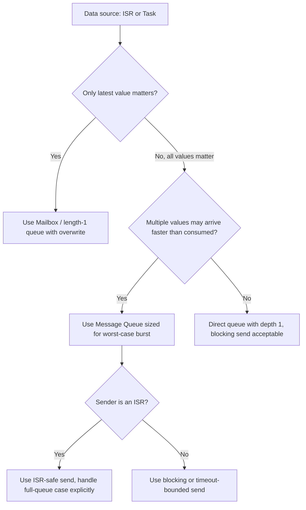

## Message Queues and Mailboxes

### Overview

Message queues and mailboxes are inter-task communication (ITC) primitives that pass actual data between tasks, or between an ISR and a task, rather than merely signaling that an event occurred. Where a semaphore says "something happened," a queue says "here is the something." This distinction makes queues the primary mechanism for decoupling producer and consumer tasks that run at different rates, different priorities, or in response to different event sources, without forcing either side to share memory directly and manage its own synchronization.

### Message Queues

A message queue is a FIFO (first-in, first-out) buffer of fixed-size elements that one or more tasks can send to and one or more tasks can receive from.

- **Decoupling**: producer and consumer do not need to run at the same rate — the queue absorbs rate mismatches up to its configured depth
- **Blocking behavior**: a task attempting to receive from an empty queue can block (with or without a timeout) until data arrives; a task attempting to send to a full queue can similarly block until space is available
- **Fixed element size**: most RTOS queue implementations require each queued item to be the same fixed size, determined at queue creation, which is copied into and out of the queue's internal buffer

**Example (FreeRTOS queue passing sensor readings from ISR to task):**

```c
typedef struct {
    uint32_t timestamp;
    int16_t  value;
} sensor_reading_t;

QueueHandle_t xSensorQueue;

void ADC_IRQHandler(void) {
    sensor_reading_t reading;
    reading.timestamp = get_tick_count();
    reading.value = read_adc_raw();

    BaseType_t xHigherPriorityTaskWoken = pdFALSE;
    xQueueSendFromISR(xSensorQueue, &reading, &xHigherPriorityTaskWoken);
    portYIELD_FROM_ISR(xHigherPriorityTaskWoken);
}

void vProcessingTask(void *pv) {
    sensor_reading_t reading;
    for (;;) {
        if (xQueueReceive(xSensorQueue, &reading, portMAX_DELAY) == pdTRUE) {
            process_reading(&reading);
        }
    }
}
```

The queue itself carries the data (`timestamp` and `value`), not just a notification that new data exists — `vProcessingTask` doesn't need any separate shared buffer or additional synchronization to retrieve what the ISR captured.

### Mailboxes

A mailbox is conceptually a queue with a depth of exactly one — it holds a single message slot that is typically overwritten on each send, rather than queuing multiple pending messages.

- **Latest-value semantics**: commonly used when only the most recent value matters (a current sensor reading, current setpoint) and stale queued values would be useless or even harmful
- Not all RTOS kernels expose a distinct "mailbox" API — some (like FreeRTOS) implement this pattern simply as a queue of length 1, while others (many commercial/classic RTOS kernels, e.g., µC/OS, VxWorks) provide a dedicated mailbox primitive
- **Overwrite behavior**: some implementations support explicit overwrite semantics (unconditionally replacing the current value even if a message is already present) as distinct from a blocking send that would wait for the single slot to be emptied first

**Example (FreeRTOS queue-of-length-1 used as a mailbox with overwrite):**

```c
QueueHandle_t xLatestSetpointMailbox;  // created with length = 1

void vControlPanelTask(void *pv) {
    int32_t new_setpoint = read_user_input();
    xQueueOverwrite(xLatestSetpointMailbox, &new_setpoint);
}

void vControlLoopTask(void *pv) {
    int32_t setpoint;
    for (;;) {
        xQueuePeek(xLatestSetpointMailbox, &setpoint, 0);  // non-blocking, keeps using last value
        run_control_iteration(setpoint);
        vTaskDelay(pdMS_TO_TICKS(10));
    }
}
```

`xQueueOverwrite` always succeeds and replaces any pending value, ensuring `vControlLoopTask` only ever sees the most recent setpoint rather than a backlog of stale ones.

### Queue vs. Mailbox vs. Semaphore

| Primitive | Carries Data | Depth | Ownership | Typical Use |
| --- | --- | --- | --- | --- |
| Message Queue | Yes | N (configurable) | None | Producer/consumer with buffering needed |
| Mailbox | Yes | 1 (latest value) | None | Latest-value distribution, setpoints |
| Binary/Counting Semaphore | No | N/A | None | Event signaling, resource counting |
| Mutex | No (protects access) | N/A (1 owner) | Yes | Mutual exclusion of shared resource |

### Message Queue Architecture Diagram

<svg xmlns="http://www.w3.org/2000/svg" viewBox="0 0 800 300">
\<style\>
.box { fill: #f4f4f4; stroke: #333; stroke-width: 1.5; }
.box2 { fill: #e8f0fe; stroke: #333; stroke-width: 1.5; }
.box3 { fill: #fdecea; stroke: #333; stroke-width: 1.5; }
.label { font-family: sans-serif; font-size: 12px; fill: #111; }
.title { font-family: sans-serif; font-size: 14px; fill: #111; font-weight: bold; }
.arrow { stroke: #333; stroke-width: 1.5; marker-end: url(#arrow3); }
\</style\>
<text x="20" y="24" class="title">Producer/Consumer via Queue (svg_diagram)</text>
<rect x="20" y="60" width="140" height="50" rx="6" class="box" />
<text x="35" y="90" class="label">Producer (ISR</text>
<text x="35" y="105" class="label">or Task)</text>
<line x1="160" y1="85" x2="210" y2="85" class="arrow" />
<rect x="210" y="50" width="330" height="70" rx="6" class="box2" />
<text x="225" y="75" class="label">Queue (FIFO buffer, depth N)</text>
<rect x="225" y="85" width="40" height="25" class="box" />
<rect x="270" y="85" width="40" height="25" class="box" />
<rect x="315" y="85" width="40" height="25" class="box" />
<text x="360" y="103" class="label">... empty slots ...</text>
<line x1="540" y1="85" x2="590" y2="85" class="arrow" />
<rect x="590" y="60" width="150" height="50" rx="6" class="box" />
<text x="605" y="82" class="label">Consumer Task</text>
<text x="605" y="98" class="label">(xQueueReceive)</text>
<rect x="210" y="160" width="330" height="60" rx="6" class="box3" />
<text x="225" y="185" class="label">Mailbox (depth 1, latest value)</text>
<rect x="225" y="195" width="60" height="20" class="box" />
<text x="232" y="209" class="label">value</text>

<text x="20" y="260" class="label">Full queue: sender blocks (or fails) until space available</text>

<text x="20" y="280" class="label">Empty queue: receiver blocks (or fails) until data arrives</text>

</svg>

### Blocking, Non-Blocking, and Timeout Semantics

- **Blocking indefinitely** (`portMAX_DELAY` or equivalent): appropriate when the calling task has genuinely nothing else useful to do until the message arrives
- **Timeout-bounded blocking**: appropriate when the task must periodically perform other work or detect a stalled producer (e.g., a communication timeout condition)
- **Non-blocking (zero timeout)**: appropriate in ISR context or when the calling code must never stall, accepting that the send/receive may simply fail if the queue is full/empty

```c
// Non-blocking check — never stalls the caller
if (xQueueReceive(xSensorQueue, &reading, 0) == pdTRUE) {
    process_reading(&reading);
} else {
    // no new data yet, continue with other work
}
```

### Multiple Producers and Multiple Consumers

- Queues in most RTOS kernels safely support multiple tasks sending to the same queue and multiple tasks receiving from it, with the kernel internally serializing access
- When multiple consumers read from the same queue, each message goes to exactly one consumer (whichever is unblocked to receive it) — this is a work-distribution pattern, not a broadcast
- For true one-to-many broadcast (every consumer must see every message), a queue alone is insufficient; patterns include a dedicated queue per consumer fed by a fan-out dispatcher, or an event group / publish-subscribe mechanism if the RTOS or middleware provides one

### Sizing Queues Correctly

- **Too shallow**: producer blocks or messages are dropped/rejected under normal bursts of activity, causing data loss or unwanted backpressure on a time-critical producer (especially problematic if the producer is an ISR, which cannot block)
- **Too deep**: wastes RAM (each queue reserves space for `depth × element_size` at creation in most static-allocation configurations) and can mask a consumer that is falling behind, since a large buffer delays the point at which backpressure becomes visible
- Queue depth should generally be derived from the actual worst-case burst rate of the producer versus the guaranteed service rate of the consumer, not chosen arbitrarily

[Inference] A common and reasonable approach is to size the queue based on the maximum expected burst length at the producer's peak rate divided by the consumer's minimum guaranteed processing rate, then add margin — though the specific method and margin should be validated against actual measured or worst-case timing for the system in question rather than treated as a fixed rule.

### ISR Considerations for Queues

- Sending from an ISR must use the ISR-safe variant (`xQueueSendFromISR`), which never blocks — if the queue is full, the send simply fails and the ISR must decide how to handle that (drop the newest data, or maintain a separate overflow counter for diagnostics)
- Receiving from an ISR is far less common than sending, since the typical pattern is ISR-produces / task-consumes, but ISR-safe receive variants do exist for the reverse pattern in some designs
- The `pxHigherPriorityTaskWoken` (or equivalent) parameter pattern used across ISR-safe RTOS APIs signals to the caller whether a context switch should be requested immediately after the ISR completes, ensuring the newly-unblocked (typically higher-priority) task runs promptly rather than waiting for the next tick

### Common Pitfalls

- **Passing pointers to stack-allocated data through a queue**: if a task sends a pointer to a local (stack) variable and then returns or reuses that stack frame before the receiver processes the message, the receiver dereferences invalid memory — queues should generally copy the actual data (by value) or point only to data with a guaranteed lifetime (static, heap, or a dedicated buffer pool)
- **Using a full-depth queue to paper over a consumer that's too slow**: masks a genuine timing/design problem rather than solving it, and delays discovery of the issue until the queue eventually overflows under worse-than-tested conditions
- **Forgetting queue-full handling from an ISR**: since an ISR cannot block, failing to check the return value of an ISR-safe send and silently dropping data can create hard-to-diagnose intermittent data loss
- **Using a large queue element size unnecessarily**: since most RTOS queues copy elements by value into internal storage, oversized elements waste RAM proportionally to queue depth; passing a pointer to a pooled buffer is often more efficient for large payloads, provided buffer lifetime is managed correctly



### Key Points

- Message queues carry actual data between tasks/ISRs with FIFO ordering and configurable depth, decoupling producers and consumers running at different rates
- Mailboxes (depth-1 queues) provide latest-value semantics, appropriate when stale queued data is not useful
- Queue depth must be sized from actual worst-case burst and service-rate analysis, not chosen arbitrarily — too shallow risks data loss or producer stalls, too deep wastes RAM and masks consumer lag
- ISR-safe queue variants never block and require explicit handling of the full-queue failure case, since an ISR cannot wait
- Passing pointers to stack-allocated data through a queue is a common and serious lifetime bug; prefer copying by value or referencing data with guaranteed lifetime

### Related Topics

- Semaphores and mutexes for signaling and mutual exclusion
- RTOS event groups for multi-condition synchronization
- Buffer pool and memory management patterns for embedded messaging
- ISR-safe programming and deferred interrupt processing
- Producer-consumer rate mismatch analysis and backpressure design
- Publish-subscribe and broadcast messaging patterns in embedded middleware