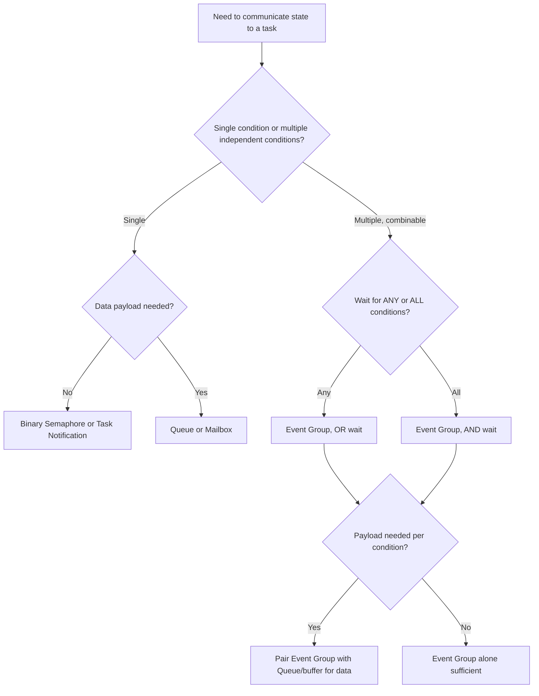

## Event Flags and Signals

### Overview

Event flags and signals are lightweight synchronization primitives for notifying a task that one or more conditions have occurred, without necessarily transferring any data. Where a queue moves data and a mutex protects a resource, an event flag communicates state: "condition X is now true." Event flags are especially valuable when a task needs to wait on a combination of multiple independent conditions simultaneously — something a single semaphore or queue cannot express cleanly.

### Event Flags (Event Groups)

An event flag group is a set of bits (typically 8, 24, or more depending on RTOS/platform) within a single object, where each bit represents a distinct condition or event. Tasks can set specific bits, clear specific bits, and block waiting for some combination of bits to become set.

- **Multiple independent conditions in one object**: rather than creating a separate semaphore per condition, a single event group can represent many named conditions as individual bits
- **AND/OR wait semantics**: a task can wait for *any* of several bits to be set (logical OR) or for *all* of several bits to be set simultaneously (logical AND) before proceeding
- **No data payload**: like a semaphore, an event flag communicates that something happened, not what the associated data is — an event flag is frequently used alongside a queue or shared buffer that holds the actual payload

**Example (FreeRTOS event group waiting for multiple conditions):**

```c
#define BIT_SENSOR_READY   (1 << 0)
#define BIT_COMMS_READY    (1 << 1)
#define BIT_CALIBRATION_OK (1 << 2)

EventGroupHandle_t xSystemEvents;

void vSensorInitTask(void *pv) {
    perform_sensor_init();
    xEventGroupSetBits(xSystemEvents, BIT_SENSOR_READY);
    vTaskDelete(NULL);
}

void vCommsInitTask(void *pv) {
    perform_comms_init();
    xEventGroupSetBits(xSystemEvents, BIT_COMMS_READY);
    vTaskDelete(NULL);
}

void vMainControlTask(void *pv) {
    // Block until ALL three conditions are met before starting normal operation
    const EventBits_t required = BIT_SENSOR_READY | BIT_COMMS_READY | BIT_CALIBRATION_OK;
    xEventGroupWaitBits(xSystemEvents, required, pdFALSE, pdTRUE, portMAX_DELAY);
    start_normal_operation();
}
```

Here, `vMainControlTask` waits for all three subsystems to independently signal readiness (`pdTRUE` as the fourth argument requests "wait for all," not "wait for any") before proceeding — a pattern that would require considerably more manual bookkeeping with plain semaphores.

### Signals

"Signal" is used in embedded contexts in two related but distinct senses, and the applicable meaning depends heavily on the specific RTOS or OS layer being discussed:

1. **RTOS task signals/notifications**: a lightweight, built-in per-task notification mechanism (e.g., FreeRTOS task notifications, µC/OS-III task semaphore-like signals) that acts like a simplified event flag or binary/counting semaphore built directly into the task control block, avoiding the overhead of a separately allocated kernel object
2. **POSIX-style signals**: asynchronous notifications delivered to a process/thread that interrupt its normal control flow to run a signal handler, more common on embedded Linux (running full POSIX-compliant OS) than on bare RTOS kernels, and analogous in spirit to a hardware interrupt but at the OS/process level

**Example (FreeRTOS lightweight task notification as a signal):**

```c
void vProducerTask(void *pv) {
    for (;;) {
        produce_event();
        xTaskNotifyGive(xConsumerTaskHandle);  // lightweight signal, no separate object needed
    }
}

void vConsumerTask(void *pv) {
    for (;;) {
        ulTaskNotifyTake(pdTRUE, portMAX_DELAY);  // blocks until notified
        handle_event();
    }
}
```

[Inference] Task notifications are generally lower overhead than an equivalent dedicated semaphore or event group specifically because no separate kernel object needs to be allocated or managed — the notification state lives directly in the task's control block — though the precise performance difference is implementation-specific and should be measured on the target RTOS/hardware combination rather than assumed.

**Example (POSIX signal handler on embedded Linux):**

```c
#include <signal.h>

volatile sig_atomic_t shutdown_requested = 0;

void handle_sigterm(int signum) {
    shutdown_requested = 1;   // signal handlers should do minimal work
}

int main(void) {
    signal(SIGTERM, handle_sigterm);
    while (!shutdown_requested) {
        do_main_loop_work();
    }
    cleanup_and_exit();
    return 0;
}
```

POSIX signal handlers are restricted in what they can safely do (async-signal-safe functions only), analogous to the restrictions on ISRs in bare-metal/RTOS contexts — both should defer substantial work to the normal execution context rather than doing it inline.

### Event Flags vs. Other Primitives

| Primitive | Multiple Conditions? | AND/OR Wait | Data Payload | Typical Use |
| --- | --- | --- | --- | --- |
| Event Group/Flags | Yes, multiple bits | Yes | No | Waiting on combinations of independent conditions |
| Binary Semaphore | No (single condition) | N/A | No | Single event signaling |
| Task Notification | Limited (single value, can be used bitwise) | Partial (bitwise AND/OR possible on the value) | Small (one word) | Lightweight single-source signaling |
| Queue | No (per-message) | N/A | Yes | Data transfer with FIFO ordering |

### Event Flags Wait Semantics Diagram

<svg xmlns="http://www.w3.org/2000/svg" viewBox="0 0 800 320">
\<style\>
.box { fill: #f4f4f4; stroke: #333; stroke-width: 1.5; }
.box2 { fill: #e8f0fe; stroke: #333; stroke-width: 1.5; }
.box3 { fill: #fdecea; stroke: #333; stroke-width: 1.5; }
.label { font-family: sans-serif; font-size: 12px; fill: #111; }
.title { font-family: sans-serif; font-size: 14px; fill: #111; font-weight: bold; }
\</style\>
<text x="20" y="24" class="title">Event Group AND vs OR Wait (svg_diagram)</text>

<text x="20" y="60" class="label">Bits available:</text>

<rect x="150" y="45" width="60" height="30" class="box2" />

<text x="163" y="65" class="label">Bit 0</text>

<rect x="220" y="45" width="60" height="30" class="box2" />

<text x="233" y="65" class="label">Bit 1</text>

<rect x="290" y="45" width="60" height="30" class="box2" />

<text x="303" y="65" class="label">Bit 2</text>

<text x="20" y="130" class="label">OR wait (any bit):</text>

<rect x="150" y="105" width="200" height="35" class="box" />

<text x="160" y="128" class="label">Unblocks as soon as ANY one bit sets</text>

<text x="20" y="200" class="label">AND wait (all bits):</text>

<rect x="150" y="175" width="200" height="35" class="box3" />

<text x="160" y="198" class="label">Unblocks only when ALL bits set</text>

<text x="20" y="260" class="label">Auto-clear option:</text>

<text x="40" y="285" class="label">Bits can be automatically cleared on successful wait,</text>

<text x="40" y="303" class="label">or left set for other waiting tasks to also observe</text>

</svg>

### Setting Bits from an ISR

As with semaphores and queues, event group operations from interrupt context require ISR-safe variants.

```c
void GPIO_IRQHandler(void) {
    BaseType_t xHigherPriorityTaskWoken = pdFALSE;
    xEventGroupSetBitsFromISR(xSystemEvents, BIT_BUTTON_PRESSED, &xHigherPriorityTaskWoken);
    portYIELD_FROM_ISR(xHigherPriorityTaskWoken);
}
```

[Unverified] Some RTOS kernels defer the actual bit-setting work from `SetBitsFromISR` calls to a daemon/timer task rather than performing it immediately in interrupt context, because the underlying event group implementation may not be safe to modify directly from an ISR; the exact mechanism should be checked against the specific RTOS's implementation documentation, since this detail varies and can affect worst-case latency analysis.

### Common Use Cases for Event Flags

- **System initialization synchronization**: waiting for multiple independent subsystems (sensors, communication stacks, calibration routines) to each report readiness before entering normal operation
- **Multi-condition state machines**: a task that must react differently depending on which combination of several independent flags is currently set (e.g., "door closed AND power stable AND self-test passed")
- **Coordinating multiple producer tasks feeding one consumer's readiness check**: rather than each producer sending to a separate queue, producers set distinct bits and the consumer waits on the combination
- **Broadcast-style notification**: unlike a semaphore (typically consumed by one waiter) or a queue message (delivered to one consumer), event flags can be observed by multiple waiting tasks simultaneously without being "consumed" — the same bit-set event can satisfy multiple tasks waiting on different bit combinations that both include that bit, depending on the auto-clear configuration

### Common Pitfalls

- **Race conditions on flag clearing**: if a task checks flags, then acts, then clears them non-atomically relative to another task setting new flags, an event can be lost between the check and the clear; RTOS-provided atomic wait-and-clear APIs exist specifically to avoid this
- **Using event flags where a queue is actually needed**: if the task needs to know the specific data associated with an event, not just that some event occurred, a flag alone is insufficient — pairing with a queue, mailbox, or shared buffer for the payload is required
- **Bit exhaustion**: event groups typically support a limited number of usable bits (some implementations reserve bits internally); a design that grows to need many independent conditions may need multiple event groups or a redesign
- **Overloading a single bit for multiple unrelated meanings**: reusing the same bit for different logical conditions in different parts of a codebase creates subtle coupling and is a common source of confusion during maintenance



### Key Points

- Event flags/groups let a task wait on combinations (AND/OR) of multiple independent conditions represented as bits in a single object, which plain semaphores cannot express cleanly
- Task notifications (a lightweight signal built into the task control block) are commonly used for simple single-source signaling with lower overhead than a full semaphore or event group
- POSIX-style signals, relevant mainly on embedded Linux, interrupt normal control flow similarly to how hardware interrupts do, and signal handlers should defer substantial work to the main context just as ISRs do
- Event flags carry no data payload — they must be paired with a queue, mailbox, or shared buffer when the actual event data (not just its occurrence) matters
- ISR-safe variants are required to set bits from interrupt context, and some RTOS implementations defer this work internally to a daemon task rather than performing it directly in the ISR

### Related Topics

- Semaphores and mutexes for simple signaling and mutual exclusion
- Message queues and mailboxes for data-carrying inter-task communication
- RTOS task notification mechanisms and their overhead characteristics
- POSIX signal handling on embedded Linux systems
- System initialization and multi-subsystem readiness synchronization patterns
- ISR-safe programming and deferred interrupt processing