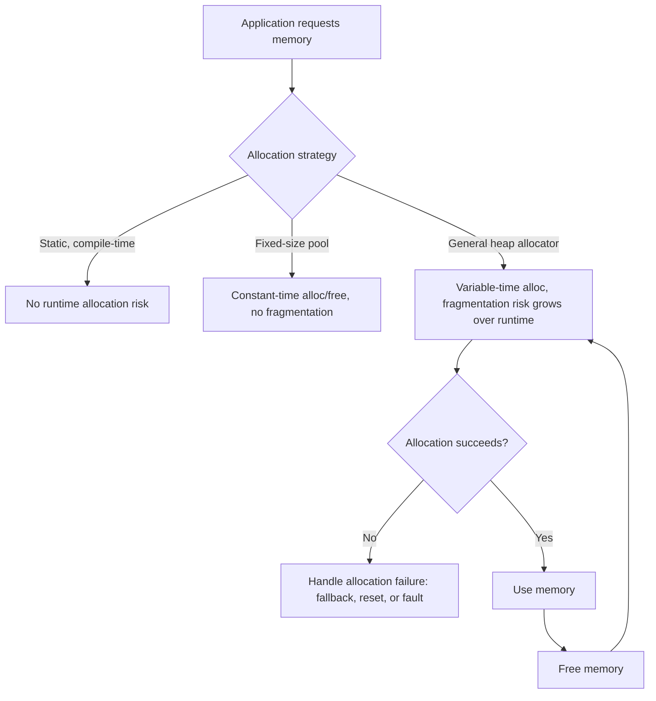

## Memory Management in RTOS Environments


### Overview

Memory management in an RTOS context spans several distinct concerns: how the RTOS kernel itself allocates memory for its own objects (tasks, queues, semaphores), how application code allocates and frees memory during runtime, how per-task stacks are sized and monitored, and how memory protection hardware (where available) is used to contain faults. Unlike general-purpose operating systems, embedded RTOS memory management must prioritize determinism, fragmentation avoidance, and worst-case bounding over average-case throughput, because an unpredictable allocation failure or a stack overflow in a safety-critical system can have consequences far beyond a dropped frame or a slow response.

### Kernel Object Memory: Static vs. Dynamic Allocation

Most RTOS kernels offer two ways to create kernel objects (tasks, queues, semaphores, mutexes, timers):

- **Static allocation**: memory for the kernel object is provided by the application at compile time (a statically declared buffer/struct), and the RTOS API takes a pointer to this pre-allocated memory rather than allocating it itself
- **Dynamic allocation**: the RTOS allocates memory for the object internally, typically from its own heap implementation, at object-creation time

**Example (FreeRTOS static vs. dynamic task creation):**

```c
// Dynamic allocation — RTOS allocates stack and TCB from its heap
xTaskCreate(vMyTask, "MyTask", STACK_SIZE, NULL, PRIORITY, &xTaskHandle);

// Static allocation — application provides the memory up front
static StaticTask_t xTaskBuffer;
static StackType_t  xStack[STACK_SIZE];

xTaskCreateStatic(vMyTask, "MyTask", STACK_SIZE, NULL, PRIORITY,
                   xStack, &xTaskBuffer);
```

Static allocation eliminates a class of runtime allocation failures entirely (the memory either exists at link time or the build fails), which is why it is strongly preferred in many certified and safety-critical embedded designs.

### RTOS Heap Implementations

Kernels that support dynamic allocation typically offer a choice of heap management schemes, since a general-purpose `malloc`/`free` is often unsuitable for real-time or resource-constrained use.

**Common FreeRTOS heap scheme examples** (illustrative of a general pattern seen across many RTOS kernels, not necessarily exact naming elsewhere):

- **Simple bump allocator (allocate-only, no free)**: extremely fast and deterministic, but memory can never be reclaimed — suitable only when all allocations happen once at startup and nothing is ever freed
- **Best-fit allocator with coalescing**: supports both allocation and freeing, attempts to merge adjacent free blocks to reduce fragmentation, at the cost of non-constant allocation time
- **Multiple fixed-size block pools**: several pools of different fixed block sizes, each pool itself O(1) to allocate/free from, avoiding fragmentation entirely at the cost of some wasted space when an allocation doesn't need the full block size
- **Wrapper around the toolchain's standard `malloc`/`free`**: convenient for portability but often not thread-safe by default and rarely provides real-time-friendly worst-case timing guarantees

[Inference] Fixed-size block pools are generally preferred in hard real-time or safety-critical embedded designs specifically because their allocation and deallocation time is constant and independent of prior allocation history, unlike best-fit or general-purpose heaps whose worst-case time can grow with fragmentation — though the specific scheme chosen should match the actual allocation pattern of the application (fixed-size vs. highly variable-size allocations).

### Memory Pool (Fixed-Block) Allocators

A memory pool divides a pre-reserved region into N fixed-size blocks, tracked with a simple free list.

**Example (basic fixed-block pool allocator):**

```c
#define BLOCK_SIZE  64
#define NUM_BLOCKS  16

typedef struct pool_block {
    struct pool_block *next;
} pool_block_t;

static uint8_t pool_memory[NUM_BLOCKS][BLOCK_SIZE];
static pool_block_t *free_list = NULL;

void pool_init(void) {
    for (int i = 0; i < NUM_BLOCKS; i++) {
        pool_block_t *blk = (pool_block_t *)pool_memory[i];
        blk->next = free_list;
        free_list = blk;
    }
}

void *pool_alloc(void) {
    if (free_list == NULL) return NULL;   // pool exhausted
    pool_block_t *blk = free_list;
    free_list = blk->next;
    return (void *)blk;
}

void pool_free(void *ptr) {
    pool_block_t *blk = (pool_block_t *)ptr;
    blk->next = free_list;
    free_list = blk;
}
```

Both `pool_alloc` and `pool_free` execute in constant time regardless of pool state, and the pool can never fragment since every block is the same size.

### Fragmentation and Why It Matters

Heap fragmentation occurs when free memory becomes divided into many small, non-contiguous blocks, such that a new allocation request fails even though the total free memory would technically be sufficient if it were contiguous.

- **Long-running embedded systems are especially vulnerable**: a system running for months or years with continuous alloc/free cycles of varying sizes can gradually fragment even a heap that started out healthy
- **Non-deterministic failure timing**: fragmentation-caused allocation failure often only manifests after extended runtime under a particular usage pattern, making it notoriously difficult to catch in short test cycles
- **Mitigation strategies**: fixed-size pools (immune to fragmentation by design), avoiding dynamic allocation after initialization entirely, periodic defragmentation/compaction (rare in embedded due to complexity of relocating in-use memory), or heap allocators with coalescing to merge adjacent free blocks



### Stack Management Per Task

Each RTOS task requires its own stack, sized to accommodate the worst-case nesting of function calls, local variables, and (on some architectures) any ISR nesting that may occur while that task's stack is active.

- **Under-sizing risk**: a stack overflow can silently corrupt adjacent memory (including other tasks' stacks, kernel data structures, or even code/constant regions), producing seemingly unrelated and hard-to-diagnose failures elsewhere in the system
- **Over-sizing cost**: since each task reserves its full stack allocation regardless of typical usage, excessive margin across many tasks can consume a disproportionate share of total RAM on constrained targets

**Example (FreeRTOS stack high-water-mark check):**

```c
void vDiagnosticTask(void *pv) {
    for (;;) {
        UBaseType_t words_remaining = uxTaskGetStackHighWaterMark(xMonitoredTaskHandle);
        if (words_remaining < STACK_WARNING_THRESHOLD) {
            log_event(EVENT_STACK_LOW, WARNING, words_remaining, 0);
        }
        vTaskDelay(pdMS_TO_TICKS(1000));
    }
}
```

`uxTaskGetStackHighWaterMark` reports the closest the monitored task's stack has ever come to overflowing since it started, providing an empirical (not exhaustive) signal of stack margin based on actual observed execution paths.

### Stack Overflow Detection Mechanisms

- **Software canary/guard values**: a known pattern value written to the far end of each stack at initialization; periodically checked to see if it has been overwritten, indicating the stack grew further than expected
- **MPU-based guard regions** (where a Memory Protection Unit is available): a small unmapped or access-restricted region placed immediately beyond each task's stack, causing an immediate hardware fault on overflow rather than silent corruption — considerably more reliable than a canary check, which only detects overflow if checked at the right moment and can itself be corrupted past
- **RTOS built-in overflow checking**: many kernels (FreeRTOS's `configCHECK_FOR_STACK_OVERFLOW` options) provide automatic overflow detection using canary or stack-pointer-range checks at context-switch time, trading a small amount of runtime overhead for much earlier fault detection than manual high-water-mark polling

[Inference] MPU-based guard regions are generally the most reliable stack overflow detection method available on capable hardware, because they catch the overflow at the moment it occurs via a hardware fault rather than relying on periodic software checks that could miss a transient overflow between check intervals — though this requires the target to have an MPU and the RTOS port to support configuring per-task memory regions, which not all RTOS/hardware combinations provide.

### Memory Protection Units (MPUs) in RTOS Contexts

Some RTOS kernels (e.g., FreeRTOS-MPU, certain ThreadX/Zephyr configurations) support using a hardware MPU to enforce memory isolation between tasks, going beyond simple stack overflow detection.

- **Task memory isolation**: restricting a given task's access to only its own stack, designated data regions, and explicitly shared memory regions, so a bug in one task cannot silently corrupt another task's memory
- **Privileged vs. unprivileged task execution**: some MPU-enabled RTOS configurations distinguish trusted (kernel-level) code from untrusted or less-trusted application tasks, restricting the latter's ability to access peripherals or kernel data structures directly
- **Trade-offs**: MPU configuration adds context-switch overhead (reprogramming the MPU's region registers on every task switch) and design complexity (explicitly defining and granting each task's exact memory access needs), which is why many simpler embedded systems forgo MPU-based task isolation even when the hardware supports it

### Memory Layout Diagram

<svg xmlns="http://www.w3.org/2000/svg" viewBox="0 0 800 340">
\<style\>
.box { fill: #f4f4f4; stroke: #333; stroke-width: 1.5; }
.box2 { fill: #e8f0fe; stroke: #333; stroke-width: 1.5; }
.box3 { fill: #fdecea; stroke: #333; stroke-width: 1.5; }
.label { font-family: sans-serif; font-size: 12px; fill: #111; }
.title { font-family: sans-serif; font-size: 14px; fill: #111; font-weight: bold; }
\</style\>
<text x="20" y="24" class="title">Typical RTOS RAM Layout (svg_diagram)</text>
<rect x="200" y="50" width="300" height="40" class="box" />
<text x="215" y="75" class="label">Global/Static Data (.data, .bss)</text>
<rect x="200" y="90" width="300" height="40" class="box2" />
<text x="215" y="115" class="label">RTOS Heap (dynamic allocation, if used)</text>
<rect x="200" y="130" width="300" height="40" class="box" />
<text x="215" y="155" class="label">Task A Stack</text>
<rect x="200" y="170" width="300" height="8" class="box3" />
<text x="510" y="178" class="label" font-size="10">guard region</text>
<rect x="200" y="185" width="300" height="40" class="box" />
<text x="215" y="210" class="label">Task B Stack</text>
<rect x="200" y="225" width="300" height="8" class="box3" />
<text x="510" y="233" class="label" font-size="10">guard region</text>
<rect x="200" y="240" width="300" height="40" class="box" />
<text x="215" y="265" class="label">Idle Task Stack + Kernel Overhead</text>

<text x="20" y="310" class="label">Guard regions (canary or MPU-backed) sit between stacks</text>

<text x="20" y="328" class="label">to catch overflow before it corrupts adjacent memory</text>

</svg>

### Common Memory Management Pitfalls in RTOS Systems

- **Calling non-thread-safe `malloc`/`free` directly**: the C standard library's default heap functions are often not safe to call concurrently from multiple tasks without an RTOS-aware wrapper; many toolchains require explicit configuration (e.g., providing `__malloc_lock`/`__malloc_unlock` hooks) to make them safe under an RTOS
- **Allocating from an ISR**: most heap implementations are not safe to call from interrupt context at all, since they may involve blocking or non-reentrant critical sections; dynamic allocation should generally be confined to task context
- **Fragmentation from irregular allocation sizes over long uptime**: particularly dangerous in systems expected to run for months without a reset, where the failure may not surface during normal test durations
- **Insufficient stack margin for worst-case interrupt nesting**: on architectures where ISRs execute on the interrupted task's stack (rather than a dedicated interrupt stack), worst-case stack sizing must include the deepest possible ISR nesting on top of the task's own worst-case call depth — a frequently underestimated contribution to stack overflow
- **Ignoring allocation failure return values**: treating a `NULL` return from an allocator as impossible rather than as a case requiring explicit handling, especially problematic in systems that must degrade gracefully rather than silently proceeding with a null pointer

### Best Practices Summary

- Prefer static allocation for all kernel objects (tasks, queues, semaphores) where certification, determinism, or fragmentation-avoidance goals apply
- Use fixed-size memory pools instead of general-purpose heaps wherever the application's allocation sizes are reasonably uniform
- Avoid dynamic allocation after system initialization wherever feasible, especially in long-uptime or safety-critical designs
- Size stacks from actual worst-case analysis (call-graph depth × largest stack frame at each level, plus worst-case ISR nesting), not guesswork, and validate with high-water-mark monitoring during testing
- Enable RTOS-provided stack overflow checking, and use MPU-backed guard regions where the hardware and RTOS port support it, rather than relying solely on periodic software polling
- Explicitly handle allocation failure at every call site where dynamic allocation is used, rather than assuming success

### Key Points

- RTOS memory management spans kernel object allocation, application dynamic memory, per-task stack sizing, and hardware memory protection — each with distinct failure modes
- Static allocation eliminates runtime allocation failure for kernel objects and is preferred in safety-critical and certified designs
- Fixed-size memory pools provide deterministic, fragmentation-free allocation at the cost of some wasted space versus a general-purpose heap
- Stack overflow is a serious and often silent failure mode; MPU-backed guard regions provide the most reliable detection where hardware supports it, ahead of canary values or high-water-mark polling alone
- Fragmentation in long-running systems is a classic hard-to-reproduce failure mode, generally best avoided architecturally rather than mitigated after the fact

### Related Topics

- Stack sizing methodologies and worst-case call-graph analysis
- Memory Protection Unit (MPU) configuration for task isolation
- Fixed-size memory pool allocator design patterns
- Heap fragmentation analysis and long-uptime reliability testing
- Certification requirements for dynamic memory use (DO-178C, ISO 26262 guidance on heap usage)
- RTOS-aware thread-safe C standard library configuration