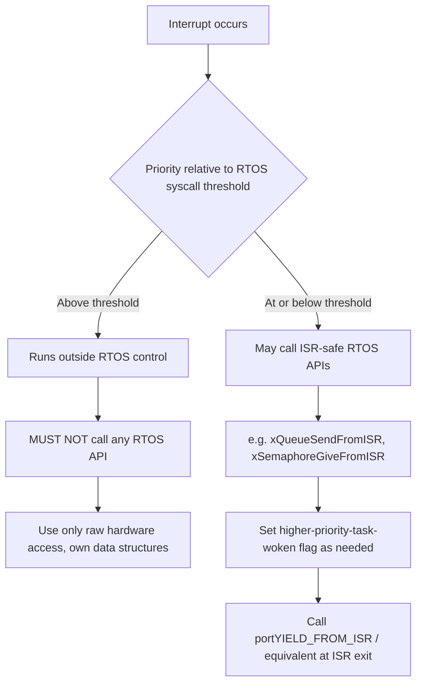

## Interrupt Handling Within an RTOS

### Overview

Interrupt handling in an RTOS context operates under a stricter set of constraints than bare-metal interrupt handling, because the ISR must coexist correctly with a preemptive task scheduler, kernel data structures, and priority-based execution guarantees. An RTOS doesn't eliminate the fundamental rules of good ISR design — keep it short, don't block — it adds an additional layer of rules around which RTOS APIs are safe to call from interrupt context, how the ISR interacts with the scheduler, and how work gets correctly deferred from interrupt context into task context.

### The ISR-to-Task Deferral Pattern

The single most important pattern in RTOS interrupt handling is minimizing work done inside the ISR itself and deferring the bulk of processing to a task.

- **Why**: ISRs typically run at a priority above all tasks and, depending on the architecture, may block lower-priority interrupts or the entire scheduler while executing; a long-running ISR directly undermines the RTOS's priority-based scheduling guarantees for every task in the system
- **Mechanism**: the ISR performs only the minimal, time-critical work (e.g., reading a data register before it's overwritten, clearing the interrupt flag) and then signals a waiting task via an ISR-safe primitive (semaphore, queue, event group, or task notification)

**Example (minimal ISR deferring to a task):**

```c
void UART_IRQHandler(void) {
    uint8_t byte = UART->DATA;   // must read quickly before overwritten
    UART->ICR = UART_IT_RXNE;    // clear interrupt flag

    BaseType_t xHigherPriorityTaskWoken = pdFALSE;
    xQueueSendFromISR(xUartRxQueue, &byte, &xHigherPriorityTaskWoken);
    portYIELD_FROM_ISR(xHigherPriorityTaskWoken);
}

void vUartProcessingTask(void *pv) {
    uint8_t byte;
    for (;;) {
        xQueueReceive(xUartRxQueue, &byte, portMAX_DELAY);
        parse_uart_byte(byte);   // all substantial work happens here, at task level
    }
}
```

The ISR does the absolute minimum required to preserve data and satisfy hardware timing, then exits — `parse_uart_byte()` runs later, at task priority, where it can be preempted normally and does not hold up other interrupts.

### ISR-Safe vs. Task-Level RTOS APIs

Most RTOS kernels maintain a strict, explicit separation between APIs safe to call from interrupt context and those that are not.

- **"FromISR" suffix convention** (FreeRTOS and many others): `xQueueSendFromISR`, `xSemaphoreGiveFromISR`, `xEventGroupSetBitsFromISR` — these never block and typically take an additional output parameter indicating whether a context switch should occur
- **Never call blocking APIs from an ISR**: `xQueueReceive` with a nonzero timeout, `xSemaphoreTake` with a wait, or any operation that could suspend the caller must never be invoked in interrupt context, since an ISR cannot be "put to sleep" the way a task can
- **Mutex acquisition from an ISR**: generally unsupported entirely, since mutexes are fundamentally a task-level ownership concept (see Semaphores and Mutexes)

[Inference] The rationale for this strict separation is that interrupt context has no task control block to suspend and resume in the way blocking task-level calls require, so RTOS kernels generally either omit these operations from the ISR-safe API set or given them non-blocking semantics; the exact API list and behavior naturally varies by RTOS, and specific kernel documentation should be consulted before assuming a given call is ISR-safe.

### The Context-Switch Request Pattern

Because an ISR executing on most architectures cannot itself directly force a full task context switch mid-execution the same way the scheduler's normal tick handler does, RTOS APIs use an explicit "higher priority task woken" flag pattern to defer the actual switch to a safe point.

```c
void SomeIRQHandler(void) {
    BaseType_t xHigherPriorityTaskWoken = pdFALSE;

    // ... ISR-safe RTOS calls, each may set xHigherPriorityTaskWoken to pdTRUE ...
    xSemaphoreGiveFromISR(xSem1, &xHigherPriorityTaskWoken);
    xQueueSendFromISR(xQueue1, &data, &xHigherPriorityTaskWoken);

    portYIELD_FROM_ISR(xHigherPriorityTaskWoken);  // request switch only if needed
}
```

`portYIELD_FROM_ISR` (or the architecture-specific equivalent) checks the flag and, if set, triggers a PendSV (on Cortex-M) or equivalent mechanism to perform the actual context switch immediately after the ISR returns, ensuring the newly-unblocked task runs promptly rather than waiting for the next scheduler tick.

### Interrupt Priority Configuration Relative to the RTOS

On architectures with configurable interrupt priority levels (notably ARM Cortex-M with NVIC), the RTOS typically requires a specific priority configuration to function correctly.

- **`configMAX_SYSCALL_INTERRUPT_PRIORITY`** (FreeRTOS terminology, analogous concepts exist in other kernels): defines the highest interrupt priority level from which RTOS API calls are permitted
- **Interrupts above this threshold** ("above the kernel," i.e., at logically higher priority than the RTOS itself) must **never** call any RTOS API at all — they run completely outside the RTOS's control and cannot safely interact with kernel data structures
- **Interrupts at or below the threshold** can safely call ISR-safe RTOS functions, since the RTOS's critical sections are designed to mask interrupts only up to this configured level

This distinction exists specifically to allow a small number of extremely time-critical, ultra-low-latency interrupts (e.g., a hard real-time control loop tick) to remain completely unaffected by RTOS critical section masking, at the cost of those interrupts being unable to use any RTOS synchronization primitives at all.



### ISR Nesting and Stack Usage

- On architectures where interrupts execute on the currently active task's stack (rather than a dedicated interrupt stack), the worst-case stack size for every task must account for the deepest possible level of ISR nesting that could occur while that task is running
- Some architectures/RTOS ports provide a dedicated interrupt stack separate from task stacks, which simplifies per-task stack sizing (task stacks no longer need margin for ISR nesting) at the cost of additional fixed RAM reserved for the interrupt stack itself
- [Unverified] Whether a given RTOS port uses a shared task stack or a dedicated interrupt stack for ISR execution is architecture- and port-specific; this should be confirmed against the specific RTOS port's documentation before finalizing stack-sizing calculations, since assuming the wrong model can lead to underestimated worst-case stack requirements

### Interrupt Latency Considerations

- **RTOS critical sections mask interrupts (up to the configured syscall priority threshold) during operations on kernel data structures**, meaning even permitted interrupts can experience some added latency while the kernel is inside such a critical section
- **Worst-case interrupt latency analysis** for a system using an RTOS must include the longest critical section duration within the kernel itself, not just application-level critical sections, since kernel-internal locking contributes to the total worst-case delay
- Keeping ISRs and any RTOS-level critical sections as short as possible directly bounds worst-case interrupt response latency, which matters for any interrupt tied to a hard real-time deadline

### Interrupt Handling Architecture Diagram

<svg xmlns="http://www.w3.org/2000/svg" viewBox="0 0 800 320">
\<style\>
.box { fill: #f4f4f4; stroke: #333; stroke-width: 1.5; }
.box2 { fill: #e8f0fe; stroke: #333; stroke-width: 1.5; }
.box3 { fill: #fdecea; stroke: #333; stroke-width: 1.5; }
.label { font-family: sans-serif; font-size: 12px; fill: #111; }
.title { font-family: sans-serif; font-size: 14px; fill: #111; font-weight: bold; }
.arrow { stroke: #333; stroke-width: 1.5; marker-end: url(#arrow4); }
\</style\>
<text x="20" y="24" class="title">ISR to Task Deferral Flow (svg_diagram)</text>
<rect x="20" y="60" width="160" height="50" rx="6" class="box3" />
<text x="35" y="82" class="label">Hardware Event</text>
<text x="35" y="98" class="label">(e.g. UART RX)</text>
<line x1="180" y1="85" x2="230" y2="85" class="arrow" />
<rect x="230" y="60" width="180" height="50" rx="6" class="box" />
<text x="245" y="80" class="label">ISR: minimal work</text>
<text x="245" y="98" class="label">(read data, clear flag)</text>
<line x1="410" y1="85" x2="460" y2="85" class="arrow" />
<rect x="460" y="60" width="180" height="50" rx="6" class="box2" />
<text x="475" y="80" class="label">ISR-safe RTOS call</text>
<text x="475" y="98" class="label">(SendFromISR / GiveFromISR)</text>
<line x1="550" y1="110" x2="550" y2="150" class="arrow" />
<rect x="380" y="150" width="340" height="50" rx="6" class="box" />
<text x="395" y="170" class="label">portYIELD_FROM_ISR checks woken flag</text>
<text x="395" y="188" class="label">requests context switch if needed</text>
<line x1="550" y1="200" x2="550" y2="240" class="arrow" />
<rect x="380" y="240" width="340" height="50" rx="6" class="box2" />
<text x="395" y="260" class="label">Task resumes at task priority</text>
<text x="395" y="278" class="label">performs full processing</text>
</svg>

### Common Pitfalls

- **Doing substantial work inside an ISR**: parsing, computation, or anything beyond minimal data capture and flag clearing directly increases worst-case latency for every other interrupt and task in the system
- **Calling a blocking RTOS API from an ISR**: results in undefined behavior on most kernels, ranging from an assertion failure (in debug builds) to silent corruption in release builds
- **Forgetting `portYIELD_FROM_ISR`**: an ISR that correctly signals a higher-priority task via an ISR-safe call but never requests the context switch can leave that task waiting until the next unrelated scheduling event, defeating the purpose of prompt signaling
- **Misconfiguring interrupt priority relative to `configMAX_SYSCALL_INTERRUPT_PRIORITY`**: calling an RTOS API from an interrupt configured above the syscall threshold is a serious and sometimes silent bug that can corrupt kernel state, since the RTOS's own critical sections don't protect against interrupts above that level
- **Underestimating stack margin for ISR nesting**: particularly on ports where ISRs share the interrupted task's stack, failing to account for worst-case nested interrupt depth is a common cause of hard-to-diagnose stack overflow

### Key Points

- ISRs in an RTOS system should do minimal work and defer substantial processing to a task via an ISR-safe signaling primitive — the same "keep it short" principle as bare-metal, but layered with RTOS-specific API restrictions
- RTOS kernels distinguish ISR-safe ("FromISR") APIs, which never block, from task-level blocking APIs, which must never be called from interrupt context
- The higher-priority-task-woken flag pattern, followed by an explicit yield-from-ISR call, is how most RTOS kernels defer the actual context switch to a safe point immediately after the ISR
- Interrupt priority must be configured relative to the RTOS's syscall priority threshold; interrupts above that threshold must never call any RTOS API
- Worst-case interrupt latency analysis must include kernel-internal critical section duration, not just application-level critical sections and ISR execution time

### Related Topics

- Semaphores, mutexes, queues, and event flags as ISR-safe signaling mechanisms
- Interrupt priority configuration on ARM Cortex-M NVIC
- Worst-case interrupt latency analysis techniques
- Stack sizing accounting for ISR nesting depth
- Priority inversion risks introduced by interrupt-level resource sharing
- RTOS kernel critical section implementation and its effect on interrupt latency