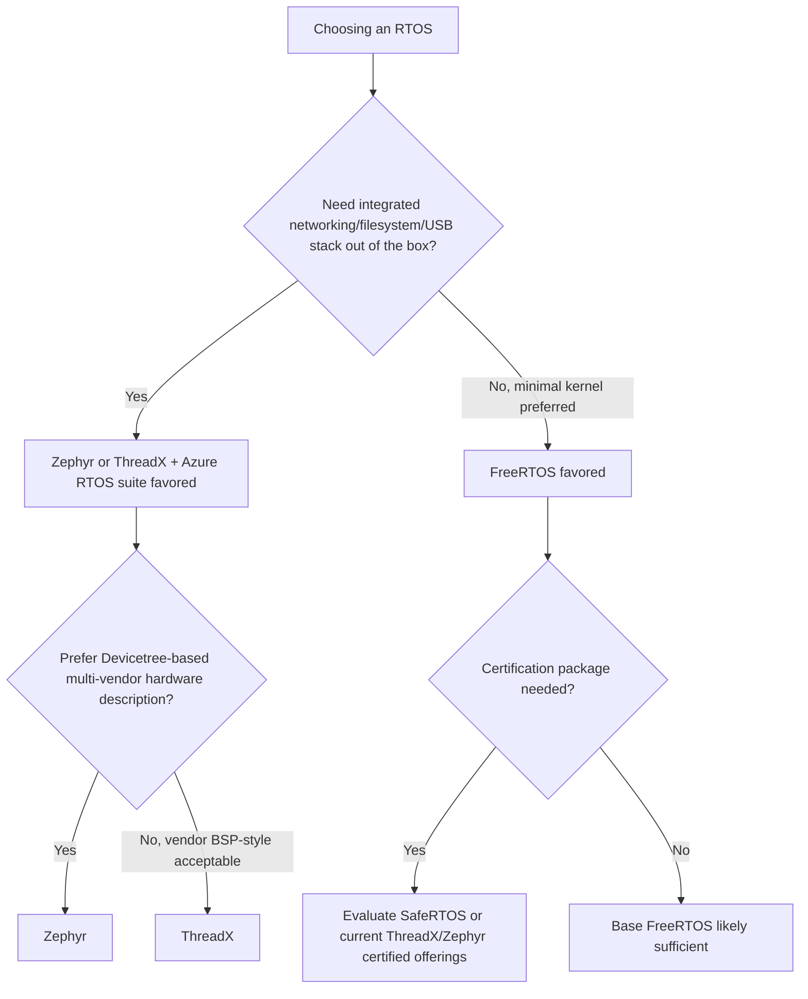

## Popular RTOS Options: FreeRTOS, Zephyr, ThreadX

### Overview

FreeRTOS, Zephyr, and ThreadX represent three of the most widely deployed RTOS kernels in commercial and industrial embedded development, each with distinct architectural philosophies, licensing models, and ecosystem strengths. Choosing among them (or another RTOS entirely) depends on factors including certification needs, hardware ecosystem, connectivity stack requirements, and long-term maintenance model. This topic compares their core characteristics to inform that decision.

### FreeRTOS

FreeRTOS is a minimalist, widely-ported real-time kernel originally developed by Richard Barry and now maintained by Amazon Web Services.

- **Scope**: intentionally small in scope — a scheduler, task management, and inter-task communication/synchronization primitives (queues, semaphores, mutexes, event groups, task notifications) — without a built-in filesystem, networking stack, or device driver framework as core kernel components
- **Portability**: ported to an extremely wide range of microcontroller architectures (ARM Cortex-M/A/R, RISC-V, MIPS, PIC, AVR, and many others), making it a common default choice across many silicon vendors' SDKs
- **Licensing**: MIT license — permissive, free for commercial use without royalty
- **Ecosystem additions**: AWS provides additional libraries under the FreeRTOS umbrella (FreeRTOS+TCP for networking, coreMQTT, coreHTTP, and other AWS IoT-oriented libraries) as optional add-ons rather than core kernel components
- **Certification**: SafeRTOS (a separate, certified sibling codebase maintained historically by WITTENSTEIN/now under the FreeRTOS ecosystem) provides a pre-certified option for safety-critical use, since base FreeRTOS itself is not independently safety-certified

**Example (FreeRTOS minimal task setup, illustrating its lean core API):**

```c
void vTask1(void *pv) {
    for (;;) {
        toggle_led();
        vTaskDelay(pdMS_TO_TICKS(500));
    }
}

int main(void) {
    hardware_init();
    xTaskCreate(vTask1, "Task1", configMINIMAL_STACK_SIZE, NULL, 1, NULL);
    vTaskStartScheduler();
    for (;;);  // should never reach here
}
```

### Zephyr

Zephyr is a more comprehensive RTOS project hosted by the Linux Foundation, positioned as a full embedded operating system rather than a minimal scheduler.

- **Scope**: includes not just a scheduler and IPC primitives, but also an integrated networking stack (IPv4/IPv6, Bluetooth Low Energy, Thread, CoAP, MQTT), a device driver model, a build system (based on CMake and the Devicetree hardware description format borrowed from Linux), and a filesystem abstraction
- **Devicetree-based hardware description**: hardware configuration is described declaratively rather than through vendor-specific board support packages alone, intended to make driver and board support more portable and consistent across the many supported boards
- **Licensing**: Apache 2.0 — permissive, and notably the project itself (not just the license) is governed under an open, multi-vendor foundation model rather than controlled by a single company
- **Community and vendor backing**: contributions and governance span many silicon vendors and companies (Nordic, NXP, Intel, and others have been significant contributors historically), which broadens hardware support but also means the project's scope and direction is shaped by a wider set of stakeholders than a single-vendor kernel
- **Certification**: [Unverified] specific certified variants and the current state of safety-certification packages for Zephyr change over time and vary by commercial vendor offering; the Zephyr project's own documentation and any commercial certification partner should be consulted for the current status relevant to a specific safety standard and target

**Example (Zephyr application structure, illustrating its Devicetree/Kconfig-based build approach):**

```c
#include <zephyr/kernel.h>
#include <zephyr/drivers/gpio.h>

#define LED0_NODE DT_ALIAS(led0)
static const struct gpio_dt_spec led = GPIO_DT_SPEC_GET(LED0_NODE, gpios);

void main(void) {
    gpio_pin_configure_dt(&led, GPIO_OUTPUT_ACTIVE);
    while (1) {
        gpio_pin_toggle_dt(&led);
        k_msleep(500);
    }
}
```

Note the `DT_ALIAS`/`GPIO_DT_SPEC_GET` pattern — hardware pin/peripheral assignment comes from a Devicetree overlay rather than being hardcoded in application source, a structural difference from FreeRTOS's typical direct-register or vendor-HAL approach.

### ThreadX

ThreadX (now distributed as **Azure RTOS ThreadX** following Microsoft's acquisition of Express Logic, and more recently open-sourced) is a commercial-heritage RTOS with a long track record in high-volume embedded deployments.

- **Scope**: core kernel is compact and focused like FreeRTOS, but Microsoft/Express Logic bundles it within the broader Azure RTOS suite alongside FileX (filesystem), NetX/NetX Duo (networking), USBX (USB stack), and GUIX (graphics), forming a more complete middleware ecosystem when those components are used together
- **Licensing history**: historically commercially licensed with per-unit or per-project fees under Express Logic; Microsoft has since made ThreadX available under an open-source license (MIT) as part of the broader Azure RTOS/Eclipse ThreadX transition, changing its accessibility considerably compared to its earlier commercial-only model
- **Certification**: [Unverified] ThreadX has historically held pre-certification evidence packages for standards such as IEC 61508, ISO 26262, and IEC 62304 through its commercial certification partners; the specific current certification packages and their applicability should be verified against current vendor/Eclipse Foundation documentation, since certification offerings and ownership have shifted with the project's transitions
- **Deployment footprint**: [Unverified] ThreadX is frequently cited as having an extremely large installed base (claims of billions of deployed devices appear in vendor and press materials), though this figure originates from vendor marketing rather than independently audited data and should be treated as a vendor-reported claim rather than a verified count

**Example (ThreadX thread creation, illustrating its API style):**

```c
TX_THREAD thread_0;
UCHAR thread_0_stack[1024];

void thread_0_entry(ULONG thread_input) {
    while (1) {
        toggle_led();
        tx_thread_sleep(50);   // ticks, not milliseconds directly
    }
}

void tx_application_define(void *first_unused_memory) {
    tx_thread_create(&thread_0, "Thread 0", thread_0_entry, 0,
                      thread_0_stack, sizeof(thread_0_stack),
                      1, 1, TX_NO_TIME_SLICE, TX_AUTO_START);
}
```

### Comparison Table

| Aspect | FreeRTOS | Zephyr | ThreadX |
| --- | --- | --- | --- |
| Core scope | Minimal (scheduler + IPC) | Full OS (net, drivers, fs, build system) | Compact core, broader suite alongside it |
| Governance | AWS-maintained | Linux Foundation, multi-vendor | Microsoft/Eclipse Foundation (post-acquisition) |
| License | MIT | Apache 2.0 | MIT (current), formerly commercial |
| Hardware config model | Vendor HAL / direct register access typical | Devicetree + Kconfig | Vendor BSP-style, varies by port |
| Built-in networking stack | Optional add-on (FreeRTOS+TCP) | Integrated | Integrated (NetX/NetX Duo, separate component) |
| Build system | Flexible/none prescribed (Makefiles, CMake, vendor IDEs all common) | CMake + west, prescribed | Varies by port/toolchain |
| Certification path | Via separate SafeRTOS codebase | [Unverified] varies by vendor/version | [Unverified] historically available via commercial partners |
| Typical adoption pattern | Broadest MCU portability, minimalist projects | Full-featured IoT/connected products wanting integrated stack | High-volume commercial products, historically license-driven adoption |

### RTOS Selection Considerations Diagram



### Practical Selection Factors

- **Existing vendor SDK support**: many silicon vendors ship FreeRTOS as the default/example RTOS integration in their SDKs, which can make it the path of least resistance regardless of other technical merits
- **Team familiarity**: prior experience with a specific kernel's API and idioms (task notifications and heap schemes in FreeRTOS vs. Devicetree/Kconfig in Zephyr vs. ThreadX's `tx_` API prefix conventions) affects onboarding time meaningfully
- **Need for an integrated, maintained networking/USB/filesystem stack**: favors Zephyr or ThreadX's broader suite over assembling separate third-party components around a minimal FreeRTOS core
- **Long-term support and governance risk tolerance**: a multi-vendor foundation-governed project (Zephyr) versus a single-company-maintained project (FreeRTOS under AWS, ThreadX under Microsoft/Eclipse) carries different considerations around roadmap control and continuity, though [Inference] this is a general governance consideration rather than a claim that any one model is objectively safer for a given project — actual continuity depends on specific project health indicators at the time of the decision, not governance structure alone
- **Certification requirements**: projects needing pre-existing certification evidence for a specific standard should verify current certified offerings and their exact scope directly with the relevant vendor/foundation, since this landscape changes over time

### Key Points

- FreeRTOS is a minimal, extremely widely-ported kernel under MIT license, with networking/other stacks available as separate optional components and certification available via the separate SafeRTOS codebase
- Zephyr is a full embedded OS with integrated networking, drivers, and a Devicetree-based hardware description model, governed by a multi-vendor Linux Foundation project under Apache 2.0
- ThreadX is a compact-core kernel historically distributed commercially, now available under MIT license as Eclipse ThreadX, typically paired with the broader Azure RTOS suite (FileX, NetX, USBX, GUIX) for full-featured products
- Selection should weigh existing vendor SDK integration, team familiarity, need for integrated stacks versus a minimal core, and current certification offerings — several of these specifics (especially certification status) change over time and should be verified against current vendor documentation rather than assumed

### Related Topics

- SafeRTOS and other certified RTOS options for safety-critical development
- Devicetree and Kconfig-based hardware configuration in Zephyr
- RTOS memory management and heap scheme selection
- Networking stack integration (FreeRTOS+TCP, Zephyr networking, NetX Duo)
- RTOS task scheduling algorithms and priority assignment
- Vendor SDK and board support package (BSP) evaluation criteria