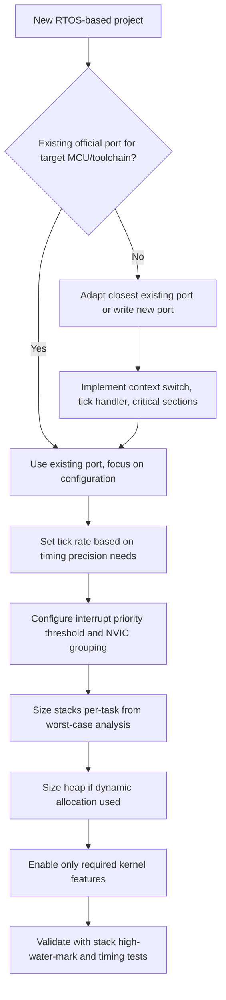

## RTOS Configuration and Porting


### Overview

Configuring and porting an RTOS is the process of adapting a kernel to run correctly on a specific microcontroller and application, spanning everything from low-level architecture-specific context-switch code to high-level decisions about which kernel features to enable. A port that compiles but is subtly misconfigured — wrong tick rate, incorrect interrupt priority grouping, insufficient stack sizing — can produce a system that appears to work in casual testing but fails unpredictably under load or over long runtime. This topic covers what porting actually involves and the key configuration decisions that follow.

### What "Porting" an RTOS Means

Porting is distinct from configuring: porting adapts the kernel to new hardware/toolchain at the lowest level, while configuration tunes an already-ported kernel's behavior for a specific application.

- **Architecture port**: implementing the processor-specific context-switch mechanism (saving/restoring registers, switching stack pointers), typically the smallest but most critical piece of hardware-specific code in the entire kernel
- **Toolchain/compiler port**: adapting to compiler-specific intrinsics, calling conventions, and startup code conventions (GCC vs. IAR vs. Keil/ARMCC vs. others)
- **Tick source integration**: connecting the RTOS's time base to an actual hardware timer (SysTick on Cortex-M, or a general-purpose timer on other architectures)
- Most mainstream RTOS kernels (FreeRTOS, Zephyr, ThreadX) already ship with ports for the vast majority of common microcontroller architectures and toolchains, so "porting" in most modern embedded projects means selecting and lightly adapting an existing port rather than writing one from scratch

### Core Architecture-Specific Port Components

For architectures without an existing official port (a genuinely new/unusual core, or a heavily customized processor), the minimal set of components a port must provide typically includes:

- **Context switch routine**: assembly code that saves the currently running task's CPU register state to its stack, and restores the next task's saved state from its stack
- **First task start-up code**: a special case of context switch used only once, when the scheduler starts and there is no "previous" task to save
- **Tick interrupt handler**: increments the RTOS's internal tick counter and triggers a scheduling decision at each tick period
- **Critical section (interrupt masking) primitives**: architecture-specific instructions to disable/enable interrupts (or mask to a configured priority threshold) for protecting kernel data structures

**Example (illustrative Cortex-M PendSV context switch skeleton, showing the general shape of this code — actual production ports include additional handling not shown here):**

```c
void PendSV_Handler(void) {
    __asm volatile (
        "MRS R0, PSP                  \n"  // get current task's process stack pointer
        "STMDB R0!, {R4-R11}          \n"  // save remaining registers onto its stack
        "LDR R1, =pxCurrentTCB        \n"
        "LDR R2, [R1]                 \n"
        "STR R0, [R2]                 \n"  // save new stack pointer into current TCB
        "                             \n"
        "BL vTaskSwitchContext        \n"  // scheduler picks next task
        "                             \n"
        "LDR R1, =pxCurrentTCB        \n"
        "LDR R2, [R1]                 \n"
        "LDR R0, [R2]                 \n"  // load next task's saved stack pointer
        "LDMIA R0!, {R4-R11}          \n"  // restore its registers
        "MSR PSP, R0                  \n"
        "BX LR                        \n"
    );
}
```

[Unverified] This is a simplified illustration of the general structure of a Cortex-M context switch; production RTOS ports include additional handling (FPU context, MPU region reconfiguration, interrupt priority manipulation) not shown here, and the exact instruction sequence varies by RTOS and Cortex-M variant — the actual kernel source for the target RTOS/architecture combination should be used as the authoritative reference rather than this simplified illustration.

### Key Configuration Parameters

Once a port exists (whether pre-supplied or newly written), a substantial amount of application-specific tuning happens through configuration, typically in a header file (e.g., FreeRTOS's `FreeRTOSConfig.h`, Zephyr's Kconfig options, ThreadX's `tx_port.h`/build-time defines).

#### Tick Rate

- Determines the granularity of time-based operations (`vTaskDelay`, timeouts, round-robin time-slicing)
- **Higher tick rate**: finer timing granularity, but more CPU overhead spent servicing tick interrupts and more frequent scheduler invocations
- **Lower tick rate**: less overhead, but coarser granularity for delays and timeouts — a delay of "1 tick" could represent anywhere from just-under to just-over the configured tick period depending on when within the tick interval the delay was requested
- Common values range from 100 Hz to 1000 Hz depending on application timing precision needs and available CPU headroom

#### Interrupt Priority Configuration

- As discussed in interrupt handling, `configMAX_SYSCALL_INTERRUPT_PRIORITY` (or equivalent) must be set correctly relative to the NVIC priority grouping configuration
- **Priority grouping/bits**: on Cortex-M, the number of priority bits implemented and the NVIC's priority grouping register configuration must match what the RTOS port expects, or interrupt priority comparisons can behave incorrectly
- Misconfiguration here is a common source of hard-to-diagnose faults that only manifest when a specific interrupt priority combination occurs, rather than immediately at startup

#### Stack and Heap Sizing

- **Minimal task stack size**: a default/baseline stack size configuration, though individual tasks with deeper call chains need larger explicit allocations
- **Total heap size** (for kernels using dynamic allocation): must be sized to accommodate all kernel objects (tasks, queues, semaphores) created at runtime, with margin for the specific heap scheme's overhead per allocation
- **Idle task stack size**: often overlooked, but the idle task itself needs sufficient stack for any hook functions or cleanup routines it performs (such as deleting deleted tasks' resources)

#### Feature Enable/Disable Flags

Most configurable RTOS kernels allow disabling unused features to reduce code size and, in some cases, runtime overhead:

```c
// Example: FreeRTOSConfig.h illustrative excerpt
#define configUSE_PREEMPTION           1
#define configUSE_TIME_SLICING         1
#define configUSE_MUTEXES              1
#define configUSE_RECURSIVE_MUTEXES    1
#define configUSE_COUNTING_SEMAPHORES  1
#define configUSE_TASK_NOTIFICATIONS   1
#define configCHECK_FOR_STACK_OVERFLOW 2
#define configUSE_TICKLESS_IDLE        1
#define configTICK_RATE_HZ             1000
```

Disabling unused features (e.g., `configUSE_RECURSIVE_MUTEXES` if the application never needs them) reduces flash footprint and, for some options, avoids unnecessary runtime checks.

### Configuration Decision Flow



### Startup Sequence Considerations

- **Scheduler start point**: the RTOS scheduler typically takes over the CPU permanently once started (`vTaskStartScheduler()` or equivalent) — code after this call in `main()` should never execute in a correctly functioning system
- **Pre-scheduler hardware initialization**: peripherals, clocks, and any hardware that must be ready before the first task runs are typically initialized in `main()` before starting the scheduler, though some designs defer non-critical initialization into the first task itself
- **Interrupt enable timing**: interrupts that call RTOS APIs should generally not be enabled until after the scheduler has started, to avoid a race where an ISR attempts to signal a task before the kernel's data structures are fully initialized

### Common Porting and Configuration Pitfalls

- **Incorrect NVIC priority grouping relative to what the port expects**: a frequent, subtle source of misbehavior since the system may run correctly under light interrupt load and fail only when specific priority interactions occur
- **Tick rate mismatches with hardware timer configuration**: an incorrectly configured timer prescaler/reload value produces a tick rate that doesn't match `configTICK_RATE_HZ`, silently skewing every time-based delay and timeout in the system
- **Insufficient heap size for all kernel objects created**: manifests as allocation failures (task creation failing, silently returning an error that isn't checked) rather than an obvious build-time or immediate-runtime failure
- **Enabling interrupts that call RTOS APIs before the scheduler starts**: can corrupt kernel state that hasn't yet been initialized, producing failures that may not manifest consistently depending on exact timing
- **Copying configuration from an unrelated reference project without understanding each setting**: settings tuned for a different MCU, clock speed, or application profile (e.g., a much higher tick rate than actually needed) can waste CPU cycles or, worse, be actively incorrect for the new target's clock configuration

### Validating a New Port or Configuration

- **Context switch correctness**: verify with a debugger that register state is correctly preserved across a switch — a common test is confirming that a task resumes exactly where it was preempted, with all local variables intact
- **Tick accuracy**: measure actual elapsed time for a requested delay against a known-good external reference (oscilloscope, logic analyzer, or a calibrated hardware timer) to confirm the configured tick rate matches reality
- **Interrupt latency measurement**: toggle a GPIO at ISR entry and measure the delay from the triggering hardware event using an oscilloscope, to validate worst-case interrupt response time assumptions
- **Stack margin verification**: run realistic (ideally worst-case) workloads and check high-water-mark values for every task, not just a quick smoke test, since stack usage depends heavily on the specific code paths actually exercised

### Key Points

- Porting adapts the kernel's lowest-level, architecture-specific code (context switch, tick handler, critical sections) to new hardware; configuration tunes an already-ported kernel's behavior for a specific application, and most projects only need the latter since official ports for common MCUs already exist
- Tick rate, interrupt priority threshold configuration, and stack/heap sizing are the most consequential application-level configuration decisions, and errors in any of them tend to produce intermittent, hard-to-diagnose failures rather than obvious immediate ones
- Interrupt priority grouping mismatches and enabling RTOS-calling interrupts before the scheduler starts are among the most common and subtle porting/configuration bugs
- New port validation should include context-switch correctness, tick accuracy against an external reference, interrupt latency measurement, and stack margin verification under realistic workloads — not just a basic smoke test

### Related Topics

- Interrupt priority configuration and the syscall priority threshold
- Stack sizing methodology and overflow detection
- RTOS memory management and heap scheme selection
- Task scheduling algorithms and tick-driven time-slicing
- Hardware timer configuration for RTOS tick sources
- RTOS-aware debugging and trace tools for validating context switches