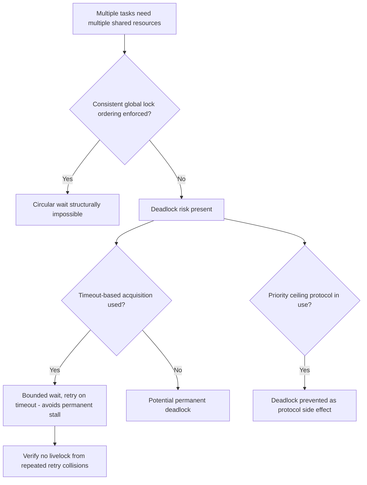

## Deadlock and Race Condition Avoidance

### Overview

Deadlocks and race conditions are two of the most consequential concurrency defects in embedded systems, distinguished by their failure signature: a race condition produces incorrect results from mistimed access to shared data, while a deadlock produces complete stoppage when tasks become permanently blocked waiting on each other. Both are notoriously difficult to reproduce on demand, since they typically depend on precise timing that varies run to run, making prevention through disciplined design far more reliable than detection through testing alone.

### Race Conditions

A race condition occurs when the correctness of a program depends on the relative timing of two or more concurrent operations on shared data, and that timing is not properly controlled.

**Example (classic read-modify-write race):**

```c
volatile uint32_t shared_counter = 0;

// Task A
void task_a(void) {
    shared_counter++;   // load, increment, store — three separate steps
}

// Task B (or an ISR)
void task_b(void) {
    shared_counter++;
}
```

If Task A is preempted between reading `shared_counter` and writing back the incremented value, and Task B (or an ISR) also increments it during that window, one of the two increments is lost — the final value is one less than expected, silently and without any error indication.

### Common Race Condition Patterns in Embedded Systems

- **Non-atomic read-modify-write on shared variables**: as above, any `x++`, `x += n`, or multi-instruction compound operation on data shared across tasks/ISRs
- **Check-then-act races**: checking a condition (e.g., "is the buffer empty?") and then acting on it (e.g., "write to the buffer") as two separate steps, where another task/ISR can change the condition in between
- **Partially-updated multi-field structures**: writing several related fields of a struct is a race if a reader can observe the struct in a state where some fields reflect the new values and others still reflect the old ones
- **Unsynchronized access to hardware peripheral registers**: two tasks (or a task and an ISR) manipulating the same peripheral register without coordination can produce a corrupted register write if the operation isn't a single atomic bus transaction

**Example (check-then-act race on a buffer):**

```c
// Race: another task/ISR could fill the buffer between the check and the write
if (buffer_write_index < BUFFER_SIZE) {
    buffer[buffer_write_index] = new_value;   // buffer_write_index may have changed
    buffer_write_index++;
}
```

### Race Condition Prevention Techniques

- **Mutexes**: protect the entire read-modify-write or check-then-act sequence as a single critical section, ensuring no other task can interleave
- **Atomic operations/intrinsics**: where the architecture provides them (e.g., ARM's LDREX/STREX exclusive access instructions, or C11 `_Atomic` types with appropriate compiler/library support), atomic operations can avoid the need for a full mutex for simple operations
- **Disabling interrupts for very short critical sections**: appropriate only for extremely brief operations, since this adds directly to worst-case interrupt latency for the entire system
- **Message passing instead of shared memory**: redesigning the interaction so data is transferred via a queue rather than accessed concurrently at all, eliminating the race by construction rather than by locking

**Example (mutex-protected critical section fixing the check-then-act race):**

```c
xSemaphoreTake(xBufferMutex, portMAX_DELAY);
if (buffer_write_index < BUFFER_SIZE) {
    buffer[buffer_write_index] = new_value;
    buffer_write_index++;
}
xSemaphoreGive(xBufferMutex);
```

### Race Condition Timeline Diagram

<svg xmlns="http://www.w3.org/2000/svg" viewBox="0 0 800 280">
\<style\>
.box { fill: #f4f4f4; stroke: #333; stroke-width: 1.5; }
.box2 { fill: #e8f0fe; stroke: #333; stroke-width: 1.5; }
.box3 { fill: #fdecea; stroke: #333; stroke-width: 1.5; }
.label { font-family: sans-serif; font-size: 12px; fill: #111; }
.title { font-family: sans-serif; font-size: 14px; fill: #111; font-weight: bold; }
\</style\>
<text x="20" y="24" class="title">Lost Update Race Condition (svg_diagram)</text>

<text x="20" y="60" class="label">Task A:</text>

<rect x="100" y="45" width="90" height="25" class="box" />

<text x="108" y="62" class="label">Read x=5</text>

<rect x="300" y="45" width="120" height="25" class="box3" />

<text x="308" y="62" class="label">Write x=6 (stale!)</text>

<text x="20" y="110" class="label">Task B:</text>

<rect x="200" y="95" width="90" height="25" class="box2" />

<text x="208" y="112" class="label">Read x=5</text>

<rect x="290" y="95" width="90" height="25" class="box2" />

<text x="298" y="112" class="label">Write x=6</text>

<text x="20" y="170" class="label">Expected result: x=7 (two increments)</text>

<text x="20" y="195" class="label">Actual result: x=6 (one increment lost)</text>

<text x="20" y="230" class="label">Cause: Task A read stale value before Task B's write completed,</text>

<text x="20" y="250" class="label">then overwrote Task B's update with its own stale calculation</text>

</svg>

### Deadlock

A deadlock occurs when two or more tasks are each waiting for a resource held by another, such that none can proceed — a permanent, not just temporary, stall.

**The four classic necessary conditions for deadlock** (all four must hold simultaneously for deadlock to occur):

1. **Mutual exclusion**: at least one resource must be held in a non-shareable mode
2. **Hold and wait**: a task holding one resource is waiting to acquire another
3. **No preemption**: resources cannot be forcibly taken from a task holding them; they must be voluntarily released
4. **Circular wait**: a cycle exists in the resource-wait graph (Task 1 waits for a resource held by Task 2, which waits for a resource held by Task 1)

**Example (two-mutex circular wait deadlock):**

```c
// Task 1
void task1(void) {
    xSemaphoreTake(xMutexA, portMAX_DELAY);
    vTaskDelay(pdMS_TO_TICKS(10));           // simulates some work, widens the race window
    xSemaphoreTake(xMutexB, portMAX_DELAY);  // blocks here if Task 2 holds B
    // ...
    xSemaphoreGive(xMutexB);
    xSemaphoreGive(xMutexA);
}

// Task 2 — acquires in the opposite order
void task2(void) {
    xSemaphoreTake(xMutexB, portMAX_DELAY);
    vTaskDelay(pdMS_TO_TICKS(10));
    xSemaphoreTake(xMutexA, portMAX_DELAY);  // blocks here if Task 1 holds A
    // ...
    xSemaphoreGive(xMutexA);
    xSemaphoreGive(xMutexB);
}
```

If Task 1 acquires `xMutexA` and Task 2 acquires `xMutexB` at roughly the same time, each then blocks waiting for the mutex the other already holds — neither can ever proceed, and neither mutex is ever released.

### Deadlock Prevention Strategies

Each prevention strategy works by breaking one of the four necessary conditions.

- **Lock ordering (breaks circular wait)**: enforce a strict, global, consistent order in which mutexes are always acquired across the entire codebase — if every task acquires `xMutexA` before `xMutexB`, never the reverse, a circular wait cannot form
- **Lock timeout with backoff (breaks hold-and-wait indefinitely)**: use a bounded timeout on lock acquisition rather than waiting forever; on timeout, release any already-held locks and retry, preventing a permanent stall (though this can introduce livelock if not carefully designed)
- **Priority ceiling protocol (breaks circular wait, in properly configured systems)**: as discussed in priority inversion, a correctly configured priority ceiling protocol can structurally prevent deadlock as a side effect of its priority-boosting rules
- **Single-lock acquisition per critical section**: redesigning the system so no task ever needs to hold more than one lock at a time, eliminating the possibility of circular wait entirely
- **Resource hierarchy/allocation graph analysis**: for systems with a bounded, known set of resources, statically analyzing the possible acquisition graph at design time to detect potential cycles before they occur at runtime



### Livelock: A Related but Distinct Hazard

Livelock occurs when tasks are not blocked (as in deadlock) but are actively running, continuously changing state in response to each other, without making actual forward progress — for example, two tasks that each release a lock and retry upon detecting contention, but happen to retry in a pattern that perpetually collides.

[Inference] Livelock is generally considered harder to detect through simple state monitoring than deadlock, because the tasks involved are not blocked or idle — CPU utilization and task state both appear normal — so livelock often requires observing a lack of actual progress over time (e.g., an operation that should complete never does, despite the system appearing busy) rather than a straightforward blocked/waiting state check.

### Detection Techniques

- **RTOS-aware tracing tools**: tools such as Percepio Tracealyzer or SEGGER SystemView can visualize task blocking relationships over time, making a deadlock's characteristic pattern (multiple tasks simultaneously blocked, none ever resuming) visible
- **Watchdog timers**: a system-level watchdog that is not serviced when all tasks are deadlocked will eventually trigger a reset — this is a safety-net recovery mechanism, not a prevention technique, and doesn't diagnose the root cause
- **Static analysis of lock acquisition patterns**: some static analysis tools can detect potential lock-ordering violations by examining all code paths that acquire multiple locks, flagging inconsistent ordering across the codebase before it ever manifests at runtime
- **Deadlock detection algorithms** (resource allocation graph cycle detection): more common in general-purpose operating systems than in resource-constrained embedded RTOS kernels, since the runtime overhead of maintaining and analyzing a full allocation graph is often not justified when prevention-by-design is more practical

### Testing Challenges

- **Timing-dependent reproducibility**: both race conditions and deadlocks often depend on precise interleaving that may only occur under specific load conditions, specific interrupt timing, or after extended runtime — a passing test suite does not prove their absence
- **Stress and soak testing**: running the system under artificially heavy and varied load for extended durations increases the likelihood of surfacing timing-dependent defects that light functional testing would miss
- **Fault injection for timing**: deliberately introducing artificial delays at specific points in the code (compile-time configurable for test builds) can widen race windows and make normally rare interleavings occur reliably enough to test against
- [Inference] Because these defects are fundamentally about timing rather than logic errors visible in a single execution trace, code review focused specifically on shared-resource access patterns and lock-ordering discipline is generally considered a more reliable primary defense than relying on testing alone to catch every possible interleaving, though testing remains a valuable complementary check.

### Common Pitfalls

- **Assuming `volatile` prevents race conditions**: `volatile` only prevents the compiler from optimizing away accesses to a variable; it does nothing to make multi-step operations atomic or to provide mutual exclusion — a very common and consequential misunderstanding
- **Inconsistent lock ordering introduced during maintenance**: a codebase that starts with consistent lock ordering can develop violations over time as new code is added by developers unaware of the convention, without any tooling to catch the regression
- **Overly broad critical sections used defensively**: locking far more than necessary "to be safe" increases contention and worst-case blocking time without actually improving correctness, and can itself contribute to timing-related issues elsewhere in the system
- **Nested lock acquisition without recursive mutex support**: attempting to re-acquire a non-recursive mutex already held by the same task typically deadlocks the task against itself
- **Ignoring the interaction between ISR-level and task-level access to the same data**: race condition analysis must include ISRs, not just other tasks, since an ISR can preempt a task at any point regardless of task-level locking

### Key Points

- Race conditions produce incorrect results from unsynchronized concurrent access to shared data; deadlocks produce permanent stoppage from circular resource waiting — distinct failure signatures requiring distinct analysis
- Race conditions are prevented by ensuring multi-step operations on shared data execute as atomic units, via mutexes, atomic instructions, or eliminating shared access through message passing
- Deadlock requires all four classic conditions (mutual exclusion, hold-and-wait, no preemption, circular wait) simultaneously; breaking any one prevents it, with consistent lock ordering being the most broadly applicable technique
- Livelock is a related but distinct hazard where tasks remain active but make no real progress, generally harder to detect than deadlock since no task appears blocked
- Both defects are timing-dependent and often not reliably caught by light functional testing; disciplined design (lock ordering, minimal critical sections) is generally a more dependable defense than testing alone

### Related Topics

- Semaphores and mutexes: correct usage and priority inheritance
- Priority inversion and priority ceiling protocol deadlock prevention
- RTOS-aware tracing and visualization tools for concurrency debugging
- Watchdog timer design as a deadlock recovery safety net
- Message-passing architecture as an alternative to shared-memory synchronization
- Stress testing and fault injection techniques for timing-dependent defects