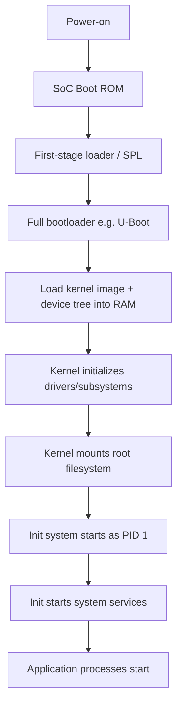

## Embedded Linux Architecture Overview

### Overview

Embedded Linux refers to the use of the Linux kernel and surrounding userspace ecosystem in purpose-built, resource-managed embedded devices, as distinct from general-purpose desktop or server Linux distributions. It sits at a different point on the complexity/capability spectrum than a bare-metal or RTOS-based design: embedded Linux brings a full process model, virtual memory, a rich driver ecosystem, and mature networking and filesystem support, at the cost of higher resource requirements (typically megabytes of RAM and storage rather than kilobytes) and less deterministic timing than a dedicated RTOS. This topic surveys the architectural layers that make up a typical embedded Linux system.

### Why Embedded Linux Instead of an RTOS or Bare-Metal

- **Rich driver and subsystem ecosystem**: mainline Linux includes drivers and subsystems for an enormous range of hardware and protocols (USB, networking stacks, filesystems, graphics, multimedia) that would require substantial custom development on a bare-metal or minimal RTOS platform
- **Multi-process isolation**: Linux's process model with virtual memory provides fault isolation between applications that a typical single-address-space RTOS does not — a crash in one process does not usually corrupt another process's memory
- **Mature application-level tooling**: standard POSIX APIs, scripting languages, package management, and a vast body of existing open-source software can often be reused directly rather than reimplemented
- **Trade-off**: higher RAM/storage/power requirements, more complex boot process, and generally weaker hard real-time guarantees than an RTOS (though real-time extensions exist — see below) — Linux is typically chosen when device capability and ecosystem leverage matter more than hard microsecond-level determinism

### Layered Architecture

<svg xmlns="http://www.w3.org/2000/svg" viewBox="0 0 800 420">
\<style\>
.box { fill: #f4f4f4; stroke: #333; stroke-width: 1.5; }
.box2 { fill: #e8f0fe; stroke: #333; stroke-width: 1.5; }
.box3 { fill: #fdecea; stroke: #333; stroke-width: 1.5; }
.label { font-family: sans-serif; font-size: 12px; fill: #111; }
.title { font-family: sans-serif; font-size: 14px; fill: #111; font-weight: bold; }
\</style\>
<text x="20" y="24" class="title">Embedded Linux Software Stack (svg_diagram)</text>
<rect x="150" y="50" width="500" height="45" rx="6" class="box3" />
<text x="165" y="78" class="label">Applications (user-space programs, scripts)</text>
<rect x="150" y="100" width="500" height="45" rx="6" class="box2" />
<text x="165" y="128" class="label">Libraries (libc, libraries, middleware)</text>
<rect x="150" y="150" width="500" height="45" rx="6" class="box2" />
<text x="165" y="178" class="label">Init System (systemd / BusyBox init / OpenRC)</text>
<rect x="150" y="200" width="500" height="45" rx="6" class="box" />
<text x="165" y="228" class="label">Root Filesystem (rootfs)</text>
<rect x="150" y="250" width="500" height="45" rx="6" class="box" />
<text x="165" y="278" class="label">Linux Kernel (scheduler, drivers, subsystems)</text>
<rect x="150" y="300" width="500" height="45" rx="6" class="box3" />
<text x="165" y="328" class="label">Bootloader (U-Boot, Barebox, etc.)</text>
<rect x="150" y="350" width="500" height="45" rx="6" class="box" />
<text x="165" y="378" class="label">Hardware (SoC, RAM, storage, peripherals)</text>

<text x="20" y="405" class="label">Each layer builds on and depends on the layer below it</text>

</svg>

### Bootloader Layer

- **First code to execute**: initializes minimal hardware (DRAM controller, clock configuration) sufficient to load and start the next stage
- **Common embedded bootloaders**: U-Boot (extremely widely used across ARM-based embedded Linux), Barebox, and vendor-specific bootloaders for particular SoC families
- **Multi-stage boot**: many SoCs use a chain of boot stages (on-chip boot ROM → SPL/first-stage loader → full bootloader → kernel), since the earliest stages often must execute from very limited on-chip memory before external RAM is initialized
- **Responsibilities**: loading the kernel image and device tree (or ACPI tables on some platforms) into RAM, passing boot arguments, and transferring control to the kernel

### Linux Kernel Layer

- **Scheduler**: Linux's Completely Fair Scheduler (CFS) is the default for normal tasks; real-time scheduling classes (`SCHED_FIFO`, `SCHED_RR`) are available for processes needing more deterministic priority-based behavior, though the underlying kernel's overall determinism depends heavily on configuration (see PREEMPT_RT below)
- **Device drivers**: the kernel's driver model (platform drivers, I2C/SPI/USB subsystems, etc.) is how the OS communicates with SoC peripherals and external hardware
- **Device tree**: on most embedded ARM (and increasingly other architecture) platforms, hardware configuration is described in a device tree source file, compiled into a binary blob passed to the kernel at boot, describing memory-mapped peripherals, clock trees, and pin configurations rather than hardcoding them into kernel source
- **Kernel configuration**: embedded builds typically use a heavily trimmed kernel configuration (`menuconfig`/`defconfig`) including only the drivers and subsystems the specific hardware and application actually need, to reduce image size, boot time, and attack surface

### Root Filesystem Layer

- **Contents**: the root filesystem contains the init system, standard libraries (commonly a lightweight libc alternative such as musl or uClibc rather than full glibc, though glibc is also used), userspace utilities, and application binaries
- **BusyBox**: an extremely common component in embedded root filesystems, providing a single compact binary that implements simplified versions of dozens of standard Unix command-line utilities, dramatically reducing storage footprint versus including each utility as a separate full-featured binary
- **Filesystem types**: common choices include SquashFS (compressed, read-only — often paired with an overlay filesystem for a writable layer), ext4 (read-write, journaling), UBIFS (designed specifically for raw NAND flash), and initramfs (RAM-resident filesystem, sometimes used for early boot or extremely minimal systems)

### Init System

- **Responsibility**: the first userspace process (PID 1) started by the kernel, responsible for starting all other system services and processes in the correct order
- **Common choices in embedded contexts**: systemd (increasingly common, full-featured, but heavier), BusyBox's minimal `init`, OpenRC, or custom minimal init scripts — the choice trades off feature richness (dependency-based service management, logging integration, socket activation for systemd) against simplicity and resource footprint (minimal init scripts)

### Libraries and Middleware Layer

- **C library choice**: glibc offers the broadest compatibility with existing software but has a larger footprint; musl and uClibc are common lower-footprint alternatives suited to resource-constrained targets, though not always fully compatible with every application expecting glibc-specific behavior
- **Middleware examples**: depending on application domain, this layer might include a graphics stack (Wayland/framebuffer-based UI toolkits), a communication middleware, or domain-specific libraries (industrial protocol stacks, media frameworks)

### Application Layer

- Actual product logic, running as one or more userspace processes, potentially written in C/C++, Python, or other languages supported by the target's toolchain and root filesystem contents
- Can leverage the full range of standard POSIX APIs and any included libraries, in contrast to the more constrained programming environment typical of bare-metal/RTOS application code

### Build Systems for Embedded Linux

Given the number of interacting layers, dedicated build systems exist specifically to manage cross-compiling and assembling a coherent embedded Linux image.

- **Yocto Project (via BitBake)**: highly flexible, layer-based build system widely used in commercial embedded Linux products, capable of producing a fully custom distribution tailored to specific hardware and application needs, at the cost of a steep learning curve and often long build times
- **Buildroot**: simpler and faster than Yocto for many use cases, using Kconfig-style configuration menus, often preferred for smaller projects or teams wanting a gentler learning curve
- **Vendor-provided BSPs (Board Support Packages)**: many SoC vendors provide a pre-configured Yocto layer or Buildroot configuration for their specific reference hardware as a starting point

### Real-Time Considerations in Embedded Linux

- **PREEMPT_RT patch set**: a long-maintained kernel patch (portions of which have been progressively mainlined over time) that makes the kernel substantially more preemptible, converting many spinlocks to preemptible mutexes and reducing worst-case latency significantly compared to a stock kernel configuration
- [Inference] Even with PREEMPT_RT, Linux generally does not match the worst-case latency guarantees of a purpose-built RTOS for the most demanding hard real-time applications, since Linux's scope and complexity (full MMU-based virtual memory, extensive driver subsystems, general-purpose scheduler heritage) inherently make exhaustive worst-case timing analysis more difficult than for a minimal RTOS kernel — though PREEMPT_RT substantially narrows this gap for many soft-real-time and moderately demanding use cases
- **Hybrid architectures**: some systems run Linux for general application logic and connectivity while offloading truly hard-real-time control tasks to a separate microcontroller or a dedicated RTOS core (increasingly common on heterogeneous SoCs with both an application processor and a separate microcontroller core, such as certain STM32MP1 or i.MX variants)

### Security Considerations Specific to Embedded Linux

- **Attack surface from included packages**: including only the drivers, kernel subsystems, and userspace packages actually needed reduces both image size and the number of potential vulnerabilities exposed
- **Secure boot chain**: verifying cryptographic signatures at each boot stage (boot ROM verifies bootloader, bootloader verifies kernel, and so on) to prevent unauthorized firmware from running
- **Read-only root filesystem with separate writable data partition**: a common pattern (often paired with SquashFS + overlay) that limits the persistent impact of a compromised or corrupted running system, since the base OS image cannot be modified at runtime
- **Long-term kernel and package maintenance**: embedded Linux products with long field lifetimes must plan for ongoing security patching of the kernel and any included packages, which is a substantially larger maintenance surface than a minimal RTOS/bare-metal firmware image

### Comparison: Embedded Linux vs. RTOS/Bare-Metal

| Aspect | Embedded Linux | RTOS / Bare-Metal |
| --- | --- | --- |
| Typical RAM footprint | Megabytes to gigabytes | Kilobytes to low megabytes |
| Boot time | Seconds (typically) | Milliseconds to low seconds |
| Real-time determinism | Soft/moderate (better with PREEMPT_RT) | Hard, tightly bounded |
| Driver/subsystem ecosystem | Extremely broad (mainline Linux) | Narrower, often vendor-specific |
| Process isolation | Strong (MMU-based virtual memory) | Typically none or MPU-based partial isolation |
| Development complexity | High (multiple layers, build systems) | Lower for simple applications |
| Typical use cases | Gateways, HMI panels, networked devices, complex UIs | Motor control, sensors, safety interlocks, deeply resource-constrained devices |

### Key Points

- Embedded Linux layers a bootloader, kernel, root filesystem, init system, libraries, and applications, each depending on the layer beneath it, contrasted with the flatter structure of bare-metal/RTOS firmware
- The choice of embedded Linux over an RTOS trades higher resource requirements and weaker default real-time guarantees for a vastly broader driver ecosystem, process isolation, and reuse of mature open-source software
- Device trees decouple hardware configuration from kernel source on most embedded platforms, and dedicated build systems (Yocto, Buildroot) manage the complexity of assembling a coherent custom image
- PREEMPT_RT substantially improves Linux's real-time behavior but does not generally eliminate the gap versus a purpose-built RTOS for the most demanding hard-real-time needs, motivating hybrid architectures that offload critical control to a separate RTOS or microcontroller core
- Security in embedded Linux spans secure boot chains, minimizing included packages, read-only root filesystems, and planning for long-term patch maintenance across a much larger software surface than a minimal RTOS image

### Related Topics

- Yocto Project and Buildroot build system deep dives
- Device tree syntax and hardware description
- PREEMPT_RT kernel configuration and real-time tuning
- Secure boot chain implementation for embedded Linux
- Heterogeneous SoC architectures combining Linux application cores with RTOS/microcontroller cores
- Root filesystem design (SquashFS, overlayfs, read-only strategies)