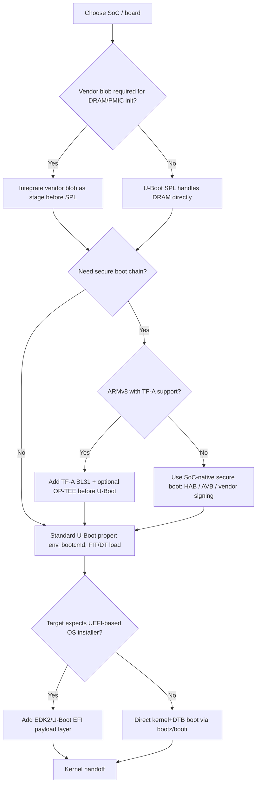

## Bootloaders: U-Boot and Alternatives


### Overview

A bootloader is the first software that runs after power-on or reset, before the operating system kernel exists in memory. On embedded systems, the bootloader is responsible for low-level hardware bring-up (clocks, DRAM controller, pin muxing), loading the kernel and device tree (or ACPI tables) into RAM, and transferring control to it. Unlike desktop/server systems where firmware (BIOS/UEFI) does most hardware init and a lightweight bootloader (GRUB, systemd-boot) just chains to the OS, embedded systems frequently have no prior firmware layer at all — the bootloader itself must initialize DRAM before it can even load a larger second-stage program.

### Why Bootloaders Matter More on Embedded Systems

- **No BIOS/UEFI substrate on most SoCs.** Many embedded SoCs (particularly ARM-based ones) boot from on-chip mask ROM directly into a vendor-specific low-level loader, then into U-Boot or similar — there is no standardized firmware layer abstracting hardware away.
- **DRAM is not initialized at reset.** SRAM (small, on-chip) is available immediately, but DDR/LPDDR controllers must be configured by software before external RAM is usable. Early boot stages typically run entirely from SRAM.
- **Board-specific hardware variance is extreme.** A single SoC family (e.g., NXP i.MX8, TI AM62x) ships in dozens of board designs with different DRAM chips, pin routing, and peripheral placement — bootloader porting work concentrates here.
- **Recovery and field-update paths depend on the bootloader.** A/B partition switching, fallback images, and network recovery (TFTP, USB DFU) are usually bootloader features, not kernel features.

### The Multi-Stage Boot Chain

Most embedded ARM/RISC-V systems boot through several discrete stages rather than jumping straight into a full bootloader. This exists because on-chip boot ROM is small (often tens of KB) and can't contain a full-featured loader, and because DRAM must be brought up before large images can be loaded.

**Typical stage breakdown:**

1. **Boot ROM (BootROM)** — Fixed, unmodifiable code baked into the SoC at manufacture. Reads a small image from a fixed boot medium (SD card offset, SPI flash, eMMC boot partition) into on-chip SRAM and jumps to it. Has no DRAM access.
2. **SPL / TPL (Secondary/Tertiary Program Loader)** — U-Boot's own minimal first-stage loader, sized to fit in SRAM (often under 100KB). Its main job is DRAM controller initialization and loading the next stage from storage. TPL is used on some platforms as an even earlier stage before SPL when boot ROM constraints are tighter.
3. **Full bootloader (U-Boot proper)** — Runs from DRAM, has full driver support (network, USB, filesystem, block devices), presents an interactive console, and loads the kernel + device tree + optional initramfs.
4. **Kernel handoff** — The bootloader passes control to the kernel along with a device tree blob (or, on some platforms, boots via an intermediate firmware layer like TF-A).

On many modern ARMv8 platforms, this chain is extended further with ARM Trusted Firmware-A (TF-A), which implements EL3 secure monitor code (BL31) and may include BL1/BL2 stages before U-Boot even runs, handling secure boot, PSCI (power state coordination), and trusted OS handoff.

**Boot stage flow (SVG):**

<svg xmlns="http://www.w3.org/2000/svg" viewBox="0 0 900 260">
\<style\>
.box { fill: #1e293b; stroke: #64748b; stroke-width: 1.5; rx: 6; }
.box2 { fill: #0f766e; stroke: #134e4a; stroke-width: 1.5; rx: 6; }
.box3 { fill: #7c3aed; stroke: #4c1d95; stroke-width: 1.5; rx: 6; }
.label { font-family: monospace; font-size: 13px; fill: #f1f5f9; text-anchor: middle; }
.sub { font-family: monospace; font-size: 10px; fill: #cbd5e1; text-anchor: middle; }
.arrow { stroke: #94a3b8; stroke-width: 2; marker-end: url(#arrowhead); fill: none; }
.title { font-family: sans-serif; font-size: 14px; fill: #e2e8f0; text-anchor: middle; }
\</style\>
<text x="450" y="20" class="title">Embedded ARM Boot Chain (svg_diagram)</text>
<rect x="20" y="60" width="130" height="60" class="box" />
<text x="85" y="85" class="label">Boot ROM</text>
<text x="85" y="102" class="sub">(on-chip, fixed)</text>
<rect x="190" y="60" width="130" height="60" class="box" />
<text x="255" y="85" class="label">SPL / TPL</text>
<text x="255" y="102" class="sub">(SRAM, DRAM init)</text>
<rect x="360" y="60" width="140" height="60" class="box2" />
<text x="430" y="80" class="label">TF-A</text>
<text x="430" y="97" class="sub">BL31 (EL3, optional)</text>
<rect x="540" y="60" width="140" height="60" class="box2" />
<text x="610" y="80" class="label">U-Boot proper</text>
<text x="610" y="97" class="sub">(DRAM, full drivers)</text>
<rect x="720" y="60" width="150" height="60" class="box3" />
<text x="795" y="80" class="label">Linux Kernel</text>
<text x="795" y="97" class="sub">+ Device Tree</text>
<path d="M150 90 L190 90" class="arrow" />
<path d="M320 90 L360 90" class="arrow" />
<path d="M500 90 L540 90" class="arrow" />
<path d="M680 90 L720 90" class="arrow" />

<text x="450" y="160" class="sub" font-size="11">Storage medium: SD card / eMMC / SPI-NOR / SPI-NAND — each stage reads the next from a known offset or partition</text>

<text x="450" y="185" class="sub" font-size="11">Boot ROM and SPL execute from on-chip SRAM (no DRAM access yet); DRAM becomes available after SPL configures the memory controller</text>

</svg>

### U-Boot (Das U-Boot)

U-Boot ("Universal Bootloader," also called Das U-Boot) is the dominant open-source bootloader for embedded ARM, RISC-V, MIPS, and PowerPC systems. It is maintained as a large upstream project with broad vendor SoC support merged directly into mainline.

**Core capabilities:**

- Interactive command-line shell over UART, accessible during a configurable countdown before autoboot.
- Environment variable system (`bootcmd`, `bootargs`, `bootdelay`, etc.) stored in flash/eMMC, editable at runtime and persisted with `saveenv`.
- Driver support for common storage (MMC/SD, NAND, NOR, USB mass storage), network (Ethernet, TFTP, NFS, PXE), and console interfaces.
- Filesystem support: FAT, ext4, and others, allowing kernel/DTB/initramfs to be loaded from a normal partition rather than raw offsets.
- Scripting via the U-Boot shell language and `boot.scr` script images, allowing distro-style boot flows (`distro_bootcmd`) that probe multiple devices/partitions for a kernel automatically.
- **Falcon mode**: skips loading full U-Boot proper and boots the kernel directly from SPL, reducing boot time significantly on latency-sensitive products.
- **A/B and fallback boot support** via extensions (e.g., `bootcount`, U-Boot's implementation of Android-style A/B slots on some boards) for field-update resilience.

**Configuration model:**

U-Boot uses Kconfig (the same system as the Linux kernel) with board-specific `defconfig` files under `configs/`. Board bring-up typically involves:

1. Selecting or creating a `defconfig` for the target board.
2. Writing or adapting a board-specific device tree (U-Boot ships its own DT copies, often synced from Linux).
3. Implementing board-specific C code in `board/<vendor>/<board>/` for things not covered by generic drivers (custom power sequencing, board ID detection).
4. Configuring SPL DRAM timing parameters, often generated by vendor tools (e.g., TI's SysConfig, NXP's DDR tool) and pasted into board files.

**Typical U-Boot environment variables:**



```
bootdelay=2
baudrate=115200
bootargs=console=ttyS0,115200 root=/dev/mmcblk0p2 rootwait rw
bootcmd=load mmc 0:1 ${kernel_addr_r} zImage; load mmc 0:1 ${fdt_addr_r} board.dtb; bootz ${kernel_addr_r} - ${fdt_addr_r}
```

- `bootargs` — passed to the kernel command line, controlling console device, root filesystem location, and kernel-level options.
- `bootcmd` — the default command sequence run automatically after `bootdelay` expires if no key is pressed.

**Verified/secure boot:** U-Boot supports FIT (Flattened Image Tree) images with embedded RSA/ECDSA signatures, verified against public keys compiled into U-Boot (`CONFIG_FIT_SIGNATURE`), forming the basis of chain-of-trust boot flows when combined with SoC secure boot (e.g., NXP HAB, TI HS devices).

### Alternatives to U-Boot

**Barebox**

Barebox is a bootloader deliberately designed to resemble a small Linux-like environment more closely than U-Boot — it uses a device model, a real filesystem abstraction (devfs-like), and a more POSIX-ish shell. It's used primarily in the German/European embedded Linux ecosystem (originated at Pengutronix) and integrates tightly with the same device tree used by the Linux kernel it boots, reducing DT duplication/drift between bootloader and kernel. [Inference: adoption outside that ecosystem is comparatively limited relative to U-Boot's near-default status, based on community size and BSP prevalence rather than a documented feature deficiency.]

**coreboot (+ payload)**

coreboot focuses on minimal, fast hardware initialization and then hands off to a "payload" — commonly U-Boot, LinuxBoot, or a small custom payload — for the rest of the boot process. It's more associated with x86 embedded and Chromebook-class hardware than the ARM microcontroller/SoC space, but coreboot + U-Boot-as-payload is a documented combination for x86 embedded boards wanting U-Boot's higher-level features without coreboot doing full legacy BIOS emulation.

**TianoCore EDK II (UEFI)**

Full UEFI implementation, standard on x86 embedded boards and increasingly available on some ARM server-class and reference boards (e.g., via `u-boot,efi` combinations or native EDK2 ports). Provides UEFI boot services, GPT-aware boot managers, and Secure Boot per the UEFI spec. Heavier than U-Boot; more relevant where standardized OS installers (e.g., generic ARM server distros) expect UEFI+ACPI/DT rather than a board-specific script.

**RedBoot**

Older bootloader built on eCos, historically common on early embedded Linux/MIPS/ARM platforms (many older NAND-flash routers and set-top boxes). Largely legacy at this point; most active projects have migrated to U-Boot. [Unverified: current maintenance status — treat RedBoot as effectively unmaintained for new designs unless directly confirmed otherwise for a specific vendor BSP.]

**Vendor-proprietary loaders**

Many SoC vendors ship a proprietary first-stage loader before handing off to U-Boot or a custom stage 2 — e.g., Rockchip's `rkbin`/DDR-init blobs, Allwinner's boot0/boot1, Amlogic's proprietary bl2/bl30/bl31 blobs. These are frequently closed-source binary blobs required for DRAM timing/PMIC sequencing that the community cannot fully replace, and they sit *underneath* U-Boot in the boot chain rather than replacing it — U-Boot still typically runs as SPL or full U-Boot after the vendor blob.

**LinuxBoot**

Uses a stripped Linux kernel + initramfs itself as the "bootloader," replacing traditional firmware boot logic with kernel drivers (which are generally better maintained and more feature-complete than firmware-specific ones) for tasks like PCIe enumeration and NIC/storage discovery. More common in data-center firmware (originated at Google/Facebook for server BMC firmware replacement) than consumer embedded, but conceptually relevant to embedded Linux since it fully collapses the bootloader/kernel distinction.

### Comparison Table

| Bootloader | Primary Ecosystem | DRAM Init Built-in | Device Tree Native | Secure Boot | Typical Use Case |
| --- | --- | --- | --- | --- | --- |
| U-Boot | ARM, RISC-V, MIPS, PowerPC | Yes (SPL) | Yes | Yes (FIT signing) | Default for most embedded Linux SoC boards |
| Barebox | ARM (Pengutronix ecosystem) | Yes | Yes, tightly coupled | Yes | Alternative with Linux-like device model |
| coreboot | x86 embedded, Chromebooks | Yes (native init) | N/A (payload-dependent) | Via payload/vboot | Fast x86 firmware init + payload handoff |
| TianoCore EDK II | x86, ARM server-class | Platform-dependent | Optional (ACPI-first) | Yes (UEFI SB) | Standardized OS installers, server-like ARM |
| RedBoot | Legacy MIPS/ARM | Yes | No (predates DT era) | Limited | Legacy designs only |
| Vendor blobs (boot0, rkbin) | SoC-specific | Yes (proprietary) | No | Vendor-specific | Underneath U-Boot, not a replacement |
| LinuxBoot | Data-center firmware | Via Linux kernel drivers | Yes | Via kernel/IMA | Server/BMC firmware, not typical embedded |

### Boot Flow Selection Logic



### Practical Example: Minimal U-Boot Boot Script

A `boot.scr` compiled from a plain text script (`mkimage -C none -A arm -T script -d boot.txt boot.scr`) that loads a kernel and device tree from the first partition of an SD card and boots:



```
# boot.txt
setenv bootargs console=ttyS2,115200n8 root=/dev/mmcblk0p2 rootwait rw
fatload mmc 0:1 ${kernel_addr_r} zImage
fatload mmc 0:1 ${fdt_addr_r} am335x-boneblack.dtb
bootz ${kernel_addr_r} - ${fdt_addr_r}
```

- `fatload mmc 0:1 ...` reads a file from the FAT-formatted first partition of MMC device 0.
- `${kernel_addr_r}` and `${fdt_addr_r}` are board-specific default RAM load addresses defined in the board's U-Boot config.
- `bootz` boots a zImage-format kernel with a separate device tree blob (`booti` is the equivalent for Image-format ARM64 kernels).

### Key Points

- Embedded boot chains are multi-stage because on-chip boot ROM is small and fixed, and DRAM isn't usable until software configures it — SPL/TPL exist specifically to bridge this gap.
- U-Boot is the de facto standard for embedded ARM/RISC-V Linux systems due to mainline vendor support breadth, environment scripting, and FIT-based secure boot.
- Alternatives (Barebox, coreboot, EDK II, LinuxBoot) each target a different niche: Linux-like device model, x86 fast-init + payload, UEFI standardization, or full kernel-as-firmware — none are drop-in general replacements for U-Boot's ARM SoC breadth.
- Vendor proprietary blobs commonly sit *beneath* U-Boot for DRAM/PMIC bring-up rather than replacing it, and their closed-source nature is a recurring pain point in fully open embedded Linux builds.
- Secure/verified boot on U-Boot relies on FIT image signing plus SoC-level hardware root of trust (HAB, AVB-style, or TF-A-mediated), not U-Boot signing alone.

### Related Topics

- Device Tree fundamentals and the DTS/DTB compilation flow
- ARM Trusted Firmware-A (TF-A) and secure world/EL3 boot stages
- Yocto/Buildroot integration of bootloader recipes and board support packages (BSPs)
- A/B (dual-bank) firmware update schemes and rollback protection
- Secure boot chains: HAB (NXP), AVB (Android Verified Boot concepts), and TF-A-based measured boot
- Initramfs vs. direct root filesystem mount in early boot
- SPI-NOR/SPI-NAND vs. eMMC boot media tradeoffs
- Kernel command line (`bootargs`) parameter reference and common pitfalls