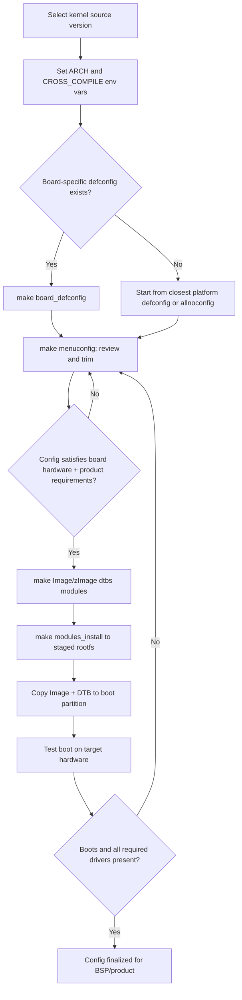

## Kernel Configuration and Cross-Compiling

### Overview

Building a Linux kernel for an embedded target requires two intertwined processes: **configuration** (selecting which drivers, subsystems, and features get compiled in, as modules, or excluded entirely) and **cross-compilation** (building on a host architecture — typically x86_64 — for a different target architecture, such as ARM, ARM64, RISC-V, or MIPS). Unlike desktop kernel builds, embedded builds are constrained by flash storage size, RAM footprint, boot time, and the specific peripheral set of a single board, making configuration precision far more consequential.

### The Kernel Configuration System (Kconfig)

The Linux kernel's build-time configuration is managed by Kconfig, a domain-specific language describing configuration options, their dependencies, and their help text. Each subsystem/driver directory contains a `Kconfig` file contributing options to the overall tree, and these are aggregated into a single `.config` file that drives the actual build.

**Key properties of Kconfig options:**

- `bool` — on/off (`y`/`n` in `.config`, or absent for `n`).
- `tristate` — three states: built-in (`y`), loadable module (`m`), or disabled (not set). Tristate options let a feature be compiled as a separate `.ko` module loaded at runtime rather than baked into the static kernel image.
- `int` / `string` / `hex` — numeric or string-valued options (e.g., default IRQ counts, CPU counts).
- `depends on` / `select` — dependency directives. `depends on` means the option is only visible/enabled if the dependency is satisfied; `select` forcibly enables another option as a side effect, which can cause dependency resolution surprises if used carelessly by out-of-tree patches.

**Common front-ends to Kconfig:**

| Interface | Command | Use Case |
| --- | --- | --- |
| ncurses TUI | `make menuconfig` | Interactive terminal-based browsing, most common for manual tuning |
| Line-oriented | `make config` | Rarely used directly; asks every question sequentially |
| Qt/GTK GUI | `make xconfig` / `make gconfig` | Graphical alternative, less common in headless CI environments |
| Non-interactive merge | `make olddefconfig` | Takes an existing `.config`, fills new options with defaults, used after kernel version bumps |
| Defconfig-based | `make <board>_defconfig` | Loads a curated minimal config shipped in `arch/<arch>/configs/` |

### Cross-Compilation Fundamentals

Cross-compiling means the build host's CPU architecture differs from the target's. The compiler toolchain must be told explicitly which architecture and ABI to emit code for, via two environment variables passed to every kernel `make` invocation:

- **`ARCH`** — selects the target architecture's build rules and header set (e.g., `arm`, `arm64`, `riscv`, `mips`, `x86`). This controls which `arch/<ARCH>/` subtree is used.
- **`CROSS_COMPILE`** — the prefix prepended to every toolchain binary name (compiler, assembler, linker, etc.), e.g., `arm-linux-gnueabihf-` resolves to `arm-linux-gnueabihf-gcc`, `arm-linux-gnueabihf-ld`, and so on. The toolchain binaries with that prefix must exist on `PATH`.

**Typical invocation:**

```bash
export ARCH=arm64
export CROSS_COMPILE=aarch64-linux-gnu-
make defconfig
make menuconfig
make -j$(nproc) Image modules dtbs
```

**Common target triplets:**

| Target | Typical `CROSS_COMPILE` prefix | Notes |
| --- | --- | --- |
| 32-bit ARM, hard-float | `arm-linux-gnueabihf-` | Most common for Cortex-A32-bit boards (e.g., older Raspberry Pi, BeagleBone) |
| 32-bit ARM, soft-float | `arm-linux-gnueabi-` | Legacy or FPU-less targets |
| 64-bit ARM | `aarch64-linux-gnu-` | Cortex-A53/A72/etc., most current SBCs |
| RISC-V 64-bit | `riscv64-linux-gnu-` | Growing ecosystem (SiFive, StarFive) |
| MIPS | `mips-linux-gnu-` / `mipsel-linux-gnu-` | Big-endian vs little-endian variants |

The suffix conventions matter: `gnueabihf` (GNU EABI Hard-Float) means the ABI passes floating-point arguments in FPU registers, requiring the target CPU to actually have a hardware FPU (VFP) and requiring userspace libraries built with matching float ABI — mismatching this between kernel/toolchain and rootfs is a common source of "illegal instruction" crashes.

### Toolchain Sources

- **Distro-packaged cross-toolchains** — e.g., Debian/Ubuntu's `gcc-aarch64-linux-gnu` package. Convenient but may lag on glibc/gcc versions and isn't guaranteed to match a specific vendor BSP's expectations.
- **crosstool-NG** — a tool for building fully custom cross-toolchains from source (choosing glibc/musl/uClibc-ng, specific gcc/binutils versions, C++ support, threading model). Used when precise reproducibility or an unusual libc choice (e.g., musl for smaller static binaries) is required.
- **Linaro toolchains** — prebuilt ARM-optimized GCC toolchains historically widely used in the ARM embedded community; release cadence and official support status should be checked against current Linaro/ARM announcements, as sponsorship and hosting arrangements have shifted over time. [Unverified: current release/maintenance cadence — verify against the toolchain's current publisher before depending on it for new projects.]
- **Yocto/Buildroot-generated toolchains** — when using a full embedded Linux build system, the cross-toolchain is generated as part of the overall build and versioned/pinned alongside the rest of the BSP, which is generally the most reproducible approach for product builds.
- **Bundled with SoC vendor SDKs** — vendor-supplied toolchains sometimes carry patches for specific errata workarounds; mixing a vendor kernel with a non-vendor toolchain can occasionally expose or hide bugs the vendor patches specifically address. [Inference: this risk is inferred from general embedded toolchain practice rather than tied to a specific documented incident.]

### Build Artifacts and Targets

| Make target | Produces | Notes |
| --- | --- | --- |
| `Image` | Uncompressed ARM64 kernel image | Larger; some bootloaders prefer this |
| `zImage` | Compressed ARM 32-bit kernel image | Self-decompressing |
| `Image.gz` | Compressed ARM64 image | Bootloader must decompress or support it directly |
| `modules` | Loadable `.ko` kernel modules | Anything marked `m` in `.config` |
| `dtbs` | Compiled Device Tree Blobs | From `.dts` sources in `arch/<ARCH>/boot/dts/` |
| `modules_install` | Installs modules to a target root filesystem tree | Uses `INSTALL_MOD_PATH` to redirect from the host's `/lib/modules` |

**Full build + install to a staged rootfs:**

```bash
make -j$(nproc) ARCH=arm64 CROSS_COMPILE=aarch64-linux-gnu- Image dtbs modules
make ARCH=arm64 CROSS_COMPILE=aarch64-linux-gnu- \
     INSTALL_MOD_PATH=/path/to/staging/rootfs modules_install
```

### Configuration Strategy for Embedded Targets

Starting configuration usually follows one of these paths, in increasing order of manual effort and decreasing image size:

1. **Board `defconfig`** — Most vendor/mainline-supported boards ship a curated defconfig (e.g., `multi_v7_defconfig`, `bcm2711_defconfig`) covering broad hardware classes. Fastest path but often includes drivers unused by a specific product.
2. **`make localmodconfig`** — Runs the target hardware live, inspects currently loaded modules via `lsmod`, and trims the `.config` to only what's actually in use. Effective for shrinking a known-working system's config, risky for cold-boot/hotplug hardware not loaded at inspection time.
3. **Manual trimming via `menuconfig`** — Systematically disabling unused subsystems (unused filesystems, unused network protocols, unused USB device classes) to reduce image size, attack surface, and boot time. This is the standard practice for production embedded images.
4. **`make tinyconfig` / `allnoconfig` as a floor** — Starts from a near-minimal config and adds back only what's needed, useful for extremely constrained targets but requires deep knowledge of dependency chains to avoid missing something the bootloader or init system silently needs.

**Common trims for embedded production kernels:**

- Disable unused filesystem drivers (e.g., disable Btrfs/XFS if only ext4/squashfs is used).
- Disable `CONFIG_KALLSYMS` and debug symbols (`CONFIG_DEBUG_INFO`) in production for size, keep in engineering builds for crash analysis.
- Disable unused network protocol stacks (e.g., disable Bluetooth or Wi-Fi stack entirely if hardware lacks the radio).
- Trim to only the actual SoC's drivers when using a multi-platform defconfig as a starting point (e.g., a `multi_v7_defconfig`-derived config still carrying dozens of unrelated SoC drivers).
- Consider `CONFIG_MODULES=n` (fully monolithic kernel) for products where dynamic module loading is a security/attack-surface concern rather than an operational need — trades flexibility for a smaller attack surface and marginally faster boot.

### Configuration and Cross-Compile Flow



### Device Tree's Relationship to Kernel Config

Kernel configuration determines *which drivers exist* in the built kernel; the Device Tree Blob (DTB), compiled separately from `.dts`/`.dtsi` sources, determines *which hardware instances are described* for those drivers to bind to at runtime. A driver compiled in but with no matching DT node simply never probes; a DT node describing hardware whose driver was configured out results in that device being unusable even though it's electrically present. Both must be aligned for a given board — this is why board bring-up work touches both `.config` and `.dts` files together, not just one.

### Cross-Compilation Pitfalls

- **Mismatched float ABI** (`gnueabi` vs `gnueabihf`) between kernel/toolchain and userspace libraries causes illegal instruction faults at runtime, not build-time errors — the kernel itself doesn't use the FPU calling convention, but any compiled kernel modules interacting with userspace-facing ABI assumptions can be affected, and this pitfall applies most directly to full-system builds (kernel + rootfs) rather than the kernel build in isolation.
- **`-j$(nproc)` on the wrong host** — using the build host's core count when cross-compiling is fine (compilation happens on the host), but forgetting `-j` entirely on a modern multi-core host makes full kernel builds unnecessarily slow (kernel builds are highly parallelizable).
- **Stale `.config` after kernel version bumps** — jumping to a newer kernel source tree with an old `.config` without running `make olddefconfig` first can silently carry forward now-removed or renamed options; always regenerate/merge rather than assuming `.config` compatibility across versions.
- **Endianness mismatches on MIPS/PowerPC** — some architectures support both big- and little-endian variants; the toolchain triplet and `CROSS_COMPILE` prefix must match the target's actual endianness configuration, not just its instruction set family.
- **Building modules against a different kernel than what's running on target** — `modules_install` output must correspond to the exact `Image`/`zImage` flashed to the target; mismatched module/kernel versions cause `insmod`/`modprobe` version-magic rejection errors.

### Key Points

- Kconfig options are `bool`, `tristate`, or value-typed, with `depends on`/`select` driving dependency resolution — tristate (`m`) lets features load as runtime modules instead of bloating the static image.
- `ARCH` and `CROSS_COMPILE` are the two environment variables that make a single kernel source tree buildable for any supported target architecture from an x86_64 host.
- Board `defconfig` files are the standard starting point; production embedded builds typically trim aggressively from there via `menuconfig` or `localmodconfig` rather than shipping the full multi-platform default.
- Toolchain choice (distro-packaged, crosstool-NG, Yocto/Buildroot-generated, or vendor-bundled) affects reproducibility and glibc/musl ABI compatibility with the target rootfs — Yocto/Buildroot-generated toolchains are generally preferred for product-grade reproducibility since they're versioned with the rest of the BSP.
- Kernel config and Device Tree are complementary but separate: config controls compiled driver availability, DT controls which hardware instances those drivers bind to at boot.

### Related Topics

- Device Tree source (.dts/.dtsi) authoring and the DT compiler (dtc)
- Buildroot vs. Yocto Project for full embedded Linux image generation
- Kernel module signing and loadable module security models
- initramfs construction and early userspace handoff
- Debugging kernel boot failures via early printk / earlycon
- Out-of-tree kernel module builds against a cross-compiled kernel source tree
- Kernel size optimization techniques beyond Kconfig trimming (LTO, compiler flags)
- musl vs. glibc tradeoffs for embedded root filesystems