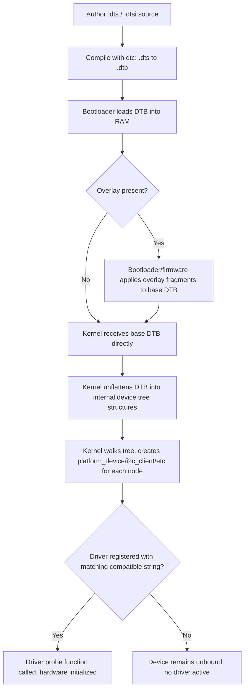

## Device Tree Fundamentals

### Overview

Device Tree is a data structure describing hardware — CPUs, memory, buses, and peripherals — that is passed from bootloader to kernel at boot time, allowing a single kernel binary to support many different boards without hardware topology being hardcoded in C. It replaced the older practice (still seen in x86 and some legacy ARM board files) of describing hardware directly in kernel source as `platform_device` registrations and `board-*.c` files, which didn't scale as the number of ARM SoC variants grew into the hundreds.

### Why Device Tree Exists

Before Device Tree became standard on ARM Linux (a transition driven substantially by Linus Torvalds' criticism of ARM board-file proliferation around 2011), each board required its own compiled-in C file describing every peripheral address, IRQ line, and GPIO mapping. This meant:

- A kernel binary built for one board would not run on a near-identical board with different peripheral wiring.
- Adding board support meant patching and recompiling the kernel itself, not just supplying configuration data.
- The kernel source tree accumulated enormous numbers of near-duplicate board files.

Device Tree decouples this: the kernel provides generic drivers that bind to hardware described externally, and the DTB (compiled binary form) is a separate artifact from the kernel image — in principle interchangeable at boot time without a kernel rebuild, provided the kernel has the relevant drivers compiled in or as loadable modules.

### Core Concepts

**Nodes and properties.** A device tree is a hierarchical tree of *nodes*, each representing a piece of hardware (a bus, a controller, a specific peripheral instance). Each node has *properties* — key/value pairs describing that hardware's characteristics (register addresses, interrupt lines, clock sources, GPIO assignments).

**Source format (.dts) vs. binary format (.dtb).** Device trees are authored as human-readable `.dts` (Device Tree Source) text files, compiled by the **Device Tree Compiler (dtc)** into a binary `.dtb` (Device Tree Blob) that the bootloader loads into memory and passes to the kernel. `.dtsi` files ("include" variants) hold shared definitions reused across multiple boards — typically an SoC-level `.dtsi` describes everything common to that chip, and a board-specific `.dts` includes it and adds/overrides board-specific details.

**Basic node syntax:**

```dts
/dts-v1/;

/ {
    compatible = "vendor,board-name";
    model = "Vendor Board v2";
    #address-cells = <1>;
    #size-cells = <1>;

    memory@80000000 {
        device_type = "memory";
        reg = <0x80000000 0x20000000>;
    };

    uart0: serial@44e09000 {
        compatible = "ti,am3352-uart";
        reg = <0x44e09000 0x2000>;
        interrupts = <72>;
        clocks = <&uart0_fck>;
        status = "okay";
    };
};
```

### Key Properties Explained

| Property | Purpose |
| --- | --- |
| `compatible` | List of strings identifying the device, most-specific first. Kernel drivers register a matching `compatible` string via `of_match_table`; this is the primary driver-binding mechanism. |
| `reg` | Register address and size (and/or bus address for I2C/SPI devices), interpreted using `#address-cells`/`#size-cells` from the parent node. |
| `interrupts` | Which interrupt line(s) the device uses, interpreted according to the parent interrupt controller's `#interrupt-cells`. |
| `status` | `"okay"` (enabled) or `"disabled"` — commonly toggled in board `.dts` to enable/disable peripherals inherited from a shared `.dtsi`. |
| `#address-cells` / `#size-cells` | Define how many 32-bit cells make up an address/size value for children of this node — necessary because address widths vary (32-bit vs. 64-bit systems). |
| `phandle` (implicit via `label:`) | A unique reference handle allowing one node to reference another (e.g., a device referencing its clock source or GPIO controller) via `&label` syntax. |
| `clocks` / `clock-names` | References to clock provider nodes plus optional names, consumed by the common clock framework. |
| `pinctrl-0` / `pinctrl-names` | References to pin control state nodes, used by the pinctrl subsystem to configure pin muxing per device state (e.g., default vs. sleep). |

### The compatible String Matching Mechanism

The `compatible` property is how the kernel matches a DT node to a driver. It's a list, ordered from most specific to most generic, allowing a driver written for a generic IP block to match multiple SoC-specific instances:

```dts
compatible = "ti,am3352-uart", "ti,omap3-uart";
```

A driver's `of_device_id` table lists which `compatible` strings it handles:

```c
static const struct of_device_id omap_uart_of_match[] = {
    { .compatible = "ti,am3352-uart" },
    { .compatible = "ti,omap3-uart" },
    { }
};
```

The kernel walks the compatible list against registered drivers and binds the first match. This lets a single generic driver (e.g., for a common UART IP block licensed across many vendor SoCs) serve many different `compatible` strings without per-SoC driver duplication, while still allowing SoC-specific compatible strings to opt into SoC-specific quirk handling if a driver chooses to distinguish them.

### Device Tree Node Hierarchy (SVG)

<svg xmlns="http://www.w3.org/2000/svg" viewBox="0 0 850 320">
\<style\>
.root { fill: #1e3a5f; stroke: #3b82f6; stroke-width: 2; }
.bus { fill: #164e3e; stroke: #10b981; stroke-width: 1.5; }
.dev { fill: #4c1d3d; stroke: #db2777; stroke-width: 1.5; }
.label { font-family: monospace; font-size: 12px; fill: #f1f5f9; text-anchor: middle; }
.sub { font-family: monospace; font-size: 9px; fill: #cbd5e1; text-anchor: middle; }
.line { stroke: #64748b; stroke-width: 1.5; fill: none; }
.title { font-family: sans-serif; font-size: 14px; fill: #e2e8f0; text-anchor: middle; }
\</style\>
<text x="425" y="20" class="title">Device Tree Node Hierarchy (svg_diagram)</text>
<rect x="360" y="40" width="130" height="45" rx="5" class="root" />
<text x="425" y="63" class="label">/ (root)</text>
<text x="425" y="77" class="sub">compatible = "vendor,board"</text>
<rect x="180" y="130" width="120" height="45" rx="5" class="bus" />
<text x="240" y="153" class="label">memory@80000000</text>
<text x="240" y="167" class="sub">reg = &lt;addr size&gt;</text>
<rect x="330" y="130" width="120" height="45" rx="5" class="bus" />
<text x="390" y="153" class="label">soc@0</text>
<text x="390" y="167" class="sub">simple-bus</text>
<rect x="480" y="130" width="130" height="45" rx="5" class="bus" />
<text x="545" y="153" class="label">chosen / aliases</text>
<text x="545" y="167" class="sub">bootargs, stdout-path</text>
<rect x="290" y="220" width="110" height="45" rx="5" class="dev" />
<text x="345" y="243" class="label">serial@44e09000</text>
<text x="345" y="257" class="sub">status = "okay"</text>
<rect x="420" y="220" width="110" height="45" rx="5" class="dev" />
<text x="475" y="243" class="label">i2c@44e0b000</text>
<text x="475" y="257" class="sub">#address-cells=1</text>
<path d="M410 85 L240 130" class="line" />
<path d="M425 85 L390 130" class="line" />
<path d="M440 85 L545 130" class="line" />
<path d="M390 175 L345 220" class="line" />
<path d="M390 175 L475 220" class="line" />

<text x="425" y="300" class="sub" font-size="11">soc@0 is typically a "simple-bus" node whose children inherit its address translation ranges via a "ranges" property</text>

</svg>

### Overlays

Device Tree Overlays allow runtime or build-time modification of a base DTB without editing the original source — commonly used for add-on boards/HATs/capes on platforms like Raspberry Pi and BeagleBone, where the same base board can have different peripherals attached. An overlay is compiled separately and can add nodes, modify properties on existing nodes (via `&label { ... }` fragment syntax), or change `status` from `"disabled"` to `"okay"` to enable optional hardware only present when the add-on board is physically attached.

**Overlay fragment example:**

```dts
/dts-v1/;
/plugin/;

/ {
    fragment@0 {
        target = <&i2c1>;
        __overlay__ {
            status = "okay";
            rtc@68: rtc@68 {
                compatible = "dallas,ds1307";
                reg = <0x68>;
            };
        };
    };
};
```

Overlays are loaded by the bootloader (U-Boot's `fdt apply`) or, on some platforms, by firmware config mechanisms (e.g., Raspberry Pi's `config.txt` `dtoverlay=` directive) before the final combined DTB is handed to the kernel.

### Device Tree vs. ACPI

On x86 and some ARM server-class platforms, ACPI (Advanced Configuration and Power Interface) serves a broadly analogous role — describing hardware and power management to the OS — but with a different model (AML bytecode, standardized tables) oriented toward platforms where firmware, not board designers, controls hardware description in a standardized way. Device Tree remains dominant on embedded ARM/RISC-V/MIPS specifically because it suits small teams describing bespoke, low-volume board designs without needing a full ACPI-compliant firmware stack. [Inference: this framing reflects general ecosystem practice rather than a single canonical source; both mechanisms are actively maintained and the choice is largely determined by target market (embedded/SBC vs. standardized server) rather than one being a strict technical successor to the other.]

### Boot-Time Flow: From DTS to Running Driver



### Common Pitfalls

- **Missing or mismatched `compatible` strings** — a typo or version mismatch between the `.dts` compatible string and the driver's `of_device_id` table silently results in an unbound device with no error beyond a debug-level kernel log message.
- **Incorrect `#address-cells`/`#size-cells`** — mismatched cell counts between parent and child nodes cause `reg` values to be misinterpreted, often manifesting as a device driver reading garbage register addresses.
- **Overlapping `reg` regions from bad `.dtsi` overrides** — when a board `.dts` overrides an SoC `.dtsi` node incorrectly, it can inadvertently duplicate or conflict with existing peripheral memory maps.
- **Forgetting `status = "okay"`** — many SoC `.dtsi` files ship peripherals disabled by default (`status = "disabled"`) since not every board wires out every SoC peripheral; board `.dts` files must explicitly enable what's actually used.
- **Editing the wrong DTB during bring-up** — some boards load DTBs from an unexpected boot partition or firmware-fixed location (e.g., Raspberry Pi's `config.txt`-driven overlay system separate from the kernel source tree), causing confusion when kernel-source `.dts` edits don't appear to take effect.

### Key Points

- Device Tree externalizes hardware description from kernel code, letting one kernel binary serve many boards by pairing it with a board-specific compiled DTB.
- The `compatible` property list is the core driver-binding mechanism, matched most-specific-first against each driver's `of_device_id` table.
- `.dtsi` files hold shared SoC-level definitions; board `.dts` files include and selectively override/enable them — this shared/override pattern is central to how DT scales across many boards sharing one SoC.
- Overlays allow modular, runtime-composable hardware description for add-on boards without modifying the base DTB source.
- DT and ACPI serve analogous purposes on different platform classes; DT dominates embedded ARM/RISC-V/MIPS while ACPI dominates x86 and standardized server platforms.

### Related Topics

- Device Tree Compiler (dtc) syntax details, `#include` mechanics, and C-style preprocessor use in .dts files
- Common Clock Framework and how DT clock references bind to clock provider drivers
- Pinctrl subsystem and pin muxing state nodes
- Writing a minimal platform driver with an of_device_id match table
- Device Tree overlay application via U-Boot's fdt command family
- GPIO consumer/provider bindings in Device Tree
- Device Tree bindings documentation format (YAML schema-based bindings in modern kernel trees)
- Debugging unbound devices via /sys/firmware/devicetree/base and dmesg