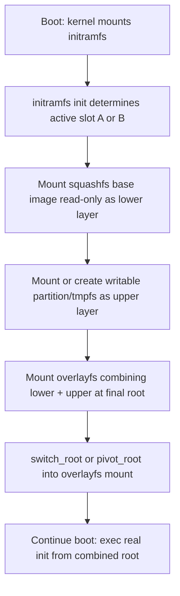

## Root Filesystem Construction


### Overview

The root filesystem (rootfs) is the userspace environment the kernel mounts as `/` after boot — it contains the init system, shared libraries, device nodes, configuration files, and application binaries that make a booted kernel into a usable system. Constructing a rootfs for an embedded target means deciding what userspace software actually needs to exist on a resource-constrained device, and packaging it into a format the bootloader/kernel can mount, which is a materially different problem from installing a desktop distro where disk space and package availability are not primary constraints.

### What a Minimal Root Filesystem Requires

At minimum, a bootable rootfs needs:

- **An init system** — PID 1, the first userspace process the kernel starts, responsible for bringing up the rest of the system (mounting filesystems, starting services, handling process reaping).
- **A C library** — glibc, musl, or uClibc-ng, since virtually all dynamically linked userspace binaries depend on one.
- **Essential device nodes** — historically populated statically under `/dev`, now almost universally provided dynamically by `devtmpfs` (kernel-populated) plus `udev`/`mdev`/`eudev` for hotplug event handling.
- **Core utilities** — a shell and basic Unix commands (`ls`, `mount`, `cat`, etc.), commonly provided by BusyBox or Toybox as a single multi-call binary rather than dozens of separate GNU coreutils binaries.
- **Filesystem hierarchy** — the standard directory layout (`/bin`, `/etc`, `/lib`, `/proc`, `/sys`, `/dev`, `/tmp`, `/usr`, etc.), with `/proc` and `/sys` being kernel-provided pseudo-filesystems mounted at boot rather than on-disk content.

### Directory Structure Essentials

| Directory | Purpose |
| --- | --- |
| `/bin`, `/sbin` | Essential executables (often merged into `/usr/bin` via symlink on modern systems — "usr-merge") |
| `/lib`, `/lib64` | Shared libraries needed at early boot, before `/usr` may be mounted separately |
| `/etc` | System-wide configuration files (init scripts, `/etc/passwd`, network config) |
| `/proc` | Kernel-provided virtual filesystem exposing process and kernel state (mounted, not on-disk) |
| `/sys` | Kernel-provided virtual filesystem exposing device/driver model (mounted, not on-disk) |
| `/dev` | Device nodes, typically populated by `devtmpfs` at boot plus dynamic hotplug additions |
| `/tmp`, `/var/run` | Runtime/temporary state, often backed by `tmpfs` on embedded systems to avoid flash wear |
| `/usr` | Non-essential (but usually still required) binaries, libraries, and shared data |

### BusyBox: The Embedded Userspace Workhorse

BusyBox combines dozens of common Unix utilities into a single statically or dynamically linked binary, with individual command names implemented as symlinks (or busybox's own applet dispatch) pointing back to the one executable. This drastically reduces flash footprint compared to installing full GNU coreutils, findutils, sed, grep, etc. as separate binaries.

**BusyBox configuration** follows the same Kconfig-based `menuconfig` model as the Linux kernel — individual applets (`ls`, `ps`, `vi`, `wget`, `tar`, etc.) are enabled/disabled per build, and each applet often has a "full" vs. reduced-feature-set variant to trade functionality for size.

```bash
make menuconfig
make -j$(nproc)
make CONFIG_PREFIX=/path/to/rootfs install
```

Toybox is a comparable alternative (BSD-licensed, used as the default in Android) with a similar multi-call design but a different feature/size tradeoff philosophy and applet coverage. [Inference: choice between BusyBox and Toybox in a given project is typically driven by license preference and specific applet coverage needs rather than one being universally superior.]

### Init Systems for Embedded

| Init system | Characteristics |
| --- | --- |
| BusyBox `init` | Extremely minimal, driven by `/etc/inittab`, no service dependency management — appropriate for simple single-purpose devices |
| systemd | Full-featured, dependency-based service management, socket activation, cgroups integration — heavier RAM/storage footprint but standard on many general-purpose embedded Linux distros |
| OpenRC | Dependency-based but lighter than systemd, common in Gentoo-derived and Alpine-adjacent embedded contexts |
| runit / s6 | Very small supervision-focused init systems, popular in minimalist and security-conscious embedded builds for simplicity and auditability |

The choice affects boot time, RAM footprint, and how service dependencies/restarts are handled — systemd's socket activation and cgroup-based resource control are valuable for complex multi-service embedded Linux products (e.g., infotainment systems), while BusyBox init or s6 suit simple, few-process appliances where systemd's overhead isn't justified.

### C Library Choice

| Library | Size | glibc Compatibility | Notes |
| --- | --- | --- | --- |
| glibc | Largest | Full (it is the reference) | Most complete POSIX/GNU extension coverage, widest binary compatibility with prebuilt software |
| musl | Small | Mostly source-compatible, not ABI-compatible | Popular for static linking, security-conscious design, used by Alpine Linux |
| uClibc-ng | Small | Partial | Historically common in Buildroot-based embedded builds, actively maintained fork of the original uClibc |

Switching C libraries is not just a rootfs decision — it constrains the toolchain (the cross-compiler must be built against the chosen libc) and can break prebuilt closed-source binary blobs that assume glibc's ABI and dynamic linker path (`/lib/ld-linux...`), which is a common practical reason products stay on glibc despite musl's smaller footprint. [Inference: this constraint is a general, well-documented pattern in embedded toolchain selection rather than tied to one specific vendor blob.]

### Root Filesystem Image Formats

| Format | Type | Characteristics |
| --- | --- | --- |
| initramfs (cpio) | RAM-resident | Kernel-embedded or bootloader-loaded compressed cpio archive, unpacked into a tmpfs at boot; common for early boot / rescue / minimal-then-switchroot flows |
| ext4 | Writable, journaled | Standard for read-write rootfs on eMMC/SD; supports normal file permissions, journaling helps power-loss resilience |
| squashfs | Read-only, compressed | Common for the immutable base layer of embedded systems; highly space-efficient, mounted read-only with an overlay for writable state |
| overlayfs (with squashfs base) | Read-only base + writable overlay | Combines a compressed read-only squashfs lower layer with a writable upper layer (tmpfs or a separate ext4 partition), giving A/B-friendly immutability with limited writable state |
| UBI/UBIFS | Raw NAND-oriented | Designed specifically for NAND flash wear-leveling and bad-block handling, used instead of a block-device filesystem when the underlying storage is raw NAND rather than eMMC/SD |
| JFFS2 | Raw NAND/NOR-oriented | Older flash filesystem, largely superseded by UBIFS on new designs but still present in legacy products |

### Read-Only Root with Overlay: A Common Production Pattern

Many production embedded Linux devices mount the base OS read-only (as squashfs) and layer a writable overlay on top via `overlayfs`, so that:

- The base OS image can't be corrupted by unexpected power loss during normal operation, since it's never written to.
- Factory reset is trivial — simply clearing the writable overlay layer restores the base image state.
- A/B update schemes can swap the entire read-only base partition while preserving (or deliberately discarding) the separate writable overlay data.



### Building a Root Filesystem Manually (Illustrative Minimal Flow)

```bash
mkdir -p rootfs/{bin,sbin,etc,proc,sys,dev,lib,usr/bin,usr/sbin,usr/lib}

# Install BusyBox applets
make CONFIG_PREFIX=$(pwd)/rootfs install

# Copy cross-compiled C library and dynamic linker
cp /path/to/sysroot/lib/libc.so.6 rootfs/lib/
cp /path/to/sysroot/lib/ld-linux-*.so.* rootfs/lib/

# Minimal inittab for BusyBox init
cat > rootfs/etc/inittab <<'EOF'
::sysinit:/etc/init.d/rcS
::respawn:/sbin/getty -L ttyS0 115200 vt100
::shutdown:/sbin/swapoff -a
EOF

# Package as an ext4 image
dd if=/dev/zero of=rootfs.img bs=1M count=64
mkfs.ext4 -d rootfs -F rootfs.img
```

This illustrates the manual approach; in practice, full embedded build systems (Buildroot, Yocto) automate this entire process, resolve library dependencies automatically, and produce reproducible, versioned outputs — manual construction is primarily useful for understanding the mechanics or for extremely minimal single-purpose images.

### Build Systems vs. Manual Construction

| Approach | Reproducibility | Effort | Typical Use |
| --- | --- | --- | --- |
| Manual (as above) | Low unless carefully scripted | High per-change | Learning, extremely minimal/custom single-binary appliances |
| Buildroot | High (single Kconfig-driven build) | Moderate | Simple to moderately complex embedded products, faster iteration than Yocto |
| Yocto Project / OpenEmbedded | High (recipe/layer-based, package-managed builds) | High initial, scales well | Complex products, multiple board variants, long-term maintained BSPs |
| debootstrap / multistrap (Debian-based) | High (real package manager) | Low-moderate | When full Debian/Ubuntu package ecosystem access on-device is valued over minimalism |

### Common Pitfalls

- **Missing shared library dependencies** — a cross-compiled binary copied into a hand-built rootfs without its full transitive shared library set (checkable via `ldd` on a compatible host, or `readelf -d` for `NEEDED` entries when cross-architecture `ldd` isn't usable directly) fails at runtime with "cannot open shared object" errors.
- **Forgetting `/dev` population strategy** — a rootfs with no `devtmpfs` mount and no static `/dev` nodes boots into a kernel with no way to open `/dev/console` or storage devices, typically hanging early in boot.
- **Static vs. dynamic linking size tradeoffs** — static linking simplifies deployment (no runtime library resolution) but bloats each binary and duplicates common library code across binaries; dynamic linking shares library pages across processes but requires the full shared library set to be present and correctly versioned on-target.
- **Write-heavy logging on flash-backed rootfs** — writing frequent logs directly to an ext4 partition on eMMC/SD without wear-leveling awareness accelerates flash wear; routing logs to `tmpfs` (with periodic flush-to-flash or remote log shipping) is a common mitigation.
- **glibc/musl ABI mismatches with prebuilt blobs** — vendor-supplied closed-source binaries (e.g., proprietary GPU or Wi-Fi userspace libraries) frequently assume glibc's dynamic linker path and ABI, breaking silently or failing to load on a musl-based rootfs.

### Key Points

- A minimal bootable rootfs needs an init system, C library, essential utilities (commonly BusyBox/Toybox), and a populated `/dev`, `/proc`, `/sys` hierarchy.
- BusyBox's multi-call binary design is central to embedded rootfs space efficiency, configured via the same Kconfig/menuconfig pattern as the kernel itself.
- Read-only squashfs base + writable overlayfs is the dominant production pattern for power-loss resilience, factory reset simplicity, and A/B update compatibility.
- C library choice (glibc vs. musl vs. uClibc-ng) is a cross-cutting decision affecting toolchain, binary compatibility, and closed-source blob support, not just rootfs disk usage.
- Manual rootfs construction is useful for understanding fundamentals, but Buildroot and Yocto are the standard tools for reproducible, maintainable production rootfs generation.

### Related Topics

- Buildroot vs. Yocto Project deep comparison and workflow differences
- overlayfs internals and multi-layer union mount semantics
- UBI/UBIFS flash wear-leveling mechanics for raw NAND storage
- A/B (dual-bank) update schemes and bootloader-coordinated slot switching
- systemd unit authoring for embedded service management
- Cross-compiling and packaging third-party userspace libraries for a custom rootfs
- initramfs construction and switch_root/pivot_root mechanics
- Static vs. dynamic linking tradeoffs in constrained-storage environments