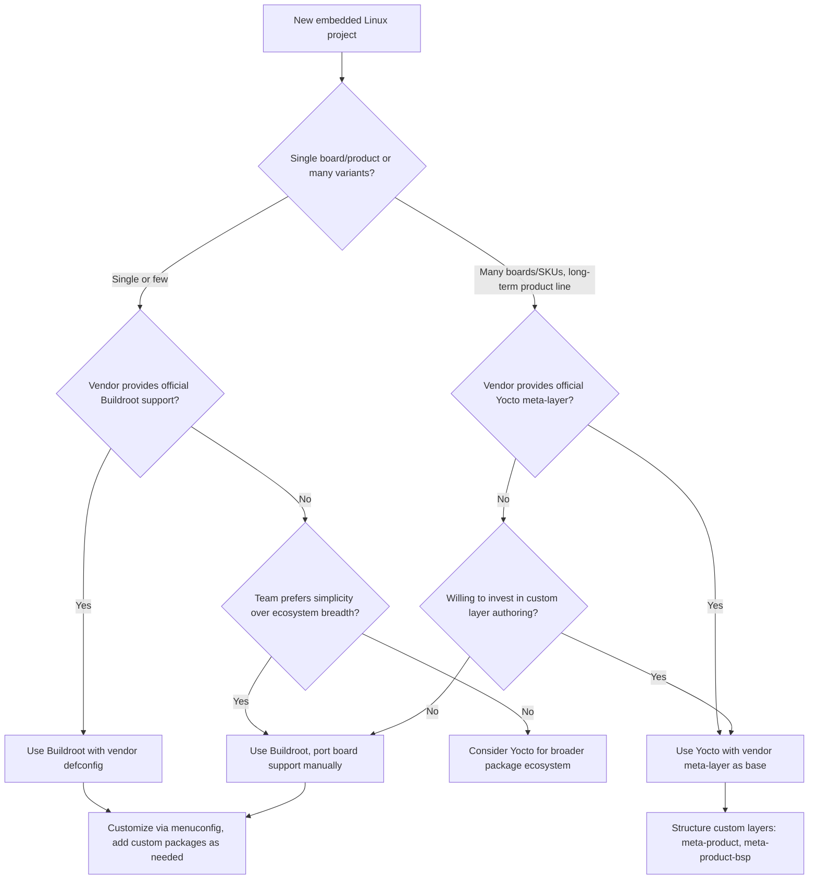

## Build Systems: Yocto and Buildroot

### Overview

Yocto and Buildroot are the two dominant open-source frameworks for producing complete, reproducible embedded Linux images — cross-compiled toolchain, kernel, bootloader, root filesystem, and application packages — from a declarative build description rather than manual assembly. Both solve the same fundamental problem (turning "I want Linux running on this board" into a reproducible, versioned build pipeline) but with substantially different architectural philosophies, tooling, and target use cases.

### The Problem They Solve

Manually cross-compiling a toolchain, kernel, bootloader, and dozens of userspace packages, then hand-assembling a root filesystem, is error-prone and non-reproducible — dependency versions drift, build steps get forgotten, and reproducing an exact build months later for a bug fix becomes difficult without careful manual documentation. Both Yocto and Buildroot exist to make this pipeline **declarative** (described in configuration/recipe files, not ad hoc shell history) and **reproducible** (a given configuration input deterministically produces the same output artifacts).

### Buildroot: Philosophy and Architecture

Buildroot uses a single Kconfig-based configuration system (the same `menuconfig` paradigm as the Linux kernel) to describe an entire embedded Linux system in one unified tree. Its design goal is simplicity and speed of iteration for a single-purpose or small-variant-count product.

**Key characteristics:**

- **Single top-level `make menuconfig`** covers toolchain selection, kernel version/config, bootloader selection, package selection, and rootfs filesystem format — all in one interface.
- **Package recipes are simple Makefile fragments** (`package/<name>/<name>.mk` plus a `Config.in`), typically much shorter and more approachable than Yocto's `.bb` recipe format for straightforward autotools/CMake packages.
- **No persistent package manager on target by default** — Buildroot typically produces a fixed-content rootfs image; adding runtime package management (opkg, etc.) is possible but not the default philosophy.
- **Build is monolithic per-configuration** — changing configuration and rebuilding regenerates affected pieces, but Buildroot does not have Yocto's fine-grained binary package caching/sharing across dissimilar configurations by default (shared download/ccache caching exists, but the layered binary-package-feed model is not Buildroot's default operating mode).

**Typical Buildroot workflow:**

```bash
git clone https://git.buildroot.net/buildroot
cd buildroot
make qemu_x86_64_defconfig   # or a board-specific defconfig
make menuconfig               # customize package selection
make -j$(nproc)
# Output: output/images/ containing kernel, rootfs, bootloader artifacts
```

### Yocto Project: Philosophy and Architecture

Yocto (via its build engine, BitBake, and metadata layers, most centrally OpenEmbedded-Core/`poky`) is designed around **layered, recipe-based metadata** with a strong emphasis on binary package feeds, reproducibility across many board variants sharing common layers, and long-term maintainability for complex, multi-product BSP portfolios.

**Key characteristics:**

- **Recipes (`.bb` files)** describe how to fetch, configure, build, and package individual pieces of software, each with explicit dependency declarations (`DEPENDS`, `RDEPENDS`).
- **Layers** are modular collections of recipes and configuration (`meta-<vendor>`, `meta-<feature>`) that can be combined, shared across projects, and version-pinned independently — this is Yocto's core scalability mechanism for supporting many board variants and product lines from shared upstream layers.
- **BitBake** is the task execution engine, resolving recipe dependency graphs and executing tasks (`do_fetch`, `do_configure`, `do_compile`, `do_install`, `do_package`, `do_rootfs`, etc.) with fine-grained caching via **shared state (sstate) cache**, allowing unchanged build steps to be skipped or pulled from a binary cache rather than rebuilt from source.
- **Package format flexibility** — output can be RPM, DEB, or IPK, and Yocto builds typically retain the ability to construct real on-target package management if desired, though many products still ship an immutable image.
- **`local.conf` and `bblayers.conf`** configure the specific build (machine target, distro policy, enabled layers) separately from the recipe metadata itself.

**Typical Yocto workflow:**

```bash
git clone git://git.yoctoproject.org/poky
cd poky
source oe-init-build-env
# Edit conf/local.conf: set MACHINE = "your-board"
# Edit conf/bblayers.conf: add required meta-layers
bitbake core-image-minimal
# Output: tmp/deploy/images/<machine>/ containing kernel, rootfs, bootloader artifacts
```

### Comparison Table

| Aspect | Buildroot | Yocto Project |
| --- | --- | --- |
| Configuration model | Single Kconfig tree | Layered `.bb` recipes + `.conf` policy files |
| Learning curve | Lower, closer to kernel-config familiarity | Steeper, more moving parts (BitBake, layers, classes) |
| Build speed (clean) | Generally faster for simple single-board builds | Slower initially, but sstate cache makes incremental/shared builds fast at scale |
| Reproducibility across board variants | Good for few variants; less structured for many | Strong — designed explicitly for multi-BSP, multi-product layer reuse |
| Package management on target | Not default; fixed-content image typical | Native support for RPM/DEB/IPK package management if desired |
| Vendor BSP support | Present but less standardized across vendors | Very broad — most SoC vendors publish official `meta-<vendor>` layers |
| Community/ecosystem layer availability | Smaller package/recipe pool | Very large (OpenEmbedded metadata universe, meta-openembedded, etc.) |
| Typical fit | Single product, small team, fast iteration, simpler requirements | Complex products, multiple SKUs/boards, long-term maintenance, larger teams |

### Recipe/Package Definition Comparison

**Buildroot package (`.mk` fragment, simplified):**

```makefile
FOO_VERSION = 1.2.3
FOO_SITE = https://example.com/foo
FOO_LICENSE = MIT

define FOO_BUILD_CMDS
    $(MAKE) -C $(@D) CC="$(TARGET_CC)"
endef

define FOO_INSTALL_TARGET_CMDS
    $(INSTALL) -D -m 0755 $(@D)/foo $(TARGET_DIR)/usr/bin/foo
endef

$(eval $(generic-package))
```

**Yocto recipe (`.bb`, simplified):**

```bitbake
SUMMARY = "Foo utility"
LICENSE = "MIT"
LIC_FILES_CHKSUM = "file://COPYING;md5=..."

SRC_URI = "https://example.com/foo-${PV}.tar.gz"

DEPENDS = "zlib"

inherit autotools

do_install:append() {
    install -d ${D}${bindir}
}
```

The Yocto recipe's `inherit autotools` pulls in a shared `.bbclass` implementing the standard configure/make/make-install task sequence, illustrating the layer/class reuse model that lets most recipes stay short by inheriting common build-system logic rather than restating it per package.

### Decision Flow



### Shared State Cache and Build Performance (Yocto-specific)

Yocto's sstate cache is a significant architectural differentiator: each task's output is hashed based on its inputs (recipe content, dependencies, configuration), and if a matching hash exists in the sstate cache (local or a shared network cache), BitBake reuses the cached output instead of rebuilding. This makes Yocto highly effective in CI environments building many board variants or frequent incremental changes, since unchanged packages across builds are pulled from cache rather than recompiled — a build farm with a shared sstate cache can make single-developer incremental builds nearly as fast as Buildroot's simpler model, though the initial cold-cache build remains comparatively heavier due to Yocto's larger metadata/tooling overhead.

### Common Layers and Ecosystem Structure (Yocto)

| Layer | Purpose |
| --- | --- |
| `meta` (OpenEmbedded-Core) | Base recipes, classes, and policy — the foundation nearly all other layers depend on |
| `meta-poky` | Poky's reference distro policy layer |
| `meta-yocto-bsp` | Reference BSP layer for QEMU and reference hardware |
| `meta-openembedded` | Large community collection of additional recipes (networking, multimedia, python modules, etc.) |
| `meta-<vendor>` | SoC vendor-published BSP layers (e.g., `meta-ti`, `meta-freescale`, `meta-raspberrypi`) providing kernel, bootloader, and driver recipes for specific hardware |
| `meta-<product>` | Custom, product-specific layer a team authors for their own application and configuration |

### Common Pitfalls

- **Treating Yocto layers as a monolith rather than composable units** — mixing incompatible layer versions (different `meta` branch releases) across layers is a frequent source of build breakage; layers must generally track matching release branches (e.g., all layers on the same named Yocto release, such as "scarthgap" or "kirkstone").
- **Buildroot's lack of native on-target package management surprising teams expecting apt/opt-style updates** — teams wanting field package updates without full image replacement need to deliberately add a package manager (e.g., opkg) rather than assuming Buildroot provides one by default.
- **Underestimating Yocto's initial learning curve and build time investment** — teams new to Yocto sometimes attempt it for a simple single-board product where Buildroot would have reached a working image faster, only justified when the multi-variant/long-term-maintenance case actually applies.
- **Ignoring sstate/ccache cache invalidation causes** — seemingly unrelated configuration changes (e.g., `DISTRO_FEATURES` changes) can invalidate large portions of the sstate cache, causing unexpectedly long rebuilds; understanding what triggers cache misses is important for maintaining fast CI iteration in Yocto.
- **Vendoring vs. tracking upstream layers** — pinning vendor BSP layers to a specific commit for reproducibility is standard practice, but forgetting to periodically update pinned layers can leave a product on an EOL'd Yocto release branch without security patches. [Inference: this risk generalizes standard software supply-chain pinning tradeoffs to the Yocto layer context rather than reflecting a documented Yocto-specific incident.]

### Key Points

- Buildroot favors a single unified Kconfig-driven configuration and simplicity, best suited to single-product or few-variant embedded builds with faster initial iteration.
- Yocto favors layered, recipe-based metadata with strong dependency tracking and sstate caching, best suited to complex products, multiple board variants, and long-term maintained BSP portfolios.
- Vendor SoC support availability (official Buildroot `defconfig` vs. official `meta-<vendor>` layer) is often the deciding practical factor in tool choice for a given board.
- Yocto's sstate cache and layer reuse model pay off most clearly at scale (many boards, many developers, CI-driven builds); Buildroot's simplicity pays off most clearly for small teams and single-purpose devices.
- Neither system replaces understanding of the underlying components (kernel Kconfig, Device Tree, root filesystem construction) — both are orchestration frameworks around those same fundamentals, not a substitute for understanding them.

### Related Topics

- BitBake task execution model and dependency graph resolution in depth
- Authoring a custom Yocto meta-layer for a product-specific application
- Buildroot external tree (`BR2_EXTERNAL`) for maintaining out-of-tree custom packages
- Yocto image recipe types (core-image-minimal vs. core-image-full-cmdline vs. custom image recipes)
- Software Bill of Materials (SBOM) generation from Yocto/Buildroot builds for compliance
- Continuous integration strategies for embedded image builds (shared sstate cache servers, distributed Buildroot ccache)
- Comparing Yocto/Buildroot outputs against Debian-based embedded approaches (debootstrap, multistrap)
- Long-term security patching strategy for pinned build-system layer/package versions