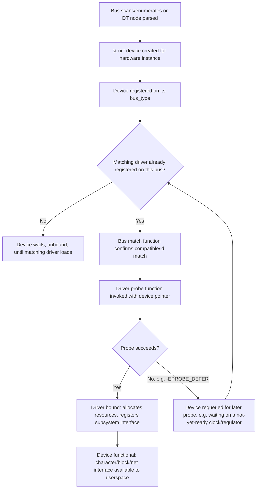

## Linux Device Drivers Overview


### Overview

A device driver is kernel code that mediates between hardware (or a virtual/logical device) and the rest of the kernel/userspace, exposing a consistent interface (character device, block device, network interface, etc.) regardless of the specific hardware implementation underneath. On embedded Linux, driver work is often the largest engineering surface of a board bring-up project, since every non-generic peripheral — sensors, custom ASICs, display panels, industrial buses — typically needs either an existing mainline driver matched via Device Tree, or new driver code written against the kernel's driver model.

### The Linux Driver Model

The kernel organizes hardware and drivers through a unified abstraction called the **driver model** (`struct device`, `struct device_driver`, `struct bus_type`), which handles device/driver matching, power management, and sysfs representation uniformly across all bus types (platform, I2C, SPI, USB, PCI, etc.).

**Core abstractions:**

- **`struct device`** — represents a single hardware device instance, regardless of bus type. Contains a pointer to its parent device, its driver (once bound), and bus-specific data.
- **`struct device_driver`** — represents a driver capable of handling one or more device types, with `probe()` and `remove()` callbacks invoked when a matching device appears or disappears.
- **`struct bus_type`** — represents a bus (platform, I2C, SPI, USB, etc.), implementing the actual matching logic between devices and drivers registered on that bus.
- **Match and probe cycle** — when a device is registered (e.g., discovered via Device Tree parsing, USB enumeration, or PCI bus scan) and a compatible driver is also registered, the bus's match function pairs them, and the driver's `probe()` function runs to initialize that specific device instance.

### Character, Block, and Network Devices

The three broad driver categories in Linux, each with a distinct kernel-facing interface:

| Category | Userspace Interface | Typical Examples | Key Kernel Structures |
| --- | --- | --- | --- |
| **Character devices** | `/dev/foo`, read/write/ioctl as a byte/message stream | UART, sensors, GPIO chips, custom ioctl-driven hardware | `struct cdev`, `file_operations` |
| **Block devices** | `/dev/sdX`, `/dev/mmcblkX`, accessed via filesystem/block layer | eMMC, SD card, NVMe, NAND-backed block devices | `struct block_device`, `struct gendisk`, `struct request_queue` (or `blk_mq` for multi-queue) |
| **Network devices** | `ethX`, `wlanX` — no `/dev` node, accessed via socket API | Ethernet MAC, Wi-Fi, CAN bus (as `can0` via `SocketCAN`) | `struct net_device`, `net_device_ops` |

**Character device driver skeleton (illustrative):**

```c
static int foo_open(struct inode *inode, struct file *file) {
    return 0;
}

static ssize_t foo_read(struct file *file, char __user *buf,
                          size_t count, loff_t *offset) {
    // copy_to_user(...) from hardware/buffer state
    return bytes_read;
}

static const struct file_operations foo_fops = {
    .owner = THIS_MODULE,
    .open  = foo_open,
    .read  = foo_read,
};

static int foo_probe(struct platform_device *pdev) {
    cdev_init(&foo_cdev, &foo_fops);
    cdev_add(&foo_cdev, dev_num, 1);
    return 0;
}

static const struct of_device_id foo_of_match[] = {
    { .compatible = "vendor,foo-device" },
    { }
};
MODULE_DEVICE_TABLE(of, foo_of_match);

static struct platform_driver foo_driver = {
    .probe = foo_probe,
    .driver = {
        .name = "foo",
        .of_match_table = foo_of_match,
    },
};
module_platform_driver(foo_driver);
```

This illustrates the standard pattern: an `of_device_id` table matches against Device Tree `compatible` strings, `probe()` runs on match, and `file_operations` implements the userspace-facing read/write/ioctl surface for a character device.

### Bus-Specific Driver Frameworks

Most embedded peripherals sit on a specific bus, and the kernel provides bus-specific driver frameworks layered on top of the generic driver model:

| Bus | Framework | Typical Peripherals |
| --- | --- | --- |
| I2C | `i2c_driver`, `i2c_client` | Sensors (accelerometers, temperature), RTCs, PMICs, EEPROMs |
| SPI | `spi_driver`, `spi_device` | Displays, flash memory, ADCs, some sensors |
| USB | `usb_driver`, `usb_interface` | Mass storage, HID devices, webcams, modems |
| PCI/PCIe | `pci_driver` | High-speed peripherals, some NVMe/networking hardware on larger embedded boards |
| Platform bus | `platform_driver` | SoC-internal peripherals with no true discoverable bus (UART, GPIO controllers, memory-mapped IP blocks) — matched via Device Tree rather than hardware enumeration |

The **platform bus** is a special case worth emphasizing for embedded work: many SoC-internal peripherals (UART controllers, timers, GPIO banks) aren't on a discoverable bus like USB or PCI — there's no enumeration protocol that lets software ask "what's connected here." Device Tree fills this role, describing what exists at what address so the platform bus driver framework can construct `platform_device` instances for the kernel to match against registered `platform_driver`s.

### Driver Subsystem Frameworks

Beyond raw bus frameworks, the kernel provides higher-level subsystem frameworks that most well-behaved drivers plug into rather than reimplementing common logic:

- **GPIO subsystem (`gpiod` API)** — unified GPIO consumer/provider interface, replacing older direct GPIO number-based APIs with Device Tree-described `gpiod_get()`-style consumer lookups.
- **Pinctrl subsystem** — manages pin muxing states (which SoC pin is routed to which peripheral function), coordinating with GPIO and often required before a peripheral driver can function correctly on a given board.
- **Common Clock Framework (CCF)** — provides a unified `clk_get()`/`clk_enable()` consumer API, with clock provider drivers describing SoC clock trees so peripheral drivers don't need bus/SoC-specific clock enable logic.
- **Regulator framework** — models voltage/current regulators (often PMIC outputs) as consumer-facing `regulator_get()`/`regulator_enable()` calls, letting drivers request power without hardcoding board-specific PMIC details.
- **IIO (Industrial I/O)** — standard framework for ADCs, sensors, and similar data-acquisition devices, exposing readings via sysfs and/or a character device buffer interface rather than each driver inventing its own userspace ABI.
- **Regmap** — abstracts register access (I2C, SPI, or MMIO-backed) behind a common API, letting a single driver core support a device wired via different buses across product variants without duplicating register-access code.

Using these frameworks instead of ad hoc register-poking or GPIO toggling is generally what separates a driver likely to be accepted upstream from one that stays permanently out-of-tree. [Inference: this reflects common mainline review practice around subsystem framework use rather than a documented formal rule.]

### Driver-Device Matching and Probe Flow



`-EPROBE_DEFER` is a common and expected return from `probe()` when a driver depends on another resource (a clock, regulator, or GPIO controller) that hasn't finished its own probe yet — the kernel automatically retries deferred probes as dependency drivers become available, which is why probe order in boot logs doesn't necessarily reflect final DT node order.

### Kernel Modules vs. Built-in Drivers

Drivers can be compiled directly into the kernel image (`=y` in Kconfig) or as loadable kernel modules (`=m`, producing a `.ko` file). Modules allow deferring driver loading until needed, reduce base kernel image size, and simplify field updates to individual drivers without a full kernel reflash — at the cost of needing a working module loading mechanism (correct `/lib/modules/<version>/` layout, `depmod`-generated dependency data) present in the rootfs.

```c
module_init(foo_init);
module_exit(foo_exit);
MODULE_LICENSE("GPL");
MODULE_AUTHOR("...");
MODULE_DESCRIPTION("Foo device driver");
```

`MODULE_LICENSE` matters beyond documentation — GPL-licensed kernel symbols (`EXPORT_SYMBOL_GPL`) are only accessible to modules declaring a GPL-compatible license string, and non-GPL modules calling GPL-only exported functions will fail to load or trigger a kernel taint warning.

### Debugging Driver Bring-Up

| Technique | Purpose |
| --- | --- |
| `dmesg` / `printk` | Primary early debugging tool; `pr_debug`/`dev_dbg` calls can be enabled selectively via dynamic debug (`/sys/kernel/debug/dynamic_debug/control`) without recompiling |
| `/sys/kernel/debug` (debugfs) | Many subsystems expose internal state here (clock trees, regulator state, GPIO state) for live inspection |
| `/sys/firmware/devicetree/base` | Live view of the running kernel's parsed device tree, useful for confirming DT properties actually reached the kernel as expected |
| `ftrace` | Kernel function tracer, useful for tracing probe/interrupt timing issues that plain printk debugging struggles to capture |
| JTAG/SWD hardware debugging | Lower-level than any software tool, used when a driver bug crashes the kernel before console output is even possible |
| `-EPROBE_DEFER` loops in dmesg | A driver stuck permanently deferring (rather than eventually succeeding) usually indicates a genuinely missing dependency (misconfigured DT reference, disabled dependency driver) rather than normal defer-then-succeed behavior |

### Common Pitfalls

- **Register-poking without regmap/clock framework integration** — directly writing MMIO registers without going through the clock framework to ensure the peripheral's clock is actually enabled first is a common source of "device doesn't respond" bugs that look like hardware failures but are software sequencing issues.
- **Ignoring `-EPROBE_DEFER` semantics** — treating a single failed probe as fatal instead of recognizing legitimate defer conditions can lead to drivers that "sometimes work" depending on module/DT parse ordering, when the actual fix is proper deferred-probe handling.
- **Race conditions between probe and interrupt handler registration** — requesting an IRQ before the device is fully initialized can allow a spurious/premature interrupt to run against not-yet-initialized driver state; ordering matters and is a frequent source of intermittent bring-up crashes.
- **Missing `MODULE_DEVICE_TABLE`** — omitting this from an out-of-tree module means the module won't be automatically loaded via udev/modprobe-based hardware matching, requiring manual `insmod`/`modprobe` instead of hotplug-driven loading.
- **Writing a custom userspace ABI instead of using an existing subsystem framework** (e.g., inventing custom sysfs/ioctl interfaces for a sensor instead of using IIO) — this creates maintenance burden and makes the driver a poor candidate for mainline inclusion, since reviewers generally expect new drivers to fit existing subsystem conventions rather than introduce bespoke ones. [Inference: general characterization of mainline review norms, not a documented formal policy statement.]

### Key Points

- The Linux driver model unifies device/driver matching across all bus types via `struct device`, `struct device_driver`, and `struct bus_type`, with `probe()`/`remove()` as the core lifecycle callbacks.
- Character, block, and network devices are the three fundamental driver categories, each with a distinct userspace-facing interface and kernel-side structure set.
- The platform bus and Device Tree together fill the role of "enumeration" for SoC-internal peripherals that have no true discoverable bus protocol.
- Subsystem frameworks (GPIO/gpiod, pinctrl, Common Clock Framework, regulator, IIO, regmap) exist specifically so individual drivers don't reimplement common register-access, power-sequencing, and userspace-ABI logic — using them is standard practice for both correctness and mainline acceptance.
- `-EPROBE_DEFER` is a normal, expected part of the boot-time dependency resolution process, not an error condition by itself; persistent deferral (never resolving) indicates a genuine missing dependency.

### Related Topics

- Writing and matching Device Tree bindings for a new custom driver
- Interrupt handling: top-half/bottom-half split, threaded IRQs, and tasklets/workqueues
- Linux power management framework: runtime PM and system suspend/resume driver hooks
- SocketCAN and industrial fieldbus driver integration on embedded boards
- Out-of-tree kernel module maintenance vs. upstreaming a driver
- Kernel debugging with JTAG/SWD and hardware debug probes
- DMA subsystem integration for high-throughput peripheral drivers
- udev rules and hotplug event handling for dynamically enumerated devices