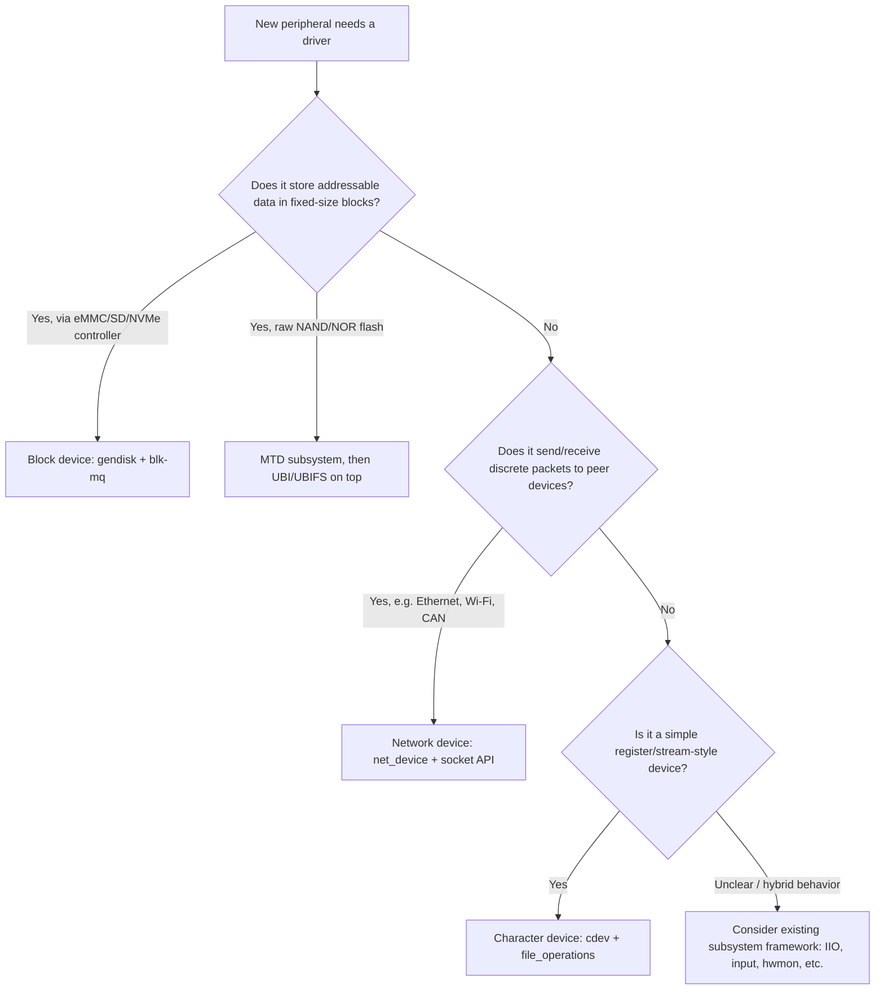

## Character, Block, and Network Drivers

### Overview

Character, block, and network devices are the three fundamental categories of Linux kernel drivers, each defined not by the physical hardware itself but by the **access pattern and kernel subsystem** used to expose that hardware to userspace. A single physical chip could theoretically be exposed through more than one category depending on driver design intent, but in practice each device type has a natural fit: streaming/register-style hardware as character devices, storage as block devices, and packet-switched hardware as network devices. Understanding which category a new peripheral belongs to — and which kernel infrastructure that implies — is one of the first architectural decisions in writing any new embedded driver.

### Character Devices

Character devices expose hardware as a byte or message stream accessed via standard file operations (`open`, `read`, `write`, `ioctl`, `close`) against a `/dev/foo` node, without the block layer's caching, request queuing, or fixed-size sector abstraction sitting in between. They are the default choice for hardware that doesn't fit "storage" or "packet network" semantics — sensors, UARTs, GPIO controllers, custom accelerators.

**Core kernel structures:**

- **`struct cdev`** — the kernel's internal representation of a character device, associating a device number range with a `file_operations` table.
- **`struct file_operations`** — the dispatch table mapping syscalls (`read`, `write`, `unlocked_ioctl`, `mmap`, `poll`, etc.) to driver-specific implementations.
- **Device numbers** — a major number (identifying the driver) and minor number (identifying the specific device instance), historically allocated statically but now commonly obtained dynamically via `alloc_chrdev_region()` to avoid collisions.

**Registration flow:**

```c
static dev_t dev_num;
static struct cdev foo_cdev;

static int __init foo_init(void) {
    alloc_chrdev_region(&dev_num, 0, 1, "foo");
    cdev_init(&foo_cdev, &foo_fops);
    cdev_add(&foo_cdev, dev_num, 1);
    // class_create()/device_create() to auto-populate /dev via udev
    return 0;
}
```

**When ioctl is appropriate:** `read()`/`write()` suit simple linear data streams; `ioctl()` is the standard escape hatch for device-specific control operations that don't map to a byte-stream model (configuring a sensor's sample rate, triggering a calibration routine, querying device capabilities). Well-designed character drivers keep the `ioctl` command set minimal and documented, since undocumented custom ioctls are a common source of userspace/kernel ABI confusion across driver versions.

### Block Devices

Block devices represent storage accessed in fixed-size sectors (traditionally 512 bytes, though 4096-byte "4Kn" sectors are increasingly common on newer storage), mediated through the kernel's block layer, which provides request queuing, I/O scheduling, read-ahead, and a page cache layer that character devices bypass entirely. Filesystems (ext4, squashfs, FAT) are built on top of block devices, not directly on hardware.

**Core kernel structures:**

- **`struct gendisk`** — represents a disk/block device as seen by userspace (`/dev/mmcblk0`, `/dev/sda`), including partition table handling.
- **`struct request_queue`** — the queue of pending I/O requests for a block device, historically single-queue, now predominantly using the **`blk-mq`** (multi-queue) framework for better scalability on multi-core systems and modern high-IOPS storage like NVMe.
- **`bio` (block I/O)** — the fundamental unit of I/O submitted to the block layer, describing a set of memory pages to transfer to/from a range of sectors.

**Why the block layer matters for embedded storage:** eMMC and SD controllers are exposed as block devices specifically so that the standard filesystem stack, page cache, and I/O scheduler apply uniformly — a raw character-device approach to storage would require every filesystem and every application to reimplement caching, request merging, and I/O ordering individually, which the block layer centralizes once for all storage-backed drivers.

**Raw flash is different:** NAND/NOR flash accessed directly (not through an eMMC/SD controller's built-in flash translation layer) is *not* typically exposed as a conventional block device, because raw flash requires wear-leveling and bad-block management the block layer doesn't provide. This is handled instead by the **MTD (Memory Technology Device)** subsystem, with UBI/UBIFS layered on top providing flash-aware wear-leveling before anything resembling a normal filesystem interface is presented.

### Network Devices

Network devices are fundamentally different from character and block devices: they have **no `/dev` node** and are not accessed via `open()`/`read()`/`write()` at all. Instead, userspace interacts with them through the socket API (`socket()`, `bind()`, `sendmsg()`, etc.), and the driver's job is to move packets between the kernel's networking stack and the physical medium.

**Core kernel structures:**

- **`struct net_device`** — represents a network interface (`eth0`, `wlan0`, `can0`), holding interface state, statistics, and a pointer to the driver's operation callbacks.
- **`struct net_device_ops`** — dispatch table for interface-level operations: `ndo_open`, `ndo_stop`, `ndo_start_xmit` (transmit a packet), `ndo_set_mac_address`, etc.
- **`sk_buff` (socket buffer)** — the fundamental packet representation moving through the networking stack, analogous to `bio` for block I/O but for network packets, carrying headers, payload, and metadata as it traverses protocol layers.

**Minimal transmit path illustration:**

```c
static netdev_tx_t foo_start_xmit(struct sk_buff *skb, struct net_device *dev) {
    // Hand skb payload to hardware TX ring/FIFO
    dev_kfree_skb(skb);
    return NETDEV_TX_OK;
}

static const struct net_device_ops foo_netdev_ops = {
    .ndo_open       = foo_open,
    .ndo_stop       = foo_stop,
    .ndo_start_xmit = foo_start_xmit,
};
```

**SocketCAN as an instructive special case:** CAN bus, common in automotive/industrial embedded systems, is implemented in Linux as a network device family (`can0`) rather than a character device, even though CAN is not "networking" in the Ethernet/IP sense — this design choice reuses the kernel's existing packet filtering, queuing, and multi-protocol socket infrastructure rather than inventing bespoke character-device framing for CAN frames, illustrating that the character/block/network split is about which kernel subsystem's semantics best fit the access pattern, not a literal hardware-type classification.

### Side-by-Side Comparison

| Aspect | Character | Block | Network |
| --- | --- | --- | --- |
| Userspace access | `/dev/foo` via `read`/`write`/`ioctl` | `/dev/sdX` via filesystem or direct I/O | Socket API, no `/dev` node |
| Core kernel structure | `struct cdev` | `struct gendisk` / `blk-mq` request queue | `struct net_device` |
| Data unit | Byte stream / discrete messages | Fixed-size sectors via `bio` | Packets via `sk_buff` |
| Caching layer | None by default (driver-managed if needed) | Page cache, I/O scheduler, read-ahead | Protocol stack buffering (not a "cache" in the storage sense) |
| Typical embedded examples | UART, sensors, GPIO chip, custom ASIC | eMMC, SD, NVMe (via block layer) | Ethernet MAC, Wi-Fi, CAN (SocketCAN) |
| Raw flash handling | N/A | Not directly — MTD/UBI/UBIFS instead | N/A |

### Driver Category Decision Flow



### Subsystem Frameworks as a Fourth Path

In practice, many embedded peripherals don't need a raw character device at all — the kernel provides higher-level subsystems (IIO for sensors/ADCs, `input` for buttons/touchscreens, `hwmon` for temperature/voltage monitoring, `rtc` for real-time clocks) that already implement a standard userspace ABI on top of character-device or sysfs mechanics. Writing a bespoke character driver for a device that fits one of these existing frameworks is generally discouraged in mainline review, since it fragments the userspace ABI landscape that these frameworks exist specifically to standardize. [Inference: general mainline review norm, not a documented formal policy.]

### Common Pitfalls

- **Using a character device for storage-like access patterns** — implementing custom `read`/`write` logic for something that's genuinely block-structured storage forfeits the page cache, I/O scheduling, and filesystem compatibility the block layer provides for free.
- **Blocking operations in `ndo_start_xmit`** — network transmit callbacks are expected to be fast/non-blocking (typically queuing to a hardware ring buffer); blocking here can stall the networking stack and trigger transmit timeout watchdogs.
- **Forgetting sector size assumptions** — code or configuration assuming a fixed 512-byte sector size can break on storage using 4096-byte native sectors; block layer code should query actual `logical_block_size`/`physical_block_size` rather than hardcoding.
- **Treating MTD/raw flash as a drop-in block device replacement** — attempting to mount a filesystem designed for block devices (like ext4) directly on raw MTD without UBI/UBIFS in between skips wear-leveling and bad-block handling, leading to premature flash failure.
- **Inventing custom ioctls for functionality an existing subsystem already standardizes** — e.g., a custom character driver for a temperature sensor when `hwmon` or `IIO` already provides a standard sysfs/character interface other userspace tooling expects.

### Key Points

- The character/block/network split is determined by access pattern and which kernel subsystem's semantics fit the hardware, not by a literal hardware taxonomy — SocketCAN's use of the network device model despite CAN not being IP networking illustrates this.
- Character devices use `cdev`/`file_operations` for direct byte-stream/ioctl access; block devices use `gendisk`/`blk-mq` for cached, sector-addressed storage; network devices use `net_device`/`sk_buff` via the socket API with no `/dev` node at all.
- Raw NAND/NOR flash is not a conventional block device — it goes through MTD, then typically UBI/UBIFS, because wear-leveling and bad-block management aren't things the standard block layer provides.
- Existing subsystem frameworks (IIO, input, hwmon, rtc) often make a raw character device driver unnecessary for common peripheral classes, and using them is generally preferred over inventing a custom ABI.
- Network transmit paths must avoid blocking, and block device code should query actual sector sizes rather than assuming 512 bytes, reflecting subsystem-specific performance and correctness constraints not shared across the three categories.

### Related Topics

- MTD subsystem and UBI/UBIFS flash wear-leveling internals
- IIO (Industrial I/O) framework for sensor and ADC drivers
- blk-mq multi-queue block layer architecture in depth
- SocketCAN driver implementation and CAN frame filtering
- Network driver NAPI (New API) polling for interrupt mitigation under high packet load
- Writing a minimal character driver with mmap support for zero-copy data transfer
- udev/sysfs device node creation and class_create()/device_create() mechanics
- Linux input subsystem for buttons, touchscreens, and HID-class embedded peripherals