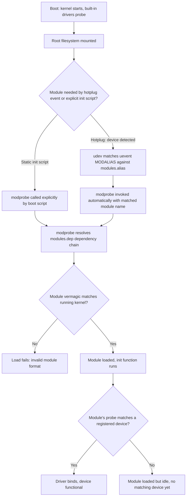

## Kernel Modules and Driver Loading

### Overview

A kernel module is a piece of kernel code (`.ko` file) that can be loaded and unloaded into a running kernel without a reboot, in contrast to functionality compiled directly into the static kernel image. Modules give embedded systems flexibility — drivers for hardware that may or may not be present, or features not always needed, can be loaded on demand rather than bloating every boot with every possible driver. Understanding the module loading mechanism, versioning, and dependency resolution is necessary both for board bring-up (getting the right drivers loaded at the right time) and for field maintenance (updating individual drivers without a full kernel reflash).

### Built-in vs. Module: The Core Tradeoff

| Aspect | Built-in (`=y`) | Module (`=m`) |
| --- | --- | --- |
| Kernel image size | Larger — code is always present | Smaller — code loaded only when needed |
| Boot time impact | Driver runs at kernel init time, in dependency order determined by link order | Driver loads when triggered (hotplug, explicit `modprobe`, or init script) — can be later than built-in equivalent |
| Field updatability | Requires full kernel image reflash to change | Can update/replace a single `.ko` file independently |
| Memory footprint if unused | Always resident, even if hardware absent | Zero if never loaded |
| Attack surface consideration | Fixed at build time | Loadable module mechanism itself can be a security consideration if unrestricted |
| Suitability for root/boot-critical drivers | Preferred — no chicken-and-egg dependency on module loading working | Risky if the storage/filesystem driver needed to *find* the module is itself a module |

**The bootstrapping problem:** a common pitfall is making the driver for the *root filesystem's own storage controller* (e.g., the eMMC/SD controller) a loadable module — the kernel needs to mount the root filesystem to find `/lib/modules/`, but if the storage driver needed to mount that filesystem is itself sitting as a file on that same filesystem, the system can't bootstrap without an initramfs providing that driver early. This is one of the most common reasons embedded builds either keep storage-critical drivers built-in or rely on an initramfs bundling exactly the modules needed for early boot.

### Module Structure

A minimal loadable module has entry/exit points and metadata macros:

```c
#include <linux/module.h>
#include <linux/init.h>

static int __init foo_init(void) {
    pr_info("foo: module loaded\n");
    return 0;
}

static void __exit foo_exit(void) {
    pr_info("foo: module unloaded\n");
}

module_init(foo_init);
module_exit(foo_exit);

MODULE_LICENSE("GPL");
MODULE_AUTHOR("Example Author");
MODULE_DESCRIPTION("Example kernel module");
MODULE_VERSION("1.0");
```

- **`module_init`/`module_exit`** register the functions called on `insmod`/`rmmod`, respectively. For built-in code, `module_init` functions are instead called during kernel boot in link order (there is no separate "load" event).
- **`MODULE_LICENSE`** is functionally significant, not just documentation: it gates access to `EXPORT_SYMBOL_GPL` kernel symbols. A module without a GPL-compatible license string calling a GPL-only exported function will either fail symbol resolution or load with a kernel "taint" flag indicating non-GPL code is present, which can affect what support/debugging assumptions apply to that running kernel (some kernel maintainers and vendors treat a tainted kernel as reducing their debugging obligation).

### Module Metadata and Versioning

- **`MODULE_DEVICE_TABLE`** — declares which hardware IDs (Device Tree `compatible` strings, USB vendor/product IDs, PCI IDs, etc.) this module handles, embedding that information into the `.ko` file itself so userspace tools (`depmod`, `udev`) can build an automatic hardware-to-module mapping without loading the module first.

```c
static const struct of_device_id foo_of_match[] = {
    { .compatible = "vendor,foo-device" },
    { }
};
MODULE_DEVICE_TABLE(of, foo_of_match);
```

- **`vermagic`** — every compiled module embeds a version string (kernel version, compiler version, SMP/preemption config) that must match the running kernel's own vermagic for `insmod` to accept it without `--force`. This is why a module built against one kernel source tree generally cannot be loaded on a kernel built from a different configuration or version, even if the source code is identical — mismatched module/kernel builds are a common source of "invalid module format" errors during board bring-up.
- **`depmod`** — generates `modules.dep` and related metadata mapping module dependencies and aliases, run as part of the build/rootfs population process (`make modules_install` triggers this), consumed by `modprobe` to automatically load a module's dependencies in the correct order.

### Loading Mechanisms

| Mechanism | Trigger | Typical Use |
| --- | --- | --- |
| `insmod` | Explicit, manual, no dependency resolution | Debugging/development; loads exactly one `.ko`, ignoring dependencies |
| `modprobe` | Explicit, dependency-aware (uses `modules.dep`) | Standard tool for loading a module and its dependencies by name or alias |
| `rmmod` / `modprobe -r` | Explicit unload | Removing a module (only succeeds if refcount is zero — no open file handles/users) |
| udev/hotplug auto-load | Kernel uevent on device detection matches `MODULE_DEVICE_TABLE` alias | Automatic loading when hardware appears (USB insertion, PCI enumeration) — the dominant mechanism on general-purpose Linux, also used on embedded systems with dynamic peripheral sets |
| Static `/etc/modules-load.d/` or init script `modprobe` calls | Boot-time init sequence | Common on embedded systems for predictable, deterministic module loading order regardless of hotplug timing |
| Kernel built-in `MODULE_SOFTDEP` / `request_module()` | Explicit in-kernel dependency triggering by another driver | A driver can trigger loading of another module it depends on programmatically, rather than relying solely on static dependency declarations |

### Module Loading Flow



### Module Signing and Security

Modern kernels support cryptographic module signing (`CONFIG_MODULE_SIG`), where modules are signed at build time and the kernel verifies the signature against a compiled-in (or otherwise trusted) key before loading. This is commonly paired with:

- **`CONFIG_MODULE_SIG_FORCE`** — refuses to load any unsigned or invalidly-signed module at all, rather than just warning/tainting.
- **Lockdown LSM** — a kernel security module that, when enabled (often tied to Secure Boot state), restricts a broad set of kernel-tampering operations including unsigned module loading, `/dev/mem` access, and other mechanisms that could otherwise bypass signature enforcement.
- **Relevance to embedded secure boot chains** — module signing is one layer of a fuller chain-of-trust story that typically starts at SoC boot ROM (verifying the bootloader), continues through U-Boot verifying the kernel/DTB (via FIT signatures), and can extend into the kernel verifying its own loadable modules — each link independently enforced, and a break at any link undermines the chain's guarantees for the layers above it.

### Practical Commands

```bash
# Load a module by path (no dependency resolution)
insmod ./foo.ko

# Load a module by name, resolving dependencies via modules.dep
modprobe foo

# List currently loaded modules
lsmod

# Show detailed info embedded in a .ko file (license, version, params, device table)
modinfo foo.ko

# Unload a module (fails if in use)
rmmod foo
# or
modprobe -r foo

# Regenerate modules.dep and related metadata after installing new modules
depmod -a
```

**Passing parameters to a module at load time:**

```c
static int sample_rate = 100;
module_param(sample_rate, int, 0644);
MODULE_PARM_DESC(sample_rate, "Sensor sample rate in Hz");
```

```bash
modprobe foo sample_rate=200
# or after boot via sysfs, if the parameter permission bits allow it:
echo 200 > /sys/module/foo/parameters/sample_rate
```

### Common Pitfalls

- **Making the root storage driver a module without initramfs support** — as described above, this creates a bootstrapping deadlock; the fix is either building that driver in, or ensuring an initramfs bundles it for early boot before the real root filesystem is mounted.
- **Kernel/module version mismatch after partial updates** — replacing only the kernel image (`Image`/`zImage`) without also updating `/lib/modules/<version>/` on the rootfs (or vice versa) leads to vermagic mismatches and module load failures, a common field-update bug when kernel and rootfs images aren't versioned/deployed atomically together.
- **Forgetting `depmod -a` after manually copying `.ko` files into a rootfs** — `modprobe` relies on `modules.dep`; modules copied in without regenerating this metadata won't resolve dependencies correctly even though `insmod` might still load them individually.
- **Assuming hotplug-only loading is sufficient for deterministic embedded boot** — hotplug/udev-based auto-loading works well for dynamically-appearing hardware (USB) but can introduce nondeterministic ordering for statically-present peripherals; many embedded systems supplement or replace this with explicit static module loading in boot scripts for predictable startup sequencing.
- **Ignoring taint state during debugging** — a kernel tainted by an out-of-tree or non-GPL module can behave subtly differently in ways unrelated to the actual bug being investigated (some debug facilities and vendor support policies change behavior based on taint state), and checking `/proc/sys/kernel/tainted` early in a debugging session can save time misattributing a symptom.

### Key Points

- Module vs. built-in is a tradeoff between kernel image size/flexibility and boot-time predictability, with the root storage driver's own boot-critical status being the most common reason to keep certain drivers built-in.
- `MODULE_LICENSE`, `MODULE_DEVICE_TABLE`, and vermagic are functionally significant metadata, not documentation — they gate symbol access, enable hardware-triggered auto-loading, and enforce kernel/module build compatibility respectively.
- `modprobe` (dependency-aware) is the standard loading tool; `insmod` is a lower-level primitive mainly useful for single-module debugging without dependency resolution.
- Module signing and Lockdown LSM extend the secure boot chain of trust from bootloader/kernel verification into the loadable module layer, relevant for products enforcing full chain-of-trust boot security.
- Deterministic embedded boot often supplements or replaces pure hotplug-driven module loading with explicit static loading in boot scripts, since hotplug ordering isn't guaranteed to match a product's required startup sequence.

### Related Topics

- initramfs construction for early-boot module availability
- Secure boot chain of trust: boot ROM through bootloader, kernel, and module signing layers
- udev rules and MODALIAS-based automatic module loading in depth
- Kernel taint flags and their effect on debugging/support workflows
- Out-of-tree module maintenance across kernel version upgrades (DKMS-style rebuilding)
- Kernel lockdown LSM and its interaction with debugging tools like /dev/mem and kprobes
- Deterministic boot ordering strategies for embedded init systems
- Building and packaging kernel modules within Yocto/Buildroot recipes