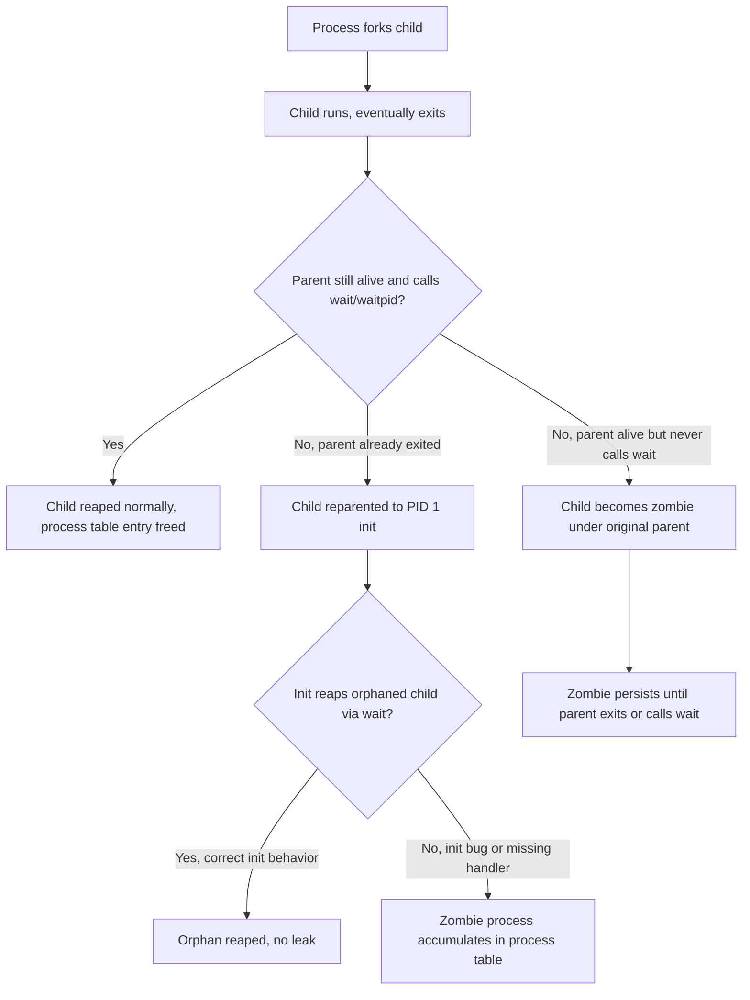
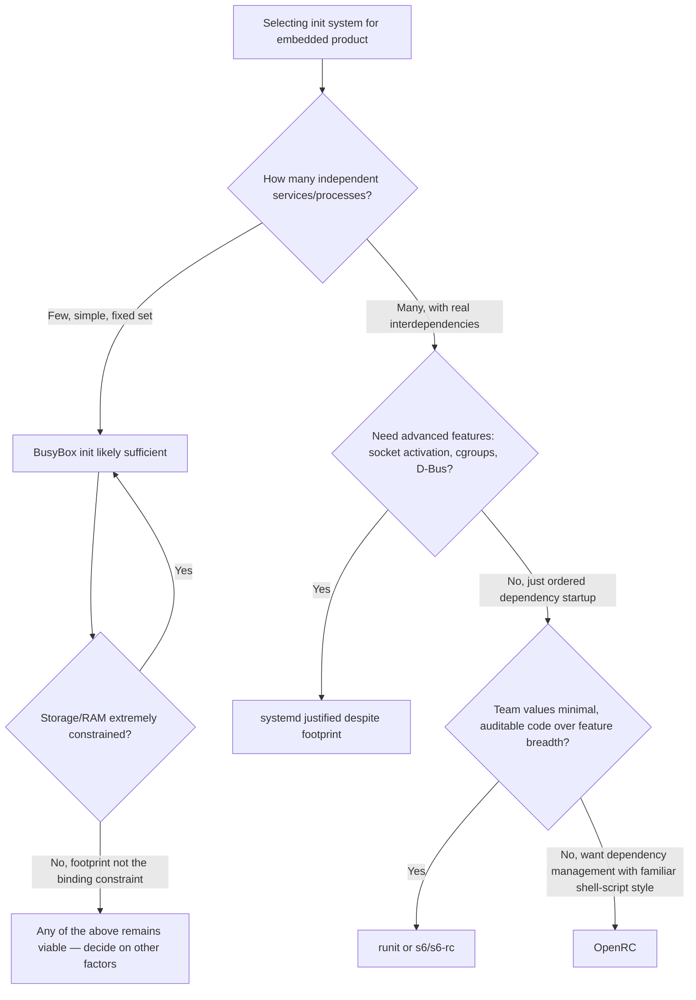

## Init Systems and Process Management

### Overview

The init system is PID 1 — the first userspace process the kernel starts after mounting the root filesystem, and the ancestor of every other process on the system. Beyond simply "starting things," init is responsible for service supervision (restarting failed processes), orphaned process reaping (preventing zombie process accumulation), system state transitions (boot, shutdown, reboot), and on many systems, dependency-ordered service startup. Choice of init system materially affects embedded boot time, RAM footprint, and how service failures are handled in the field, making it a deliberate architectural decision rather than a default to accept unexamined.

### Why PID 1 Is Special

The kernel treats PID 1 differently from every other process in ways relevant to embedded reliability:

- **Orphan reaping** — when a process's parent dies before it does, the orphaned process is reparented to PID 1, which must call `wait()` on it to prevent it from becoming a permanent zombie (a process table entry consuming resources with no parent to reap it). An init system that fails to reap orphans correctly can leak zombie processes until the process table fills.
- **Signal handling exemption** — PID 1 does not receive default signal dispositions the way other processes do; a signal sent to PID 1 without an explicit handler installed for it is typically ignored rather than terminating the process, which prevents accidental system-wide crashes but means init must explicitly handle signals it cares about (e.g., `SIGTERM` for graceful shutdown).
- **System halts if PID 1 dies** — unlike any other process, if PID 1 exits or crashes, the kernel panics rather than continuing — there is no process to hand off to, making init reliability directly equivalent to system reliability.

### Init System Comparison

| Init System | Complexity | RAM/Storage Footprint | Dependency Management | Typical Embedded Fit |
| --- | --- | --- | --- | --- |
| BusyBox `init` | Minimal | Very low | None — linear `/etc/inittab` execution | Simple, single-purpose appliances with few services |
| systemd | High | Higher (comparatively) | Full dependency graph, socket/D-Bus activation, cgroups | Complex multi-service embedded products (infotainment, gateways) where service management complexity justifies the footprint |
| OpenRC | Moderate | Low-moderate | Dependency-based, shell script driven | Middle ground — dependency ordering without systemd's full scope |
| runit | Low | Very low | Simple supervision, no complex dependency graph | Minimalist, security/audit-conscious builds favoring small, inspectable code |
| s6 / s6-rc | Low-moderate | Very low | Explicit dependency declaration, strong reliability focus | Similar niche to runit, chosen for correctness/auditability over feature breadth |

### BusyBox init: Minimal Linear Execution

BusyBox's `init` is deliberately simple — no dependency graph, just a sequential reading of `/etc/inittab` describing what to run at which boot stage.



```
# /etc/inittab
::sysinit:/etc/init.d/rcS
::respawn:/sbin/getty -L ttyS0 115200 vt100
::shutdown:/bin/umount -a -r
::restart:/sbin/init
```

- **`sysinit`** — runs once early in boot, typically pointing to a shell script (`rcS`) that mounts filesystems, sets up `/dev`, and starts other processes in whatever order that script defines internally.
- **`respawn`** — automatically restarts the specified process if it exits, commonly used for `getty` (login prompts) — this is BusyBox init's primary form of "supervision," restart without dependency awareness.
- **`shutdown`** — runs during system shutdown, for cleanup like unmounting filesystems.

Because there's no dependency graph, ordering is entirely the responsibility of whatever `rcS` script does internally — typically a hand-written sequence of `mount`, `mkdir`, and service-starting commands, executed strictly in file order.

### systemd: Dependency-Based Service Management

systemd models services as **units** (`.service`, `.socket`, `.mount`, `.target`, etc.) with explicit dependency relationships, enabling parallel startup where dependencies allow, automatic restart policies, and resource control via cgroups.

**Example service unit:**

```ini
[Unit]
Description=Foo Application
After=network.target
Requires=foo-config.service

[Service]
ExecStart=/usr/bin/foo-app
Restart=on-failure
RestartSec=2

[Install]
WantedBy=multi-user.target
```

- **`After=`/`Before=`** — ordering dependencies (does not imply the dependency is required, only sequencing if both are being started).
- **`Requires=`/`Wants=`** — actual dependency declarations; `Requires` fails the unit if the dependency fails, `Wants` is a softer preference that doesn't block startup on dependency failure.
- **`Restart=on-failure`** — automatic supervision/restart policy, configurable per-unit (`always`, `on-failure`, `on-abnormal`, etc.) rather than BusyBox init's blanket `respawn`.
- **Socket activation** — a service can be started lazily on first connection to its socket rather than unconditionally at boot, which can measurably reduce boot-time resource contention when many services would otherwise all start simultaneously.
- **cgroups integration** — systemd uses Linux control groups to track and constrain resource usage (CPU, memory) per service, which is valuable for embedded products needing to prevent one misbehaving service from starving others on constrained hardware.

**Boot time consideration:** systemd's dependency resolution and parallelization can start unrelated services concurrently, which sometimes offsets its baseline overhead compared to a strictly sequential init — but the net boot-time effect versus a minimal init depends heavily on service count and configuration, and shouldn't be assumed in either direction without measurement on the actual target hardware. [Inference: net effect is workload-dependent rather than a fixed, universally-documented number; treat any specific boot-time claim as needing verification on the target device.]

### Process Lifecycle and Zombie/Orphan Handling

Understanding process reaping is relevant beyond init system choice — any long-running embedded application that forks child processes needs to handle this correctly too.



A zombie process (`Z` state in `ps`) has already terminated and released its resources, but its process table entry (holding exit status) persists until reaped — it consumes a process table slot and PID, not CPU or significant memory, but on a system with a small configured process limit, zombie accumulation from a buggy application can eventually prevent new processes from being created at all.

### Signal Handling in Init

Init systems typically translate external signals into orderly system state transitions rather than terminating immediately:

| Signal | Typical Meaning to Init |
| --- | --- |
| `SIGTERM` | Request graceful shutdown — init begins stopping services in dependency order (or reverse `rcS` order for BusyBox) |
| `SIGHUP` | Historically "re-exec/reload configuration" on many init systems, though exact behavior is init-specific |
| `SIGCHLD` | Notification that a child process has exited/changed state — init's core mechanism for detecting when to reap or respawn |
| `SIGKILL` | Cannot be caught/ignored even by PID 1 — an immediate, unrecoverable termination that will panic the kernel since PID 1 cannot be gracefully substituted |

### Application-Level Process Supervision Beyond Init

Many embedded products layer additional supervision above the base init system for application-specific processes — either because the chosen init system's native supervision (BusyBox `respawn`, systemd `Restart=`) is deemed insufficient, or because a lighter, purpose-built supervisor is preferred for a specific subset of processes:

- **`monit`** — configurable process/resource monitoring with restart and alerting rules, often layered on top of a simpler init.
- **s6-supervise / runsv** — per-service supervision daemons used both as full init replacements (s6-rc, runit) and, in some designs, as a supervision layer under a different top-level init.
- **Custom watchdog processes** — some embedded products implement a small custom supervisor tailored to their exact process set rather than adopting a general-purpose tool, trading generality for a smaller, more auditable footprint.

### Choosing an Init System: Decision Factors



### Common Pitfalls

- **Assuming `respawn`/`Restart=` alone constitutes reliability** — automatic restart handles crashes but not resource leaks or hung-but-alive processes; production embedded systems often need a watchdog (hardware or software) as a separate reliability layer independent of init-level restart policies.
- **Ignoring PID 1 signal-handling exemption during custom init development** — a hand-rolled minimal init that doesn't explicitly install a `SIGCHLD` handler will fail to reap children, silently accumulating zombies over the device's operational lifetime until the process table exhausts.
- **systemd unit ordering (`After=`) mistaken for dependency (`Requires=`)** — a common authoring mistake is assuming `After=` alone guarantees the dependency is running, when it only guarantees ordering *if* both units are being started; a unit that isn't explicitly required/wanted may simply not start at all.
- **Underestimating systemd's footprint impact on genuinely constrained hardware** — on devices with very limited RAM/flash, systemd's baseline footprint can be a meaningful fraction of total available resources in a way that isn't apparent when developing/testing on more capable hardware.
- **Zombie accumulation misdiagnosed as a memory leak** — zombies consume process table slots, not significant memory; conflating the two during field debugging can lead to investigating the wrong subsystem.

### Key Points

- PID 1 has kernel-level special treatment (orphan reaping responsibility, signal handling exemption, system-panic-on-death) that makes init reliability foundational to overall system reliability, not just another service.
- Init system choice is a genuine architectural tradeoff between footprint/simplicity (BusyBox init, runit, s6) and dependency/feature richness (systemd, with OpenRC as a middle ground).
- Zombie processes result from a parent (including init itself) failing to call `wait()`/`waitpid()` on a terminated child — orphans are reparented to PID 1 specifically so someone is always responsible for eventually reaping them.
- `After=`/`Before=` in systemd control ordering only; `Requires=`/`Wants=` control actual dependency semantics — conflating the two is a common unit-authoring mistake.
- Init-level restart policies are necessary but not sufficient for field reliability; many embedded products add a separate watchdog layer (hardware and/or software) independent of init's own supervision.

### Related Topics

- Hardware and software watchdog integration for embedded reliability
- systemd socket activation and D-Bus service architecture in depth
- Writing a minimal custom init for extremely constrained single-purpose devices
- cgroups v1 vs v2 resource control differences relevant to embedded service isolation
- Boot time optimization techniques across kernel, initramfs, and init stages
- Signal handling best practices for long-running embedded application processes
- Yocto/Buildroot integration choices for systemd vs. BusyBox init images
- Graceful shutdown handling for power-loss-prone embedded deployments