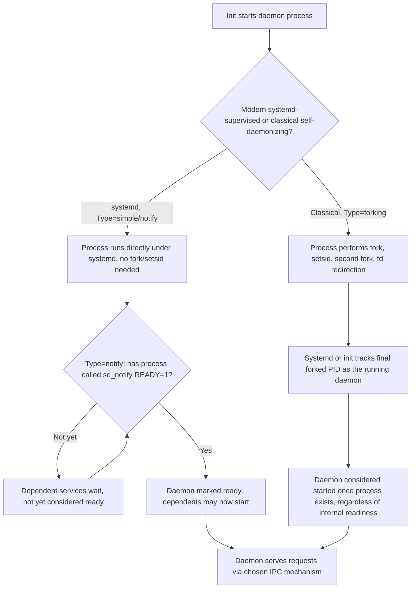
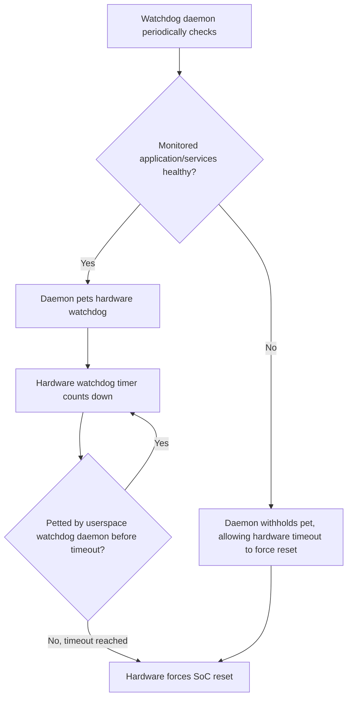

## System Services and Daemons

### Overview

A daemon is a long-running background process with no controlling terminal, typically started at boot and running for the system's operational lifetime, providing a specific service to other processes or the network rather than interacting directly with a user. On embedded Linux, daemons handle networking (DHCP clients, NTP sync), device management (udev), logging, and application-specific business logic — understanding how to correctly write, supervise, and communicate with a daemon is a distinct skill from writing an ordinary application, since daemons must handle process lifecycle concerns (detachment, signal handling, logging without a terminal) that a foreground program never encounters.

### What Makes a Process a Daemon

Classically, a Unix daemon detaches itself from the terminal and process group that launched it through a specific sequence, historically called "daemonizing":

1. **Fork**, and have the parent exit — the child continues as an orphan, eventually reparented to init.
2. **`setsid()`** — create a new session, making the child a session leader with no controlling terminal.
3. **Fork again** (double-fork) — prevents the daemon from ever being able to reacquire a controlling terminal, a defensive measure against certain terminal-reattachment edge cases.
4. **Change working directory** (commonly to `/`) — avoids holding a lock on whatever directory launched it, which would prevent that filesystem from being unmounted.
5. **Reset file mode creation mask (`umask`)** — ensures predictable file permission behavior independent of the launching environment's umask.
6. **Close or redirect standard file descriptors** — `stdin`/`stdout`/`stderr` are typically redirected to `/dev/null` or to a log destination, since there's no terminal to write to.

```c
pid_t pid = fork();
if (pid > 0) exit(0);           // parent exits
setsid();                        // new session
pid = fork();
if (pid > 0) exit(0);           // first child exits
chdir("/");
umask(0);
close(STDIN_FILENO);
close(STDOUT_FILENO);
close(STDERR_FILENO);
// continue as the daemon...
```

**Modern practice diverges from this classical sequence.** Under systemd, most of this manual daemonizing is unnecessary and actively discouraged — a service unit with `Type=simple` or `Type=notify` runs the program directly under systemd's supervision without requiring it to self-daemonize, since systemd itself handles session detachment, stdout/stderr redirection (to the journal), and process tracking via cgroups rather than relying on the double-fork trick.

### systemd Service Types

| `Type=` | Behavior | When to Use |
| --- | --- | --- |
| `simple` (default) | systemd considers the service started as soon as the main process is forked; the process should NOT self-daemonize | Most modern daemons — the standard choice |
| `forking` | Expects the classical double-fork pattern; systemd tracks the final forked process via `PIDFile=` or process tracking heuristics | Legacy daemons that self-daemonize using the classical sequence |
| `notify` | Service signals readiness explicitly via `sd_notify()`, letting systemd know precisely when startup (including any slow initialization) has completed | Services with non-trivial startup where "process exists" isn't the same as "ready to serve requests" |
| `oneshot` | Runs to completion and exits; used for setup tasks rather than persistent daemons | Initialization scripts, one-time configuration tasks |
| `dbus` | Considered started when the specified D-Bus name is acquired | D-Bus-activated services |

**`sd_notify()` readiness signaling:**

```c
#include <systemd/sd-daemon.h>

// after completing slow initialization:
sd_notify(0, "READY=1");
```

This solves a real reliability problem: without explicit readiness signaling, systemd (or any supervisor) only knows a process *exists*, not that it has finished initializing and is actually able to serve requests — a dependent service starting immediately after the process forks, rather than after it's genuinely ready, is a common source of intermittent startup-order bugs.

### Inter-Process Communication for Daemons

Daemons typically need to communicate with clients or other daemons; the mechanism chosen affects latency, security boundary, and complexity:

| Mechanism | Characteristics | Typical Embedded Use |
| --- | --- | --- |
| Unix domain sockets | Local-only, filesystem-path-addressed, supports credential passing (`SO_PEERCRED`) | Local daemon-to-daemon or daemon-to-application communication, common default choice |
| D-Bus | Message-bus abstraction with method calls, signals, and service discovery; built on Unix sockets underneath | Desktop-influenced embedded systems (many automotive/IVI stacks), systemd-integrated services |
| TCP/UDP sockets | Network-reachable, higher overhead than Unix sockets for purely local communication | When the client may be remote, or when reusing existing network-protocol tooling is preferred |
| Shared memory + semaphores | Very low latency, no copy overhead for large data | High-throughput local IPC (e.g., camera frame buffers between capture daemon and processing application) |
| Netlink sockets | Kernel-to-userspace and userspace-to-userspace messaging, used extensively by networking/udev | Consuming kernel event notifications (device hotplug, network state changes) |
| Message queues (POSIX/SysV) | Simple, kernel-managed message passing | Lightweight command/event passing between cooperating processes |

### Logging Without a Terminal

Since daemons have no controlling terminal, `printf`-style output to stdout is meaningless unless explicitly redirected somewhere useful. Standard approaches:

- **syslog (`syslog()` / `openlog()`)** — the traditional Unix logging API, sending messages to a syslog daemon (`syslogd`, `rsyslogd`, or BusyBox's minimal `syslogd`) which handles routing to files, remote servers, or rotation.
- **systemd journal (`sd_journal_print()` or stdout/stderr capture)** — under systemd, a service's stdout/stderr is automatically captured into the structured, indexed journal without any explicit logging API call required, simplifying the common case.
- **Direct file logging** — simpler daemons sometimes write directly to a log file with manual rotation logic, appropriate for very constrained systems avoiding a full syslog daemon's overhead.
- **Remote/network logging** — shipping logs off-device (via syslog's remote UDP/TCP forwarding or a dedicated log-shipping agent) is common in fielded embedded products where on-device log retention before overwrite/rotation is too short for post-incident diagnosis, and where flash write-endurance considerations discourage extensive local log accumulation in the first place.

### Common Embedded System Daemons

| Daemon | Role |
| --- | --- |
| `udevd` / `eudev` | Handles kernel uevents for device hotplug, populates `/dev`, runs matching udev rules |
| `dhcpcd` / `udhcpc` (BusyBox) | DHCP client, network address configuration |
| `chronyd` / `ntpd` / `busybox ntpd` | Time synchronization, important for embedded systems needing accurate timestamps (logging, TLS certificate validation) despite no persistent RTC or an inaccurate one |
| `syslogd` / `rsyslogd` | Log message routing and persistence |
| `sshd` (dropbear or OpenSSH) | Remote administrative access — `dropbear` is a common lighter-footprint alternative to OpenSSH's sshd for constrained systems |
| `watchdogd` | Userspace daemon petting a hardware watchdog timer, ensuring a hung system triggers a hardware reset rather than remaining unresponsive indefinitely |
| Application-specific daemons | The product's actual business logic — sensor polling, control loops, cloud connectivity agents, etc. |

### Daemon Startup and Readiness Flow



### Watchdog Integration Pattern

A common embedded reliability pattern pairs a hardware watchdog timer (a peripheral that resets the SoC if not periodically "petted") with a userspace watchdog daemon that itself checks application health before petting the hardware timer — this way, a hung application (not just a hung kernel) can trigger a recovery reset, since the watchdog daemon only pets the hardware timer if its own health checks against monitored processes/services pass.



### Common Pitfalls

- **Self-daemonizing under systemd unnecessarily** — using the classical double-fork sequence for a service actually managed by systemd with `Type=simple` confuses systemd's process tracking (it may lose track of the "real" daemon process across the forks) and is generally unnecessary extra complexity; `Type=simple` or `Type=notify` with no self-daemonizing is the modern-practice default.
- **Missing readiness signaling causing race conditions** — a dependent service starting immediately after a daemon's process exists, rather than after actual initialization completes, is a frequent source of intermittent (timing-dependent, hard-to-reproduce) startup failures — `sd_notify()`/`Type=notify` exists specifically to eliminate this class of bug.
- **Logging to stdout with no capture mechanism configured** — a daemon writing diagnostic output to stdout when nothing is actually capturing it (no journal, no redirected log file) silently loses that output, which is a common debugging dead-end during board bring-up when a daemon appears to produce no logs at all.
- **Watchdog daemon that pets unconditionally** — a userspace watchdog that pets the hardware timer on a fixed timer interval regardless of actual application health defeats much of the watchdog's purpose, since it will happily pet through an application hang as long as the watchdog daemon process itself is still scheduled.
- **Ignoring flash write endurance for verbose local logging** — daemons configured for verbose logging directly to flash-backed storage without rotation/rate limiting can meaningfully impact flash lifespan on write-cycle-limited storage over a product's field lifetime, an easy-to-overlook operational cost of default-verbose logging configurations.

### Key Points

- The classical double-fork daemonizing sequence exists to detach a process from its controlling terminal and launching session, but is largely unnecessary and discouraged under systemd, which handles equivalent concerns itself for `Type=simple`/`notify` services.
- `sd_notify()` readiness signaling (`Type=notify`) solves a genuine class of startup-race bugs that "process exists" tracking alone cannot, by letting a daemon explicitly declare when it's actually ready rather than merely running.
- IPC mechanism choice (Unix sockets, D-Bus, shared memory, netlink, message queues) should match the actual latency/security/discoverability requirements of the specific daemon-to-client relationship rather than defaulting to one mechanism universally.
- Daemons have no controlling terminal, so logging strategy (syslog, systemd journal, direct file, remote shipping) must be deliberately chosen — silent loss of diagnostic output from unconfigured stdout logging is a common and avoidable bring-up frustration.
- Userspace watchdog daemons should gate hardware watchdog petting on genuine application health checks, not merely on their own process being scheduled, or the pattern's core reliability benefit is largely negated.

### Related Topics

- systemd unit file authoring in depth: Type=, Restart=, dependency ordering
- D-Bus service architecture and method/signal design for embedded IPC
- Hardware watchdog timer driver integration (Linux watchdog subsystem)
- syslog protocol, log rotation, and remote log shipping strategies for embedded fleets
- Unix domain socket programming and credential passing (SO_PEERCRED)
- Flash write endurance considerations for embedded logging and state persistence
- udev rule authoring for custom hotplug-triggered daemon actions
- Security hardening for network-facing embedded daemons (privilege dropping, seccomp, namespaces)