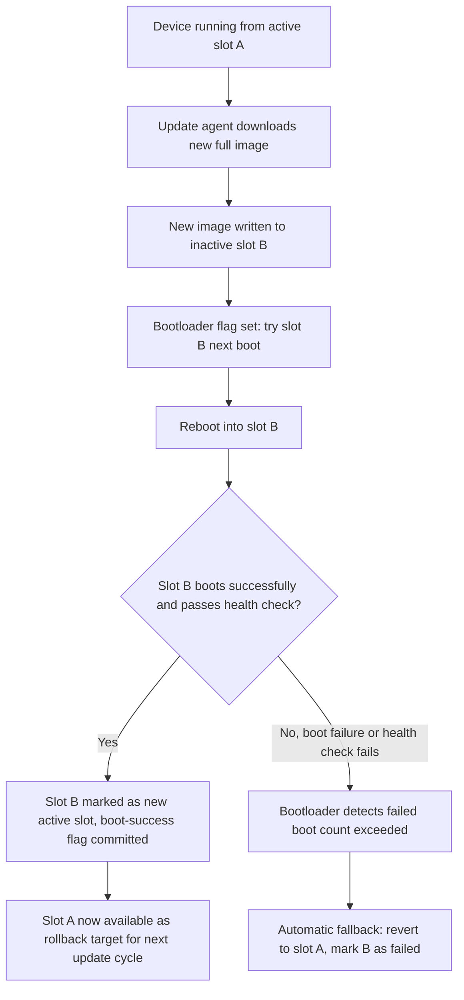
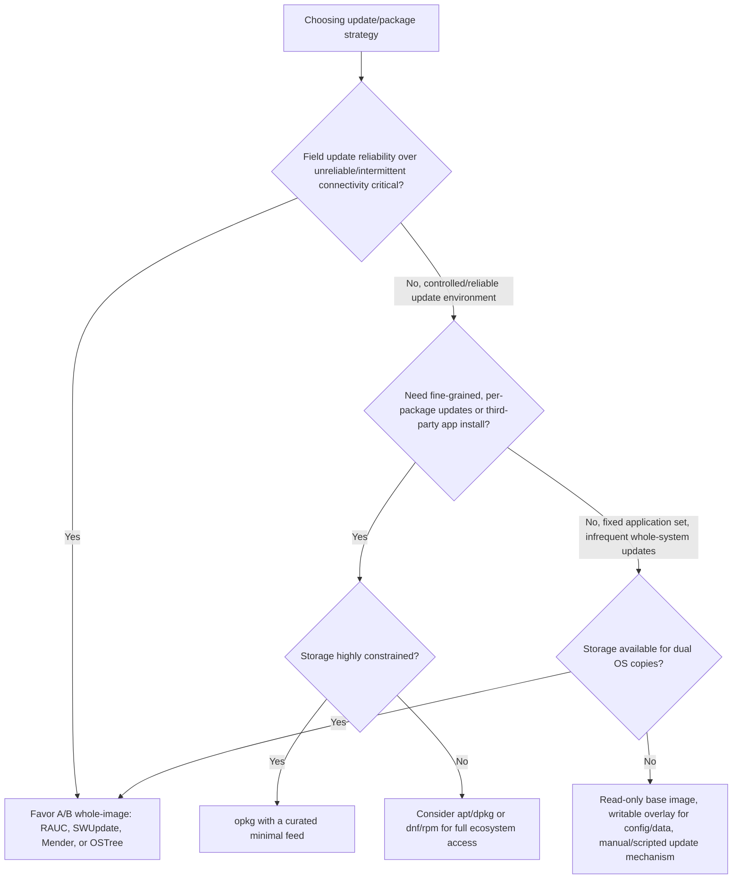

## Package Management for Embedded Targets

### Overview

Package management on embedded targets is the question of how software gets installed, updated, and removed on a running device after the initial image is built — and it is far less settled than on desktop/server Linux, where apt/dnf/pacman are near-universal defaults. Embedded systems frequently forgo traditional runtime package management entirely in favor of immutable, whole-image updates, and understanding *why* that tradeoff is made — and when a real package manager is still the right choice — is central to embedded software architecture decisions.

### The Core Tension: Immutable Images vs. Runtime Package Management

| Approach | Update Granularity | Failure Recovery | Storage Overhead | Typical Fit |
| --- | --- | --- | --- | --- |
| Immutable image (A/B, full replace) | Whole image | Simple — fall back to other slot | Higher (often two full OS copies) | Products prioritizing update reliability and field robustness over update size/flexibility |
| Runtime package manager (opkg, apt, rpm) | Per-package | Complex — partial update failures can leave inconsistent state | Lower (only changed packages transferred/stored) | Products needing fine-grained updates, third-party app installation, or resource-constrained update bandwidth |
| Read-only base + writable overlay, no package manager | Whole base image, overlay for config/data only | Simple — base is never partially modified | Moderate | Common middle ground: immutability for the OS, without needing full second-copy A/B partitioning |

The immutable-image philosophy trades update granularity for **update atomicity and predictability** — a failed package manager transaction can leave a system in a broken, partially-updated state that's difficult to diagnose or recover from remotely, which is a much more serious problem on a headless field-deployed device than on a desktop where a user can intervene. Whole-image A/B updates sidestep this: either the new image boots successfully, or the bootloader falls back to the known-good previous slot.

### opkg: The Traditional Embedded Package Manager

opkg (originally derived from ipkg, used by early OpenWrt) is a lightweight package manager designed specifically for storage- and RAM-constrained embedded systems, using a `.ipk` package format (a variant of Debian's `.deb` structure, but simplified).

**Characteristics:**

- Minimal dependency resolution compared to apt/dnf — historically less sophisticated conflict resolution, appropriate for smaller, more curated package feeds rather than large general-purpose repositories.
- Small footprint binary, itself embeddable in space-constrained rootfs images.
- Commonly paired with Yocto-built images that choose to expose runtime package management rather than shipping a fully static rootfs — Yocto can generate opkg-compatible package feeds as a build output option.

```bash
opkg update
opkg install foo-package
opkg remove foo-package
opkg list-installed
```

### apt/dpkg on Embedded (Debian-Derived Targets)

Full Debian or Ubuntu-derived embedded builds (via debootstrap or multistrap, or vendor images like Raspberry Pi OS) bring the complete apt/dpkg ecosystem, trading minimalism for access to the entire Debian package repository and mature, well-tested dependency resolution.

**When this tradeoff makes sense:**

- Development/prototyping boards where developer convenience and package availability outweigh storage minimalism.
- Products where the target hardware has comparatively generous storage (multi-GB eMMC or larger) and internet connectivity, making apt's larger footprint and network dependency less consequential.
- Teams wanting to leverage existing Debian packaging and security update infrastructure rather than maintaining their own feed.

**When it doesn't:** heavily storage-constrained targets (small SPI-NOR or small eMMC), products requiring atomic/reliable field updates over unreliable connections, or products wanting a minimal attack surface without a general-purpose package manager and its associated tooling present on-device.

### RPM-Based Embedded Package Management

Yocto also supports RPM as a package output format (via `PACKAGE_CLASSES = "package_rpm"` in Yocto configuration), typically paired with `dnf` or `smart` for on-target package management, more common in Yocto-based products originating from or integrating with RPM-based enterprise Linux practices than in traditional "small embedded" contexts.

### Comparison of Runtime Package Formats

| Format | Origin Ecosystem | Typical On-Target Tool | Footprint | Notes |
| --- | --- | --- | --- | --- |
| `.ipk` | OpenWrt/ipkg lineage | opkg | Minimal | Purpose-built for constrained embedded systems |
| `.deb` | Debian | apt / dpkg | Larger | Mature dependency resolution, huge repository access |
| `.rpm` | Red Hat lineage | dnf / rpm | Larger | Common in Yocto builds targeting enterprise-adjacent conventions |
| Custom/proprietary container formats | Product-specific | Vendor update agent | Variable | Common in whole-image A/B update schemes, not "package management" in the traditional sense |

### A/B (Dual-Bank) Whole-Image Updates as an Alternative Paradigm

Rather than managing individual packages, many embedded products partition storage into two (or more) OS partitions ("slots"), where updates write an entirely new OS image to the inactive slot, and the bootloader switches to it only after validating a successful first boot.



**Update frameworks implementing this pattern:**

- **RAUC (Robust Auto-Update Controller)** — bundle-based, signed update packages, integrates with U-Boot for slot selection, widely used in Yocto-based products.
- **SWUpdate** — similar goals, flexible handler architecture supporting various storage/update targets beyond simple A/B partitioning (e.g., bootloader environment updates, UBI volumes).
- **Mender** — combines A/B image updates with a device management server component, oriented toward fleet management as well as the on-device update mechanism itself.
- **OSTree / rpm-ostree** — a different model: a Git-like versioned filesystem tree for the OS, allowing atomic image-like updates while still supporting some package-manager-like layering (`rpm-ostree install`) on top of an otherwise immutable base — a hybrid between pure whole-image and pure package-based approaches.

These frameworks are not "package managers" in the opkg/apt sense — they operate at the whole-image or whole-bundle level, prioritizing atomicity and rollback safety over per-package granularity.

### Decision Flow: Package Manager vs. Immutable Image Update



### Security Considerations

- **Signed packages/bundles** — both traditional package managers (apt's repository signing, RPM's GPG signing) and A/B update frameworks (RAUC bundle signing, SWUpdate's signed images) should verify cryptographic signatures before installing/applying an update, since an unsigned update mechanism is a direct remote code execution vector on any network-connected embedded device.
- **Rollback protection** — for products with hardware-enforced anti-rollback (monotonic counters preventing reverting to an older, potentially vulnerable firmware version), the update mechanism must integrate with that hardware feature rather than assuming pure software-level version tracking is sufficient — this is a product-specific security architecture decision beyond the update tool's default behavior. [Inference: framed generally rather than tied to a specific tool's built-in guarantee, since anti-rollback hardware integration is typically a product-specific integration effort layered on top of the base update framework.]
- **Partial update exposure window** — traditional package managers have a window during multi-package transactions where system state is inconsistent; A/B schemes largely eliminate this at the OS level by construction, which is a primary driver of their popularity for safety- or reliability-critical embedded products.
- **Network-facing package manager attack surface** — a full apt/dnf stack present on a fielded device is itself additional attack surface (parsing untrusted repository metadata, handling potentially malicious package content) compared to a minimal, purpose-built update agent with a narrower, more auditable code path.

### Common Pitfalls

- **Choosing full apt/dnf for storage-constrained targets without evaluating footprint impact** — the package manager stack itself (not just installed packages) consumes meaningful flash space that may not be obvious until the image is actually built and measured against the target's real storage budget.
- **Treating opkg's dependency resolution as equivalent to apt/dnf's maturity** — opkg's simpler resolution logic can behave unexpectedly with complex dependency graphs; curating a small, well-tested package feed rather than a large sprawling one is the practical mitigation most embedded teams adopt.
- **Building an A/B scheme without a boot-success health check** — writing a new image to the inactive slot and switching to it without verifying the new slot actually boots and functions correctly (not just "the bootloader jumped to it") can result in a device bricking itself on a bad update with no automatic recovery path.
- **Ignoring rollback storage/versioning limits** — A/B schemes provide one level of rollback (to the immediately previous slot) by default; products needing deeper rollback history or staged rollout capability need additional infrastructure beyond the basic two-slot mechanism.
- **Mixing philosophies inconsistently** — some products end up with both a package manager for application updates and a separate A/B mechanism for OS updates, without clearly defining which layer owns which files, leading to confusing, hard-to-reproduce field states where the two update paths' assumptions conflict.

### Key Points

- Embedded package management sits on a spectrum from traditional runtime package managers (opkg, apt, dnf) offering fine-grained updates, to whole-image A/B schemes (RAUC, SWUpdate, Mender, OSTree) prioritizing update atomicity and reliable rollback.
- The core tradeoff is update granularity and storage efficiency versus update atomicity and field-failure recovery simplicity — headless, remotely-deployed devices generally weight atomicity and recoverability more heavily than desktop systems do.
- opkg exists specifically to fill the "package manager for genuinely constrained embedded systems" niche that full apt/dnf don't serve well, at the cost of less mature dependency resolution.
- A/B update frameworks are not package managers and shouldn't be evaluated against package managers on granularity — their value proposition is atomic, verifiable, rollback-safe whole-system updates, which is a fundamentally different problem being solved.
- Signed updates, boot-success health checks, and (where applicable) hardware anti-rollback integration are security-critical regardless of which paradigm is chosen — an update mechanism is a remote code execution surface if any of these are missing.

### Related Topics

- RAUC vs. SWUpdate vs. Mender detailed feature and architecture comparison
- OSTree's versioned-filesystem-tree model and rpm-ostree hybrid layering
- Bootloader-coordinated slot selection (U-Boot bootcount/upgrade_available mechanisms)
- Signed firmware/package verification chains and key management for embedded fleets
- Fleet-scale device management platforms and staged/canary rollout strategies
- Hardware anti-rollback (monotonic counter) integration with update mechanisms
- Yocto package feed generation and configuration (opkg/rpm/deb output classes)
- Storage partitioning strategies for A/B schemes on space-constrained flash