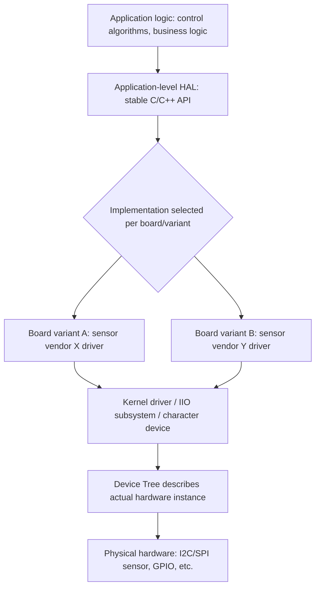
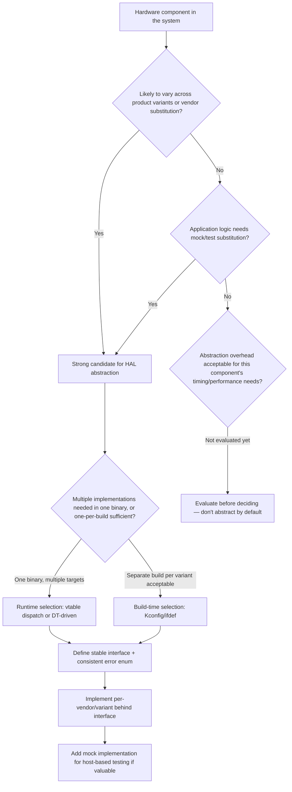

## Hardware Abstraction Layer Design

### Overview

A hardware abstraction layer (HAL) is a software boundary that isolates application or higher-level system logic from the specific details of the underlying hardware — chip register maps, bus protocols, timing quirks — so that code above the boundary can be written once and reused across different hardware revisions, SoC variants, or even entirely different vendor platforms. On embedded Linux, HAL design decisions determine how much rework a product needs when a component is respun, a supplier changes, or a product line adds a new hardware variant, making HAL architecture one of the highest-leverage design decisions in a multi-generation embedded product.

### Why a HAL Matters

Without a deliberate abstraction boundary, application code accumulates direct hardware dependencies — a sensor read function that calls `i2c_smbus_read_byte_data()` directly, with the specific I2C address and register map hardcoded inline, scattered across the codebase. This works until:

- The same product needs to support two different sensor vendors for supply-chain flexibility, and both sensors measure the same physical quantity but have completely different register layouts.
- A hardware revision moves a peripheral from I2C to SPI, or changes its address.
- The same application logic needs to run on both the target hardware and a development/simulation environment without real hardware present.
- Multiple product variants share application logic but differ in which physical sensors/actuators are populated.

A HAL addresses this by defining a **stable interface** (function signatures, data types, semantics) that application code depends on, with hardware-specific implementations behind that interface swapped out per board/variant without touching application code.

### HAL Layering in the Broader System

It's important to distinguish where a "HAL" sits relative to kernel-level abstractions already discussed, since the kernel driver model and Device Tree already provide significant hardware abstraction — a userspace/application-level HAL is typically an additional layer above these, not a replacement for them.



The kernel's own driver model (Device Tree, subsystem frameworks like IIO/gpiod) already abstracts *bus and register-level* detail from kernel drivers. An application-level HAL abstracts a further layer up: differences between which *sensor/actuator/subsystem* is present at all, and how the application should semantically interpret and control it, independent of which specific kernel interface (character device path, sysfs node, IIO channel) exposes it on a given board.

### Designing a HAL Interface

**Principle: interface stability over implementation convenience.** The HAL's public interface should be designed around the *semantic operation* the application needs ("read ambient temperature in millidegrees Celsius"), not around the mechanics of any particular current implementation ("read register 0x05 over I2C and apply this specific calibration formula") — implementation details belong entirely behind the interface, never leaking into its signature or semantics.

**Example: a minimal temperature sensor HAL**

```c
// hal_temp_sensor.h — stable interface, no vendor/bus detail
typedef struct hal_temp_sensor hal_temp_sensor_t;

int hal_temp_sensor_init(hal_temp_sensor_t **handle);
int hal_temp_sensor_read_millidegrees(hal_temp_sensor_t *handle, int32_t *out_mdeg);
void hal_temp_sensor_deinit(hal_temp_sensor_t *handle);
```

```c
// hal_temp_sensor_vendorX.c — implementation for one sensor
int hal_temp_sensor_init(hal_temp_sensor_t **handle) {
    // open /dev/iio:deviceN or i2c-dev path, vendor-specific setup
}

int hal_temp_sensor_read_millidegrees(hal_temp_sensor_t *handle, int32_t *out_mdeg) {
    int32_t raw = /* vendor-specific register read */;
    *out_mdeg = vendor_x_convert_to_millidegrees(raw);  // vendor-specific calibration
    return 0;
}
```

```c
// hal_temp_sensor_vendorY.c — different sensor, same interface
int hal_temp_sensor_read_millidegrees(hal_temp_sensor_t *handle, int32_t *out_mdeg) {
    uint16_t raw = /* completely different register layout, different bus even */;
    *out_mdeg = vendor_y_convert_to_millidegrees(raw);  // different calibration formula
    return 0;
}
```

Application code calling `hal_temp_sensor_read_millidegrees()` is entirely unaware of which vendor's sensor, which bus, or which calibration formula is behind the call — swapping vendors means swapping the linked implementation object, not touching application logic.

### Implementation Selection Mechanisms

| Mechanism | How It Works | Tradeoffs |
| --- | --- | --- |
| Build-time selection (Kconfig/CMake option, `#ifdef`) | Only one implementation is compiled into the binary at all, chosen per board build target | Smallest binary, zero runtime overhead, but requires a separate build per board variant |
| Runtime detection + function pointer dispatch | Single binary probes hardware (or reads a board-ID mechanism) at startup and selects the appropriate implementation via a vtable/function-pointer struct | One binary supports multiple boards, at the cost of slightly more complex initialization and marginal runtime dispatch overhead |
| Device Tree-driven selection | HAL layer reads board compatible string or a custom DT property to determine which implementation to instantiate | Reuses the same hardware-description mechanism the kernel already uses, keeping hardware description centralized in one place |
| Plugin/shared-library loading | Implementation compiled as a separate `.so`, loaded dynamically based on runtime detection | Maximum flexibility (can update HAL implementation independent of main application binary) but adds dynamic loading complexity and a larger attack/failure surface |

**Function-pointer vtable pattern (runtime selection):**

```c
typedef struct {
    int (*init)(void **handle);
    int (*read_millidegrees)(void *handle, int32_t *out);
    void (*deinit)(void *handle);
} temp_sensor_ops_t;

static const temp_sensor_ops_t vendor_x_ops = {
    .init = vendor_x_init,
    .read_millidegrees = vendor_x_read,
    .deinit = vendor_x_deinit,
};

static const temp_sensor_ops_t vendor_y_ops = {
    .init = vendor_y_init,
    .read_millidegrees = vendor_y_read,
    .deinit = vendor_y_deinit,
};

const temp_sensor_ops_t *select_temp_sensor_impl(const char *board_variant) {
    if (strcmp(board_variant, "variant-a") == 0) return &vendor_x_ops;
    if (strcmp(board_variant, "variant-b") == 0) return &vendor_y_ops;
    return NULL;
}
```

### HAL Design for Testability

A well-designed HAL boundary is also the natural seam for substituting a **mock/simulated implementation** during development or automated testing, allowing application logic to be exercised without real hardware present — this is often as valuable as the multi-vendor-hardware benefit, particularly for CI pipelines that can't practically have physical target hardware attached to every build agent.

```c
// hal_temp_sensor_mock.c — for host-based unit testing
static int32_t mock_value = 25000;  // 25.000 C default

int hal_temp_sensor_read_millidegrees(hal_temp_sensor_t *handle, int32_t *out_mdeg) {
    *out_mdeg = mock_value;
    return 0;
}

void mock_set_temp_millidegrees(int32_t val) { mock_value = val; }  // test-only control hook
```

Application logic that only calls the stable HAL interface can be unit-tested on a development host, with test cases injecting specific mock sensor values to exercise edge-case handling (out-of-range readings, sensor failure return codes) that would be difficult or slow to reproduce reliably against real hardware.

### Error Handling and Semantic Consistency Across Implementations

A subtle but important HAL design requirement: different underlying hardware/drivers often fail in different ways (I2C NACK, SPI timeout, a kernel driver returning `-ENODEV`), but the HAL should translate these into a **consistent, hardware-independent error semantic** that application code can handle uniformly, rather than leaking bus-specific or vendor-specific error codes up through the abstraction boundary.

```c
typedef enum {
    HAL_OK = 0,
    HAL_ERR_NOT_PRESENT,     // sensor not detected/responding
    HAL_ERR_COMM_FAILURE,    // bus-level communication error
    HAL_ERR_OUT_OF_RANGE,    // reading outside plausible physical range
    HAL_ERR_NOT_INITIALIZED,
} hal_status_t;
```

Each vendor-specific implementation is responsible for mapping its own failure modes (I2C error codes, SPI status registers, IIO sysfs error strings) onto this shared enum, so application-level error handling logic is written once against `hal_status_t`, not once per vendor implementation.

### HAL Scope: What to Abstract and What Not To

Over-abstracting is a real risk — a HAL layer covering functionality that will genuinely never vary across the product's hardware variants adds indirection and complexity without corresponding benefit. Reasonable scoping questions:

- **Will this hardware component plausibly change across product variants, hardware revisions, or supplier substitutions?** If yes, it's a strong HAL candidate. If a component is architecturally fixed for the product's lifetime (e.g., a SoC-internal peripheral with no alternative), abstracting it may add cost without benefit.
- **Does application logic need to be testable without this hardware present?** Testability alone can justify a HAL boundary even for hardware unlikely to change vendors, if mock substitution meaningfully improves test coverage or CI practicality.
- **Is the abstraction cost (indirection, potential performance overhead, added code) proportionate to the flexibility gained?** A vtable-dispatch HAL over a nanosecond-timing-critical bit-banged protocol may introduce overhead that matters; a HAL over a sensor read at 1 Hz almost certainly doesn't.

### HAL Design Decision Flow



### Common Pitfalls

- **Leaking implementation details through the interface** — a HAL function that returns a vendor-specific raw register value, or takes a vendor-specific configuration struct as a parameter, isn't actually abstracting anything; the true test of a HAL boundary is whether an implementation can be swapped without changing the interface's signature or semantics.
- **Over-abstracting stable, unlikely-to-change hardware** — adding a full vtable-dispatch HAL layer over a SoC-internal peripheral with no plausible alternative implementation adds indirection and cognitive overhead without corresponding flexibility benefit.
- **Inconsistent error semantics across implementations** — if one vendor implementation returns a bus-specific error code while another returns a generic failure, application code can't handle errors uniformly, defeating a key purpose of the abstraction.
- **Designing the interface around the first implementation's convenience rather than the actual semantic need** — a HAL interface shaped too closely around one specific sensor's quirks (e.g., its particular fixed-point scaling factor) can prove awkward or lossy when a second vendor's sensor with different native precision/range is added later.
- **Neglecting mock implementation investment until testing pain forces it** — retrofitting testability onto a HAL designed without it in mind is more disruptive than designing the interface with a mock implementation in mind from the start, even if the mock isn't written until later.

### Key Points

- A HAL's core value is a stable interface that decouples application logic from hardware/vendor/bus specifics, enabling vendor substitution, hardware revision changes, and mock-based testing without touching application code.
- Application-level HALs sit above kernel-level abstractions (driver model, Device Tree, subsystem frameworks) rather than replacing them — the kernel already abstracts bus/register detail; the HAL abstracts a further semantic layer above that.
- Implementation selection can happen at build time (smallest footprint, per-variant builds) or runtime (single binary, vtable/DT-driven dispatch, more flexible but with added complexity) depending on product deployment needs.
- Consistent, hardware-independent error semantics across all implementations behind a HAL interface are necessary for application code to handle failures uniformly — leaking vendor-specific error codes undermines the abstraction.
- HAL scope should be deliberate, not reflexive — components unlikely to vary across the product's lifetime may not justify abstraction overhead, while testability needs can justify a HAL boundary even for hardware unlikely to change vendors.

### Related Topics

- IIO subsystem as a kernel-level hardware abstraction for sensors and its relationship to application-level HALs
- Dependency injection patterns in embedded C/C++ for testable application architecture
- Board variant detection mechanisms (Device Tree compatible strings, GPIO-based board ID straps, EEPROM-stored identifiers)
- Continuous integration strategies for embedded software using mock hardware layers
- Fixed-point vs. floating-point representation choices in HAL interface design for resource-constrained targets
- Vendor sensor/actuator qualification and second-source strategy in embedded product design
- C++ abstract base class vs. C function-pointer vtable tradeoffs for HAL implementation
- Real-time performance considerations when introducing abstraction layers over timing-critical peripherals