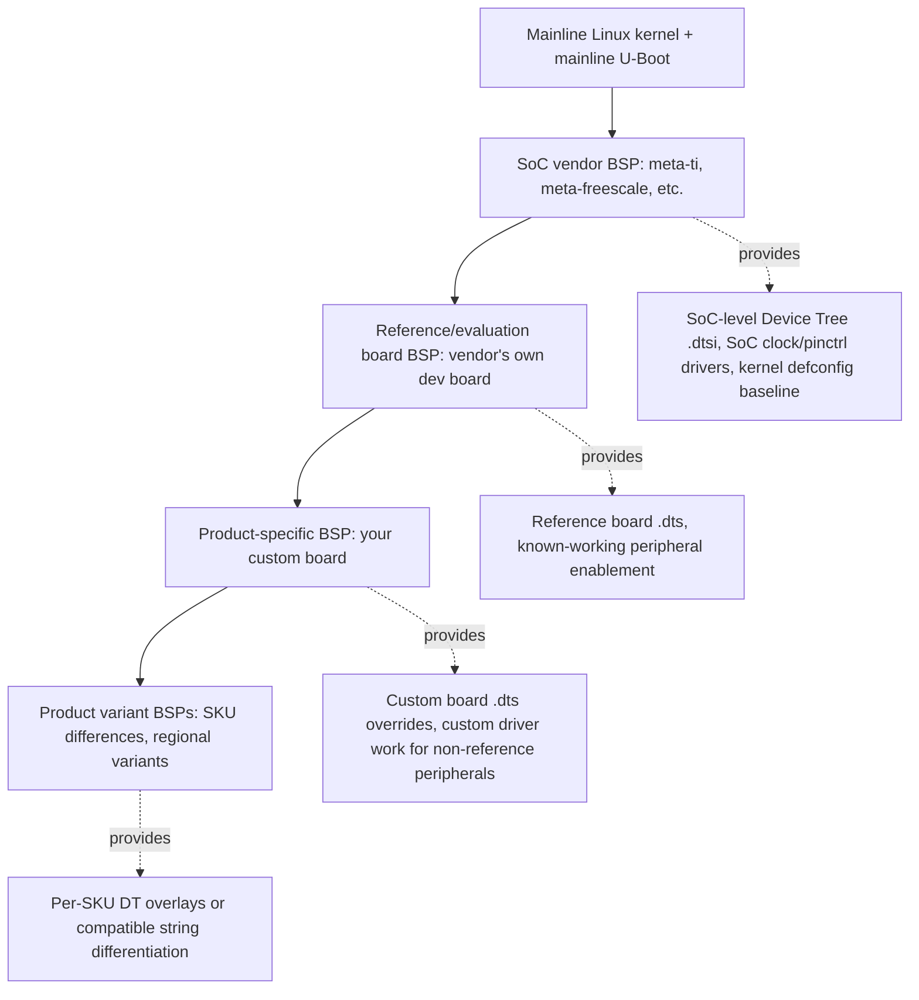
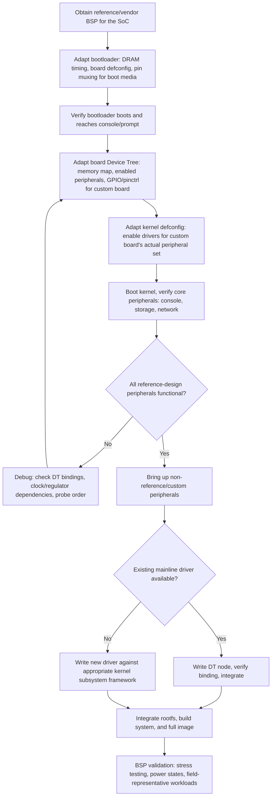

## Board Support Packages

### Overview

A Board Support Package (BSP) is the collection of software artifacts — bootloader configuration, kernel configuration and patches, Device Tree sources, and driver code — required to bring a specific hardware board to a functioning state running an embedded OS. A BSP is not a single file or component; it's the integration glue binding together bootloader, kernel, and board-specific hardware description into a working, reproducible combination for one particular piece of hardware. Understanding BSP structure and lifecycle is central to embedded Linux work because nearly every board bring-up, hardware revision, or new-product effort starts by either building a BSP from scratch or adapting an existing one.

### What a BSP Actually Contains

| Component | Role |
| --- | --- |
| Bootloader config + board files | U-Boot `defconfig`, board-specific C files, DRAM timing parameters — everything covered under bootloader board bring-up |
| Kernel `defconfig` | Board/SoC-appropriate kernel configuration selecting relevant drivers and subsystems |
| Kernel patches (if any) | Out-of-tree or not-yet-upstreamed driver code, vendor fixes, or board-specific kernel modifications not (yet) in mainline |
| Device Tree source(s) | `.dts`/`.dtsi` files describing the specific board's hardware — often the single largest board-specific artifact set |
| Vendor firmware blobs | Proprietary DRAM-init blobs, GPU firmware, Wi-Fi/Bluetooth firmware images required for full functionality but not distributable as source |
| Build system integration | Yocto `meta-<vendor>` layer or Buildroot `br2-external` tree tying the above into a reproducible build |
| Board documentation | Pinout references, schematic excerpts, known erratas, bring-up notes — often the most valuable but most frequently neglected artifact |

### BSP Layering: Vendor, Reference, and Product

BSPs typically exist in a layered lineage, each layer adding or overriding specifics for a narrower scope:



The practical implication of this layering: most product BSP work is **not** writing drivers or kernel code from scratch — it's *adapting* the vendor/reference layer to a custom board's specific peripheral set, GPIO assignments, and any non-reference hardware the product adds. The proportion of genuinely new driver work versus adaptation work depends heavily on how closely the product board follows the vendor's reference design.

### Vendor BSPs vs. Mainline: A Persistent Tension

SoC vendors commonly ship their own kernel forks and U-Boot forks — often based on an older mainline version with vendor-specific patches layered in — rather than working entirely through upstream mainline contribution. This creates a recurring architectural decision for any BSP project:

| Approach | Advantages | Disadvantages |
| --- | --- | --- |
| Vendor BSP (vendor kernel fork, vendor U-Boot fork) | Immediate hardware support, vendor may have already solved bring-up issues, vendor support channel available | Often based on an older kernel version, may carry non-upstream patches complicating future updates, potential long-term maintenance burden if vendor abandons the fork |
| Mainline-first | Long-term maintainability, security patch access from upstream, no vendor lock-in on kernel version | May lack support for newer/less common peripherals not yet upstreamed, potentially more bring-up work if mainline support for the specific SoC/board is incomplete |
| Hybrid (mainline base + selectively backported vendor patches) | Balances currency with hardware support completeness | Requires ongoing patch maintenance/rebasing effort, patches can bit-rot as mainline evolves |

This choice is highly product-dependent: a product needing long field support lifetime and regular security patching benefits from mainline proximity, while a product with a short lifecycle or using very new/niche silicon may have no practical alternative to the vendor fork, at least initially. [Inference: framed as a general, well-established tradeoff in embedded Linux practice rather than tied to a single documented case; the specific balance point depends on the SoC, vendor's upstreaming track record, and product requirements.]

### BSP Bring-Up Sequence

A new board bring-up (assuming a related reference design exists to start from) typically proceeds through a recognizable sequence:



### Device Tree's Central Role in BSP Adaptation

Because most BSP adaptation work for a product board derived from a reference design centers on Device Tree changes (rather than new driver code), understanding the reference `.dtsi`/`.dts` structure deeply is often more valuable early in a bring-up effort than deep driver-writing skill — most of what changes between "vendor reference board" and "our product board" is *which* SoC peripherals are wired out and to what, which is exactly what Device Tree describes, not what requires new kernel code.

**Typical board-specific DT adaptation pattern:**

```dts
// product-board.dts
/dts-v1/;
#include "soc-vendor.dtsi"        // SoC-level definitions, unchanged
#include "reference-board.dtsi"   // Reference board baseline, mostly unchanged

/ {
    model = "Product Board v1";
    compatible = "vendor,product-board", "vendor,reference-board", "vendor,soc";
};

&i2c1 {
    // Reference board didn't populate this sensor; our board does
    status = "okay";
    temp_sensor: temp@48 {
        compatible = "ti,tmp102";
        reg = <0x48>;
    };
};

&uart2 {
    // Reference board used uart2 for debug console; our board repurposes it
    status = "disabled";
};
```

This pattern — including the vendor and reference `.dtsi` largely unchanged, then overriding/adding only what genuinely differs — is the standard approach precisely because it minimizes divergence from the well-tested reference baseline, concentrating actual product-specific risk into a smaller, more reviewable diff.

### Firmware Blobs and Licensing Considerations

Many BSPs include closed-source firmware blobs (GPU microcode, Wi-Fi/Bluetooth firmware, DRAM-init binaries) that cannot be distributed under the same terms as the rest of a typically GPL-licensed kernel/bootloader BSP. This has practical build-system and compliance implications:

- **`linux-firmware` package/layer separation** — firmware blobs are typically packaged separately from kernel source specifically because their licensing terms differ (often redistributable but not modifiable/relicensable), and build systems (Yocto's `linux-firmware` recipe, Buildroot's firmware packages) handle this separation deliberately rather than bundling blobs directly into kernel source trees.
- **Export control considerations** — some firmware (particularly certain cryptographic or RF-related blobs) can be subject to export control regulations affecting redistribution, a compliance dimension that BSP integration work should account for rather than assume away. [Unverified: applicability is jurisdiction- and component-specific; treat as a flag to check against current regulations for the specific firmware and target markets involved, not a general rule.]
- **Reproducibility despite closed blobs** — even when a blob's internals can't be inspected/modified, pinning the exact blob version/hash used in a given BSP release is still necessary for build reproducibility and field support, the same as any other BSP component.

### BSP Maintenance Over a Product's Lifecycle

A BSP is not a one-time deliverable — it typically requires ongoing maintenance across a product's field lifetime:

- **Security patching** — kernel and bootloader CVEs affecting components in the BSP need a defined update path, which is substantially easier if the BSP stays reasonably close to actively maintained upstream/vendor branches rather than diverging into an unmaintained fork.
- **Hardware revision support** — a mid-life hardware revision (component substitution, PCB respin) typically requires BSP changes (new/modified DT nodes, possibly new driver work) that need to coexist with support for earlier hardware revisions still in the field, often handled via board-ID detection selecting the correct DT/config at runtime or build time.
- **Kernel/toolchain version currency** — staying on a BSP's original kernel/toolchain version indefinitely accumulates technical debt and eventually loses vendor/community support entirely; periodic BSP rebasing to newer upstream versions is a recurring, non-trivial maintenance task that's easy to underinvest in during initial product development timelines.

### Common Pitfalls

- **Treating a vendor's reference BSP as production-ready without validation** — reference BSPs are typically validated against the vendor's own evaluation board under vendor test conditions, not against a specific product's actual enclosure, power supply, thermal environment, or peripheral combination; assuming reference-board stability transfers directly to a product board skips necessary validation.
- **Diverging too far from the reference `.dtsi`/kernel baseline without tracking why** — accumulating undocumented board-specific patches/overrides over time, without clear rationale tied to actual hardware differences, makes future BSP rebasing (to a newer kernel or vendor BSP release) significantly harder to reconcile.
- **Underestimating firmware blob licensing/compliance obligations** — assuming all BSP content can be freely redistributed/modified without checking individual component licenses (kernel GPL vs. firmware blob's typically more restrictive terms) risks compliance issues at product shipment.
- **No defined plan for BSP security patching over the field lifetime** — building a BSP once and never revisiting it leaves fielded products running kernels/bootloaders with accumulating known vulnerabilities; this is a business/process gap as much as a technical one, and needs conscious planning during initial product architecture, not as an afterthought.
- **Board-ID/hardware-revision handling bolted on late** — adding support for a second hardware revision without having planned any board-ID detection mechanism from the start often forces awkward retrofitting (e.g., detecting revision via an unrelated peripheral's presence/absence) rather than a clean, purpose-built detection mechanism.

### Key Points

- A BSP is the integrated combination of bootloader, kernel configuration/patches, Device Tree, firmware blobs, and build system glue needed to bring a specific board to a working state — not any single artifact.
- BSPs typically layer from SoC vendor → reference board → product board → product variants, with most product-specific bring-up work being adaptation (primarily Device Tree changes) of an existing layer rather than ground-up development.
- The vendor-fork-vs-mainline tradeoff is a recurring, product-dependent architectural decision affecting long-term maintainability, security patch access, and initial hardware support completeness.
- Firmware blob licensing differs from the typically GPL-licensed kernel/bootloader components and requires deliberate build-system separation and compliance awareness.
- BSP maintenance — security patching, hardware revision support, periodic rebasing — is an ongoing lifecycle responsibility, not a one-time deliverable, and underinvesting in this planning is a common and costly gap in embedded product development.

### Related Topics

- Device Tree overlay and board-ID detection strategies for multi-revision hardware support
- Yocto meta-layer structuring for vendor, reference, and product-specific BSP layers
- Kernel rebasing strategies when updating a vendor-forked BSP to a newer upstream version
- linux-firmware packaging and firmware blob version pinning practices
- Security patch management and CVE tracking for embedded Linux BSPs
- U-Boot and kernel board bring-up debugging techniques (early console, JTAG)
- Open source license compliance for mixed GPL/proprietary embedded BSP components
- Long-term support (LTS) kernel branch selection strategy for product BSPs