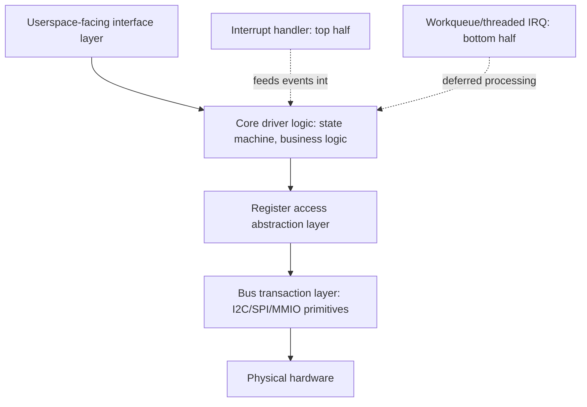

## Peripheral Driver Architecture

### Overview

Peripheral driver architecture is the study of *how to structure* a driver internally — separating concerns like register access, bus transaction handling, interrupt processing, and userspace-facing interface — so that the resulting code is correct under concurrency, maintainable across hardware revisions, and ideally acceptable for mainline inclusion. This builds directly on the driver model and bus framework concepts covered earlier: where those establish *how a driver gets matched and probed*, this topic addresses *how a well-structured driver is organized internally* once probe has succeeded.

### Layered Driver Structure

A well-architected peripheral driver typically separates into distinct layers, each with a narrow responsibility, rather than one monolithic file mixing register access, business logic, and userspace ABI handling:



- **Userspace-facing interface layer** — `file_operations`, IIO channel definitions, sysfs attribute groups, or `net_device_ops`, depending on driver category. This layer translates external requests into internal core logic calls and should contain minimal hardware-specific logic itself.
- **Core driver logic** — the actual behavior: what a "read sensor" operation means, what state transitions are valid, timeout/retry policy. This layer should be largely independent of *which specific bus* the hardware sits on.
- **Register access abstraction** — commonly implemented via the kernel's **regmap** framework, which provides a unified `regmap_read()`/`regmap_write()` API regardless of whether the underlying transport is I2C, SPI, or direct MMIO, letting the same core driver logic support a chip available in multiple bus variants without duplicating register logic per bus.
- **Bus transaction layer** — the lowest level, handling actual I2C/SPI/MMIO transactions, typically supplied by the kernel's existing bus frameworks (`i2c_transfer()`, `spi_sync()`) or by regmap's bus-specific backends, rather than hand-rolled by driver authors.

### The regmap Framework in Practice

regmap's value is concentrated in chips that ship in multiple bus variants (a common pattern for sensor and PMIC ICs, which are frequently offered in both I2C and SPI versions of the same silicon) — without regmap, supporting both variants would mean either duplicating all register-level logic per bus, or writing awkward bus-abstraction code from scratch that regmap already provides as shared, well-tested infrastructure.

```c
static const struct regmap_config foo_regmap_config = {
    .reg_bits = 8,
    .val_bits = 8,
    .max_register = 0xFF,
    .cache_type = REGCACHE_RBTREE,  // caches register values to avoid redundant bus reads
};

static int foo_i2c_probe(struct i2c_client *client) {
    struct regmap *regmap = devm_regmap_init_i2c(client, &foo_regmap_config);
    return foo_probe_common(&client->dev, regmap);  // shared core logic, bus-agnostic
}

static int foo_spi_probe(struct spi_device *spi) {
    struct regmap *regmap = devm_regmap_init_spi(spi, &foo_regmap_config);
    return foo_probe_common(&spi->dev, regmap);  // same core logic, different bus
}
```

`foo_probe_common()` — the actual driver logic — is written once against the `regmap` abstraction and works identically regardless of whether it was initialized via I2C or SPI, which is the core architectural payoff: bus-specific code is confined to two small `probe()` wrapper functions.

### Interrupt Handling: Top Half and Bottom Half

Peripheral drivers handling interrupt-driven hardware (rather than pure polling) need a deliberate split between fast, minimal top-half processing and slower bottom-half processing, because interrupt context has severe constraints — it cannot sleep, must complete quickly, and runs with certain kernel facilities unavailable.

| Mechanism | Runs In | Can Sleep? | Typical Use |
| --- | --- | --- | --- |
| Hard IRQ handler (top half) | Interrupt context | No | Acknowledge the interrupt at hardware level, read minimal status, wake up bottom half |
| Threaded IRQ (bottom half) | Kernel thread context | Yes | Perform actual bus transactions (I2C/SPI reads take time and can sleep), process data, update driver state |
| Workqueue | Kernel thread context (deferred) | Yes | Similar to threaded IRQ but decoupled from the IRQ itself — useful when work needs to be scheduled from multiple trigger sources, not just the interrupt |
| Tasklet | Softirq context | No | Legacy mechanism, largely superseded by threaded IRQs for most peripheral driver use cases in modern kernel code |

**Threaded IRQ registration (the modern standard pattern for most peripheral drivers):**

```c
static irqreturn_t foo_irq_handler(int irq, void *data) {
    // Minimal: acknowledge at hardware level if needed, return WAKE_THREAD
    return IRQ_WAKE_THREAD;
}

static irqreturn_t foo_irq_thread(int irq, void *data) {
    struct foo_data *foo = data;
    int val;
    regmap_read(foo->regmap, FOO_STATUS_REG, &val);  // I2C/SPI read, can sleep here
    // process val, update driver state, wake any waiting readers
    return IRQ_HANDLED;
}

devm_request_threaded_irq(dev, irq, foo_irq_handler, foo_irq_thread,
                           IRQF_ONESHOT, "foo-irq", foo);
```

**Why this split matters practically:** most I2C/SPI transactions inherently sleep (bus transfers aren't instantaneous, and the kernel doesn't busy-wait for them), so a driver needing to read a status register in response to an interrupt *cannot* do that read directly in a hard IRQ handler — it must defer to a threaded handler or workqueue where sleeping is permitted. Getting this wrong (attempting a sleeping bus operation in hard IRQ context) triggers kernel warnings/crashes (`BUG: scheduling while atomic` class errors) rather than silently working, making it a common but loudly-surfaced bring-up bug rather than a subtle one.

### Locking and Concurrency

Peripheral drivers commonly need to protect shared state accessed from multiple contexts (userspace syscalls, interrupt threads, workqueues), and choosing the right locking primitive for each context matters:

| Primitive | Sleeps While Held? | Usable in Interrupt Context? | Typical Use |
| --- | --- | --- | --- |
| `mutex` | Yes (contended acquisition sleeps) | No | Protecting state accessed only from process/thread context (e.g., syscall handlers, threaded IRQ) |
| `spinlock` | No (busy-waits) | Yes (with `_irqsave` variant) | Protecting state accessed from actual hard IRQ context, or very short critical sections where sleeping would be inappropriate |
| `completion` | N/A (signaling primitive, not a lock) | Signal from IRQ context, wait from process context | Waiting for an asynchronous hardware event (e.g., "wait until DMA transfer completes") without busy-polling |
| RCU (read-copy-update) | N/A (specialized pattern) | Read-side usable in atomic context | High-read, infrequent-write shared data structures; less commonly needed in typical peripheral drivers but relevant for some subsystem-level code |

**Common pattern: mutex for device state, spinlock only where hard-IRQ access is genuinely required.** Many peripheral drivers can avoid spinlocks entirely if all shared-state access happens from process/thread context (syscalls and threaded IRQ handlers), reserving spinlocks specifically for the rare case where a hard IRQ handler itself needs to touch shared state — over-applying spinlocks where a mutex would suffice adds unnecessary busy-wait behavior and complexity without correctness benefit.

### Power Management Integration

Well-architected peripheral drivers integrate with the kernel's runtime power management framework rather than assuming the device is always fully powered, which matters significantly for battery-powered or thermally-constrained embedded products:

```c
static int foo_runtime_suspend(struct device *dev) {
    struct foo_data *foo = dev_get_drvdata(dev);
    regmap_write(foo->regmap, FOO_POWER_REG, FOO_POWER_DOWN);
    return 0;
}

static int foo_runtime_resume(struct device *dev) {
    struct foo_data *foo = dev_get_drvdata(dev);
    regmap_write(foo->regmap, FOO_POWER_REG, FOO_POWER_UP);
    return 0;
}

static const struct dev_pm_ops foo_pm_ops = {
    SET_RUNTIME_PM_OPS(foo_runtime_suspend, foo_runtime_resume, NULL)
};
```

Runtime PM lets the kernel automatically suspend a peripheral (cut its clock/power) when unused and resume it transparently on the next access, driven by reference counting (`pm_runtime_get_sync()`/`pm_runtime_put()`) rather than requiring every caller to manually manage device power state — this is architecturally significant because it decouples power management policy from individual call sites throughout the driver.

### Driver Data Organization

A common architectural pattern is a single private data structure per device instance, allocated during probe and attached to the `struct device` for retrieval throughout the driver's lifetime, rather than relying on global/static variables (which break with multiple device instances and complicate testing):

```c
struct foo_data {
    struct regmap *regmap;
    struct mutex lock;
    struct gpio_desc *reset_gpio;
    struct clk *clk;
    int irq;
    // driver-specific state
};

static int foo_probe(struct i2c_client *client) {
    struct foo_data *foo = devm_kzalloc(&client->dev, sizeof(*foo), GFP_KERNEL);
    foo->regmap = devm_regmap_init_i2c(client, &foo_regmap_config);
    mutex_init(&foo->lock);
    i2c_set_clientdata(client, foo);
    return 0;
}
```

**`devm_*` managed resource allocation** — functions prefixed `devm_` (device-managed) automatically free/release their resource when the device is unbound (on `remove()` or probe failure), eliminating an entire category of manual cleanup bugs (forgetting to free memory or release a GPIO on error paths) that plague drivers using raw `kmalloc`/`gpio_request` without corresponding careful manual cleanup in every error path.

### Common Pitfalls

- **Sleeping bus operations in hard IRQ context** — attempting an I2C/SPI register read directly in a non-threaded hard IRQ handler triggers atomic-context violations; the fix is always to defer actual bus transactions to a threaded IRQ handler or workqueue.
- **Mixing manual `kmalloc`/`kfree` with `devm_*` allocations inconsistently** — partially adopting managed resources while still manually managing others reintroduces the exact cleanup-on-error-path bugs `devm_*` exists to eliminate; consistency within a driver matters.
- **Over-applying spinlocks where a mutex would suffice** — using spinlocks for state only ever accessed from sleepable (process/thread) context adds unnecessary busy-wait overhead and forecloses future sleeping operations (like bus transactions) from ever being added to that critical section without a rewrite.
- **Skipping runtime PM integration under the assumption power doesn't matter** — even for mains-powered embedded products, foregoing runtime PM can leave unnecessary clocks/peripherals active, contributing to thermal load and (for battery-backed or battery-powered variants of a product line) meaningfully reduced battery life.
- **Duplicating register-access logic per bus variant instead of using regmap** — hand-rolling separate I2C and SPI register access code paths for a chip available in both variants, rather than using regmap's shared abstraction, duplicates logic and duplicates the maintenance/bug-fixing burden across both copies.

### Key Points

- Well-structured peripheral drivers separate userspace interface, core logic, register access, and bus transaction concerns into distinct layers, with regmap commonly providing the register-access abstraction layer for chips supporting multiple bus variants.
- Interrupt handling requires a deliberate top-half (fast, non-sleeping, interrupt context) / bottom-half (threaded IRQ or workqueue, sleep-capable) split, because most real bus transactions (I2C/SPI) inherently sleep and cannot run in hard IRQ context.
- Locking primitive choice (mutex vs. spinlock) should match the actual execution context of the code being protected — many drivers can avoid spinlocks entirely if all shared-state access occurs from sleepable contexts.
- Runtime power management integration (`dev_pm_ops`, `pm_runtime_get_sync`/`put`) decouples power policy from call sites and matters for thermal and battery-life reasons even beyond obviously battery-powered products.
- `devm_*` managed resource allocation eliminates a significant class of cleanup-on-error-path bugs by tying resource lifetime automatically to device binding/unbinding, and should be used consistently rather than mixed with manual allocation within the same driver.

### Related Topics

- regmap framework internals: caching strategies, bus-specific backends, register range definitions
- Threaded IRQ and workqueue design patterns for high-frequency interrupt sources
- Linux runtime power management framework and autosuspend tuning
- Kernel locking primitives in depth: RCU, seqlocks, and lock-free patterns for high-performance drivers
- Writing regmap-based drivers supporting both I2C and SPI variants of the same chip
- Kernel DMA API integration for high-throughput peripheral data transfer
- Mainline kernel driver submission process and common review feedback patterns
- Debugging atomic-context violations and kernel scheduling-while-atomic bugs