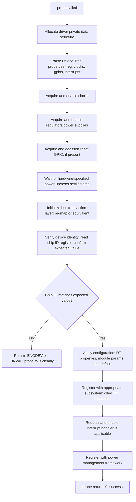
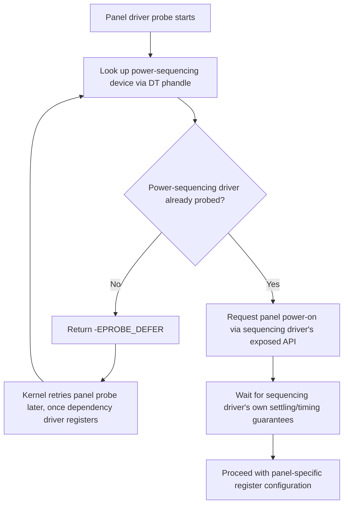

## Driver Initialization and Configuration Patterns

### Overview

Driver initialization is the sequence of operations a peripheral driver performs during `probe()` to bring hardware from an unconfigured, powered-off, or unknown state into a fully functional, ready-to-use state — and configuration patterns describe how that process obtains the parameters it needs (Device Tree properties, module parameters, runtime defaults) to do so correctly for the specific device instance it's binding to. Getting initialization ordering and configuration source precedence wrong is one of the most common classes of embedded driver bugs, often manifesting as intermittent failures that depend on boot timing or DT parsing order rather than obviously broken logic.

### The Canonical Initialization Sequence

While every driver's specifics differ, a well-structured `probe()` function typically follows a recognizable ordering, because dependencies between these steps are largely fixed by hardware reality — you cannot configure a register over a bus that isn't clocked, and you cannot safely touch a chip still held in reset:



This ordering exists because each step generally depends on the previous one having succeeded: a chip ID read is meaningless before the bus is clocked and the chip is out of reset; interrupt registration is premature before the device is fully configured and ready to generate meaningful interrupts; power management registration should happen only once the device's baseline operational state is established.

### Clock, Regulator, and Reset Sequencing

Many peripheral bring-up bugs trace back to getting the clock/power/reset sequence wrong, since real silicon frequently has genuine timing requirements (minimum settling times, specific power-up ordering between multiple supply rails) that software must respect rather than assume away.

```c
static int foo_probe(struct i2c_client *client) {
    struct foo_data *foo;
    int ret;

    foo = devm_kzalloc(&client->dev, sizeof(*foo), GFP_KERNEL);
    if (!foo)
        return -ENOMEM;

    foo->clk = devm_clk_get(&client->dev, "foo_clk");
    if (IS_ERR(foo->clk))
        return PTR_ERR(foo->clk);
    ret = clk_prepare_enable(foo->clk);
    if (ret)
        return ret;

    foo->vdd = devm_regulator_get(&client->dev, "vdd");
    if (IS_ERR(foo->vdd)) {
        ret = PTR_ERR(foo->vdd);
        goto err_clk;
    }
    ret = regulator_enable(foo->vdd);
    if (ret)
        goto err_clk;

    foo->reset_gpio = devm_gpiod_get(&client->dev, "reset", GPIOD_OUT_HIGH);
    if (IS_ERR(foo->reset_gpio)) {
        ret = PTR_ERR(foo->reset_gpio);
        goto err_regulator;
    }
    usleep_range(1000, 2000);           // hold in reset briefly
    gpiod_set_value_cansleep(foo->reset_gpio, 0);  // deassert reset
    usleep_range(5000, 10000);          // datasheet-specified settling time

    // ... continue to bus init, chip ID verification ...
    return 0;

err_regulator:
    regulator_disable(foo->vdd);
err_clk:
    clk_disable_unprepare(foo->clk);
    return ret;
}
```

**Why explicit error-path cleanup (`goto` chains) still appears alongside `devm_*` usage:** `devm_gpiod_get()`/`devm_regulator_get()` manage the *acquisition* lifetime (freed automatically on device unbind), but *enabling* a clock or regulator is a separate runtime state that generally needs explicit disable on an error path within `probe()` itself, since the device hasn't successfully bound yet and devm cleanup on probe failure won't know to call `clk_disable_unprepare()`/`regulator_disable()` unless a devm-wrapped enable variant (e.g., `devm_clk_get_enabled()` in newer kernels) was used instead — driver authors should check which devm variants exist for their target kernel version rather than assume plain `devm_*_get()` implies enabled-state cleanup too.

### Chip Identity Verification

Reading and checking a chip ID/revision register early in probe (before applying any configuration) is a standard defensive pattern serving several purposes:

- **Confirms the bus/address is actually correct** — a wrong I2C address or a DT `reg` typo often still allows the transaction to complete (especially with regmap caching or a floating bus line reading back plausible-looking garbage) without an ID check catching the mismatch.
- **Distinguishes between silicon revisions or chip family variants** — some chip families share a compatible register layout across multiple part numbers, with the ID register indicating which variant is actually present, letting one driver adjust behavior (feature availability, register offsets) per-variant.
- **Fails cleanly and diagnosably** — returning `-ENODEV` from a failed ID check produces a clear, greppable kernel log message, versus a driver that proceeds with a wrong chip and produces confusing garbage sensor readings or silent misbehavior discovered much later.

```c
ret = regmap_read(foo->regmap, FOO_CHIP_ID_REG, &chip_id);
if (ret)
    return ret;
if (chip_id != FOO_EXPECTED_CHIP_ID) {
    dev_err(&client->dev, "unexpected chip id: 0x%02x\n", chip_id);
    return -ENODEV;
}
```

### Configuration Source Precedence

A driver's runtime configuration typically draws from multiple possible sources, and a well-designed driver applies them in a clear, documented precedence order rather than ad hoc/undefined interaction between sources:

| Source | Typical Precedence | Notes |
| --- | --- | --- |
| Hardware-fixed defaults | Lowest (base case) | Sane defaults matching typical/safe operating parameters if nothing else specifies otherwise |
| Compiled-in driver defaults | Low | Driver author's chosen defaults, applied absent any DT/module-param override |
| Device Tree properties | High | The standard mechanism for board-specific configuration in mainline drivers — DT is normally treated as authoritative for board-specific values |
| Module parameters | Variable — often used for debug/development overrides | `module_param()`-declared values, set at `modprobe` time; less common as the primary configuration mechanism in modern mainline drivers, since DT is preferred for board-specific configuration, but still useful for debug/tuning knobs not tied to board hardware description |
| Runtime sysfs/ioctl adjustment | Highest (explicit runtime override) | Explicit user/application runtime changes after the device is already operational |

**Device Tree property parsing pattern:**

```c
u32 sample_rate_hz = FOO_DEFAULT_SAMPLE_RATE;  // compiled-in default
device_property_read_u32(&client->dev, "vendor,sample-rate-hz", &sample_rate_hz);
// sample_rate_hz now reflects DT override if present, default otherwise
```

`device_property_read_u32()` (part of the generic device property API, which works across both Device Tree and ACPI-described devices) returns an error if the property is absent, which idiomatic driver code treats as "use the default already assigned" rather than a fatal condition — optional DT properties should have sensible compiled-in defaults so the driver still functions reasonably on boards whose `.dts` doesn't specify every possible tunable.

### Deferred Probe and Resource Dependency Ordering

Initialization order gets more complex when a driver's required resources (a clock, a regulator, a GPIO controller) are themselves provided by another driver that may not have probed yet — a common situation in Device Tree-described systems where node parsing order doesn't guarantee dependency-satisfying probe order.

```c
foo->clk = devm_clk_get(&client->dev, "foo_clk");
if (IS_ERR(foo->clk)) {
    if (PTR_ERR(foo->clk) == -EPROBE_DEFER)
        return -EPROBE_DEFER;  // resource not ready yet, kernel will retry probe later
    dev_err(&client->dev, "failed to get clock: %ld\n", PTR_ERR(foo->clk));
    return PTR_ERR(foo->clk);
}
```

Idiomatic driver code checks specifically for `-EPROBE_DEFER` and propagates it unchanged (rather than treating it as a generic failure), since the kernel's deferred probe mechanism automatically re-attempts `probe()` later once the dependency becomes available — this is why probe order in boot logs commonly appears "out of order" relative to DT node order, and why a driver stuck permanently deferring, rather than eventually succeeding, usually indicates a genuinely missing or misconfigured dependency rather than expected behavior.

### Initialization Ordering Across Related Devices

Beyond a single driver's internal sequencing, whole-system initialization order between *related* devices (e.g., a display panel driver that must not touch panel registers until its power-sequencing driver has established a stable supply) is coordinated through the same probe/defer mechanism at a system level, plus explicit Device Tree phandle references establishing the dependency relationship (a panel node referencing its power-sequencing node via a phandle property causes the panel driver to naturally depend on and defer until the power-sequencing driver has probed).



### Common Pitfalls

- **Reading/writing registers before confirming the bus is actually clocked and powered** — a bus transaction issued before the relevant clock is enabled can either fail outright or, on some hardware, appear to "succeed" while actually operating on an unclocked/unstable peripheral, producing confusing intermittent bring-up symptoms rather than a clean failure.
- **Skipping or ignoring chip ID verification** — proceeding with configuration despite a mismatched or unread chip ID can mask an underlying wiring, addressing, or Device Tree error, with the actual root cause surfacing later as confusing data-quality symptoms rather than a clear early failure.
- **Treating `-EPROBE_DEFER` as a generic error rather than propagating it correctly** — a driver that doesn't specifically check for and propagate `-EPROBE_DEFER` can either fail permanently when a dependency simply hasn't probed yet, or (worse) silently continue with a NULL/invalid resource pointer if error checking is incomplete.
- **Undocumented or inconsistent configuration source precedence** — a driver that sometimes lets module parameters override DT properties and sometimes doesn't (inconsistently applied precedence across different configuration values within the same driver) creates confusing, hard-to-predict behavior for anyone configuring the device.
- **Missing settling-time delays specified in hardware datasheets** — omitting a required post-reset or post-power-up delay because it "seems to work" during bring-up on one board/temperature/voltage condition, only to fail intermittently in the field under different conditions, is a common source of hard-to-reproduce field failures traceable back to skipped or under-specified timing requirements. [Inference: general, well-documented category of embedded bring-up bug rather than a specific cited incident.]

### Key Points

- Driver initialization ordering (data allocation → DT parsing → clock/power/reset sequencing → bus init → chip ID verification → configuration → subsystem registration → interrupt/PM registration) largely follows fixed hardware dependency ordering, not arbitrary code organization preference.
- Chip ID verification early in probe is a standard defensive pattern catching wiring/addressing/DT errors early and diagnosably, rather than allowing a driver to proceed against genuinely wrong or absent hardware.
- Configuration should draw from a clear precedence order (compiled defaults → Device Tree properties → module parameters/runtime overrides), applied consistently across all of a driver's tunable parameters.
- `-EPROBE_DEFER` must be explicitly checked for and propagated unchanged when a dependency (clock, regulator, GPIO controller, phandle-referenced device) isn't yet available, since the kernel's deferred probe mechanism relies on this to retry probing automatically once the dependency resolves.
- Hardware-specified settling/timing delays (post-reset, post-power-up) are genuine requirements, not defensive padding, and skipping them is a common source of field-only, hard-to-reproduce failures.

### Related Topics

- Common Clock Framework consumer API in depth (clk_get, clk_prepare_enable, clk_round_rate)
- Regulator framework consumer API and voltage/current constraint declaration
- GPIO descriptor (gpiod) consumer API and Device Tree GPIO property conventions
- Device Tree phandle references and cross-device dependency modeling
- Generic device property API (device_property_read_*) for DT/ACPI-portable drivers
- Deferred probe mechanism internals and debugging permanently-deferred drivers
- Kernel error code conventions (ERR_PTR, IS_ERR, PTR_ERR) and idiomatic error propagation
- Writing driver bring-up test/validation checklists for board respins