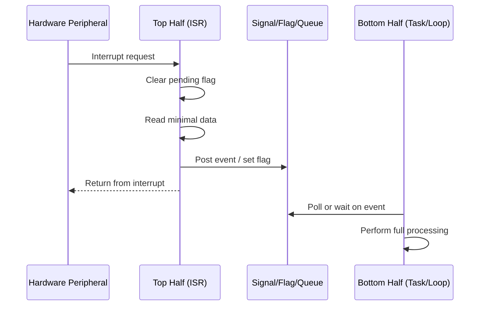

## Interrupt Service Routine Design

### Overview

An interrupt service routine (ISR), also called an interrupt handler, is a special block of code that executes in response to a hardware or software interrupt signal. Interrupts allow a microcontroller to respond to asynchronous events — a UART byte arriving, a timer overflowing, a GPIO edge, a DMA transfer completing — without continuously polling for them. ISR design sits at the core of embedded systems because it directly affects responsiveness, determinism, power consumption, and system stability.

### Interrupt Handling Fundamentals

#### The Interrupt Lifecycle

1. **Event occurs** — a peripheral sets a status flag (e.g., RXNE in a UART, or OVF in a timer).
2. **Request signal raised** — the peripheral asserts an interrupt request (IRQ) line to the interrupt controller (e.g., NVIC on ARM Cortex-M, PLIC on RISC-V).
3. **Arbitration** — the interrupt controller checks priority, masking, and enable bits, then decides whether to forward the request to the core.
4. **Context save** — the core automatically (hardware-assisted on many architectures) or the compiler-generated prologue pushes registers onto the stack.
5. **Vector fetch** — the core reads the interrupt vector table to find the ISR's entry address.
6. **ISR execution** — the handler runs.
7. **Context restore and return** — registers are popped, and execution resumes at the point of interruption.

#### Interrupt Vector Table

The vector table is an array of function pointers (or, on some architectures, jump instructions) indexed by interrupt number. On ARM Cortex-M, it resides at a fixed or relocatable address (`VTOR` register controls relocation) and includes the initial stack pointer and reset handler as the first two entries.

$$\text{VectorTable}[n] = \text{Address of ISR for IRQ } n$$

**Key Points**

- The vector table location and format are architecture-specific; consult the reference manual before assuming layout.
- Unimplemented or unused vectors should point to a default handler (often an infinite loop or fault trap) rather than being left undefined, to catch spurious interrupts.
- On Cortex-M, the vector table must be aligned according to the number of interrupts implemented, since `VTOR` requires alignment to a power-of-two boundary matching the table size. [Inference — the exact alignment requirement depends on the specific core variant and number of exception/interrupt sources; always verify against the applicable architecture reference manual.]

### Interrupt Controller Concepts

#### Priority and Preemption

Most modern interrupt controllers support priority levels, allowing higher-priority interrupts to preempt lower-priority ones. On ARM Cortex-M NVIC, priorities are typically split into **group priority** (determines preemption) and **subpriority** (determines execution order among same-group pending interrupts), configurable via the Application Interrupt and Reset Control Register (AIRCR).

#### Interrupt Masking

- **Global masking** — disabling all maskable interrupts (e.g., `CPSID I` on ARM, or `cli` on x86/AVR) for critical sections.
- **Selective masking** — disabling specific interrupt sources via NVIC enable/disable registers (`NVIC_ISER`, `NVIC_ICER`).
- **Priority-based masking** — the `BASEPRI` register on Cortex-M allows masking interrupts below a given priority threshold without disabling all interrupts, which is useful for nested critical sections.

**Key Points**

- Minimize the duration of globally masked sections; they directly increase worst-case interrupt latency for every other interrupt source in the system.
- Non-maskable interrupts (NMIs) bypass masking entirely and are reserved for catastrophic conditions (clock failure, watchdog, memory protection faults).

### Anatomy of an ISR

#### Prologue, Body, Epilogue

Conceptually, every ISR has three phases:

1. **Prologue** — hardware and/or compiler-inserted context save (registers, status flags).
2. **Body** — the actual handler logic written by the developer.
3. **Epilogue** — context restore and return-from-interrupt instruction (e.g., `bx lr` with an `EXC_RETURN` value on Cortex-M, or `reti` on AVR).

On Cortex-M, hardware automatically stacks `{r0-r3, r12, LR, PC, xPSR}` before entering the handler and unstacks them on exit, which reduces the compiler's prologue/epilogue burden compared to architectures requiring fully manual context save.

#### Example: Minimal GPIO Edge-Triggered ISR (C, Cortex-M style)

```c
volatile uint32_t button_press_count = 0;

void EXTI0_IRQHandler(void) {
    if (EXTI->PR & EXTI_PR_PR0) {   // Check pending bit for line 0
        EXTI->PR = EXTI_PR_PR0;     // Clear by writing 1 (write-1-to-clear)
        button_press_count++;
    }
}
```

**Key Points**

- The pending flag must be cleared inside the ISR, typically by writing a 1 to a write-1-to-clear (W1C) bit; failing to do so causes the ISR to re-fire immediately upon return, a common bug known as an interrupt storm.
- Shared variables modified in an ISR and read in main-line code must be declared `volatile` at minimum; for read-modify-write safety across priority levels, atomic access or masking may also be required (see Data Sharing section below).

### Design Principles

#### Keep ISRs Short

The dominant rule in ISR design is to minimize time spent in interrupt context. Long ISRs increase interrupt latency for other sources (especially lower-priority ones), degrade real-time responsiveness, and — in RTOS environments — can violate scheduling guarantees.

**Practical pattern: Deferred Work (Top Half / Bottom Half)**

- **Top half (ISR)** — does the minimal, time-critical work: read the data register, clear the flag, and signal that work is pending.
- **Bottom half (deferred handler)** — runs in a lower-priority context (main loop, task, workqueue, or software interrupt) to do the heavier processing.



#### Avoid Blocking Calls

ISRs must never call functions that can block indefinitely: `malloc`/`free` (on many embedded allocators, unless explicitly interrupt-safe), mutex locks that can sleep, printf-style logging over slow interfaces, or busy-wait delays. Blocking in an ISR can stall the entire system or, in an RTOS, corrupt the scheduler if the wrong API is used (e.g., calling a blocking OS primitive instead of its ISR-safe variant such as FreeRTOS's `xQueueSendFromISR`).

#### Reentrancy and Nesting

If interrupts are nested (a higher-priority interrupt preempts a lower-priority one), the ISR and any code/data it touches must be reentrant-safe:

- Avoid static/global state unless protected.
- Avoid non-reentrant library calls (many `libc` functions, like older `strtok`, are not reentrant without `_r` variants or thread-local storage).
- Be cautious with hardware registers that have side effects on read (read-clear registers read twice due to nesting can lose data).

#### Minimizing Latency

**Interrupt latency** is the time from the physical event to the first instruction of the ISR executing. It is affected by:

- Current interrupt mask state.
- Pipeline flush and instruction completion time.
- Whether a higher/equal-priority interrupt or a critical section is already active.
- Memory wait states (fetching the vector and instructions from flash vs. RAM).

$$T_{\text{latency}} = T_{\text{detect}} + T_{\text{mask\_clear}} + T_{\text{context\_save}} + T_{\text{vector\_fetch}}$$

[Inference — the exact contribution of each term is architecture- and configuration-dependent; cycle-accurate figures require consulting the specific core's timing documentation or empirical measurement.]

### Data Sharing Between ISR and Main Context

#### The `volatile` Qualifier

`volatile` prevents the compiler from caching a variable in a register across accesses, ensuring each read/write goes to memory. This is necessary but **not sufficient** for correctness when the access is not atomic (e.g., a 32-bit variable on an 8-bit MCU, or any multi-step read-modify-write).

#### Atomic Access Patterns

- **Single-instruction atomicity** — on 32-bit architectures, aligned 32-bit reads/writes are typically atomic by nature of the bus width. [Inference — this depends on the specific memory system and bus architecture; not guaranteed for all access types or all cores.]
- **Critical sections** — temporarily disable the relevant interrupt (or all interrupts) around a read-modify-write sequence.

```c
uint32_t safe_read(volatile uint32_t *shared_var) {
    uint32_t val;
    __disable_irq();
    val = *shared_var;
    __enable_irq();
    return val;
}
```

- **Lock-free structures** — ring buffers with single-producer/single-consumer (SPSC) semantics can often avoid locks entirely if head/tail indices are updated atomically and only one side (ISR or main) ever writes each index.

#### Example: SPSC Ring Buffer for UART RX

```c
#define RX_BUF_SIZE 64
volatile uint8_t rx_buf[RX_BUF_SIZE];
volatile uint8_t rx_head = 0;
volatile uint8_t rx_tail = 0;

void USART1_IRQHandler(void) {
    if (USART1->SR & USART_SR_RXNE) {
        uint8_t byte = USART1->DR;
        uint8_t next = (rx_head + 1) % RX_BUF_SIZE;
        if (next != rx_tail) {        // avoid overwrite if buffer full
            rx_buf[rx_head] = byte;
            rx_head = next;
        }
        // else: byte dropped, optionally set overflow flag
    }
}

int main_loop_read(uint8_t *out) {
    if (rx_tail == rx_head) return 0;  // empty
    *out = rx_buf[rx_tail];
    rx_tail = (rx_tail + 1) % RX_BUF_SIZE;
    return 1;
}
```

**Key Points**

- In a true SPSC design, `rx_head` is written only by the ISR and read by main; `rx_tail` is written only by main and read by the ISR — this avoids the need for locks.
- Buffer size should be a power of two where possible, allowing index wraparound via bitmasking instead of modulo division, which is faster on cores without hardware division.

### Interaction With RTOS Environments

#### ISR-Safe APIs

RTOSes distinguish between task-context and ISR-context API calls because ISRs cannot block or yield in the same way tasks can. FreeRTOS, for example, provides `...FromISR` variants (`xQueueSendFromISR`, `xSemaphoreGiveFromISR`, `xTaskNotifyFromISR`) that avoid blocking and instead return a `pxHigherPriorityTaskWoken` flag.

```c
void TIM2_IRQHandler(void) {
    BaseType_t xHigherPriorityTaskWoken = pdFALSE;
    if (TIM2->SR & TIM_SR_UIF) {
        TIM2->SR &= ~TIM_SR_UIF;
        xSemaphoreGiveFromISR(xTimerSemaphore, &xHigherPriorityTaskWoken);
    }
    portYIELD_FROM_ISR(xHigherPriorityTaskWoken);
}
```

#### Priority Grouping Constraints

RTOSes that manage interrupt-safe critical sections (like FreeRTOS on Cortex-M) typically require that ISRs calling RTOS APIs run at or below a configured priority threshold (`configMAX_SYSCALL_INTERRUPT_PRIORITY` / `configLIBRARY_MAX_SYSCALL_INTERRUPT_PRIORITY`). Interrupts configured above this threshold (higher urgency, lower numeric priority) must **not** call any RTOS API, since the kernel cannot mask them during its own critical sections.

**Key Points**

- Misconfiguring interrupt priority relative to the RTOS threshold is a common source of hard-to-diagnose corruption bugs.
- Behavior here is RTOS- and port-specific; always cross-reference the specific RTOS port's documentation for the target core. [Behavior may vary by RTOS version and configuration.]

### Common Pitfalls

#### Pitfall Summary Table

| Pitfall | Consequence | Mitigation |
| --- | --- | --- |
| Not clearing pending/status flag | Interrupt storm, system hang | Explicitly clear flag per peripheral's clear mechanism (W1C, read-then-write, etc.) |
| Long ISR body | Increased latency for other interrupts | Defer work to bottom half |
| Missing `volatile` on shared data | Compiler caches stale value | Mark ISR/main shared variables `volatile` |
| Non-atomic multi-byte access | Torn reads/writes, corrupted data | Use critical sections or atomic primitives |
| Calling blocking APIs in ISR | System hang, undefined behavior | Use ISR-safe/non-blocking variants |
| Stack overflow from nested ISRs | Memory corruption, hard fault | Size interrupt stack appropriately, limit nesting depth |
| Priority misconfiguration with RTOS | Kernel data corruption | Respect `configMAX_SYSCALL_INTERRUPT_PRIORITY` or equivalent |
| Read-clear register read twice | Lost interrupt/data due to nested access | Read register value once into a local, then act on the copy |

### Interrupt Priority and Nesting Diagram

<svg xmlns="http://www.w3.org/2000/svg" viewBox="0 0 800 420" font-family="sans-serif">
<text x="400" y="30" text-anchor="middle" font-size="18" font-weight="bold">ISR Priority and Nesting Timeline (svg_diagram)</text>
<line x1="60" y1="380" x2="740" y2="380" stroke="#333" stroke-width="2" />
<text x="400" y="405" text-anchor="middle" font-size="13">Time</text>
<rect x="80" y="330" width="600" height="30" fill="#a8d5ba" stroke="#333" />
<text x="380" y="350" text-anchor="middle" font-size="13">Main Loop / Low-Priority Task</text>
<rect x="180" y="270" width="180" height="30" fill="#f4c542" stroke="#333" />
<text x="270" y="290" text-anchor="middle" font-size="12">ISR A (Priority 2)</text>
<rect x="230" y="210" width="90" height="30" fill="#e07a5f" stroke="#333" />
<text x="275" y="230" text-anchor="middle" font-size="11">ISR B (Priority 1, preempts A)</text>
<line x1="230" y1="270" x2="230" y2="210" stroke="#555" stroke-dasharray="4" />
<line x1="320" y1="270" x2="320" y2="240" stroke="#555" stroke-dasharray="4" />

<text x="180" y="255" font-size="11" fill="#333">A starts</text>

<text x="235" y="205" font-size="11" fill="#333">B preempts A</text>

<text x="322" y="265" font-size="11" fill="#333">A resumes</text>

<text x="365" y="325" font-size="11" fill="#333">A returns, main resumes</text>

<rect x="20" y="60" width="18" height="18" fill="#a8d5ba" stroke="#333" />
<text x="45" y="74" font-size="12">Main context (lowest priority)</text>
<rect x="20" y="85" width="18" height="18" fill="#f4c542" stroke="#333" />
<text x="45" y="99" font-size="12">ISR at priority level 2</text>
<rect x="20" y="110" width="18" height="18" fill="#e07a5f" stroke="#333" />
<text x="45" y="124" font-size="12">ISR at priority level 1 (higher urgency, preempts level 2)</text>
</svg>

### Debugging and Verification Techniques

- **Logic analyzer / oscilloscope on a toggled GPIO** at ISR entry/exit — a low-overhead way to measure real latency and execution time without a debugger halting timing.
- **Cycle counters** (e.g., Cortex-M `DWT->CYCCNT`) to measure ISR execution time in-code.
- **Static analysis for reentrancy** — tools that flag shared-state access without protection.
- **Stack usage analysis** — since nested interrupts consume stack, worst-case nesting depth × per-frame stack usage must fit within the allocated interrupt/main stack.

$$\text{Stack}_{\text{required}} \geq \sum_{i=1}^{n} \text{FrameSize}_i \quad \text{for the deepest possible nesting path}$$

### Conclusion

ISR design requires balancing responsiveness against system stability: handlers must be fast, non-blocking, and carefully synchronized with main-line and RTOS-task code. The dominant pattern — minimal top-half work deferred to a bottom half — recurs across virtually every embedded platform and RTOS, and most real-world ISR bugs trace back to unclear flags, unprotected shared state, or excessive time spent in interrupt context.

**Related Topics**

- DMA-driven peripheral transfers as an alternative to interrupt-per-byte handling
- RTOS task scheduling and priority inversion
- Real-time constraints and worst-case execution time (WCET) analysis
- Power management and interrupt-driven low-power sleep modes
- Watchdog timers and fault/exception handling
- Peripheral driver architecture and register-level abstraction layers
- Memory-mapped I/O and volatile memory access patterns
- Cortex-M exception model (SysTick, PendSV, fault handlers)