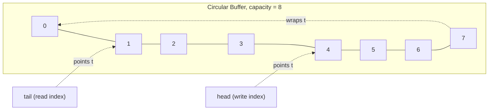
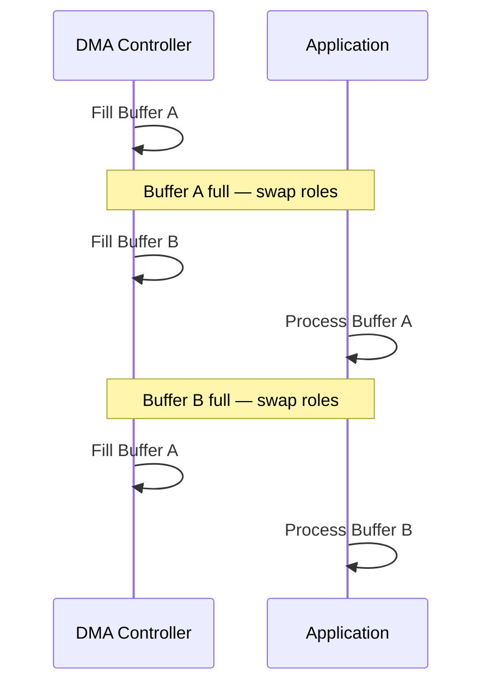

## Buffer Management and Circular Buffers

### Overview

Buffers are regions of memory used to temporarily hold data as it moves between producers and consumers operating at different rates or in different execution contexts — an ISR and a main loop, a DMA controller and application code, or two communicating peripherals. In embedded systems, buffer management must account for fixed, limited memory, real-time constraints, and frequent producer/consumer speed mismatches. The circular buffer (ring buffer) is the dominant data structure for this purpose because it provides bounded, predictable memory usage with efficient insertion and removal.

### Why Circular Buffers

#### The Producer/Consumer Rate Mismatch Problem

A UART receives bytes at a fixed baud rate; the main loop processes them at a variable rate depending on system load. A linear (non-wrapping) buffer would either need to be resized dynamically (expensive, fragmentation-prone, often disallowed in embedded contexts) or would require shifting all remaining data toward the start after each read (an $O(n)$ operation per read). A circular buffer solves this by treating the underlying array as logically continuous, wrapping index positions back to zero upon reaching the end.

**Key Points**

- Circular buffers provide $O(1)$ insertion and removal, independent of buffer occupancy.
- Memory footprint is fixed and known at compile time (or allocation time), which matters heavily in memory-constrained embedded targets.
- No data movement/shifting is required, unlike a naive shift-based FIFO.

### Core Structure and Operation

#### Basic Layout

A circular buffer typically consists of:

- A fixed-size backing array (or block of memory).
- A **head** (write) index — where the next item will be inserted.
- A **tail** (read) index — where the next item will be removed from.
- A size/capacity constant.
- Optionally, a count of currently stored elements (used in some implementations instead of, or alongside, head/tail comparison).



#### Index Wraparound

The core operation is advancing an index and wrapping it back to zero at capacity:

```c
next_index = (current_index + 1) % CAPACITY;
```

When `CAPACITY` is a power of two, this can be replaced with a bitmask operation, which is faster on cores lacking hardware division:

```c
next_index = (current_index + 1) & (CAPACITY - 1);
```

**Key Points**

- Powers-of-two capacities are strongly preferred in performance-sensitive or division-less embedded targets (many small MCU cores lack a hardware divider).
- Choosing a non-power-of-two capacity forces a modulo operation, which on cores without hardware division is emulated in software and can cost significantly more cycles. [Inference — exact cycle cost depends on the specific core and compiler-generated division routine; verify via disassembly or cycle counter if this path is timing-critical.]

### Full vs. Empty Disambiguation

#### The Core Design Problem

When `head == tail`, this is ambiguous: it could mean the buffer is completely empty, or (if using strict modular wraparound without extra state) that it has wrapped exactly around to full. Three common strategies resolve this:

**Strategy 1: Reserve One Slot**

The buffer is considered full when `head` is one position behind `tail` (mod capacity), sacrificing one storage slot but requiring no extra state.

```c
bool is_full(uint32_t head, uint32_t tail, uint32_t capacity) {
    return ((head + 1) % capacity) == tail;
}
bool is_empty(uint32_t head, uint32_t tail) {
    return head == tail;
}
```

**Strategy 2: Separate Count Variable**

Maintain an explicit `count` field alongside `head`/`tail`, incremented on insert and decremented on remove.

```c
bool is_full(uint32_t count, uint32_t capacity)  { return count == capacity; }
bool is_empty(uint32_t count)                    { return count == 0; }
```

**Strategy 3: Extended Index Range (Non-Wrapped Counters)**

Let `head` and `tail` grow monotonically (not wrapped) and only apply the modulo/mask when indexing into the array. Occupancy is `head - tail` (using unsigned wraparound arithmetic, which works correctly even when the counters themselves overflow, provided capacity is a power of two and counter width matches expectations).

```c
uint32_t head = 0, tail = 0;   // never wrapped directly
bool is_full(void)  { return (head - tail) == CAPACITY; }
bool is_empty(void) { return head == tail; }
void push(uint8_t val) {
    buffer[head & (CAPACITY - 1)] = val;
    head++;
}
```

**Key Points**

- Strategy 1 is simplest and requires no extra synchronization variable, making it attractive for ISR/main-loop sharing, but wastes one element of capacity.
- Strategy 2 uses full capacity but introduces a third shared variable that must also be kept consistent, which can complicate lock-free reasoning between ISR and main context.
- Strategy 3 is elegant for single-producer/single-consumer (SPSC) cases and avoids the wasted slot, but requires care with integer overflow semantics and is less intuitive to read/maintain.

### Single-Producer/Single-Consumer (SPSC) Lock-Free Design

#### Why SPSC Matters in Embedded Contexts

The most common embedded buffering scenario is exactly one producer (e.g., an ISR receiving UART bytes) and exactly one consumer (e.g., the main loop). In this specific case, a circular buffer can be made lock-free without disabling interrupts or using mutexes, provided:

- The ISR only ever writes `head` and reads `tail`.
- The main loop only ever writes `tail` and reads `head`.
- Reads/writes of `head` and `tail` are atomic (true for properly aligned word-sized variables on most 32-bit cores).

```c
#define BUF_SIZE 64  // power of two
volatile uint8_t  buf[BUF_SIZE];
volatile uint32_t head = 0;
volatile uint32_t tail = 0;

// Producer context (ISR)
void isr_push(uint8_t data) {
    uint32_t next = (head + 1) & (BUF_SIZE - 1);
    if (next != tail) {          // room available
        buf[head] = data;
        head = next;
    }
    // else: buffer full, byte dropped (or set overflow flag)
}

// Consumer context (main loop)
bool main_pop(uint8_t *out) {
    if (tail == head) return false;   // empty
    *out = buf[tail];
    tail = (tail + 1) & (BUF_SIZE - 1);
    return true;
}
```

**Key Points**

- No critical section (interrupt disable) is required in this specific SPSC pattern, because each index variable has exactly one writer.
- This pattern breaks down if a second producer or consumer is introduced — multi-producer or multi-consumer buffers require explicit locking or more advanced lock-free algorithms (e.g., compare-and-swap-based approaches), which are less common on simple microcontrollers lacking such atomic instructions. [Behavior may vary by core — some Cortex-M variants provide `LDREX`/`STREX` exclusive access instructions enabling limited lock-free multi-party algorithms; availability depends on the specific core.]
- `volatile` on `head`, `tail`, and `buf` is necessary to prevent compiler reordering/caching, but is not itself a substitute for proper memory ordering on architectures with weak memory models. [Behavior may vary by architecture and compiler optimization level.]

### Overflow Handling Strategies

#### Design Choices When the Buffer Is Full

| Strategy | Behavior | Typical Use Case |
| --- | --- | --- |
| Drop new data | Newest incoming data discarded, oldest retained | Logging where old context matters more |
| Overwrite oldest | Oldest data discarded to make room for new | Sensor sampling where most recent value matters most (e.g., circular sample history) |
| Block producer | Producer stalls until space is available | Only viable if producer is not time-critical (e.g., not in an ISR) |
| Signal overflow / assert | Set an error flag, increment overflow counter, or trigger a fault | Safety-critical systems needing overflow visibility |

**Example: Overwrite-Oldest Variant**

```c
void isr_push_overwrite(uint8_t data) {
    buf[head] = data;
    head = (head + 1) & (BUF_SIZE - 1);
    if (head == tail) {
        tail = (tail + 1) & (BUF_SIZE - 1);  // advance tail, discarding oldest
    }
}
```

**Key Points**

- Silent data drop without any overflow indication is a common source of hard-to-diagnose bugs (e.g., corrupted UART protocol framing after a burst of unhandled data); an overflow counter is inexpensive and valuable for diagnostics.
- Choice of strategy should be driven by what "correctness" means for the specific data stream — event/command streams typically need drop-oldest-with-flag or backpressure, while continuous sensor telemetry can often tolerate overwrite-newest-window semantics.

### Buffer Management Beyond Simple Byte Queues

#### Fixed-Size Object Pools

When the "elements" being buffered are structs rather than bytes (e.g., sensor readings, message frames), the same circular buffer principles apply, but element size and alignment matter.

```c
typedef struct {
    uint32_t timestamp;
    int16_t  value;
} sensor_sample_t;

#define POOL_SIZE 32
volatile sensor_sample_t sample_pool[POOL_SIZE];
```

**Key Points**

- Struct alignment/padding affects both memory footprint and whether multi-field writes can be considered atomic (they generally cannot without a lock, since a struct write is not a single-instruction operation on most cores).
- For a producer writing multi-field structs from an ISR, disabling interrupts briefly during the multi-field write (or writing to a shadow slot and only atomically updating a single "commit" index afterward) avoids torn reads by the consumer.

#### Double Buffering (Ping-Pong Buffers)

An alternative to a single circular buffer: two fixed buffers where one is actively being filled (e.g., by DMA) while the other is being processed by the application, then roles swap.



**Key Points**

- Double buffering is especially common with DMA-driven ADC sampling, audio streaming, and display frame buffers, where a whole block is processed at once rather than element-by-element.
- Many DMA peripherals support this natively via "double-buffer mode" or "circular mode with half-transfer/transfer-complete interrupts," letting hardware handle the swap signaling. [Behavior may vary — availability and exact naming of double-buffer DMA modes is vendor- and part-specific; consult the specific MCU's reference manual.]

### Buffer Sizing Considerations

#### Determining Adequate Capacity

Buffer size must accommodate the worst-case burst between consumer service intervals:

$$\text{Capacity} \geq \text{ProducerRate} \times T_{\text{worst-case consumer latency}}$$

For example, a UART running at 115200 baud (~11,520 bytes/sec) with a main loop that might be delayed up to 5 ms by a higher-priority task needs at least:

$$11520 \times 0.005 \approx 58 \text{ bytes}$$

rounded up to the next power of two — 64 bytes — with margin for jitter and other delays.

**Key Points**

- Undersized buffers cause data loss under worst-case timing, which may not manifest during casual testing but appears under load or in the field — a classic latent bug.
- Oversized buffers waste RAM, which is often the more scarce resource (versus flash) on small microcontrollers.
- Worst-case analysis should consider all higher-priority interrupt/task activity that could delay the consumer, not just typical-case behavior. [Inference — exact worst-case latency figures depend on the full system's interrupt priority configuration and scheduling behavior; this generally requires system-level timing analysis rather than isolated buffer sizing.]

### Memory Placement Considerations

#### Placement in Available Memory Regions

- **Regular SRAM** — default location for most buffers.
- **DMA-accessible memory** — on some architectures, DMA controllers can only access specific memory regions (e.g., certain cores restrict DMA from accessing tightly-coupled memory/TCM); buffers used with DMA must be placed accordingly via linker script sections or compiler attributes.
- **Cache-coherency concerns** — on cores with data cache, a buffer written by DMA (bypassing the cache) may appear stale to the CPU reading through cache, requiring cache invalidation/clean operations around DMA transfers. [Behavior may vary — this applies primarily to higher-end cores like Cortex-M7 or Cortex-A series with data cache; simpler Cortex-M0/M3/M4 cores without cache are not affected.]

**Key Points**

- Placing a DMA buffer in an incompatible memory region is a common source of silent, hard-to-diagnose data corruption on more capable cores.
- Buffer alignment requirements (e.g., cache-line alignment) may also apply when cache maintenance operations are involved, since partial cache-line operations can affect adjacent data.

### Debugging Circular Buffer Issues

#### Common Symptoms and Root Causes

| Symptom | Likely Cause |
| --- | --- |
| Data loss under burst load | Buffer too small for worst-case producer/consumer rate mismatch |
| Occasional garbage/corrupted data | Struct-based buffer torn write (non-atomic multi-field write) |
| Off-by-one full/empty ambiguity | Incorrect full/empty disambiguation logic |
| Data corruption only with DMA | Missing cache maintenance or buffer placed in DMA-inaccessible memory |
| Works in main loop, fails with interrupts enabled | Missing `volatile`, missing synchronization for multi-producer case |

### Conclusion

Circular buffers are the standard tool for managing data flow between producers and consumers operating at different rates or execution contexts in embedded systems. Correct implementation hinges on carefully resolving the full/empty ambiguity, choosing an appropriate overflow policy, sizing capacity against worst-case timing, and — particularly in ISR/main-loop or DMA scenarios — ensuring index updates remain atomic and correctly ordered without requiring locks in the common single-producer/single-consumer case.

**Related Topics**

- DMA controller configuration and circular/double-buffer transfer modes
- Lock-free data structures and atomic operations on embedded cores
- Cache coherency and memory barriers in embedded systems
- UART/SPI/I2C driver buffering strategies
- Memory pool allocators for fixed-size embedded objects
- Real-time constraints and worst-case execution time (WCET) analysis
- Linker scripts and memory section placement