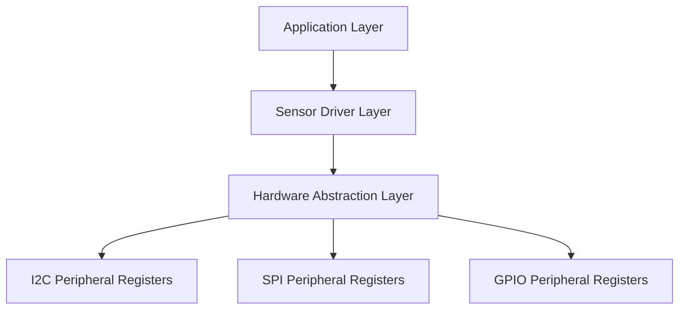
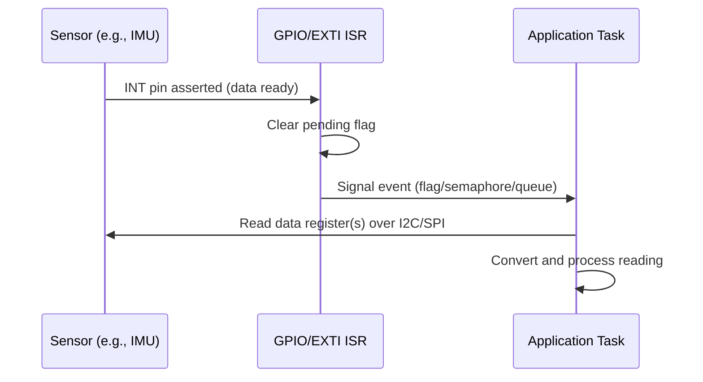

## Sensor Driver Implementation Patterns

### Overview

Sensor drivers form the software layer between raw peripheral communication (I2C, SPI, analog inputs) and application code that needs meaningful, calibrated readings. Well-structured sensor driver design separates hardware access, protocol handling, data conversion, and application-facing API into distinct layers, enabling portability across MCUs, testability without hardware, and maintainability as sensors are added or replaced. This topic covers the recurring architectural patterns used across temperature, IMU, pressure, humidity, light, and similar sensor classes.

### Layered Driver Architecture

#### The Three-Layer Model

Most robust sensor drivers separate concerns into:

1. **Hardware Abstraction Layer (HAL)** — vendor/platform-specific bus primitives (I2C read/write, SPI transfer, GPIO toggle).
2. **Sensor Driver Layer** — protocol-specific register maps, command sequences, and raw-to-engineering-unit conversion, written against the HAL interface rather than directly against MCU registers.
3. **Application Layer** — calls a portable API (`sensor_read_temperature()`) without knowledge of bus type, register addresses, or MCU vendor.



**Key Points**

- This layering allows the same sensor driver source to be reused across different MCU families by re-implementing only the HAL layer.
- It also enables unit testing the driver logic (register interpretation, unit conversion) on a host machine using a mock/fake HAL, without physical hardware.

### Bus Abstraction Pattern

#### Function-Pointer-Based HAL Interface

A common C pattern is defining a struct of function pointers representing the bus operations the driver needs, populated by the platform-specific glue code at initialization.

```c
typedef struct {
    int (*write_reg)(void *ctx, uint8_t reg, const uint8_t *data, uint16_t len);
    int (*read_reg)(void *ctx, uint8_t reg, uint8_t *data, uint16_t len);
    void (*delay_ms)(uint32_t ms);
    void *bus_ctx;   // opaque pointer to bus-specific handle (e.g., I2C_HandleTypeDef*)
} sensor_bus_if_t;
```

The sensor driver then only calls through this interface:

```c
static int bmp280_read_raw_temp(bmp280_dev_t *dev, int32_t *raw_temp) {
    uint8_t buf[3];
    int ret = dev->bus->read_reg(dev->bus->bus_ctx, BMP280_REG_TEMP_MSB, buf, 3);
    if (ret != 0) return ret;
    *raw_temp = ((int32_t)buf[0] \<\< 12) | ((int32_t)buf[1] << 4) | (buf[2] \>\> 4);
    return 0;
}
```

**Key Points**

- This pattern avoids `#ifdef`-based platform branching scattered throughout the driver, centralizing platform dependency in one small glue layer.
- It maps naturally onto Linux kernel-style driver models (e.g., `regmap` abstractions) and is also common in vendor SDKs (e.g., ST's X-CUBE sensor drivers, Bosch BMEXXX driver family) which ship platform-independent "C files" with a documented bus-callback contract.

### Initialization and Configuration Sequencing

#### Typical Init Sequence

1. **Bus setup** — ensure the underlying peripheral (I2C/SPI) is already initialized by the platform layer before the sensor driver runs.
2. **Identity verification** — read a WHO_AM_I / chip ID register and compare against the expected value, failing fast if mismatched.
3. **Soft reset** (if supported) — put the sensor into a known state.
4. **Configuration register writes** — set output data rate, resolution, range, power mode, filter settings.
5. **Calibration data retrieval** — many sensors (e.g., Bosch BMP280/BME280) store factory calibration coefficients in NVM registers that must be read once and cached for later compensation math.
6. **Mode transition** — move the sensor from standby/sleep into active measurement mode.

```c
int bmp280_init(bmp280_dev_t *dev, const sensor_bus_if_t *bus) {
    dev->bus = bus;

    uint8_t chip_id;
    if (dev->bus->read_reg(dev->bus->bus_ctx, BMP280_REG_ID, &chip_id, 1) != 0)
        return -1;
    if (chip_id != BMP280_CHIP_ID_EXPECTED)
        return -2;  // identity check failed

    if (bmp280_read_calibration(dev) != 0)
        return -3;

    uint8_t ctrl_meas = (BMP280_OSRS_T_X2 << 5) | (BMP280_OSRS_P_X16 << 2) | BMP280_MODE_NORMAL;
    return dev->bus->write_reg(dev->bus->bus_ctx, BMP280_REG_CTRL_MEAS, &ctrl_meas, 1);
}
```

**Key Points**

- WHO_AM_I verification early in `init()` catches wiring errors, wrong sensor variants, and address conflicts before any further communication is attempted.
- Calibration coefficients should be read once at init and cached in the device context struct rather than re-read on every measurement, since NVM reads are typically slower and the values are static for the sensor's lifetime.

### Data Conversion and Compensation

#### Raw-to-Engineering-Unit Conversion

Sensors typically return raw ADC counts that must be converted using either:

- A **fixed linear scale factor** (simple sensors — e.g., a basic analog thermistor with known slope/offset).
- **Vendor-supplied compensation formulas** using factory calibration coefficients (common in precision digital sensors like Bosch BMP/BME series, where raw pressure/temperature/humidity require multi-step polynomial compensation).

```c
// Simplified fixed-point temperature compensation pattern (structure only)
int32_t bmp280_compensate_temperature(bmp280_dev_t *dev, int32_t raw_temp) {
    int32_t var1, var2, t_fine;
    var1 = ((((raw_temp >> 3) - ((int32_t)dev->calib.dig_T1 << 1))) *
            ((int32_t)dev->calib.dig_T2)) >> 11;
    var2 = (((((raw_temp >> 4) - ((int32_t)dev->calib.dig_T1)) *
              ((raw_temp >> 4) - ((int32_t)dev->calib.dig_T1))) >> 12) *
            ((int32_t)dev->calib.dig_T3)) >> 14;
    t_fine = var1 + var2;
    return (t_fine * 5 + 128) >> 8;  // returns temperature in 0.01 degC units
}
```

**Key Points**

- Vendor compensation formulas are sensor-specific and must be implemented exactly as specified in the datasheet; deriving them independently is error-prone and unnecessary since manufacturers publish reference implementations.
- Fixed-point arithmetic (as shown above) is common on MCUs without an FPU, trading some code readability for performance and determinism; the specific coefficient widths and shift amounts are dictated by the datasheet's reference algorithm.
- `t_fine` (or equivalent intermediate state) is often needed by other compensation formulas (e.g., pressure compensation depends on the temperature compensation's intermediate value), so driver state must retain it across related calls within a single "measurement cycle."

### Polling vs. Interrupt-Driven Sensor Access

#### Polling Pattern

Simplest approach: application periodically calls a blocking read function.

```c
float temp_c;
if (bmp280_read_temperature(&dev, &temp_c) == 0) {
    // use temp_c
}
```

**Key Points**

- Polling is simple to implement and reason about but wastes CPU cycles waiting on conversion time, and can miss transient events between polls (e.g., a brief threshold crossing on an accelerometer).
- Appropriate for sensors sampled infrequently relative to system activity (e.g., a temperature sensor read once per second).

#### Interrupt-Driven Pattern (Data-Ready / Threshold Interrupts)

Many sensors expose a dedicated interrupt pin (INT) that asserts when new data is ready, a FIFO watermark is reached, or a configured threshold (motion, tap, proximity) is crossed. The MCU GPIO interrupt handler then defers to a bottom-half read.



**Key Points**

- This follows the same top-half/bottom-half principle used in general ISR design — the GPIO ISR should not perform the (relatively slow) I2C/SPI transaction itself, since bus transactions typically take far longer than is appropriate for interrupt context.
- FIFO-based sensors (many modern IMUs) can buffer multiple samples internally and interrupt only when a watermark is reached, reducing interrupt frequency and bus traffic compared to per-sample interrupts.

### Error Handling and Robustness Patterns

#### Bus Communication Failures

Sensor drivers should propagate distinguishable error codes rather than silently returning stale or zeroed data on I2C/SPI failure (NACK, timeout, bus arbitration loss).

```c
typedef enum {
    SENSOR_OK = 0,
    SENSOR_ERR_BUS,
    SENSOR_ERR_ID_MISMATCH,
    SENSOR_ERR_NOT_INITIALIZED,
    SENSOR_ERR_TIMEOUT,
    SENSOR_ERR_INVALID_ARG,
} sensor_status_t;
```

**Key Points**

- Distinguishing error categories (bus failure vs. identity mismatch vs. timeout) allows calling code to make informed retry/fallback decisions rather than treating all failures identically.
- Some drivers implement automatic retry with backoff for transient bus errors, but this should be a deliberate, bounded policy (fixed max retry count) rather than unbounded retry loops that could hang application code.

#### Timeout Protection

Any register read/write that waits on a sensor-side condition (e.g., "wait for conversion complete" status bit) must be timeout-bounded rather than looping indefinitely, to avoid hanging on a disconnected or faulty sensor.

```c
int wait_for_conversion(bmp280_dev_t *dev, uint32_t timeout_ms) {
    uint32_t elapsed = 0;
    uint8_t status;
    do {
        dev->bus->read_reg(dev->bus->bus_ctx, BMP280_REG_STATUS, &status, 1);
        if (!(status & BMP280_STATUS_MEASURING)) return 0;
        dev->bus->delay_ms(1);
        elapsed++;
    } while (elapsed < timeout_ms);
    return -SENSOR_ERR_TIMEOUT;
}
```

### Device Context and Multi-Instance Support

#### Avoiding Global State

Drivers intended for reuse (multiple identical sensors on different buses/addresses, or a product line with several instances) should carry all instance-specific state in a context struct passed by pointer, rather than using file-scope global variables.

```c
typedef struct {
    const sensor_bus_if_t *bus;
    bmp280_calib_t calib;
    int32_t t_fine;
    uint8_t initialized;
} bmp280_dev_t;
```

**Key Points**

- Struct-based instance context allows the same compiled driver code to manage multiple physical sensor instances simultaneously (e.g., two BME280s on different I2C addresses).
- This pattern is a prerequisite for the driver being reentrant-safe and testable in isolation.

### Register Map Definition Patterns

#### Named Constants vs. Bitfield Structs

Two common approaches to representing register layouts:

**Named bit-mask constants (portable, common in embedded C):**

```c
#define BMP280_REG_CTRL_MEAS   0xF4
#define BMP280_OSRS_T_X2       0x02
#define BMP280_MODE_NORMAL     0x03
```

**Bitfield structs (readable, but endianness/packing not guaranteed by the C standard):**

```c
typedef struct __attribute__((packed)) {
    uint8_t mode   : 2;
    uint8_t osrs_p : 3;
    uint8_t osrs_t : 3;
} ctrl_meas_reg_t;
```

**Key Points**

- Named constants combined with explicit shift/mask operations are more portable across compilers and architectures since C bitfield layout (bit order, padding) is implementation-defined by the standard.
- Bitfield structs read more naturally in application code but carry portability risk if the driver is ever compiled with a different compiler/toolchain than originally targeted. [Inference — the practical impact depends on whether the driver will realistically be ported across toolchains; many single-vendor embedded projects use bitfields safely in practice given a fixed, known compiler.]

### Testability Patterns

#### Mock Bus Interface for Host-Based Unit Testing

Because the driver only depends on the abstract `sensor_bus_if_t` interface, a mock implementation can simulate register reads/writes on a development host, enabling unit tests without physical hardware.

```c
// Mock read_reg returning pre-programmed register values for test assertions
static int mock_read_reg(void *ctx, uint8_t reg, uint8_t *data, uint16_t len) {
    mock_state_t *state = (mock_state_t *)ctx;
    memcpy(data, &state->reg_values[reg], len);
    return 0;
}
```

**Key Points**

- This pattern allows compensation math, state machines, and error-handling paths to be exercised in a fast host-based test suite (e.g., via CMock, Unity, or GoogleTest for C++ drivers), separate from hardware-in-the-loop testing.
- Hardware-in-the-loop testing remains necessary to validate actual bus timing, electrical behavior, and real sensor responses, since a mock cannot capture true hardware failure modes (bus noise, timing violations, actual sensor tolerances).

### Common Sensor Driver Pitfalls

| Pitfall | Consequence | Mitigation |
| --- | --- | --- |
| No WHO_AM_I check | Silent misconfiguration goes undetected | Verify chip ID at init, fail fast |
| Missing timeout on status polling | Hang on disconnected/faulty sensor | Bound all polling loops with a timeout |
| Global driver state | Cannot support multiple instances, breaks reentrancy | Use per-instance context structs |
| Ignoring compensation formula order dependencies | Incorrect readings (e.g., pressure without prior temp compensation) | Follow datasheet-specified calculation order exactly |
| Blocking I2C/SPI transaction inside ISR | Excessive ISR execution time | Defer bus transactions to bottom half |
| Re-reading calibration data every measurement | Wasted bus bandwidth and latency | Cache calibration data at init |

### Conclusion

Robust sensor driver implementation relies on a layered architecture that isolates bus-specific code behind an abstraction interface, careful adherence to datasheet-specified initialization and compensation sequences, timeout-protected communication, and per-instance state management. These patterns collectively enable drivers that are portable across MCU platforms, safely reusable across multiple sensor instances, and testable independent of physical hardware.

**Related Topics**

- I2C and SPI protocol fundamentals and bus arbitration
- Interrupt service routine design for data-ready and threshold interrupts
- Fixed-point arithmetic techniques for MCUs without an FPU
- FIFO-based sensor buffering and watermark interrupt strategies
- Device tree and driver model concepts (Linux/Zephyr-style sensor frameworks)
- Power management modes for low-duty-cycle sensor sampling
- Unit testing strategies for embedded C without hardware