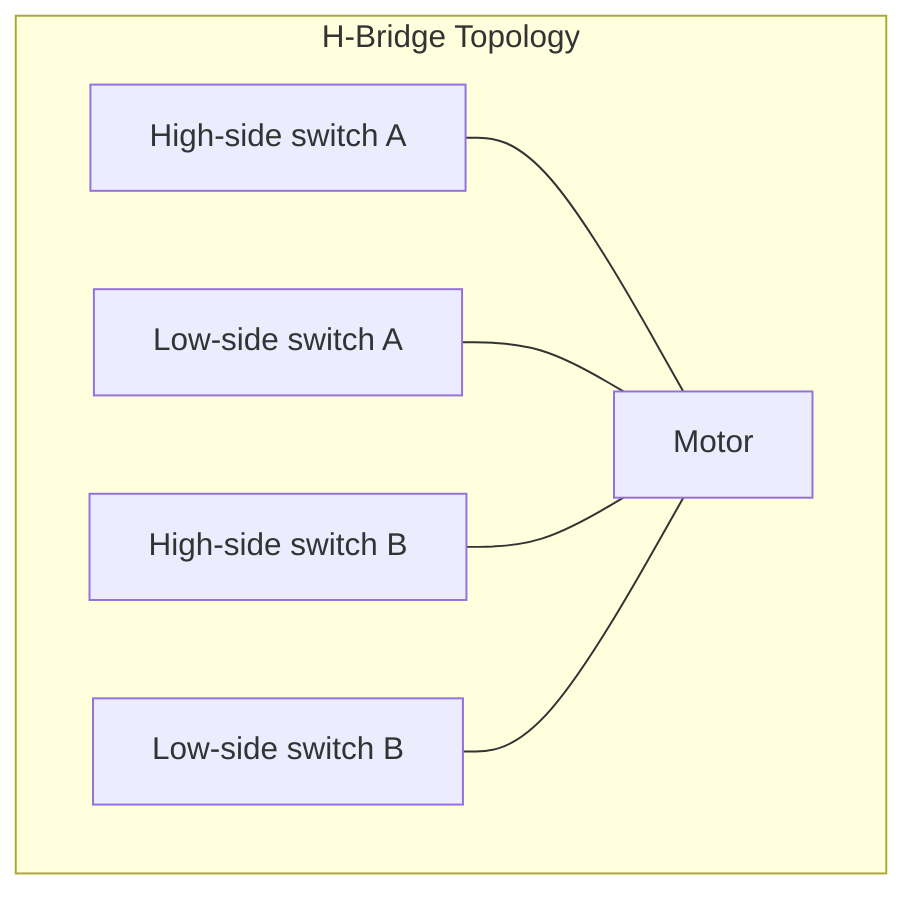
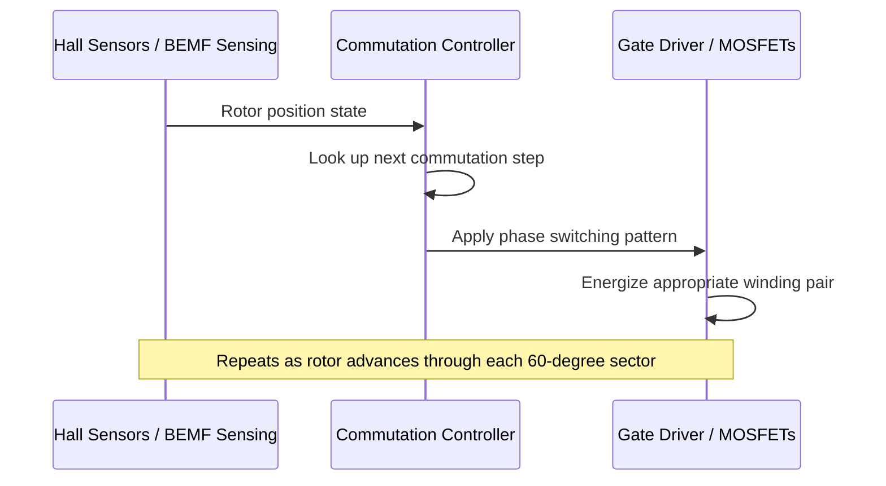
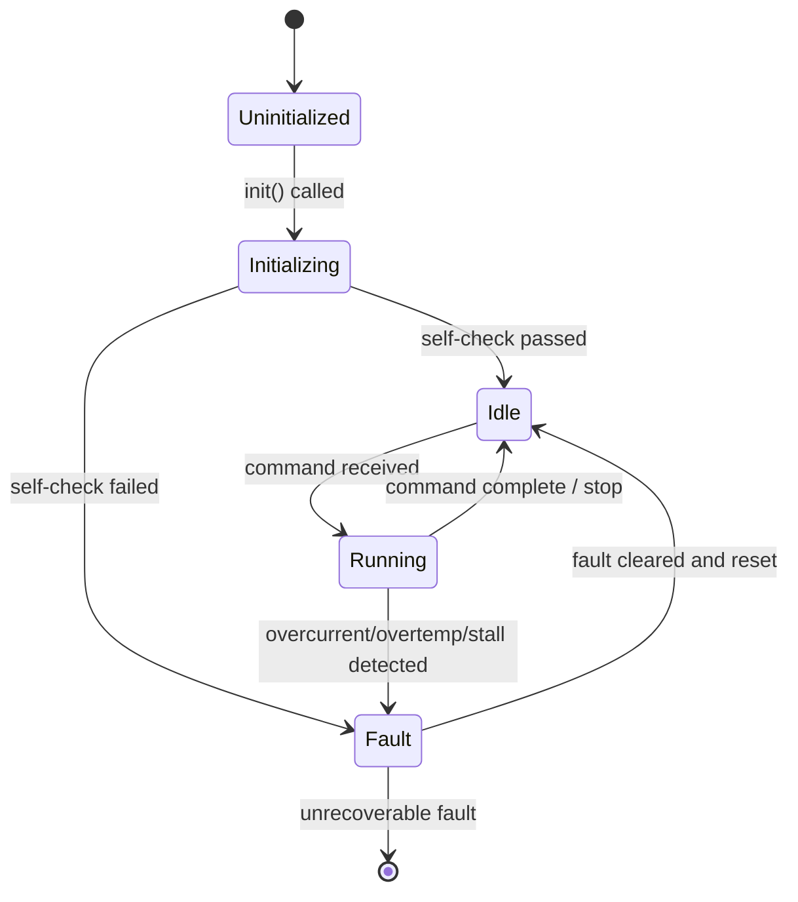

## Actuator and Motor Driver Design

### Overview

Actuator and motor driver design covers the software and hardware interfacing layer between a microcontroller and the components that convert electrical signals into physical motion — DC motors, stepper motors, brushless DC (BLDC) motors, servos, and solenoids. Unlike sensor drivers, which primarily read data, actuator drivers primarily control power delivery, timing, and feedback loops, which introduces distinct safety, timing precision, and power-electronics considerations.

### Actuator Classes and Driving Requirements

#### Common Actuator Types

| Actuator Type | Control Signal | Typical Driver Hardware |
| --- | --- | --- |
| DC motor (brushed) | PWM duty cycle + direction | H-bridge |
| Stepper motor | Step pulses + direction, or phase currents | Stepper driver IC (e.g., A4988, DRV8825) or discrete H-bridges |
| Brushless DC (BLDC) | Commutated PWM phases, often with feedback | Three-phase gate driver + MOSFETs, or integrated BLDC driver IC |
| Servo (RC-style) | PWM pulse width (typically 1-2 ms pulse in a ~20 ms period) | Built-in driver inside servo unit; MCU just generates PWM |
| Solenoid/relay | On/off, sometimes PWM for holding current reduction | Simple MOSFET/transistor switch, flyback diode |

**Key Points**

- The choice of driver hardware and control signal shape is dictated by the actuator's physical characteristics (winding configuration, current requirements, back-EMF behavior), not purely a software decision.
- All inductive loads (motors, solenoids) require flyback/freewheeling diode protection (or equivalent, such as a driver IC's internal diodes) to prevent voltage spikes from damaging switching transistors when current is interrupted.

### H-Bridge Control for DC Motors

#### Basic H-Bridge Operation

An H-bridge uses four switches arranged so current can flow through a motor in either direction, enabling forward, reverse, brake, and coast states.



**Key Points**

- Simultaneously closing both high-side and low-side switches on the *same* leg (a "shoot-through" condition) creates a direct short across the supply and must be prevented in both hardware (dead-time circuitry) and software (never issuing conflicting switch states).
- Many H-bridge driver ICs (e.g., DRV8871, L298N) include internal protection and dead-time handling, but discrete MOSFET H-bridges built without such an IC require the firmware/PWM peripheral to insert dead-time explicitly.

#### PWM-Based Speed Control

```c
void motor_set(int8_t speed_percent, motor_dev_t *m) {
    // speed_percent: -100 (full reverse) to +100 (full forward), 0 = stop
    if (speed_percent >= 0) {
        gpio_write(m->dir_pin, DIR_FORWARD);
        pwm_set_duty(m->pwm_channel, (uint32_t)speed_percent);
    } else {
        gpio_write(m->dir_pin, DIR_REVERSE);
        pwm_set_duty(m->pwm_channel, (uint32_t)(-speed_percent));
    }
}
```

**Key Points**

- Direction changes should generally not be issued instantaneously at full speed in either direction without a brief stop/ramp, since abrupt reversal causes large current spikes (regenerative braking current) that can exceed driver IC ratings. [Inference — the necessity and magnitude of this concern depends on motor inertia, driver IC current limits, and supply capacity; consult the specific driver IC's datasheet for safe operating limits.]
- PWM frequency selection matters: too low causes audible whine and torque ripple; too high increases switching losses in the driver. Common ranges for small DC motors are roughly 10–20 kHz to stay above the audible range, though this varies by motor and driver IC. [Inference — optimal frequency is motor- and driver-specific; refer to datasheet recommendations.]

### Stepper Motor Driving Patterns

#### Step Sequencing Approaches

- **Full-step** — energizes windings in fixed sequence, simplest, highest torque per step, more vibration.
- **Half-step** — alternates between full-step and single-phase energization, doubling resolution.
- **Microstepping** — uses proportional current in both windings (sine/cosine current profiles) to achieve much finer angular resolution and smoother motion, typically handled by a dedicated stepper driver IC rather than the MCU directly.

```c
// Simplified full-step sequence table (4-step, bipolar)
static const uint8_t step_table[4] = {
    0b0101, 0b0110, 0b1010, 0b1001
};

void stepper_step(stepper_dev_t *s, bool forward) {
    s->step_index = forward ? (s->step_index + 1) % 4 : (s->step_index + 3) % 4;
    gpio_write_pattern(s->coil_pins, step_table[s->step_index]);
}
```

#### Step Timing and Acceleration Profiles

Abruptly commanding a stepper to its target speed can cause missed steps (loss of synchronization) if the motor's rotor cannot physically accelerate that fast. Trapezoidal or S-curve acceleration profiles ramp step frequency up and down smoothly.


**Key Points**

- Missed steps in an open-loop stepper system are silent — the driver has no inherent feedback that a step was missed, so accumulated position error can only be detected via an external sensor (limit switch, encoder) or periodic re-homing.
- Timer-driven step pulse generation (using a hardware timer interrupt to toggle the step line at a computed, possibly varying, interval) is the typical implementation approach, since step timing precision directly affects motion smoothness and torque consistency.

### PWM Generation for Servo Control

#### RC-Style Servo Pulse Timing

Standard analog RC servos expect a pulse roughly between 1 ms (one extreme) and 2 ms (other extreme) within a repeating ~20 ms period (50 Hz), with 1.5 ms typically centering the servo. Exact endpoints vary by servo model and require calibration.

```c
void servo_set_angle(servo_dev_t *s, uint16_t angle_deg) {
    // Map angle (0-180) to pulse width (e.g., 1000-2000 us), clamp to safe range
    uint32_t pulse_us = 1000 + ((uint32_t)angle_deg * 1000) / 180;
    pwm_set_pulse_width_us(s->pwm_channel, pulse_us);
}
```

**Key Points**

- Using a dedicated hardware timer/PWM peripheral (rather than software-timed bit-banging) is strongly preferred for servo pulses, since jitter in pulse width directly translates to jittery/inaccurate servo positioning.
- Multiple servos on a single MCU are commonly driven either via multiple hardware PWM channels or a single timer generating staggered pulses across several GPIO pins, depending on how many hardware PWM channels the MCU provides.

### BLDC Motor Commutation

#### Trapezoidal (Six-Step) Commutation

BLDC motors require commutating current through motor phases in a sequence synchronized to rotor position, typically sensed via three Hall-effect sensors (sensored) or inferred from back-EMF zero-crossings (sensorless).



**Key Points**

- Sensored commutation (Hall sensors) provides reliable low-speed and startup performance but adds sensor wiring and cost; sensorless BEMF sensing eliminates sensors but typically cannot reliably determine rotor position at zero/very low speed, requiring an open-loop startup ramp before switching to closed-loop commutation. [Behavior may vary by specific motor controller IC and startup algorithm implementation.]
- Dedicated BLDC controller/gate-driver ICs (e.g., DRV83xx family) handle much of the low-level commutation timing and protection (overcurrent, undervoltage lockout) in hardware, reducing the firmware burden compared to a fully discrete MOSFET implementation.

### Closed-Loop Control Patterns

#### PID Control for Position/Speed Regulation

When an actuator has feedback (encoder, potentiometer, current sense), a control loop — most commonly PID (Proportional-Integral-Derivative) — computes the drive signal based on the error between target and measured state.

$$u(t) = K_p e(t) + K_i \int_0^t e(\tau)\, d\tau + K_d \frac{de(t)}{dt}$$

```c
typedef struct {
    float kp, ki, kd;
    float integral;
    float prev_error;
} pid_ctrl_t;

float pid_update(pid_ctrl_t *pid, float setpoint, float measured, float dt) {
    float error = setpoint - measured;
    pid->integral += error * dt;
    float derivative = (error - pid->prev_error) / dt;
    pid->prev_error = error;
    return pid->kp * error + pid->ki * pid->integral + pid->kd * derivative;
}
```

**Key Points**

- Integral windup — where the integral term grows unboundedly while the actuator is saturated and unable to respond — is a common practical issue; clamping the integral term or output (anti-windup) is a standard mitigation.
- Control loop update rate must be consistent (fixed `dt`) for predictable tuning; running the PID update from a fixed-period hardware timer interrupt rather than a variable-rate main loop is the typical robust implementation choice.
- PID gain tuning is plant-specific (dependent on motor, load inertia, mechanical linkage) and generally requires empirical tuning or system identification; there is no universal gain set. [Inference — appropriate tuning approach and resulting gain values are entirely system-dependent.]

### Safety and Fault Handling Patterns

#### Common Protective Mechanisms

- **Current limiting/sensing** — monitor motor current (via shunt resistor + comparator/ADC) and cut power if it exceeds a safe threshold, protecting against stalled-rotor overcurrent.
- **Overtemperature protection** — many driver ICs expose a thermal warning/shutdown flag that firmware should monitor and act on.
- **Watchdog on control loop** — if the control task stalls or crashes, actuator output should default to a safe state (typically off/coast) rather than continuing to hold a potentially unsafe last command.
- **Software and hardware limit switches** — for linear/rotary actuators with a bounded range of travel, both a software-enforced soft limit and (where safety-critical) an independent hardware limit switch are common practice.
- **Enable/disable line management** — many driver ICs have a dedicated enable pin; firmware should default this to disabled at boot and only enable after full initialization and self-checks pass.

```c
void motor_safety_check(motor_dev_t *m) {
    if (adc_read_current(m->current_sense_channel) > m->max_current_threshold) {
        motor_emergency_stop(m);
        m->fault_flags |= MOTOR_FAULT_OVERCURRENT;
    }
}
```

**Key Points**

- Actuator faults are generally higher-consequence than sensor faults (a stuck sensor reading is usually less dangerous than a motor that fails to stop), which typically justifies more conservative, fail-safe-oriented design — defaulting to a de-energized/safe state on any detected fault or ambiguous condition.
- Relying solely on software limits without an independent hardware cutoff is a design decision that should be evaluated against the specific application's safety requirements; software can fail (crash, hang) whereas a well-designed hardware interlock is more independent of firmware correctness. [Inference — the appropriate balance of software vs. hardware safety mechanisms is application- and risk-profile-specific, and safety-critical designs often require adherence to relevant functional safety standards beyond general embedded practice.]

### Driver State Machine Design

#### Typical Actuator Driver States



**Key Points**

- Explicit state machines make illegal transitions (e.g., commanding motion while in `Fault` state) structurally preventable rather than relying on scattered conditional checks throughout the codebase.
- A distinct `Fault` state with an explicit, deliberate clear/reset action (rather than automatic recovery) is generally preferred for actuator drivers, since automatically resuming motion after a fault (e.g., overcurrent) without operator/system awareness can be unsafe depending on the application.

### PWM Peripheral Considerations

#### Hardware Timer/PWM Selection

- **Resolution** — PWM duty cycle resolution (number of discrete steps) is determined by timer clock frequency divided by PWM frequency; higher resolution allows finer control but may conflict with frequency requirements.
- **Complementary outputs with dead-time** — some MCU timer peripherals (e.g., STM32 advanced-control timers) provide built-in complementary PWM channel pairs with programmable dead-time insertion, directly suited to H-bridge and BLDC gate-driving without discrete dead-time logic.
- **Center-aligned vs. edge-aligned PWM** — center-aligned PWM reduces certain harmonic content and is often preferred for motor control applications, though the appropriate choice depends on the specific motor and driver topology. [Inference — the practical benefit of center-aligned PWM depends on the specific application, motor type, and EMI/harmonic sensitivity of the system.]

$$\text{Resolution (steps)} = \frac{f_{\text{timer clock}}}{f_{\text{PWM}}}$$

### Common Pitfalls

| Pitfall | Consequence | Mitigation |
| --- | --- | --- |
| No flyback diode on inductive load | Voltage spike damages switching transistor | Include flyback diode or use driver IC with built-in protection |
| Shoot-through in discrete H-bridge | Short circuit, damaged MOSFETs | Enforce dead-time in software/hardware; prefer driver ICs with built-in protection |
| Abrupt direction reversal at full speed | Excessive current spike | Ramp through stop or reduced speed before reversing |
| No current limiting | Stalled motor draws excessive current, overheats | Implement current sensing with fault cutoff |
| Software-only safety limits on critical actuator | Firmware fault leads to unsafe motion | Add independent hardware limit/interlock for safety-critical applications |
| Variable-rate PID loop timing | Inconsistent, hard-to-tune control behavior | Run control loop from fixed-period timer interrupt |
| Integral windup | Overshoot and instability after saturation | Implement anti-windup clamping |

### Conclusion

Actuator and motor driver design differs from sensor driver design in its emphasis on power delivery safety, precise timing (PWM/step pulse generation), and closed-loop control rather than data acquisition. Robust designs combine appropriate driver hardware selection, protective circuitry (flyback diodes, dead-time, current sensing), explicit fault-handling state machines, and — where feedback is available — carefully tuned closed-loop control, with a general bias toward fail-safe behavior given the higher physical consequences of actuator misbehavior compared to sensor misreads.

**Related Topics**

- Interrupt service routine design for encoder feedback and commutation timing
- PID and advanced motor control algorithms (field-oriented control, sensorless BEMF estimation)
- Power electronics fundamentals: MOSFET gate driving, switching losses, thermal design
- Functional safety standards relevant to motor control (e.g., IEC 61508 concepts)
- Timer/PWM peripheral configuration across common MCU families
- Encoder interfacing and quadrature decoding
- Current sensing techniques (shunt resistors, Hall-effect current sensors)