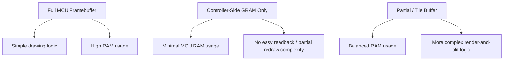
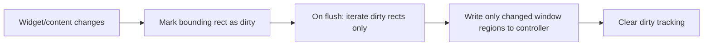
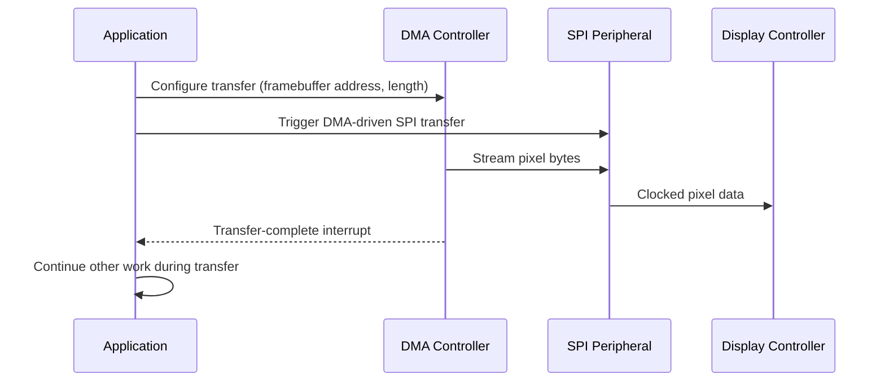

## Display and Graphics Driver Basics

### Overview

Display drivers bridge the microcontroller and a physical display panel — character LCDs, monochrome/graphic OLEDs, color TFT panels, or e-paper displays — translating framebuffer or command data into the electrical protocol the display controller expects. Graphics drivers build on top of this to provide drawing primitives (pixels, lines, shapes, text, images) that application code uses without needing to understand the underlying panel protocol. This topic covers common display technologies, controller communication patterns, framebuffer management, and rendering architecture.

### Display Technology Landscape

#### Common Display Types in Embedded Systems

| Display Type | Typical Interface | Characteristics |
| --- | --- | --- |
| Character LCD (HD44780-style) | 4-bit/8-bit parallel, sometimes I2C via expander | Fixed character grid (e.g., 16x2, 20x4), built-in character generator |
| Monochrome graphic LCD/OLED (e.g., SSD1306) | I2C or SPI | Small resolution (e.g., 128x64), 1 bit per pixel, low power |
| Color TFT LCD (e.g., ILI9341, ST7789) | SPI (often) or parallel (8080/6800-style) | Higher resolution, 16-bit (RGB565) or 18/24-bit color |
| E-paper/E-ink | SPI | Very low power, slow refresh, retains image without power |
| Segment LCD | Direct GPIO or dedicated LCD driver peripheral | Fixed segments (seven-segment digits, icons), not pixel-addressable |

**Key Points**

- Interface choice (I2C vs. SPI vs. parallel) is a tradeoff between pin count and throughput: I2C uses fewest pins but is slowest, parallel interfaces offer highest throughput at the cost of many GPIO lines, and SPI is a common middle ground.
- The appropriate driver architecture differs meaningfully by category — a segment LCD driver is fundamentally a lookup-table-to-GPIO mapping problem, while a color TFT driver is a framebuffer/streaming problem; this topic focuses primarily on graphic (pixel-addressable) displays.

### Controller Communication Fundamentals

#### Command vs. Data Distinction

Most graphic display controllers distinguish between **command bytes** (configure the controller — set addressing mode, contrast, orientation) and **data bytes** (actual pixel content), typically differentiated via:

- A dedicated D/C (data/command) GPIO line (common in SPI displays like ILI9341, ST7789).
- A control byte prefix within the transaction (common in I2C displays like SSD1306, where the first byte after the address indicates command vs. data stream).

```c
void tft_write_command(tft_dev_t *d, uint8_t cmd) {
    gpio_write(d->dc_pin, DC_COMMAND);
    spi_transfer(d->spi, &cmd, 1);
}

void tft_write_data(tft_dev_t *d, const uint8_t *data, uint16_t len) {
    gpio_write(d->dc_pin, DC_DATA);
    spi_transfer(d->spi, data, len);
}
```

**Key Points**

- Getting command/data signaling wrong is one of the most common sources of "garbage on screen" or "nothing displays" bugs when bringing up a new display, so verifying this sequencing against the specific controller datasheet is a critical first debugging step.
- Some controllers (e.g., SSD1306 over I2C) use a control byte with a "continuation bit" allowing multiple commands/data bytes to be streamed in one transaction, which affects how the low-level write functions should be structured for efficiency.

#### Initialization Sequences

Display controllers typically require a specific, often lengthy, sequence of register writes at startup: reset pulse, sleep-out, power control, gamma correction (color displays), memory access control (orientation/color order), and display-on.

```c
static const uint8_t ili9341_init_seq[] = {
    // Simplified representative structure: {cmd, num_data_bytes, data..., delay_ms}
    ILI9341_SWRESET, 0, 150,
    ILI9341_SLPOUT,  0, 255,
    ILI9341_PIXFMT,  1, 0x55, 0,       // 16-bit RGB565
    ILI9341_MADCTL,  1, 0x48, 0,       // orientation / color order
    ILI9341_DISPON,  0, 100,
    0xFF  // end marker
};
```

**Key Points**

- Init sequences are highly controller-specific and are typically copied from the manufacturer's reference driver or a well-established open-source driver, rather than derived from the datasheet register-by-register, since getting timing/ordering subtly wrong often produces confusing partial-failure symptoms.
- A hardware reset pin (if present) should generally be pulsed as the very first step, since a software-only reset command may not be reliably received if the controller is in an unknown or corrupted state.

### Framebuffer Architectures

#### Full Framebuffer in MCU RAM

The entire display content is held as a pixel array in MCU RAM; drawing operations modify this buffer, and a separate "flush" or "blit" operation transfers the whole buffer (or dirty regions) to the display controller.

```c
#define DISP_WIDTH  240
#define DISP_HEIGHT 320
uint16_t framebuffer[DISP_WIDTH * DISP_HEIGHT];  // RGB565, ~150 KB

void set_pixel(uint16_t x, uint16_t y, uint16_t color) {
    if (x < DISP_WIDTH && y < DISP_HEIGHT)
        framebuffer[y * DISP_WIDTH + x] = color;
}
```

**Key Points**

- Full framebuffers dramatically simplify drawing logic (arbitrary read-modify-write of any pixel) but require substantial RAM — a 240x320 RGB565 display needs 153,600 bytes, which exceeds the total RAM of many small microcontrollers.
- This approach is common on MCUs with sufficient RAM (or external SRAM) or when the display controller itself has no built-in graphics RAM requiring the MCU to always resend full frames.

#### Controller-Side Graphics RAM (GRAM)

Many display controllers (SSD1306, ILI9341, ST7789) contain their own internal graphics RAM and expose an addressing window mechanism; the MCU writes pixel data directly into a specified rectangular region without needing to hold the entire frame in MCU RAM.

```c
void tft_set_window(tft_dev_t *d, uint16_t x0, uint16_t y0, uint16_t x1, uint16_t y1) {
    tft_write_command(d, ILI9341_CASET);
    uint8_t col_data[4] = {x0 >> 8, x0 & 0xFF, x1 >> 8, x1 & 0xFF};
    tft_write_data(d, col_data, 4);

    tft_write_command(d, ILI9341_PASET);
    uint8_t row_data[4] = {y0 >> 8, y0 & 0xFF, y1 >> 8, y1 & 0xFF};
    tft_write_data(d, row_data, 4);

    tft_write_command(d, ILI9341_RAMWR);  // subsequent data writes fill this window
}
```

**Key Points**

- This approach allows drawing on MCU-constrained systems without a full local framebuffer, at the cost of making arbitrary pixel-level read-modify-write operations slower or impossible (since reading back GRAM over SPI, if supported at all, is typically much slower than writing).
- A common hybrid pattern is a **partial/line-buffer framebuffer** — holding only a few rows or a tile of the display in MCU RAM, rendering into that small buffer, then blitting it to the corresponding controller GRAM window, repeated across the full display.

#### Framebuffer Architecture Comparison



### Drawing Primitives Layer

#### Building Graphics Operations on Pixel Access

Once `set_pixel()` (or equivalent windowed-write) exists, higher-level primitives are typically built in terms of it or optimized directly:

```c
void draw_line(int16_t x0, int16_t y0, int16_t x1, int16_t y1, uint16_t color) {
    // Bresenham's line algorithm
    int16_t dx = abs(x1 - x0), sx = x0 < x1 ? 1 : -1;
    int16_t dy = -abs(y1 - y0), sy = y0 < y1 ? 1 : -1;
    int16_t err = dx + dy;
    while (1) {
        set_pixel(x0, y0, color);
        if (x0 == x1 && y0 == y1) break;
        int16_t e2 = 2 * err;
        if (e2 >= dy) { err += dy; x0 += sx; }
        if (e2 <= dx) { err += dx; y0 += sy; }
    }
}

void draw_rect_filled(int16_t x, int16_t y, int16_t w, int16_t h, uint16_t color) {
    for (int16_t row = 0; row < h; row++)
        for (int16_t col = 0; col < w; col++)
            set_pixel(x + col, y + row, color);
}
```

**Key Points**

- Filled rectangle/area operations are common enough to warrant optimized implementations that use the controller's windowed-write mechanism directly (writing a whole rectangular block in one transaction) rather than looping over individual `set_pixel()` SPI transactions, since per-pixel transaction overhead is typically far more costly than the pixel data itself.
- Bresenham's algorithm and similar integer-only rasterization techniques are standard in embedded graphics because they avoid floating-point operations, which is favorable on MCUs without an FPU.

### Text Rendering

#### Bitmap Font Rendering

Text is typically rendered by looking up glyph bitmaps from a font table (an array of bit patterns, one per character) and blitting each glyph's pixels into the framebuffer or display window.

```c
extern const uint8_t font_8x8[128][8];  // 128 ASCII chars, 8x8 monochrome glyphs

void draw_char(int16_t x, int16_t y, char c, uint16_t fg, uint16_t bg) {
    const uint8_t *glyph = font_8x8[(uint8_t)c];
    for (uint8_t row = 0; row < 8; row++) {
        uint8_t bits = glyph[row];
        for (uint8_t col = 0; col < 8; col++) {
            uint16_t color = (bits & (0x80 >> col)) ? fg : bg;
            set_pixel(x + col, y + row, color);
        }
    }
}
```

**Key Points**

- Fixed-width bitmap fonts are simple and fast but consume flash proportional to character set size and glyph resolution; variable-width fonts and anti-aliased fonts trade increased complexity and processing time for better visual quality, and are more commonly used on higher-resolution color displays with more available compute.
- Font data is typically stored in flash/ROM (`const`) rather than RAM, since it is static and often sizable.

### Color Formats and Conversion

#### Common Pixel Formats

| Format | Bits/Pixel | Notes |
| --- | --- | --- |
| 1-bit monochrome | 1 | Common for small OLED/LCD (SSD1306-class) |
| RGB565 | 16 | Common "high color" format for TFT displays — 5 bits red, 6 bits green, 5 bits blue |
| RGB888 | 24 | Full 24-bit color, higher memory cost |
| Grayscale (4-bit or 8-bit) | 4 or 8 | Common on e-paper and some OLEDs |

```c
uint16_t rgb888_to_rgb565(uint8_t r, uint8_t g, uint8_t b) {
    return ((r & 0xF8) \<\< 8) | ((g & 0xFC) << 3) | (b \>\> 3);
}
```

**Key Points**

- RGB565 is the dominant format for embedded color TFT work because it halves memory bandwidth/storage versus RGB888 while remaining visually acceptable for most UI purposes.
- Converting or sourcing image assets (icons, logos) into the display's native pixel format ahead of time (at build/asset-preparation stage) is generally preferable to runtime conversion, since it avoids repeated conversion cost during rendering.

### Refresh Strategies and Tearing

#### Full Redraw vs. Dirty-Rectangle Update

- **Full redraw** — the entire framebuffer/window is retransmitted every update cycle; simplest but wastes bandwidth if only a small region changed.
- **Dirty-rectangle tracking** — the application tracks which regions changed since the last flush and only transmits those regions, reducing bus traffic and improving effective frame rate for UIs with mostly-static content.



**Key Points**

- Dirty-rectangle tracking adds implementation complexity (bounding-box merging, overlap handling) but is standard practice in embedded GUI frameworks (e.g., LVGL) once UI complexity grows beyond simple full-screen redraws.
- Tearing (visible partial-update artifacts) can occur if the display is read/updated mid-refresh by the panel's own scan cycle; some controllers/displays offer a tearing-effect (TE) signal the MCU can synchronize writes against, though availability is panel- and controller-specific. [Behavior may vary by specific display module.]

### DMA-Accelerated Display Transfers

#### Offloading Pixel Transfer from the CPU

For SPI/parallel displays transferring large framebuffers or windows, using DMA to stream pixel data to the display peripheral (rather than CPU-driven byte-by-byte transfer) frees the CPU for other work during the transfer and can substantially increase achievable frame rate.



**Key Points**

- DMA completion is typically signaled via interrupt, following the same top-half/bottom-half principles as other DMA-driven peripherals — the ISR should simply flag completion (e.g., release a semaphore, set a flag) rather than perform further processing.
- Double-buffering the framebuffer (rendering into one buffer while DMA transmits the other) avoids visual corruption from modifying a buffer mid-transfer, at the cost of doubling framebuffer RAM usage if a full framebuffer approach is used.

### Common Pitfalls

| Pitfall | Consequence | Mitigation |
| --- | --- | --- |
| Incorrect D/C line timing/sequencing | Garbled or blank display | Verify against controller datasheet timing diagrams |
| Skipping/misordering init sequence steps | Display appears blank or shows corrupted output | Use verified reference init sequence; respect required delays |
| Per-pixel SPI transactions for fills | Very slow rendering | Use windowed block writes for rectangular regions |
| Framebuffer size exceeds available RAM | Compile/link failure or memory exhaustion | Use tile/partial-buffer or controller-GRAM-only approach |
| Modifying framebuffer during active DMA transfer | Visual tearing/corruption | Double-buffer, or wait for transfer-complete before modifying |
| Ignoring color order/orientation register (MADCTL-equivalent) | Mirrored, rotated, or color-swapped image | Set correct memory access control register per panel orientation |

### Conclusion

Display and graphics driver design spans a wide range of complexity, from simple character LCD command sequences to DMA-accelerated color TFT framebuffer pipelines. The central architectural decisions are how pixel data is buffered (full framebuffer, controller-side GRAM, or partial/tile buffer) and how efficiently data is transferred to the controller (per-pixel vs. windowed block writes, CPU-driven vs. DMA-driven), both of which are shaped heavily by the target MCU's available RAM and the chosen display's interface and internal architecture.

**Related Topics**

- Embedded GUI frameworks and widget/rendering architectures (e.g., LVGL)
- DMA controller configuration and circular/double-buffer transfer modes
- SPI protocol fundamentals and high-speed peripheral communication
- Interrupt service routine design for DMA transfer-complete handling
- Image and font asset conversion pipelines for embedded targets
- Touchscreen driver integration (resistive and capacitive)
- Power management considerations for display backlighting and e-paper refresh cycles