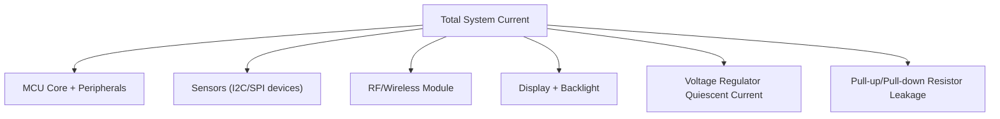
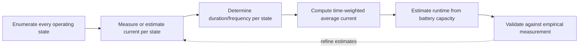

## Power Consumption Analysis and Budgeting

### Overview

Power consumption analysis and budgeting is the process of quantifying, predicting, and managing the electrical energy a device consumes across its operating modes to meet battery life, thermal, and power-supply design targets. In embedded systems — especially battery-powered or energy-harvested devices — this is often as central a design constraint as functionality itself, requiring systematic accounting of every subsystem's current draw across every operating state and duration.

### Core Concepts

#### Current, Charge, and Energy Relationships

Power budgeting fundamentally tracks current draw over time, converted into charge and energy consumed.

$$Q = \int_0^T I(t)\, dt \quad \text{(charge, in coulombs or mAh when scaled)}$$


$$E = \int_0^T V(t) \cdot I(t)\, dt \quad \text{(energy, in joules or Wh)}$$

For a battery-powered device with roughly constant voltage, average current draw and total battery capacity give an estimated runtime:

$$T_{\text{runtime}} \approx \frac{C_{\text{battery}} \text{(mAh)}}{I_{\text{avg}} \text{(mA)}}$$

**Key Points**

- Battery capacity ratings (mAh) are typically specified at a particular discharge rate and temperature; actual usable capacity can differ under different load profiles, a phenomenon related to **Peukert's law** for some battery chemistries, especially at high discharge currents relative to capacity. [Inference — the practical significance of this effect depends heavily on battery chemistry (e.g., more pronounced in some lead-acid types than in modern Li-ion/LiPo cells) and the specific discharge profile; consult the cell's datasheet discharge curves for accurate runtime estimation.]
- This runtime formula assumes constant average current, which is rarely true in practice; real embedded systems have highly variable current draw across operating modes, requiring a weighted/time-averaged calculation (see Duty-Cycle Averaging below) rather than a single flat number.

### Operating Modes and Current States

#### Typical MCU Power Modes

Most modern MCUs expose several distinct power states, each with substantially different current draw:

| Mode | Typical Behavior | Relative Current Draw |
| --- | --- | --- |
| Active/Run | CPU executing, peripherals active | Highest (mA range) |
| Sleep/Idle | CPU clock-gated, peripherals active, wakes on interrupt | Reduced (sub-mA to low mA) |
| Stop/Standby | Most clocks stopped, RAM retained, wakes on specific events | Very low (µA range) |
| Shutdown/Hibernate | Minimal retention (or none), longest wake time | Lowest (nA to low µA range) |

**Key Points**

- Exact mode names, available states, and their current figures are vendor- and part-specific; datasheet electrical characteristics tables are the authoritative source, not generic mode names. [Behavior may vary significantly across MCU families and even between parts within the same family.]
- Deeper sleep modes generally trade off wake-up latency and state retention (RAM contents, peripheral configuration) for lower current draw; selecting the appropriate mode requires balancing responsiveness requirements against power budget.

#### Peripheral and External Component Contributions

Total system current draw is the MCU plus all active peripherals and external components:



**Key Points**

- Voltage regulator quiescent current (the regulator's own overhead, independent of load) is frequently overlooked in early estimates but can dominate total system current in deep-sleep states, where the regulator's own consumption may exceed the MCU's sleep-mode draw; low-IQ (low quiescent current) regulators are a common component-level choice for battery-powered designs.
- External pull-up/pull-down resistors, LED indicators, and similar "always-on" passive elements contribute continuous current that is easy to overlook but can be significant relative to a deep-sleep MCU's microamp-level draw.

### Building a Power Budget

#### Duty-Cycle Averaging

Since real systems cycle between modes, average current is a time-weighted sum across all states in a representative operating cycle:

$$I_{\text{avg}} = \frac{\sum_{i} I_i \cdot t_i}{\sum_{i} t_i}$$

**Example: Simple Sensor Node Duty Cycle**

Consider a sensor node that wakes every 60 seconds, takes a reading, transmits over radio, then sleeps:

| State | Current | Duration |
| --- | --- | --- |
| Deep sleep | 2 µA | 59.5 s |
| Wake + sensor read (active) | 8 mA | 0.05 s |
| Radio TX | 25 mA | 0.45 s |

$$I_{\text{avg}} = \frac{(2\mu A \times 59.5) + (8mA \times 0.05) + (25mA \times 0.45)}{60}$$


$$I_{\text{avg}} = \frac{(0.000002 \times 59.5) + (0.008 \times 0.05) + (0.025 \times 0.45)}{60} \approx \frac{0.0001190 + 0.0004 + 0.01125}{60} \approx \frac{0.01177}{60} \approx 196\ \mu A$$

**Example**

With a 1000 mAh battery: $T_{\text{runtime}} \approx \frac{1000\text{mAh}}{0.196\text{mA}} \approx 5102$ hours, roughly 212 days. [Inference — this is an idealized estimate; real-world runtime will typically be shorter due to battery self-discharge, capacity derating at low discharge currents/temperature extremes, and any duty-cycle activity not captured in this simplified model.]

**Key Points**

- Even brief high-current events (radio TX, sensor active periods) can dominate the average if the sleep current is sufficiently low, making transmission duration and frequency often the single largest lever for extending battery life in duty-cycled sensor nodes.
- Real duty cycles usually have more states than this simplified example (e.g., separate sensor warm-up, ADC conversion, radio ramp-up/ramp-down transients) — each transition and sub-state should ideally be measured or estimated individually for an accurate budget.

### Sources of Power Consumption Data

#### Datasheet Figures vs. Empirical Measurement

- **Datasheet typical/max current values** — useful for early-stage estimation and worst-case bounding, but measured under specific test conditions (voltage, temperature, clock configuration) that may not match the actual application.
- **Empirical measurement** — using a precision current meter, oscilloscope with current probe, or dedicated power profiling tool (e.g., a source-measure unit or tools like the Nordic Power Profiler Kit, Joulescope, or similar) to directly measure actual current draw in the real application context.

**Key Points**

- Datasheet current figures are typically given for specific configurations (e.g., "all peripherals disabled, 25°C, VDD = 3.3V"); actual application current can differ meaningfully if the real configuration differs (peripherals enabled, different clock source, different temperature). [Inference — the magnitude of this difference is configuration- and part-specific and cannot be generalized without checking the specific datasheet's stated test conditions.]
- Empirical measurement is generally necessary for final power budget validation before production, since it captures effects (PCB leakage paths, actual peripheral configuration, real transition timings) that datasheet figures alone cannot fully predict.

### Software-Level Power Optimization Techniques

#### Reducing Active Time

- **Event-driven architecture over polling** — sleeping until an interrupt occurs rather than periodically waking to poll a status flag directly reduces active time (see ISR design's role in enabling low-power wake-on-interrupt patterns).
- **Batch processing** — accumulating data and processing/transmitting in batches rather than continuously, amortizing wake-up/ramp-up overhead across more useful work per wake event.
- **Clock scaling** — reducing CPU clock frequency when full performance is not needed can reduce active-mode current, though the relationship between clock frequency and total energy for a fixed task is not always straightforward, since a task run at half clock speed for twice as long may consume similar or even more total energy depending on the specific power/frequency curve of the core. [Inference — the energy-optimal clock frequency for a given task is architecture- and workload-dependent; this is sometimes referred to as race-to-sleep vs. dynamic frequency scaling as competing energy-optimization strategies, and the better strategy is not universal.]

```c
void low_power_wait_for_event(void) {
    enter_sleep_mode();          // CPU halts, wakes on any enabled interrupt
    // execution resumes here after wake
}
```

#### Peripheral Power Gating

Disabling clock/power to unused peripherals (via clock gating registers or power domain switches) reduces both dynamic and static current contributions from hardware not currently in use.

```c
void enter_low_power_idle(void) {
    disable_unused_peripheral_clocks();
    adc_power_down();
    spi_peripheral_disable();
    enter_sleep_mode();
}
```

**Key Points**

- Peripheral wake-up time after re-enabling (oscillator startup, ADC settling time, sensor power-on delay) must be accounted for in timing budgets, since aggressive power gating can introduce latency that conflicts with real-time responsiveness requirements.
- Some peripherals retain configuration state across certain sleep modes while others require full reconfiguration on wake; this behavior is mode- and peripheral-specific and should be verified against the datasheet rather than assumed. [Behavior may vary by specific MCU and selected low-power mode.]

### Wireless Communication Power Considerations

#### Radio Duty Cycling

Radio transmission and reception are typically the most power-intensive operations in connected embedded devices. Common power-reduction strategies include:

- **Reducing transmission frequency/payload size** — sending less data, less often.
- **Adaptive/opportunistic transmission** — batching multiple readings before transmitting rather than transmitting per-reading.
- **Duty-cycled radio listening** — many low-power wireless protocols (e.g., BLE, certain 802.15.4-based stacks) define listen/sleep intervals rather than continuous reception, trading latency for power savings.
- **Transmit power level selection** — using the minimum transmit power that achieves reliable link margin, rather than defaulting to maximum power.

**Key Points**

- The relationship between transmit power setting and actual range/reliability is affected by antenna design, environment, and interference, so minimum viable transmit power is generally determined empirically for the specific deployment environment rather than assumed from a datasheet figure alone. [Inference — exact power/range relationship is highly deployment- and environment-specific.]
- Protocol-level power behavior (e.g., BLE connection interval, advertising interval) is often a primary lever for power/latency tradeoffs and is typically configured at the application/protocol-stack level rather than being a pure hardware concern.

### Power Budget Documentation Pattern

#### Structuring a Power Budget Table

A practical power budget is typically documented as a table enumerating every distinguishable current-consuming state, its magnitude, and its duration/frequency within a representative cycle — as shown in the duty-cycle example above — with a running total and resulting runtime estimate. This should be treated as a living document updated as hardware and firmware evolve, since power draw is sensitive to seemingly minor changes (an added pull-up resistor, a peripheral left enabled, a longer radio transmission due to protocol overhead).



**Key Points**

- Treating the power budget as a one-time calculation rather than an ongoing tracked artifact is a common project pitfall — firmware changes late in development frequently erode power margins established early on.
- Margin (a safety factor below the theoretically calculated runtime) is standard practice, since real-world variability (battery aging, temperature effects, manufacturing tolerance, unaccounted-for states) typically causes actual runtime to fall short of idealized calculations. [Inference — appropriate margin percentage is project- and risk-tolerance-specific; there is no single universal figure.]

### Common Pitfalls

| Pitfall | Consequence | Mitigation |
| --- | --- | --- |
| Using only datasheet "typical" active current | Underestimates real-world power draw | Combine datasheet bounds with empirical measurement |
| Ignoring regulator quiescent current | Sleep-mode budget significantly underestimated | Select low-IQ regulator, include in budget |
| Treating average current as constant | Inaccurate runtime prediction for bursty workloads | Use time-weighted duty-cycle averaging across all states |
| Not accounting for peripheral wake-up latency | Power savings estimate ignores real transition overhead | Measure and include transition/ramp-up time and current |
| No margin in runtime estimate | Field devices underperform target battery life | Apply a deliberate safety margin below calculated runtime |
| Power budget not revisited after firmware changes | Budget becomes stale and inaccurate over project lifecycle | Treat power budget as a maintained, living document |

### Conclusion

Power consumption analysis and budgeting requires systematically enumerating every operating state and component's current contribution, weighting by realistic duty-cycle duration, and validating estimates against empirical measurement rather than datasheet figures alone. Because real systems are dominated by transitions and bursts (wake events, radio transmissions, sensor active periods) rather than a single steady-state current, accurate budgeting depends on capturing the full time-weighted profile of system behavior, maintained as an evolving artifact throughout the project rather than a one-time calculation.

**Related Topics**

- Low-power MCU sleep mode configuration and wake-source selection
- Interrupt service routine design for wake-on-event architectures
- Battery chemistry characteristics and discharge curve behavior
- Wireless protocol power profiles (BLE, 802.15.4, LoRa duty cycling)
- Voltage regulator selection (LDO vs. switching, quiescent current tradeoffs)
- Energy harvesting system design for battery-free or battery-assisted devices
- Thermal design considerations linked to power dissipation