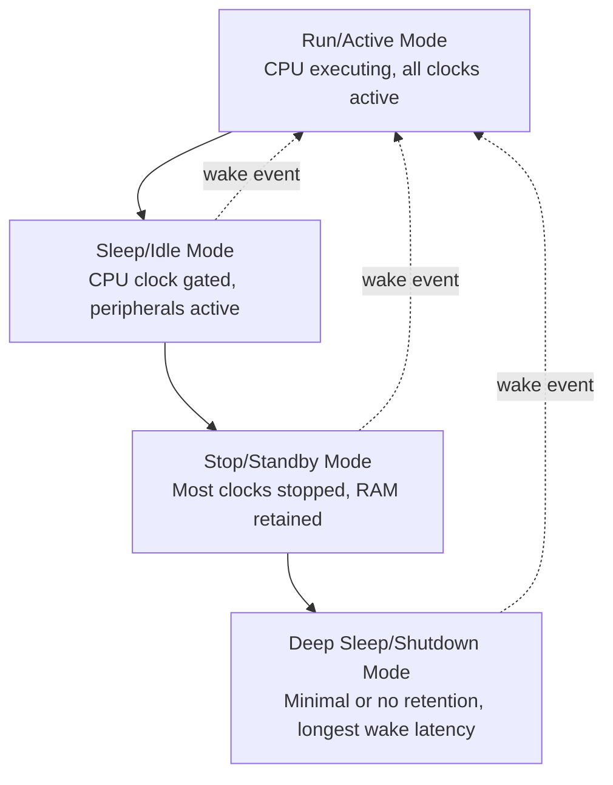
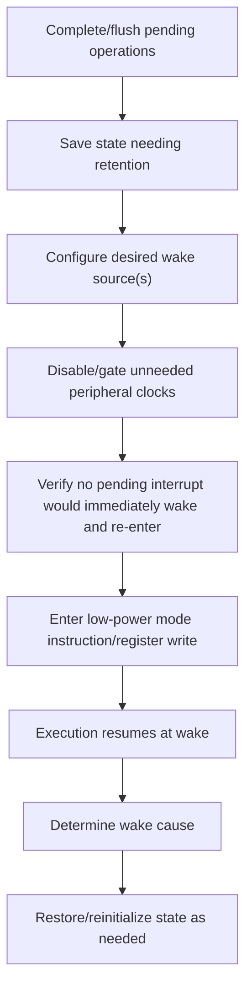
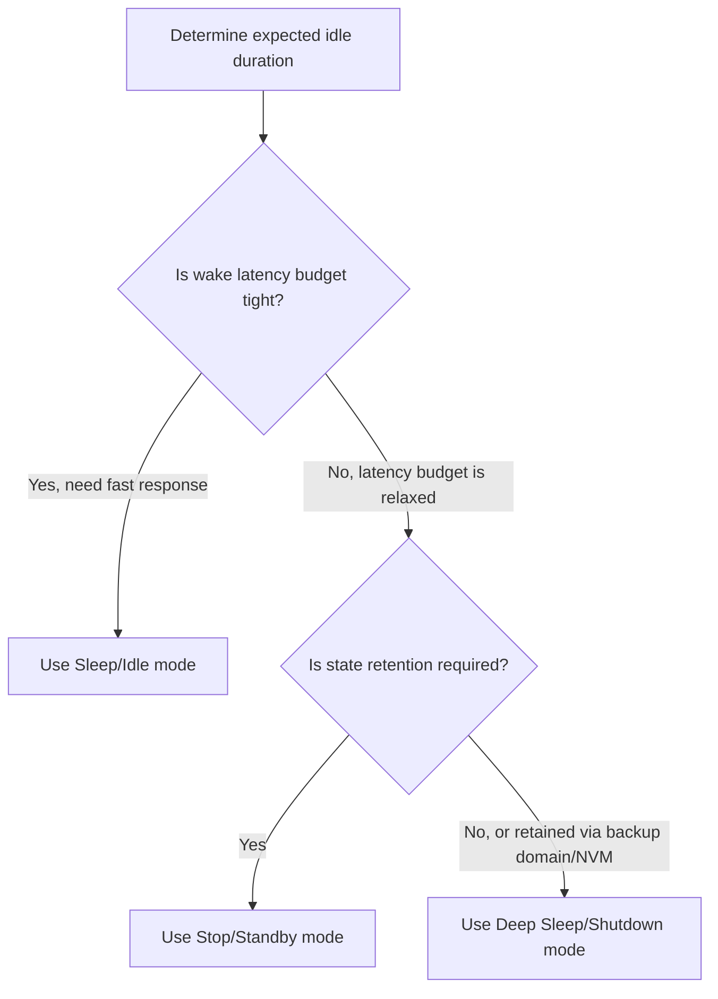

## Sleep, Standby, and Deep-Sleep Modes

### Overview

Low-power operating modes allow a microcontroller to reduce current consumption during periods of inactivity by selectively disabling clocks, power domains, and peripherals, then restoring operation on a defined wake event. Effective use of these modes is foundational to battery-powered and energy-constrained embedded system design. This topic covers the general hierarchy of low-power modes, wake-source configuration, state retention tradeoffs, and the software patterns used to enter and exit them correctly.

### The Low-Power Mode Hierarchy

#### General Mode Categories

While naming and exact behavior vary by vendor, most MCU families expose a hierarchy of increasingly aggressive low-power modes, trading wake-up latency and state retention for lower current draw.



**Key Points**

- Mode names are not standardized across vendors — "Sleep," "Stop," "Standby," "Deep Sleep," "Shutdown," and "Hibernate" are used inconsistently between manufacturers and sometimes even between product families from the same manufacturer, so behavior must always be verified against the specific part's reference manual rather than assumed from the name. [Behavior may vary significantly by vendor and part family.]
- The general trend holds across most architectures: deeper modes disable more clock domains and power rails, reduce current draw further, but increase wake-up latency and reduce what state is automatically retained.

#### Comparative Mode Characteristics

| Mode Category | CPU State | RAM Retention | Peripheral State | Typical Wake Latency | Typical Current |
| --- | --- | --- | --- | --- | --- |
| Sleep/Idle | Halted, clock gated | Fully retained | Fully retained, most peripherals can still operate | Very fast (µs range) | Sub-mA to low mA |
| Stop/Standby | Powered down | Retained (sometimes partial) | Mostly powered down, limited wake sources | Moderate (µs to low ms) | Low µA range |
| Deep Sleep/Shutdown | Fully powered down | Often not retained, or only a small backup domain | Powered down except minimal wake logic | Slow (ms range, similar to reset) | nA to very low µA range |

**Key Points**

- These figures are illustrative and representative, not universal — actual current draw and latency for any given mode must be taken from the specific MCU's datasheet electrical characteristics table.
- Some architectures provide a small always-on "backup domain" (retaining a handful of registers or a small RAM block, often powered by a separate small rail or coin cell) even in the deepest sleep modes, useful for retaining critical state like a real-time clock or a few bytes of context across an otherwise full power-down. [Behavior may vary by specific MCU family; not all parts offer this feature.]

### Wake Source Configuration

#### Common Wake Event Types

- **External GPIO interrupt/edge** — a pin transition (button press, sensor interrupt, communication line activity) wakes the device.
- **RTC/timer alarm** — a real-time clock or dedicated low-power timer configured to wake the device after a set interval or at a specific time.
- **Watchdog timeout** (in some architectures, a watchdog can be configured as a periodic wake source rather than purely a fault-recovery mechanism).
- **Communication peripheral activity** — some low-power UART/I2C/SPI peripherals can wake the core on detecting incoming data or a specific address match, without requiring the CPU to be active to detect the initial signal.
- **Analog comparator/threshold event** — an analog comparator continuing to operate in low-power mode can wake the system when a monitored signal crosses a threshold.

```c
void enter_stop_mode_wake_on_button(void) {
    configure_gpio_wake_source(BUTTON_PIN, EDGE_FALLING);
    disable_unused_peripheral_clocks();
    enter_stop_mode();
    // execution resumes here after wake, following the mode's defined wake sequence
}
```

**Key Points**

- Not all peripherals remain capable of generating wake events in every low-power mode; deeper modes typically restrict the wake source list to a small subset (often just RTC and a limited number of dedicated wake-capable GPIO pins), so the required wake source availability should be checked against the specific target mode before committing to a design. [Behavior may vary by MCU family and selected mode.]
- Multiple simultaneous wake sources are common (e.g., wake on either a button press or a periodic RTC alarm, whichever occurs first); firmware typically needs to check a wake-status/reset-cause register after waking to determine which source actually triggered the wake.

### State Retention and Context Restoration

#### What Survives Across Mode Transitions

The defining tradeoff of deeper low-power modes is what state is preserved versus lost:

| State Element | Sleep/Idle | Stop/Standby | Deep Sleep/Shutdown |
| --- | --- | --- | --- |
| CPU registers | Retained | Retained (mode-dependent) | Typically lost |
| Main RAM contents | Retained | Retained (often) | Often lost, sometimes partial retention |
| Peripheral configuration | Retained | May require reconfiguration | Typically lost, full reinit required |
| Program counter / execution point | Resumes exactly where halted | Resumes where halted (if state retained) | Typically restarts from reset vector |

**Key Points**

- When a mode does not retain execution context, firmware must be structured to detect "woke from deep sleep" at startup (via a reset-cause register) and branch into an appropriate resume path rather than assuming normal cold-boot initialization is always correct or always necessary — some designs intentionally treat every deep-sleep wake as a fresh boot for simplicity, accepting the reinitialization cost. [Inference — whether to treat deep-sleep wake as equivalent to reset or as a special resume path is an application-specific design decision with real firmware-complexity tradeoffs.]
- Any application state needed across a non-retaining sleep mode (last sensor reading, accumulated counters, calibration data) must be explicitly saved to a retained memory region (backup RAM domain, if available) or non-volatile storage (flash, FRAM, EEPROM) before entering that mode.

#### Reset Cause / Wake Reason Detection

```c
typedef enum {
    RESET_CAUSE_POWER_ON,
    RESET_CAUSE_WATCHDOG,
    RESET_CAUSE_DEEP_SLEEP_WAKE,
    RESET_CAUSE_EXTERNAL_RESET_PIN,
} reset_cause_t;

reset_cause_t get_reset_cause(void) {
    // Implementation reads a vendor-specific status register
    // that is cleared as part of the detection routine
    if (PWR->CSR & PWR_CSR_SBF) return RESET_CAUSE_DEEP_SLEEP_WAKE;
    if (RCC->CSR & RCC_CSR_WDGRSTF) return RESET_CAUSE_WATCHDOG;
    return RESET_CAUSE_POWER_ON;
}
```

**Key Points**

- Reset-cause registers typically need to be explicitly cleared by firmware after reading, since they otherwise persist and could be misread on a subsequent, unrelated reset event.
- Distinguishing wake-from-deep-sleep from a genuine power-on-reset or watchdog-triggered reset is important for correct application behavior — for example, skipping a lengthy sensor calibration routine on deep-sleep wake if calibration data was preserved in a backup domain.

### Software Patterns for Entering Low-Power Modes

#### Pre-Sleep Checklist Pattern

A robust sleep-entry routine typically follows a consistent sequence:



**Key Points**

- Step E (verifying no pending interrupt is already set) matters because entering a low-power mode with a pending, unhandled interrupt flag can cause the device to wake immediately, defeating the purpose of the sleep entry, or in some architectures cause the low-power entry instruction itself to be effectively skipped. [Behavior may vary by architecture — some cores define specific behavior for this race condition (e.g., ARM Cortex-M's WFI/WFE semantics around pending exceptions), which should be checked against the architecture reference manual.]
- Incomplete peripheral transactions (an in-progress UART transmission, an unfinished flash write) should generally be allowed to complete before entering a mode that would gate the clock those operations depend on, since interrupting them mid-operation can corrupt data or leave a peripheral in an inconsistent state.

#### Race Condition: Missed Wake Events

A classic low-power bug occurs when a wake-triggering event happens in the narrow window between checking a condition and actually entering sleep, causing the device to sleep through an event it should have woken for.

```c
// Vulnerable pattern (race condition possible)
while (!event_flag) {
    enter_sleep_mode();  // if event_flag becomes true here, between check and sleep, wake is missed until next unrelated wake
}
```

**Key Points**

- Architectures with a wait-for-event-style instruction (e.g., ARM Cortex-M `WFE` combined with the event-latching `SEV`/exception-as-event mechanism) provide specific primitives designed to close this race condition; using a plain "disable interrupts, check flag, sleep" sequence without such a mechanism can still leave a race window depending on the exact core and how sleep entry interacts with pending interrupt state. [Inference — the precise safety of a given check-then-sleep pattern depends on the specific core's documented semantics for entering low-power mode with a pending or newly-asserted interrupt; this should be verified against the architecture reference manual rather than assumed.]
- Disabling interrupts immediately before the check-and-sleep sequence and re-enabling them atomically as part of the sleep-entry instruction (where the architecture supports this) is a common pattern to close the race window.

### Peripheral Behavior Across Sleep Modes

#### Clock Domain Dependencies

Each peripheral typically depends on a specific clock source (main system clock, a slower always-on low-power clock, or an independent oscillator). Whether a peripheral remains functional in a given sleep mode depends on whether its required clock domain remains active in that mode.

```c
// Example: keeping a low-power timer running in Stop mode by
// clocking it from an independent low-power oscillator rather
// than the main system clock, which is gated in Stop mode
void configure_lptim_for_stop_mode_wake(void) {
    clock_select_lptim_source(CLOCK_SOURCE_LSE);  // low-speed external oscillator
    lptim_enable();
    lptim_set_wake_interval(WAKE_INTERVAL_MS);
}
```

**Key Points**

- Selecting an always-on, low-power clock source for any peripheral that must remain active as a wake source in deeper sleep modes (commonly an RTC or low-power timer clocked from a low-speed external/internal oscillator) is a standard and often necessary design pattern.
- Peripherals clocked from the main high-speed system clock are typically unavailable as wake sources in stop/standby-class modes, since that clock domain is usually one of the first disabled when entering such modes.

### Power Mode Selection Strategy

#### Choosing the Appropriate Mode for a Given Idle Period



**Key Points**

- The most aggressive available mode is not always the correct choice — if wake latency exceeds an application's responsiveness requirement (e.g., a control loop that must respond to a sensor event within a few microseconds), a shallower mode may be necessary despite its higher current draw.
- Some applications use a mixed strategy: a fast-responding shallow sleep mode for most idle periods, combined with an occasional deeper mode entry during known-longer idle windows (e.g., overnight, or during a known extended inactivity period), rather than a single fixed mode choice throughout operation.

### Common Pitfalls

| Pitfall | Consequence | Mitigation |
| --- | --- | --- |
| Entering sleep with pending unhandled interrupt | Immediate/unexpected wake, or missed sleep entry | Verify pending interrupt state per architecture's documented sleep-entry semantics |
| Assuming state retention in a mode that doesn't provide it | Corrupted or stale state used after wake | Explicitly save required state to a retained region before entering non-retaining modes |
| Wake source clocked from a domain disabled in the target mode | Device never wakes / expected wake source silently non-functional | Clock wake-source peripherals from an always-on low-power oscillator |
| Missed wake event due to check-then-sleep race condition | Device sleeps through an event it should have responded to | Use architecture-provided atomic wait-for-event primitives where available |
| Interrupting an in-progress peripheral transaction by sleeping | Corrupted transaction, inconsistent peripheral state | Allow pending operations to complete before entering a mode that gates their clock |
| Not distinguishing wake-from-sleep from cold power-on-reset | Incorrect reinitialization path, wasted time or lost context | Check and act on reset-cause/wake-reason register at startup |

### Conclusion

Sleep, standby, and deep-sleep modes form a hierarchy trading power savings against wake latency and state retention, with exact behavior, naming, and available wake sources varying significantly by MCU vendor and family. Correct use requires deliberately selecting the appropriate mode for each idle period's latency and retention requirements, carefully configuring wake sources on clock domains that remain active in the target mode, explicitly preserving any state not automatically retained, and closing race conditions between event detection and sleep entry.

**Related Topics**

- Power consumption analysis and budgeting across operating modes
- Interrupt service routine design for wake-on-event handling
- Real-time clock (RTC) and low-power timer peripheral configuration
- Non-volatile state preservation strategies (backup RAM, flash, FRAM)
- Watchdog timer design and reset-cause detection
- Clock tree and oscillator source selection for low-power operation
- RTOS tickless idle mode implementation