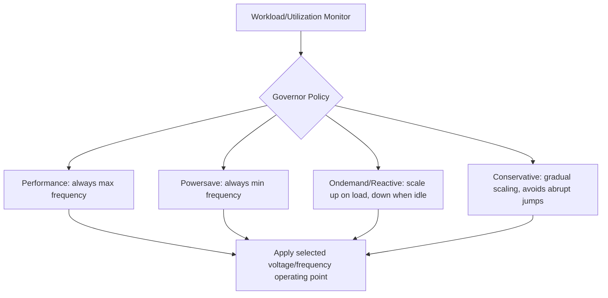
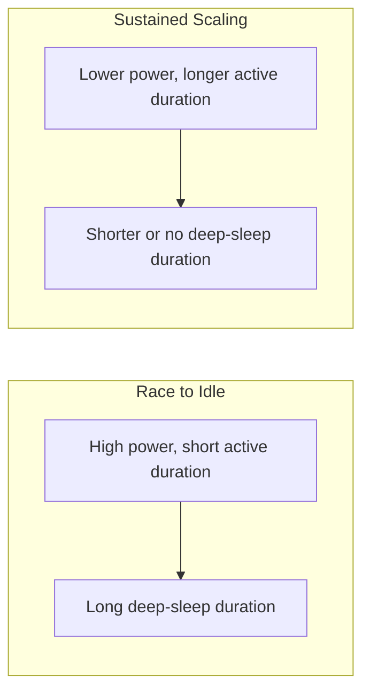
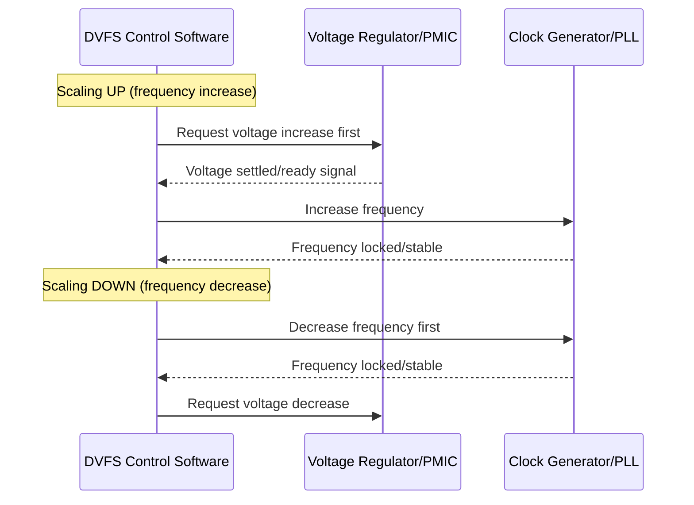

## Dynamic Voltage and Frequency Scaling

### Overview

Dynamic Voltage and Frequency Scaling (DVFS) is a power management technique that adjusts a processor's operating frequency and supply voltage at runtime based on current performance demand, rather than running continuously at a fixed maximum operating point. Because dynamic power consumption scales with both clock frequency and the square of supply voltage, reducing voltage alongside frequency during periods of lower workload can yield substantial energy savings without permanently sacrificing peak performance capability. DVFS is common in application-class embedded processors (e.g., those running Linux) and increasingly present in more capable microcontrollers.

### The Power-Frequency-Voltage Relationship

#### Dynamic Power Scaling

Dynamic (switching) power in CMOS digital logic is approximately described by:

$$P_{\text{dynamic}} \approx C \cdot V^2 \cdot f$$

where $C$ is switched capacitance, $V$ is supply voltage, and $f$ is clock frequency. Because power scales with the **square** of voltage, even a modest voltage reduction can yield a disproportionately large power saving, which is why DVFS couples frequency reduction with voltage reduction rather than adjusting frequency alone.

**Key Points**

- This formula is a simplified model of dynamic power; actual chip power also includes static/leakage power, which does not scale the same way and has become an increasingly significant fraction of total power in modern process nodes. [Inference — the relative contribution of leakage vs. dynamic power depends heavily on the specific silicon process node and operating temperature; this cannot be generalized across all embedded processors.]
- The reason voltage cannot be reduced independently of frequency (only frequency lowered while holding voltage constant) is that a given voltage level can only reliably support switching up to a maximum frequency before timing margins in the digital logic are violated; each frequency point has a corresponding minimum safe voltage.

#### Voltage-Frequency Operating Points

Processors supporting DVFS typically define a discrete table of valid (voltage, frequency) pairs — often called operating performance points (OPPs) — rather than allowing arbitrary continuous combinations.

| Performance Point | Frequency | Voltage | Relative Power |
| --- | --- | --- | --- |
| P0 (max performance) | 1.2 GHz | 1.15 V | Highest |
| P1 | 800 MHz | 1.00 V | Reduced |
| P2 | 400 MHz | 0.90 V | Lower |
| P3 (min performance) | 100 MHz | 0.80 V | Lowest |

**Key Points**

- These operating points and their voltage/frequency pairings are determined by the silicon vendor through characterization and binning, and are provided as calibrated tables (often in the SoC datasheet or a platform-specific configuration file) rather than something firmware derives independently.
- Some processors exhibit part-to-part variation in the minimum safe voltage for a given frequency due to manufacturing process variation, addressed via techniques like adaptive voltage scaling where each individual chip is calibrated at manufacturing test time; availability of this refinement is platform-specific. [Behavior may vary — not all DVFS-capable parts implement per-chip calibration; many use a single conservative voltage/frequency table applied uniformly across all units.]

### DVFS Governance Strategies

#### Governor Policies

The logic deciding which operating point to select at any given time is often called a governor (terminology borrowed from the Linux `cpufreq` subsystem, though the underlying concept applies more broadly).



**Key Points**

- **Performance** and **powersave** governors are static policies (always at one extreme), useful when workload characteristics are well-known and fixed, or as a simple baseline before implementing more adaptive logic.
- **Ondemand-style** governors react to measured CPU utilization, scaling up aggressively when load increases (to minimize latency-visible slowdown) and scaling down during idle periods; the specific thresholds and reaction speed are tunable parameters that trade responsiveness against power savings.
- **Conservative-style** governors change operating points more gradually (stepping through intermediate points rather than jumping directly to maximum), which can reduce voltage/frequency transition overhead and avoid the perceptible current spikes and potential power-supply stress associated with large, abrupt jumps, at the cost of slower response to sudden load increases.

### Race-to-Idle vs. Sustained Low Power

#### Two Competing Energy Strategies

A central and non-obvious tradeoff in DVFS-capable systems is whether it is more energy-efficient to:

1. **Race to idle** — run at maximum frequency/voltage to finish a task as quickly as possible, then enter a deep sleep mode for the remaining idle time.
2. **Sustained scaling** — run at a reduced frequency/voltage for a longer duration to complete the same task, avoiding the higher instantaneous power of maximum performance mode.



**Key Points**

- Which strategy yields lower total energy for a given task depends on the relative power draw of the deepest available sleep mode versus the reduced-frequency active mode, and on whether static/leakage power during the longer active period at reduced frequency outweighs the dynamic power saved — this is workload- and platform-specific and does not have a universal answer. [Inference — the energy-optimal strategy requires either empirical measurement or a detailed power model of the specific platform; general claims that one strategy is always superior are not reliable.]
- In practice, many systems favor race-to-idle when a genuinely deep, very-low-current sleep mode is available and quickly reachable after task completion, since deep sleep current is often dramatically lower than even the most reduced active-mode current — but this is a tendency, not a guaranteed rule, and should be validated for the specific platform and workload.

### DVFS Transition Mechanics

#### Sequencing a Voltage/Frequency Change

Changing operating point safely requires careful sequencing, since running at a frequency the current voltage cannot support (or briefly running while voltage is settling) risks unreliable operation.



**Key Points**

- The general safe-sequencing principle is: when increasing performance, raise voltage before raising frequency; when decreasing performance, lower frequency before lowering voltage — ensuring the supply voltage is always sufficient for whatever frequency is currently active at every point during the transition.
- Voltage regulator settling time (the time for output voltage to stabilize after a setpoint change) is a real, non-zero delay that DVFS transition logic must wait for before proceeding to the next step; how this settling is detected (dedicated ready/power-good signal vs. a fixed conservative delay) is platform- and PMIC-specific. [Behavior may vary by the specific voltage regulator/PMIC used.]

### Software Interfaces for DVFS

#### Operating System-Level Support

On Linux-capable embedded processors, DVFS is typically managed through the `cpufreq` subsystem, exposing governor selection and available frequency tables via `sysfs`.

```c
// Illustrative: reading available frequencies via sysfs on Linux
// (actual path may vary by kernel version and platform)
// cat /sys/devices/system/cpu/cpu0/cpufreq/scaling_available_frequencies
// echo "ondemand" > /sys/devices/system/cpu/cpu0/cpufreq/scaling_governor
```

On bare-metal or RTOS-based systems without an OS-level DVFS framework, the application or RTOS port itself is typically responsible for directly manipulating clock and voltage regulator peripherals according to the sequencing principles above.

```c
int set_performance_point(dvfs_opp_t target_opp) {
    if (target_opp.freq_hz > current_freq_hz) {
        pmic_set_voltage(target_opp.voltage_mv);
        wait_for_voltage_settled();
        clock_set_frequency(target_opp.freq_hz);
    } else {
        clock_set_frequency(target_opp.freq_hz);
        pmic_set_voltage(target_opp.voltage_mv);
    }
    current_freq_hz = target_opp.freq_hz;
    return 0;
}
```

**Key Points**

- Bare-metal/RTOS DVFS implementations must independently reimplement the safe transition sequencing that an OS-level framework like `cpufreq` would otherwise provide, making correct voltage/frequency ordering the firmware developer's direct responsibility.
- Peripheral clock dependencies must also be considered during a frequency change — some peripherals derive their clock from the same PLL/clock tree being scaled, and may need reconfiguration (e.g., baud rate divisors, timer prescalers) to maintain correct timing after a core frequency change. [Inference — the specific set of affected peripherals depends entirely on the target SoC's clock tree architecture.]

### Workload-Aware Scaling Considerations

#### Real-Time Constraint Interaction

DVFS introduces a tension with real-time systems: scaling down frequency to save power increases the time required to complete a fixed amount of work, which can jeopardize deadline guarantees if not accounted for in scheduling analysis.

**Key Points**

- Real-time systems using DVFS typically require deadline-aware scaling algorithms that select the minimum frequency/voltage still guaranteed to meet a task's deadline, rather than purely reactive utilization-based governors, since a purely reactive governor could scale down at a moment that causes a deadline miss. [Inference — the specific algorithm needed depends on the real-time guarantees required (hard vs. soft real-time) and the scheduling framework in use; this is an active area of real-time systems research with multiple competing approaches rather than one settled standard technique.]
- Worst-case execution time (WCET) analysis for real-time tasks on a DVFS-capable system must account for the possibility of running at a reduced frequency, or the system must guarantee a minimum frequency floor during time-critical operations to keep WCET analysis valid.

### Common Pitfalls

| Pitfall | Consequence | Mitigation |
| --- | --- | --- |
| Increasing frequency before voltage has risen sufficiently | Timing violations, unreliable operation, potential crash | Always raise voltage first when scaling up, and confirm settling before increasing frequency |
| Decreasing voltage before frequency has been lowered | Operating at unsupported voltage/frequency combination | Always lower frequency first when scaling down |
| Ignoring voltage regulator settling time | Transition to a new operating point before supply has stabilized | Wait for confirmed settling (ready signal or adequately conservative delay) before proceeding |
| Applying DVFS to real-time tasks without deadline-aware logic | Missed deadlines under reduced-frequency operation | Use deadline-aware scaling or maintain a guaranteed minimum frequency floor for time-critical work |
| Not reconfiguring dependent peripheral clock dividers after a frequency change | Incorrect peripheral timing (wrong baud rate, timer period) | Update all dependent peripheral clock/prescaler settings as part of the transition sequence |
| Assuming one strategy (race-to-idle or sustained scaling) is universally optimal | Suboptimal energy consumption for the specific workload | Evaluate empirically or via platform-specific power modeling rather than assuming |

### Conclusion

Dynamic Voltage and Frequency Scaling exploits the quadratic relationship between supply voltage and dynamic power to reduce energy consumption during periods of lower performance demand, using discrete, vendor-characterized voltage/frequency operating points selected by a governor policy. Correct implementation requires careful transition sequencing (voltage-then-frequency when scaling up, frequency-then-voltage when scaling down), awareness of dependent peripheral clock configurations, and — in real-time contexts — deadline-aware scaling logic to avoid trading power savings for missed timing guarantees.

**Related Topics**

- Power consumption analysis and budgeting across operating modes
- Sleep, standby, and deep-sleep mode design
- Clock tree and PLL configuration for embedded processors
- Real-time scheduling theory and worst-case execution time analysis
- PMIC (power management IC) interfacing and voltage regulator control
- Thermal management and its interaction with performance scaling
- Linux `cpufreq` and power management framework internals