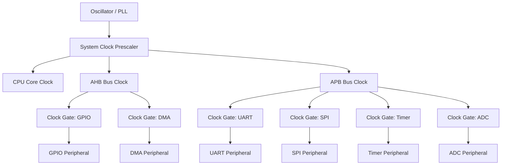
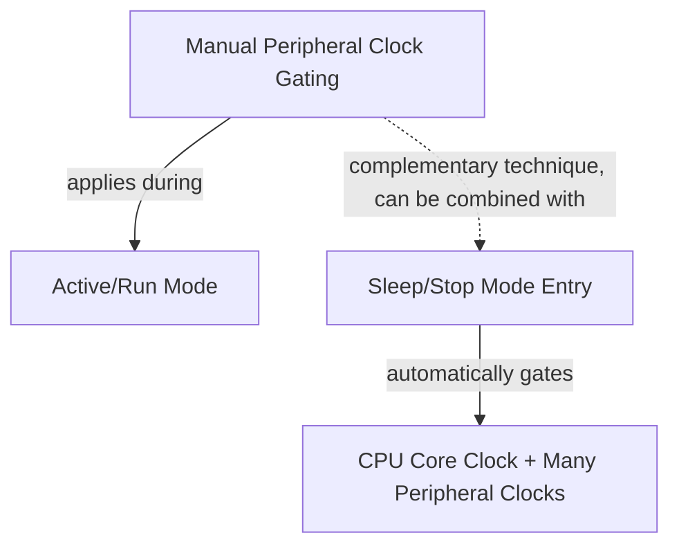

## Peripheral Clock Gating

### Overview

Peripheral clock gating is a low-power design technique that disables the clock signal delivered to unused or inactive peripheral blocks, eliminating the dynamic switching power those blocks would otherwise consume even while performing no useful work. Unlike full sleep modes that halt the entire core, clock gating operates at a finer granularity — individual peripherals or peripheral groups can have their clocks independently enabled or disabled while the CPU and other peripherals continue operating normally. This makes it a foundational, always-available power optimization technique layered underneath (and often combined with) broader sleep-mode strategies.

### Why Clock Gating Reduces Power

#### Dynamic Power and Unused Switching Activity

Digital CMOS logic consumes dynamic power primarily through the switching of transistors as clock edges propagate through the circuit, regardless of whether that switching produces useful output. A peripheral block that is clocked but not actively performing an operation still incurs this switching power in its clocked registers and logic, simply toggling state with no functional benefit.

$$P_{\text{dynamic}} \approx C \cdot V^2 \cdot f$$

Gating the clock ($f \to 0$ for that block) removes this switching activity entirely for the gated domain, while leaving the rest of the system's clock tree and voltage unaffected.

**Key Points**

- Clock gating specifically targets dynamic power; it does not eliminate static/leakage current in the gated block, since transistors remain powered even though they are not switching — for leakage elimination, a full power domain shutdown (power gating) rather than clock gating is required, which is a distinct and typically more involved technique.
- Because clock gating operates on individual peripheral blocks rather than the whole chip, it can be applied continuously during normal active operation (e.g., gating an unused SPI peripheral's clock while the CPU and UART remain fully active), not only during dedicated sleep-mode entry.

### Clock Tree Architecture and Gating Points

#### Typical MCU Clock Distribution

Most MCUs distribute clock signals from one or more source oscillators/PLLs through a clock tree, with individual gating (enable/disable) points at each peripheral's clock input, typically controlled via dedicated clock-enable registers.



**Key Points**

- Clock trees are typically organized into bus domains (commonly named something like AHB, APB1, APB2, or vendor-specific equivalents), with peripherals grouped by bus, and each bus/peripheral combination having its own clock-enable bit — the exact tree topology and naming is vendor- and part-specific.
- Some peripherals depend on clocks from multiple points in the tree simultaneously (e.g., a peripheral's bus interface clock plus a separate functional/kernel clock sourced from a different point in the tree), meaning fully gating such a peripheral may require disabling more than one enable bit. [Behavior may vary — this dual-clock structure is common in some MCU families (e.g., certain STM32 peripherals with independent kernel clock source selection) but not universal.]

### Register-Level Clock Gating Control

#### Typical Enable/Disable Register Pattern

Clock gating is almost universally controlled via memory-mapped clock-enable registers, where individual bits correspond to specific peripheral clock gates.

```c
// Illustrative pattern (register names/bits are representative, not universal)
void enable_peripheral_clock(volatile uint32_t *clk_enable_reg, uint32_t periph_bit_mask) {
    *clk_enable_reg |= periph_bit_mask;
}

void disable_peripheral_clock(volatile uint32_t *clk_enable_reg, uint32_t periph_bit_mask) {
    *clk_enable_reg &= ~periph_bit_mask;
}

// Example usage
#define RCC_APB1ENR   ((volatile uint32_t *)0x40023840)
#define USART2_CLK_EN (1 << 17)

enable_peripheral_clock(RCC_APB1ENR, USART2_CLK_EN);
// ... use USART2 ...
disable_peripheral_clock(RCC_APB1ENR, USART2_CLK_EN);
```

**Key Points**

- On many architectures, a peripheral's clock must be explicitly enabled before its registers can even be reliably read or written — attempting to configure a peripheral before enabling its clock is a common bring-up bug that produces confusing symptoms (reads returning zero or unpredictable values, writes having no effect). [Behavior may vary by specific MCU family regarding what exactly happens when accessing an unclocked peripheral's registers; some fault, some silently fail, some return undefined values.]
- Clock-enable register layouts and bit assignments are entirely part-specific and documented in the reference manual's clock/reset control section; there is no universal bit position or register address across vendors.

### Interaction with Driver Initialization

#### Clock Gating as Part of Driver Lifecycle

Well-structured peripheral drivers typically manage clock gating as an explicit part of their init/deinit lifecycle, ensuring the clock is enabled before any register access and can be disabled when the peripheral is no longer needed.

```c
int spi_driver_init(spi_dev_t *dev, const spi_config_t *cfg) {
    enable_peripheral_clock(dev->clk_reg, dev->clk_bit_mask);
    // Small delay/dummy read sometimes required after enabling clock
    // before the peripheral is ready to accept configuration writes
    // on some architectures — behavior is part-specific.
    spi_configure_registers(dev, cfg);
    dev->state = SPI_STATE_READY;
    return 0;
}

void spi_driver_deinit(spi_dev_t *dev) {
    spi_disable(dev);
    disable_peripheral_clock(dev->clk_reg, dev->clk_bit_mask);
    dev->state = SPI_STATE_UNINITIALIZED;
}
```

**Key Points**

- Some architectures require a brief delay (sometimes satisfied simply by a dummy register read) between enabling a peripheral clock and safely accessing its configuration registers, since the clock signal itself may take a small but non-zero time to propagate and stabilize. [Inference — whether this delay is required, and its necessary duration, is part-specific; consult the specific MCU's errata and reference manual, since this is a known source of subtle, hard-to-reproduce bugs on some silicon.]
- Symmetrically disabling the clock in a driver's deinit path (rather than only ever enabling clocks and never disabling them) is necessary for clock gating to provide any actual power benefit — a driver that enables clocks in init but never provides a path to disable them defeats the purpose for any peripheral used only intermittently.

### Automatic vs. Manual Clock Gating

#### Software-Managed vs. Hardware-Automatic Gating

- **Manual/software-managed gating** — firmware explicitly enables and disables each peripheral's clock via register writes, giving full control but requiring the developer to track usage and remember to gate clocks appropriately.
- **Automatic/hardware-managed gating** — some MCU designs include logic that automatically gates a peripheral's clock when it is idle (e.g., between bus transactions) without explicit software control, sometimes called "auto clock gating" or "dynamic clock gating," transparent to firmware.

**Key Points**

- Automatic hardware gating (where present) typically operates at a much finer time granularity (individual idle cycles within an active peripheral) than software-managed gating (which operates at the level of "this peripheral is entirely unused for an extended period"), and the two techniques are complementary rather than mutually exclusive. [Behavior may vary — availability of automatic hardware clock gating is a specific silicon design feature that varies by MCU vendor and part; not all parts implement this.]
- Even on parts with automatic hardware gating, software-managed gating of entirely unused peripherals typically remains worthwhile, since automatic gating generally addresses fine-grained idle cycles within an actively-used peripheral rather than fully disabling a peripheral that is never used in the current application configuration at all.

### Clock Gating and Peripheral State

#### What Happens to Peripheral State When Gated

Disabling a peripheral's clock typically halts its internal state machine mid-operation if a transaction is in progress, and depending on the specific peripheral and architecture, may or may not preserve configuration register contents while gated.

**Key Points**

- Gating a peripheral's clock while a transaction is actively in progress (an in-flight SPI transfer, an ADC conversion underway) can leave that transaction incomplete or the peripheral in an inconsistent state upon re-enabling; clock gating should generally only be applied when the peripheral is confirmed idle, not preemptively regardless of activity.
- Whether configuration registers retain their values while a peripheral's clock is gated (versus requiring full reconfiguration after re-enabling) is architecture- and peripheral-specific — some designs preserve configuration state in always-powered flip-flops independent of the gated clock domain, while others may require re-initialization. [Behavior may vary by specific MCU and peripheral; verify in the reference manual rather than assuming either behavior.]

### Relationship to Sleep Modes

#### Clock Gating as a Building Block for Sleep Modes

Clock gating and sleep/low-power modes are closely related but distinct: entering a sleep mode typically gates the CPU core clock (and often many peripheral clocks simultaneously) as part of a broader, architecturally-defined low-power state, whereas manual peripheral clock gating is a finer-grained technique applicable even during full active/run mode.



**Key Points**

- The two techniques are complementary: an application can both gate unused peripheral clocks during active operation (reducing active-mode current) and enter a broader sleep mode during idle periods (reducing sleep-mode current) — the two do not substitute for each other.
- Because a peripheral's clock is often included in what an MCU's built-in sleep-mode entry automatically gates, manually disabling that peripheral's clock immediately before entering sleep may be redundant depending on the specific mode's documented behavior — but doing so explicitly is still commonly good practice for clarity and for cases where the peripheral must remain gated during active mode too, not just during sleep. [Inference — the degree of redundancy depends on the specific MCU's sleep-mode clock-gating behavior as documented in its reference manual.]

### Common Pitfalls

| Pitfall | Consequence | Mitigation |
| --- | --- | --- |
| Accessing peripheral registers before enabling its clock | Reads return unexpected/zero values, writes silently fail | Always enable clock as the first step of peripheral driver init |
| Gating a peripheral's clock mid-transaction | Corrupted or incomplete transaction, inconsistent peripheral state | Confirm peripheral is idle before gating its clock |
| Never disabling clocks for intermittently-used peripherals | Wasted power from continuously-clocked unused logic | Symmetrically manage clock enable/disable in driver init/deinit lifecycle |
| Assuming configuration state survives clock gating without verification | Peripheral misbehaves after re-enabling due to lost configuration | Verify retention behavior per datasheet; reconfigure if not guaranteed retained |
| Not accounting for multi-clock-domain peripherals | Peripheral only partially gated, some power savings missed | Identify and gate all clock inputs a given peripheral depends on |
| Assuming register bit positions/names generalize across vendors | Incorrect register writes, non-portable code | Always reference the specific part's reference manual for clock control register layout |

### Conclusion

Peripheral clock gating is a fine-grained, always-available power optimization that disables clock delivery to unused peripheral blocks, reducing dynamic switching power without requiring the CPU or other peripherals to be idle or the system to enter a broader sleep mode. Effective use requires structuring driver init/deinit lifecycles to symmetrically manage clock enable and disable, ensuring peripherals are confirmed idle before gating, and understanding the specific part's clock tree topology and state-retention behavior — all of which are governed by the target MCU's reference manual rather than generalizable across vendors.

**Related Topics**

- Power consumption analysis and budgeting across operating modes
- Sleep, standby, and deep-sleep mode design
- Dynamic voltage and frequency scaling
- Clock tree and PLL configuration for embedded processors
- Device driver initialization and lifecycle management patterns
- Power gating and multi-power-domain SoC design
- Reset and clock control (RCC) peripheral configuration patterns