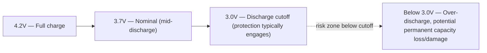
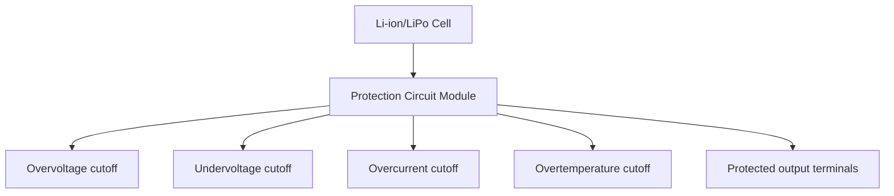
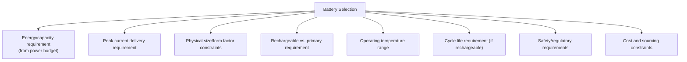

## Battery Technologies and Characteristics

### Overview

Battery selection is a foundational design decision for portable and embedded systems, affecting available energy, current delivery capability, size, weight, cost, safety requirements, and charging behavior. Different electrochemical technologies present distinct tradeoffs across these dimensions, and no single chemistry is universally optimal — selection depends on the application's power profile, physical constraints, temperature range, cycle life requirements, and safety context. This topic surveys the battery chemistries commonly encountered in embedded systems and the electrical characteristics relevant to interfacing with them.

### Common Battery Chemistries

#### Chemistry Comparison Overview

| Chemistry | Nominal Cell Voltage | Rechargeable | Typical Energy Density | Notable Characteristics |
| --- | --- | --- | --- | --- |
| Lithium-ion (Li-ion) | ~3.6-3.7 V | Yes | High | Widely used, requires protection circuitry |
| Lithium Polymer (LiPo) | ~3.7 V | Yes | High | Flexible form factors, similar chemistry to Li-ion with polymer electrolyte |
| Lithium Iron Phosphate (LiFePO4) | ~3.2 V | Yes | Moderate | Lower energy density, longer cycle life, improved thermal stability |
| Nickel-Metal Hydride (NiMH) | ~1.2 V | Yes | Moderate | Lower cost, more tolerant of abuse, higher self-discharge than Li-ion |
| Alkaline | ~1.5 V | No (primary) | Moderate | Low cost, widely available, poor performance at high current draw |
| Lithium Primary (e.g., Li-SOCl2, Li-MnO2) | ~3.0-3.6 V | No (primary) | Very high | Long shelf life, common in low-duty-cycle sensor devices |
| Coin cell (Li-MnO2, e.g., CR2032) | ~3.0 V | No (primary) | High for size | Common for RTC backup and small low-power devices |

**Key Points**

- Nominal voltage figures are approximate reference points, not fixed constants — actual terminal voltage varies across the discharge cycle (see Discharge Curves below), and design margins must account for this full range rather than the nominal figure alone.
- Energy density comparisons ("high," "moderate") are relative and approximate; exact figures vary significantly between specific cell products even within the same chemistry category, and should be sourced from the specific cell's datasheet for design purposes. [Inference — precise numeric energy density figures vary by manufacturer, cell format, and specific product generation; general chemistry-level comparisons should not be treated as precise specifications for any individual cell.]

### Lithium-Ion and Lithium Polymer Characteristics

#### Discharge and Charge Voltage Range

Li-ion/LiPo cells operate across a defined voltage window, typically approximately 3.0 V (fully discharged, cutoff) to 4.2 V (fully charged), with 3.7 V commonly cited as the nominal/average voltage.

**Key Points**

- Exact charge/discharge voltage limits vary by specific cell chemistry variant (e.g., standard Li-ion vs. high-voltage variants) and manufacturer specification; the ~3.0-4.2V range is a common but not universal figure, and the specific cell's datasheet is the authoritative source. [Inference — some cell chemistries and manufacturers specify different cutoff voltages; always verify against the specific product datasheet.]
- Operating outside the specified voltage window — particularly over-discharging below the minimum cutoff or overcharging above the maximum — can cause permanent capacity degradation, and in more severe cases, safety hazards (thermal runaway risk), which is why protection circuitry is standard practice (see Protection Circuitry below).

#### Discharge Curve Shape

Li-ion/LiPo cells exhibit a relatively flat discharge curve across most of their capacity, with voltage dropping more steeply near full discharge — meaning terminal voltage alone is a comparatively coarse indicator of remaining charge across the middle of the discharge range.

**Key Points**

- Because of this flat-curve behavior, simple voltage-based "fuel gauge" estimation is relatively imprecise in the middle capacity range for Li-ion/LiPo; more accurate state-of-charge estimation typically requires coulomb counting (integrating current over time) or a dedicated fuel-gauge IC that combines voltage, current, and temperature measurements with a chemistry-specific model. [Inference — the practical accuracy tradeoff between simple voltage lookup and coulomb-counting/fuel-gauge approaches depends on the specific application's accuracy requirements.]
- Discharge curve shape (flatness, steepness of the "knee" near depletion) differs meaningfully between chemistries — for example, LiFePO4 exhibits an even flatter voltage plateau than standard Li-ion across much of its discharge range, making voltage-based estimation for that chemistry particularly imprecise without additional techniques.

### Protection Circuitry and Safety

#### Common Protection Functions

Li-ion/LiPo cells and battery packs typically incorporate or require protection circuitry addressing several failure modes:

- **Overcharge protection** — prevents charging beyond the maximum safe voltage.
- **Over-discharge protection** — disconnects the load before voltage drops below the safe minimum.
- **Overcurrent/short-circuit protection** — limits or interrupts current beyond a safe threshold.
- **Overtemperature protection** — monitors cell temperature (often via an integrated thermistor) and interrupts charge/discharge if unsafe temperatures are detected.
- **Cell balancing** (for multi-cell packs in series) — ensures individual cells within a series stack remain at similar voltage levels, since imbalance can lead to some cells being overcharged or over-discharged relative to others.

**Key Points**

- Many commercially available Li-ion/LiPo cells intended for hobbyist/product integration include a basic protection circuit built into the pack itself, but bare cells (common in some industrial or cost-sensitive designs) require the system designer to implement equivalent protection externally — this distinction should be verified explicitly for any given cell/pack being sourced.
- Multi-cell series packs (2S, 3S, and higher configurations) generally require active cell-balancing circuitry, since manufacturing variation between individual cells causes them to drift out of voltage balance over repeated charge/discharge cycles if left unmanaged, which over time increases the risk of individual cell over/under-voltage conditions even if the overall pack voltage appears within range.

### Nickel-Metal Hydride (NiMH)

#### Characteristics Relevant to Embedded Use

NiMH cells offer a lower per-cell voltage (~1.2 V nominal) and generally lower energy density than Li-ion, but are often considered more tolerant of abuse (less prone to safety incidents from overcharge/over-discharge) and are typically compatible with simpler, lower-cost charging circuitry.

**Key Points**

- NiMH cells exhibit higher self-discharge rates than Li-ion in general, though "low self-discharge" NiMH variants (sometimes branded terms like Eneloop-style cells) are specifically engineered to substantially reduce this characteristic compared to standard NiMH. [Inference — exact self-discharge rates vary considerably between standard and low-self-discharge NiMH product lines; consult the specific product's datasheet.]
- NiMH charging typically uses different termination detection methods than Li-ion (such as detecting a small voltage drop at full charge, sometimes called negative delta V detection, or temperature-rise-based termination) rather than the constant-current/constant-voltage profile used for Li-ion, meaning charge management ICs are generally chemistry-specific and not interchangeable between NiMH and Li-ion without redesign.

### Primary (Non-Rechargeable) Batteries

#### Alkaline

Widely available and low-cost, but alkaline cells exhibit relatively poor performance under high current draw (significant voltage sag) and a declining voltage curve across discharge, making them less suitable for applications with bursty high-current demands (e.g., radio transmission) without adequate energy storage buffering (e.g., a supercapacitor) or careful current budgeting.

#### Lithium Primary Cells

Lithium primary chemistries (such as Lithium Thionyl Chloride/Li-SOCl2, or Lithium Manganese Dioxide/Li-MnO2) offer notably higher energy density and substantially longer shelf life (very low self-discharge over years) than alkaline, making them common choices for long-duration, low-duty-cycle sensor deployments where replacing a battery for years is impractical.

**Key Points**

- Some lithium primary chemistries (particularly Li-SOCl2) exhibit relatively poor performance under sudden high-current pulse loads despite good sustained low-current performance, sometimes requiring a hybrid layer capacitor (HLC) or supercapacitor in parallel to supply pulse current demands (e.g., a brief radio transmission) that the cell itself cannot deliver quickly. [Inference — the necessity and severity of this pulse-current limitation is specific to the chemistry sub-type and cell construction; consult the specific cell datasheet's pulse discharge characteristics.]
- Primary lithium cells used for small backup functions (RTC backup, memory retention) — commonly coin cells like the CR2032 — are typically selected primarily for long shelf life and adequate capacity at very low continuous current draw rather than for high current delivery capability.

### Electrical Characteristics Relevant to System Interfacing

#### Internal Resistance and Current Delivery Capability

A battery's internal resistance affects how much its terminal voltage sags under load — higher internal resistance causes greater voltage drop for a given current draw, which can be significant for applications with high peak current demands (motor actuation, radio transmission bursts).

$$V_{\text{terminal}} = V_{\text{open-circuit}} - I_{\text{load}} \cdot R_{\text{internal}}$$

**Key Points**

- Internal resistance is not a fixed constant — it typically increases as a cell ages and as temperature decreases, meaning a design that adequately handles peak current draw with a fresh cell at room temperature may not adequately handle the same load with an aged cell or at low temperature. [Inference — the exact magnitude of internal resistance change with age/temperature is chemistry- and product-specific; consult datasheet characterization curves where available.]
- Maximum continuous and pulse discharge current ratings (often expressed as a "C-rate," where 1C means a discharge current equal to the cell's capacity in one hour) are datasheet-specified limits that should not be exceeded, since doing so can cause excessive voltage sag, accelerated degradation, or in extreme cases safety hazards.

#### Temperature Effects

Battery capacity, internal resistance, and safe charge/discharge current limits are all temperature-dependent, generally with reduced usable capacity and increased internal resistance at low temperatures, and (for rechargeable chemistries) often restricted or prohibited charging below certain temperature thresholds.

**Key Points**

- Many Li-ion/LiPo cell datasheets specify that charging below 0°C (or a similar low-temperature threshold) is unsafe or prohibited due to risk of lithium plating on the anode, a degradation mechanism that can also create safety risks; system designs intended for cold-environment charging need explicit temperature-gated charge control. [Inference — exact temperature thresholds vary by specific cell chemistry and manufacturer specification; consult the specific cell's datasheet.]
- Discharge (as opposed to charge) is generally tolerated across a wider temperature range than charging for most rechargeable lithium chemistries, though usable capacity still typically decreases at temperature extremes. [Behavior may vary by specific chemistry and cell design; verify against datasheet temperature derating curves.]

### Battery Selection Considerations for Embedded Design

#### Key Selection Criteria

**Key Points**

- Battery selection should generally follow from a completed power budget (see related topic) establishing the required capacity and peak current delivery, rather than being chosen first and the system design fit around an arbitrary battery choice — though physical/cost constraints often iterate back and forth with the power budget in practice.
- Safety and regulatory requirements (transportation regulations for lithium batteries, UL/IEC certification requirements for products sold in certain markets, application-specific safety standards for medical or safety-critical devices) can significantly constrain viable chemistry and pack design choices beyond pure electrical/performance considerations, and should be investigated early in the design process rather than treated as a late-stage compliance afterthought.

### Common Pitfalls

| Pitfall | Consequence | Mitigation |
| --- | --- | --- |
| Sizing battery capacity from nominal voltage alone, ignoring discharge curve | Inaccurate runtime estimate, premature low-voltage cutoff | Use full discharge curve and account for cutoff voltage margin |
| Assuming voltage alone indicates state of charge for flat-curve chemistries | Inaccurate fuel-gauge estimation | Use coulomb counting or a dedicated fuel-gauge IC where accuracy matters |
| Exceeding peak current rating for pulse loads (e.g., radio TX) | Excessive voltage sag, possible brownout, accelerated cell degradation | Verify pulse current capability against datasheet; add supercapacitor buffering if needed |
| Charging below manufacturer-specified minimum temperature | Lithium plating risk, safety hazard, permanent capacity loss | Implement temperature-gated charge control |
| Omitting protection circuitry on bare Li-ion/LiPo cells | Overcharge/over-discharge/overcurrent safety risk | Verify whether sourced cells include protection; add external protection circuit if not |
| Ignoring cell balancing in multi-cell series packs | Individual cell imbalance leading to over/under-voltage risk over time | Implement active cell balancing for series-connected multi-cell packs |

### Conclusion

Battery technology selection requires matching electrochemical characteristics — voltage range, discharge curve shape, current delivery capability, temperature behavior, cycle life, and safety profile — against the specific embedded application's power budget, form factor, and regulatory context. Lithium-based rechargeable chemistries dominate modern portable embedded design for their energy density, but require deliberate protection circuitry and temperature-aware charge management, while primary lithium and alkaline cells remain relevant for long-duration or cost-sensitive low-power deployments where rechargeability is unnecessary or impractical.

**Related Topics**

- Power consumption analysis and budgeting
- Battery charging circuit design and charge management ICs
- Fuel gauge and state-of-charge estimation techniques
- Energy harvesting system design for battery-free or battery-assisted devices
- Regulatory and safety standards for lithium battery-powered products
- Supercapacitor and hybrid energy storage design
- Real-time clock backup power design (coin cell interfacing)