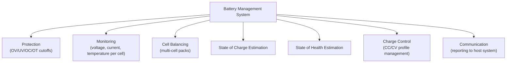
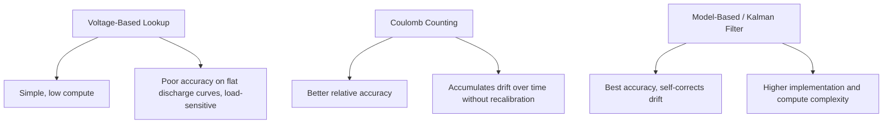
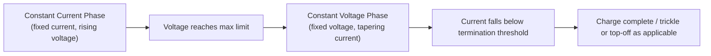

## Battery Management Systems

### Overview

A Battery Management System (BMS) is the electronic system responsible for monitoring, protecting, and controlling a battery pack throughout charging, discharging, and storage, ensuring the pack operates within its safe electrical and thermal limits while providing state information (charge level, health, available capacity) to the host system. BMS scope ranges from simple single-cell protection ICs to sophisticated multi-cell systems with active balancing, communication interfaces, and predictive health monitoring, and is a distinct but closely related discipline from battery chemistry selection itself.

### Core BMS Functions

#### Functional Overview



**Key Points**

- Not every application requires all of these functions in a dedicated subsystem — a single-cell, low-power sensor node may need only basic protection (often integrated into a simple charger IC), while a multi-cell power tool or e-mobility battery pack typically requires the full functional set including balancing and detailed state estimation.
- BMS complexity generally scales with cell count, series/parallel configuration, and the consequences of failure — higher-energy, higher-series-count, or safety-critical packs warrant more sophisticated monitoring and protection than a single low-capacity cell.

### Protection Functions

#### Voltage, Current, and Temperature Protection

The most fundamental BMS role is enforcing the safe operating envelope established by the cell manufacturer, cutting off charge or discharge paths when limits are approached or exceeded.

| Protection Type | Trigger Condition | Typical Response |
| --- | --- | --- |
| Overvoltage (OV) | Cell voltage exceeds maximum charge voltage | Disconnect charge path (FET) |
| Undervoltage (UV) | Cell voltage falls below minimum discharge cutoff | Disconnect discharge path (FET) |
| Overcurrent — charge | Charge current exceeds safe maximum | Disconnect charge path |
| Overcurrent — discharge | Discharge current exceeds safe maximum | Disconnect discharge path |
| Short circuit | Very high, near-instantaneous current spike | Immediate disconnect, often via dedicated fast-response hardware comparator rather than firmware polling |
| Overtemperature | Cell/pack temperature exceeds safe threshold | Disconnect charge and/or discharge path depending on severity |
| Undertemperature (charge) | Temperature below safe charging threshold | Disconnect or inhibit charge path |

**Key Points**

- Short-circuit protection is typically implemented with dedicated fast analog comparator hardware rather than a microcontroller polling loop, since the response time required (often microseconds) is generally faster than firmware-mediated detection and response can reliably achieve. [Inference — the specific response time requirement and whether firmware-based detection is adequate depends on the application's fault energy and acceptable risk profile; safety-critical designs typically favor dedicated hardware protection for this function regardless.]
- Protection functions are commonly implemented in a dedicated, relatively simple analog/mixed-signal protection IC that operates independently of (and as a safety backstop to) any more sophisticated microcontroller-based BMS logic, so that a firmware fault or crash does not eliminate the pack's fundamental safety protections.

### Cell Balancing

#### Why Balancing Is Necessary in Series Packs

In a multi-cell series-connected pack, manufacturing variation and differing aging/self-discharge rates cause individual cells to drift to different states of charge over repeated cycles, even though the same current flows through every cell in the series string. Without correction, this imbalance means the pack's usable capacity becomes limited by whichever cell reaches its voltage limit first, and repeated cycling without correction can progressively worsen the imbalance.


#### Passive Balancing

Passive (dissipative) balancing bleeds excess charge from higher-voltage cells through a resistor, converting the excess energy to heat, until all cells in the string reach approximately equal voltage.

```c
// Illustrative logic, not a specific IC's actual register interface
void passive_balance_check(cell_bank_t *bank) {
    uint16_t min_voltage = find_min_cell_voltage(bank);
    for (int i = 0; i < bank->cell_count; i++) {
        if (bank->cell_voltage[i] > (min_voltage + BALANCE_THRESHOLD_MV)) {
            enable_balance_resistor(bank, i);
        } else {
            disable_balance_resistor(bank, i);
        }
    }
}
```

**Key Points**

- Passive balancing is simple, low-cost, and widely used, but wastes energy as heat and is inherently limited to balancing "down" toward the lowest cell's charge level — it cannot add charge to a low cell, only bleed excess from higher cells.
- Passive balancing is typically only active during charging (or at a defined balancing stage near full charge), since continuously bleeding cells during normal discharge would waste usable capacity unnecessarily.

#### Active Balancing

Active balancing transfers charge between cells (rather than dissipating it as heat) using switched capacitor, inductor-based, or transformer-based charge-transfer circuits, redistributing energy from higher-charge to lower-charge cells with substantially less energy loss than passive approaches.

**Key Points**

- Active balancing is more complex and costly to implement than passive balancing but is more energy-efficient and can, in principle, balance both during charge and discharge; it is more commonly justified in higher-value packs (electric vehicles, larger energy storage systems) where the efficiency and capacity benefits outweigh the added circuit complexity and cost. [Inference — the cost/benefit threshold favoring active over passive balancing depends on pack size, value, and cycle-life requirements, and is an application-specific engineering tradeoff rather than a fixed rule.]
- Balancing current in either approach is typically much smaller than the main charge/discharge current, meaning balancing is a relatively slow corrective process occurring over multiple charge cycles rather than an instantaneous correction.

### State of Charge (SOC) Estimation

#### Estimation Approaches

- **Voltage-based lookup** — mapping open-circuit voltage to an estimated SOC using a pre-characterized voltage/SOC curve for the specific chemistry; simplest but least accurate, especially for flat-discharge-curve chemistries and when the cell is under load (since load-induced voltage sag distorts the reading unless accounted for).
- **Coulomb counting** — integrating measured current over time to track charge added/removed relative to a known reference point (e.g., a full-charge calibration event), providing better accuracy than pure voltage lookup but subject to accumulated error (drift) over time from current-sensing offset errors and inefficiencies not perfectly modeled.
- **Model-based/Kalman filter approaches** — combining voltage, current, temperature, and an internal battery model (often an equivalent circuit model) using state estimation techniques (commonly Extended Kalman Filters) to produce more robust SOC estimates that self-correct against sensor drift over time.



**Key Points**

- Dedicated fuel-gauge ICs (e.g., those implementing algorithms like Maxim/Analog Devices' ModelGauge or Texas Instruments' Impedance Track) package sophisticated model-based SOC estimation into a single component with a simple host communication interface (often I2C), offloading this complexity from application firmware. [Behavior may vary by specific fuel-gauge IC and its underlying algorithm; consult the specific part's documentation for accuracy characteristics and required characterization/learning procedures.]
- Coulomb counting requires periodic recalibration against a known reference (typically a full-charge or full-discharge event, where voltage-based SOC is more reliable at the extremes of the curve) to bound accumulated drift error over extended operation without such reference points.

### State of Health (SOH) Estimation

#### Tracking Long-Term Capacity Degradation

State of Health estimates the battery's current maximum capacity relative to its original (new) capacity, reflecting cumulative degradation from cycling, calendar aging, and storage/operating conditions.

$$\text{SOH} = \frac{C_{\text{current measured full capacity}}}{C_{\text{original rated capacity}}} \times 100\%$$

**Key Points**

- SOH estimation typically requires observing a substantially complete charge or discharge cycle (or a well-characterized partial cycle combined with a model) to measure actual current capacity, making it inherently a slower-evolving metric than SOC, which updates continuously during normal operation.
- Applications with strict end-of-life or safety requirements (e.g., some regulated device categories) may define a specific SOH threshold below which the pack is flagged for replacement, even if the pack still functions, since degraded cells generally at least somewhat exhibit reduced capacity, altered voltage behavior, and potentially elevated safety risk as they age. [Inference — specific SOH thresholds and their safety significance are application- and chemistry-specific; there is no universal numeric threshold applicable across all battery-powered products.]

### Charge Control

#### Constant-Current/Constant-Voltage (CC/CV) Profile

Li-ion/LiPo charging typically follows a two-phase profile: constant current (CC) phase delivering a fixed charge current until the cell reaches its maximum voltage, followed by a constant voltage (CV) phase holding that voltage while current gradually tapers as the cell approaches full charge, with charging typically terminated when current falls below a defined threshold (e.g., a small percentage of the rated capacity).



**Key Points**

- The CC/CV profile and its specific current/voltage/termination parameters are chemistry- and cell-specific, and charge management ICs are typically designed for a specific chemistry (or a small family of closely related chemistries) rather than being universally chemistry-agnostic. [Behavior may vary — always verify a given charger IC's supported chemistry and its configured parameters match the specific cell being charged.]
- Fast-charging schemes (higher CC-phase current for reduced charge time) generally trade off against cell longevity and thermal considerations, and are bounded by the cell manufacturer's maximum charge current and temperature specifications — exceeding these specifications for faster charging is a common source of accelerated degradation or safety risk.

### Communication and Host Interfacing

#### Reporting Pack Status to the System

Multi-cell/sophisticated BMS implementations commonly expose pack status (individual cell voltages, pack current, temperature, SOC, SOH, fault flags) to the host system via a digital communication interface, most commonly I2C, SMBus (a superset of I2C with additional protocol conventions common in "smart battery" applications), or CAN bus in automotive/industrial contexts.

```c
typedef struct {
    uint16_t cell_voltage_mv[MAX_CELLS];
    int16_t  pack_current_ma;      // signed: positive = charging, negative = discharging
    int16_t  temperature_c_x10;
    uint8_t  soc_percent;
    uint8_t  soh_percent;
    uint32_t fault_flags;
} bms_status_t;

int bms_read_status(bms_dev_t *dev, bms_status_t *out);
```

**Key Points**

- The Smart Battery System (SBSData) specification defines a standardized SMBus-based command set for battery communication, historically common in laptop and portable device battery packs, providing interoperability benefits when a system needs to work with batteries from multiple suppliers following the same standard. [Unverified — while SBS is a long-established industry specification, its current adoption prevalence across specific modern embedded product categories was not verified for this response; confirm relevance to a specific target application independently.]
- Fault flag reporting (which specific protection triggered, if any) is valuable both for host-system response logic (e.g., displaying a user-facing warning) and for field diagnostics/returns analysis, and should generally be latched and readable even after the triggering condition clears, rather than only reflecting instantaneous state.

### BMS Architecture Patterns

#### Centralized vs. Distributed Architectures

- **Centralized BMS** — a single controller directly monitors and manages all cells in the pack; simpler and lower-cost for smaller cell counts, but wiring complexity grows with cell count and series-string length.
- **Distributed/modular BMS** — smaller monitoring modules are placed near groups of cells (common in larger packs, e.g., electric vehicles), communicating with a central controller over a bus, reducing wiring harness complexity at the cost of increased system complexity and communication overhead.

**Key Points**

- The appropriate architecture is largely driven by pack scale and physical layout — small consumer-electronics packs (a handful of cells) almost universally use centralized approaches, while large-format packs with many series-connected modules more commonly adopt distributed architectures for practical wiring and modularity reasons.
- Isolation (electrical separation between high-voltage pack-side circuitry and lower-voltage communication/control circuitry) becomes an increasingly important design consideration as pack voltage increases, particularly in distributed architectures communicating across module boundaries at different voltage potentials within the series string. [Inference — specific isolation requirements depend on pack voltage, applicable safety standards, and system architecture; this is a significant enough topic to warrant dedicated design attention in higher-voltage systems rather than being treated as a minor detail.]

### Common Pitfalls

| Pitfall | Consequence | Mitigation |
| --- | --- | --- |
| Relying solely on firmware-based protection with no dedicated hardware backstop | Firmware crash/fault eliminates safety protection | Use a dedicated protection IC as an independent hardware safety layer |
| Using voltage-only SOC estimation on flat-discharge-curve chemistries | Inaccurate charge level reporting | Use coulomb counting or a dedicated fuel-gauge IC |
| No periodic coulomb-counter recalibration | Accumulated SOC drift error over time | Recalibrate against known reference points (full charge/discharge) |
| Mismatched charger IC chemistry vs. actual cell chemistry | Incorrect charge profile, potential safety risk or degraded cell life | Verify charger IC is designed/configured for the specific cell chemistry in use |
| Ignoring cell balancing in series packs | Reduced usable capacity, accelerated imbalance over cycles | Implement passive or active balancing appropriate to pack value/complexity |
| Insufficient isolation design in higher-voltage distributed BMS architectures | Safety risk, potential damage to low-voltage control circuitry | Apply appropriate isolation techniques per applicable safety standards |

### Conclusion

A Battery Management System combines protection, monitoring, balancing, state estimation, and charge control functions to keep a battery pack operating safely within its manufacturer-specified limits while providing the host system with actionable status information. System complexity scales with cell count and application stakes — from simple integrated protection ICs for single-cell consumer devices to distributed, actively-balanced architectures with sophisticated model-based state estimation for large multi-cell packs — with dedicated hardware protection generally retained as an independent safety layer regardless of firmware sophistication.

**Related Topics**

- Battery technologies and characteristics
- Power consumption analysis and budgeting
- Fuel gauge IC selection and coulomb counting implementation
- I2C/SMBus communication protocol fundamentals
- Functional safety standards applicable to battery-powered systems
- Thermal management and temperature sensing for battery packs
- Charger IC selection and CC/CV charge profile design