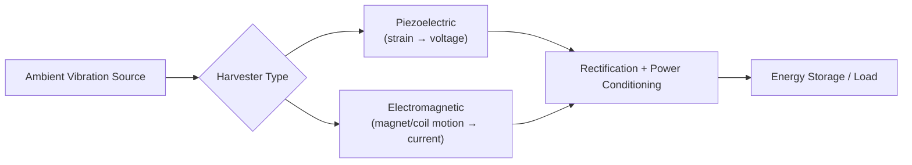
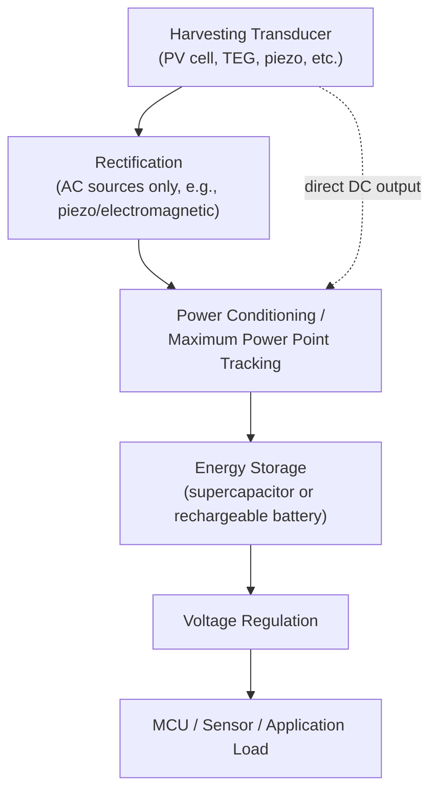
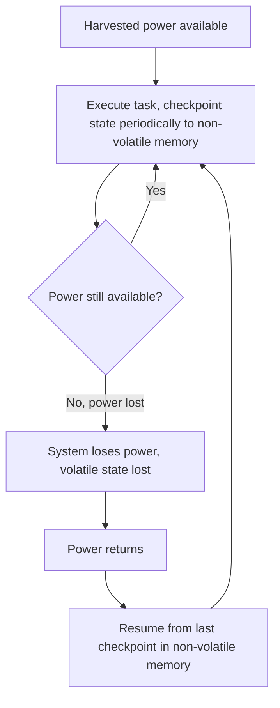

## Energy Harvesting Techniques

### Overview

Energy harvesting is the process of capturing ambient environmental energy — light, motion/vibration, heat differentials, or radio-frequency fields — and converting it into usable electrical power for embedded devices, either supplementing or entirely replacing battery power. Energy-harvested embedded systems typically operate under fundamentally different design constraints than battery-powered systems: available power is often intermittent, low-magnitude, and unpredictable, requiring specialized power management architectures, aggressive duty cycling, and careful energy storage design.

### Common Harvesting Sources

#### Source Comparison Overview

| Source | Typical Mechanism | Approximate Power Availability | Characteristics |
| --- | --- | --- | --- |
| Photovoltaic (light) | Solar/photodiode cells | Highly variable (µW indoors to W outdoors) | Most mature and widely deployed harvesting technology; strongly dependent on light intensity |
| Thermoelectric (heat) | Seebeck-effect generators (TEGs) | Typically µW to low mW | Requires a sustained temperature differential across the device |
| Piezoelectric/vibration | Mechanical strain converted via piezoelectric material | Typically µW range | Effective for machinery vibration, footsteps, or other periodic mechanical motion |
| Electromagnetic/inductive vibration | Moving magnet through coil | Typically µW to low mW | Alternative to piezoelectric for vibration harvesting, different frequency response characteristics |
| RF energy harvesting | Rectenna capturing ambient or intentionally-broadcast RF energy | Typically nW to µW, highly distance-dependent | Power available drops sharply with distance from RF source; often paired with intentional RF power transmission for practical yields |

**Key Points**

- Power availability figures are highly approximate and application-context-dependent — actual harvested power for any specific deployment depends heavily on source strength, transducer size/efficiency, and environmental conditions at the specific installation, and general figures should not be used for final design sizing without site-specific characterization or measurement. [Inference — the wide variability in real-world harvesting conditions makes generic power figures useful only for rough early-stage feasibility assessment, not final engineering sizing.]
- Photovoltaic harvesting is generally the most mature and highest-power-density option among common ambient sources when adequate light is available, which is why it remains the dominant harvesting technology for outdoor and well-lit indoor applications despite growing interest in other mechanisms for specific niches (indoor low-light, embedded-in-structure, or wearable applications where light is unavailable or impractical).

### Photovoltaic Energy Harvesting

#### Indoor vs. Outdoor Considerations

Photovoltaic cells' power output is strongly dependent on both light intensity and spectral characteristics, both of which differ substantially between outdoor sunlight and typical indoor artificial lighting.

**Key Points**

- Cells optimized for outdoor solar spectrum performance are not necessarily optimal for indoor artificial lighting spectra (LED, fluorescent), and some photovoltaic cell technologies (e.g., certain amorphous silicon or dye-sensitized cells) are specifically marketed as better suited to indoor light harvesting than traditional crystalline silicon solar cells optimized for outdoor use. [Inference — the degree of performance difference between cell technologies under specific indoor lighting conditions is product- and lighting-source-specific; consult manufacturer characterization data for the specific cell and expected light source.]
- Indoor light levels are typically several orders of magnitude lower than direct outdoor sunlight, meaning indoor photovoltaic-harvested power is correspondingly much lower and generally suitable only for very low-power sensor/beacon-class devices rather than higher-power applications.

### Thermoelectric Energy Harvesting

#### Seebeck Effect and Temperature Differential Requirements

Thermoelectric generators (TEGs) produce voltage proportional to the temperature difference across the device via the Seebeck effect; without a sustained, sufficiently large temperature differential, negligible power is produced.

$$V_{\text{TEG}} \approx N \cdot S \cdot \Delta T$$

where $N$ is the number of thermocouple junction pairs, $S$ is the Seebeck coefficient of the material, and $\Delta T$ is the temperature difference across the device.

**Key Points**

- Practical thermoelectric harvesting applications require a reliable, sustained temperature gradient (e.g., a heated pipe or machinery surface against ambient air, or human body heat against ambient environment for wearable applications), making TEG harvesting fundamentally location- and application-dependent rather than broadly applicable like photovoltaic harvesting.
- The voltage produced by practical ambient-scale temperature differentials is often quite low (frequently well under 1V), typically necessitating a specialized ultra-low-voltage-startup power converter capable of beginning operation from a lower input voltage than many conventional DC-DC converter ICs support. [Inference — the exact minimum startup voltage achievable is specific to the chosen power management IC; this is an active area of IC product development with parts specifically marketed for very low ambient-energy-harvesting startup voltages.]

### Piezoelectric and Electromagnetic Vibration Harvesting

#### Mechanism and Frequency Matching

Both approaches convert mechanical vibration or motion into electrical energy, but through different physical mechanisms: piezoelectric materials generate voltage under mechanical strain, while electromagnetic harvesters generate current via relative motion between a magnet and coil (Faraday's law of induction).

**Key Points**

- Vibration harvesters (both types) are typically most efficient when mechanically tuned to resonate at or near the dominant frequency of the specific vibration source they are harvesting from, meaning a harvester optimized for one machine or application's vibration profile may perform poorly if deployed against a source with substantially different vibration characteristics. [Inference — the practical impact of frequency mismatch depends on the specific harvester's mechanical bandwidth/quality factor design; some designs are intentionally broadened at the cost of peak efficiency to tolerate a wider range of input frequencies.]
- Piezoelectric harvesters generally produce relatively high voltage but low current output, while electromagnetic harvesters tend toward the opposite characteristic (lower voltage, higher current) for comparable power levels — this affects the choice of downstream power conditioning circuit topology.

### RF Energy Harvesting

#### Ambient vs. Intentional RF Sources

RF harvesting can draw from truly ambient RF energy already present in the environment (broadcast radio, cellular, WiFi signals) or from an intentionally deployed RF power transmitter specifically to power nearby harvesting devices (common in some RFID and near-field powered sensor applications).

**Key Points**

- Truly ambient RF harvesting (relying solely on incidental signals like broadcast or cellular RF already present) typically yields very low power levels usable only for extremely low-duty-cycle, low-power applications, given the significant path loss RF signals experience over distance; intentional RF power transmission paired with a nearby harvester (as in passive RFID tags) is a substantially more practical and higher-power approach when feasible. [Inference — the practical power yield of ambient-only RF harvesting is highly deployment- and RF-environment-specific, and general claims about its viability should be treated cautiously without site-specific RF power density measurement.]
- Regulatory constraints on intentional RF power transmission (transmit power limits, frequency allocation) vary by jurisdiction and applicable regulations, which is a relevant design constraint for any system relying on a dedicated RF power transmitter rather than purely passive ambient harvesting.

### Power Conditioning and Storage Architecture

#### Typical Harvesting System Block Diagram

**Key Points**

- AC-output sources (piezoelectric, electromagnetic vibration harvesters) require a rectification stage to produce usable DC before further power conditioning, whereas photovoltaic and thermoelectric sources produce DC output directly.
- Maximum Power Point Tracking (MPPT) — dynamically adjusting the electrical load presented to the harvesting source to extract the maximum available power at any given moment — is a well-established technique in solar harvesting (where source I-V characteristics vary with light intensity) and is increasingly applied to other harvesting modalities as well; simpler applications with predictable, low source impedance sometimes omit MPPT in favor of simpler fixed-impedance-matching approaches. [Inference — whether MPPT complexity is justified depends on the specific application's power yield sensitivity and cost/complexity budget; not every harvesting design requires it.]

#### Energy Storage Element Selection

- **Supercapacitors** — high cycle life (effectively unlimited for practical purposes relative to typical harvesting-system lifetimes), fast charge/discharge capability, but lower energy density than batteries and voltage that varies continuously with stored charge (rather than a relatively flat discharge curve).
- **Rechargeable batteries (thin-film Li-ion, LiFePO4, etc.)** — higher energy density than supercapacitors, enabling longer bridging through extended periods without harvested input, but generally lower cycle life and more restrictive charge current/temperature requirements.
- **Hybrid approaches** — combining a supercapacitor (handling frequent small charge/discharge cycles and pulse current delivery) with a battery (providing longer-duration energy reserve), leveraging the complementary strengths of each.

**Key Points**

- Supercapacitor voltage varying continuously and substantially with state of charge (unlike a battery's relatively flat discharge curve) means downstream power regulation must typically tolerate a wide input voltage range, and a supercapacitor's usable energy is a smaller fraction of its total stored energy if the load requires a minimum operating voltage above the capacitor's fully-discharged voltage.
- The very high cycle-life tolerance of supercapacitors makes them particularly well-suited to harvesting applications specifically because ambient harvesting sources often produce frequent, small, irregular charge/discharge events — a pattern that would degrade many battery chemistries relatively quickly if subjected to the same cycling frequency.

### Ultra-Low-Power System Design for Harvested Power

#### Intermittent Computing Considerations

Because harvested power is often intermittent and unpredictable (a cloud passing over a solar cell, vibration stopping, RF source moving out of range), embedded systems relying primarily on harvested power (rather than harvested power merely supplementing a battery) must be designed to tolerate frequent, unplanned power loss without corrupting state or losing critical data.

**Key Points**

- This "intermittent computing" design pattern — periodically checkpointing critical state to non-volatile memory (FRAM is particularly well-suited due to its fast write speed and high endurance compared to flash) so execution can resume from the last checkpoint after an unplanned power loss — is a specialized embedded systems research and design area distinct from conventional continuous-power embedded firmware design. [Inference — the specific checkpointing strategy and non-volatile memory technology choice involves tradeoffs (checkpoint frequency vs. overhead, memory endurance, write speed) that are application-specific and an active area of ongoing embedded systems research.]
- A minimum energy storage buffer (even a small capacitor) is typically still necessary even in "purely" harvested-power designs, both to bridge extremely brief power fluctuations and to provide the burst energy needed for operations like non-volatile memory writes or radio transmission that a harvesting source alone cannot supply instantaneously.

### System-Level Design Considerations

#### Matching System Power Profile to Harvesting Capability

Given that harvested power is typically far lower and less predictable than battery power, application firmware for energy-harvested devices generally must be designed around aggressive power budgeting from the outset, rather than treating power optimization as a secondary refinement.

**Key Points**

- Duty cycling, event-driven wake architectures, and minimizing active/radio-transmission time (as discussed in power budgeting and sleep-mode topics) are even more critical in harvested-power systems than in battery-powered systems, since the available power budget is often far more constrained and variable.
- A hybrid battery-plus-harvesting architecture (harvesting extends battery life or trickle-charges a battery, rather than the harvesting source being the sole power source) is a common practical compromise that relaxes the strict intermittent-computing design requirements while still gaining meaningful battery-life extension or maintenance-interval reduction benefits. [Inference — whether a hybrid or pure-harvesting architecture is more appropriate depends on the specific application's harvesting source reliability, required autonomy duration, and acceptable design complexity.]

### Common Pitfalls

| Pitfall | Consequence | Mitigation |
| --- | --- | --- |
| Sizing system power budget from best-case harvesting conditions | System fails to operate reliably under typical/worst-case conditions | Design and validate against realistic worst-case harvesting availability, not peak conditions |
| No energy buffer for burst/pulse loads (radio TX, flash writes) | Harvesting source cannot supply instantaneous peak current, causing brownout | Include adequate supercapacitor or battery buffering sized for peak transient loads |
| Ignoring frequency/resonance matching for vibration harvesters | Poor harvested power yield relative to harvester's rated capability | Characterize actual vibration source and select/tune harvester accordingly |
| No non-volatile checkpointing in pure-harvesting intermittent-power designs | Loss of critical state/data on unplanned power interruption | Implement periodic checkpointing to non-volatile memory appropriate to the application's criticality |
| Assuming photovoltaic cell performance transfers directly between outdoor and indoor use | Significantly overestimated indoor power yield | Select/characterize cells appropriate to actual deployment light source and intensity |
| Omitting MPPT or impedance matching where source impedance varies significantly | Suboptimal power extraction from the harvesting source | Evaluate whether MPPT or simpler matching is justified for the specific source's variability |

### Conclusion

Energy harvesting techniques capture ambient light, thermal, vibrational, or RF energy to power embedded devices, each source presenting distinct power availability characteristics, physical requirements, and power-conditioning needs. Because harvested power is typically low-magnitude and intermittent compared to battery power, successful system design requires careful energy storage element selection (often supercapacitors, batteries, or hybrids), aggressive power budgeting, and — for systems relying primarily on harvesting rather than a supplementary role — specialized intermittent-computing design patterns to tolerate frequent unplanned power loss without corrupting critical state.

**Related Topics**

- Power consumption analysis and budgeting
- Battery management systems and hybrid battery/harvesting architectures
- Sleep, standby, and deep-sleep mode design
- Non-volatile memory technologies (FRAM, flash) for state retention
- Ultra-low-power DC-DC converter and power management IC selection
- Intermittent computing and checkpoint/restore firmware architectures
- Wireless sensor network design for battery-free/harvested-power nodes