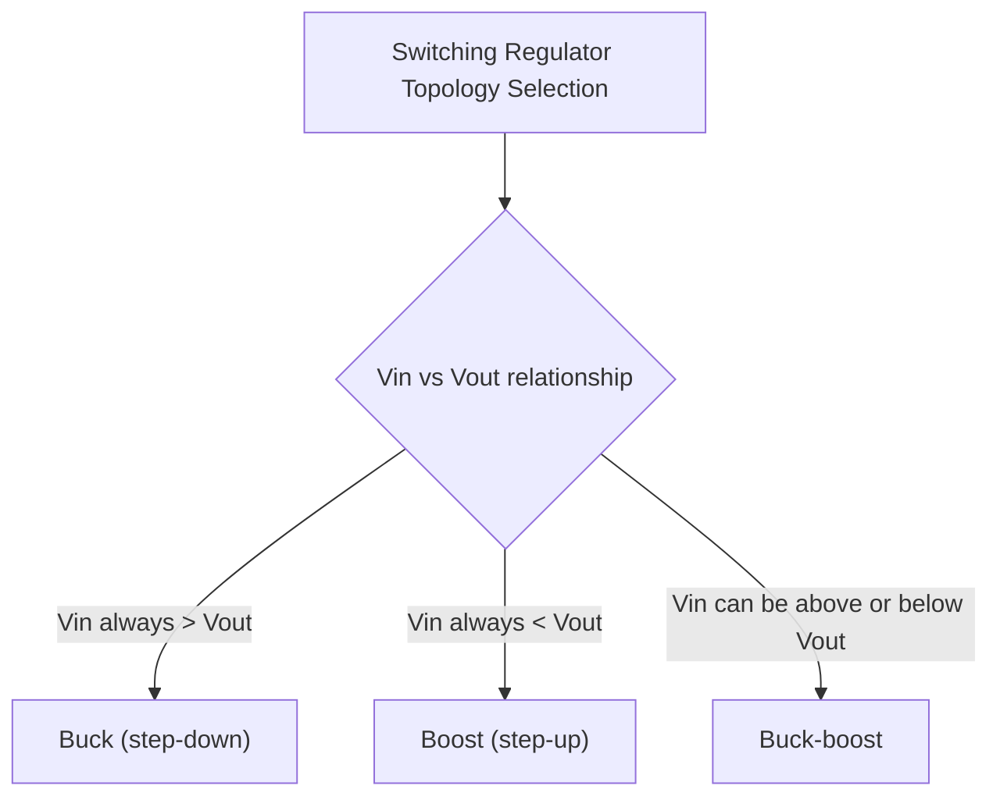
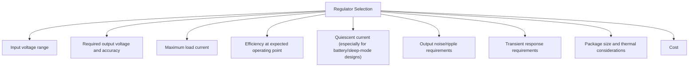
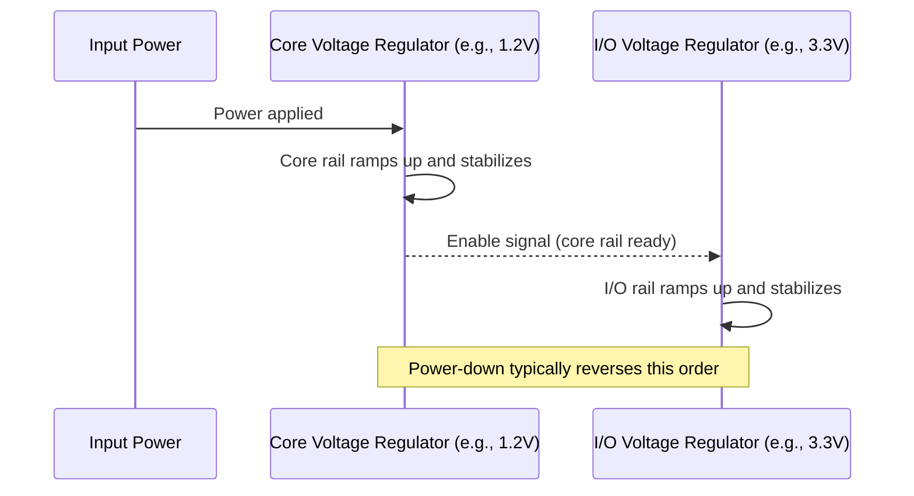

## Power Supply Design Basics


### Overview

Power supply design is the discipline of converting available input power (battery, USB, mains-derived DC, or another source) into the clean, regulated voltage rails an embedded system's MCU, peripherals, sensors, and actuators require. Poor power supply design manifests as unreliable resets, noisy sensor readings, communication errors, or outright device failure, making it a foundational concern rather than an afterthought. This topic covers linear and switching regulation, key selection criteria, sequencing, and layout considerations relevant to embedded system power supplies.

### Regulation Fundamentals

#### Why Regulation Is Necessary

Most digital logic and analog circuitry requires a stable supply voltage within a tight tolerance band to operate correctly; raw battery voltage (which varies across its discharge curve) or unregulated input voltage is generally unsuitable for direct use.

**Key Points**

- MCU and peripheral datasheets specify an absolute maximum voltage rating (exceeding which risks permanent damage) and a recommended operating voltage range (within which specified performance is guaranteed); regulation exists to keep the actual supplied voltage reliably within the operating range across the full range of input source variation.
- Even "single-voltage" systems often require multiple regulated rails in practice — for example, a 3.3V digital rail alongside a separate analog rail for ADC reference voltage, or a higher voltage rail for a display/sensor requiring more voltage than the MCU core.

### Linear Regulators

#### Basic Operation and Characteristics

Linear regulators (including simple linear regulators and low-dropout, or LDO, variants) reduce voltage by dissipating the excess as heat, essentially acting as a variable resistor that maintains a constant output voltage regardless of input voltage variation (within its specified range) or load current variation.

$$P_{\text{dissipated}} \approx (V_{\text{in}} - V_{\text{out}}) \times I_{\text{load}}$$

**Key Points**

- Linear regulator efficiency is fundamentally limited by the voltage drop across the regulator — a linear regulator converting 5V to 3.3V at a given current is inherently less efficient than one converting 3.6V to 3.3V at the same current, since the dissipated power (and thus wasted energy) scales directly with the input-output voltage differential.
- Dropout voltage — the minimum difference between input and output voltage required for the regulator to maintain regulation — is a key LDO selection parameter, particularly important in battery-powered designs where input voltage may sag close to the desired output voltage as the battery discharges; a lower-dropout part extends usable battery life by continuing to regulate correctly at lower input voltages.

#### When Linear Regulation Is Appropriate

**Key Points**

- Linear regulators are generally preferred when the input-to-output voltage differential is small (minimizing efficiency loss), when low output noise is critical (linear regulators are inherently quieter than switching regulators, which is valuable for analog/RF-sensitive circuitry), or when simplicity, low cost, and minimal PCB area outweigh efficiency concerns (e.g., a lightly-loaded auxiliary rail).
- Linear regulators are generally a poor choice when the input-output voltage differential is large and load current is significant, since the resulting power dissipation both wastes energy (a particular concern in battery-powered systems) and requires adequate thermal management to avoid overheating the regulator package.

### Switching Regulators

#### Basic Operation and Topologies

Switching regulators convert voltage by rapidly switching current through an inductor (and/or transformer) and filtering the result, achieving much higher efficiency than linear regulation because energy is transferred rather than dissipated as heat in the conversion process (aside from smaller switching and conduction losses).

| Topology | Function | Typical Use |
| --- | --- | --- |
| Buck (step-down) | Output voltage lower than input | Reducing a higher battery/supply voltage to a lower logic-level rail |
| Boost (step-up) | Output voltage higher than input | Raising a lower battery voltage (e.g., single-cell) to a higher required rail |
| Buck-boost | Output voltage can be higher or lower than input | Maintaining stable output across a battery's full discharge range that spans above and below the target output voltage |



**Key Points**

- A common practical scenario for buck-boost topology is a single-cell Li-ion/LiPo battery (ranging roughly 3.0V-4.2V across its discharge curve) powering a 3.3V rail — since input voltage crosses above and below the 3.3V output target across the discharge cycle, a simple buck or boost alone cannot maintain regulation across the entire range.
- Switching regulators introduce electrical noise (switching ripple and higher-frequency EMI) that linear regulators do not, which can be problematic for noise-sensitive analog circuitry, high-precision ADC references, or RF circuits — sometimes addressed with a switching regulator feeding into a subsequent linear regulator stage ("post-regulation") to combine switching efficiency with linear regulator output cleanliness for a sensitive sub-rail.

### Regulator Selection Criteria

#### Key Parameters to Evaluate



**Key Points**

- Quiescent current (the regulator's own current draw, independent of load) is frequently a decisive selection factor in battery-powered designs, since in deep sleep modes the regulator's own overhead can dominate total system current draw — as previously noted in power budgeting, "low-IQ" regulator variants exist specifically to address this.
- Efficiency figures published in datasheets are typically given across a curve of load current and input voltage, not a single number — a regulator can be highly efficient at one operating point and considerably less efficient at another (many switching regulators show reduced efficiency at very light loads due to fixed switching losses becoming proportionally larger relative to the small amount of power delivered), so the selection should be evaluated at the application's actual expected operating point(s), not just a headline efficiency figure. [Inference — the specific efficiency curve shape is part-specific; always consult the datasheet's efficiency-vs-load-current graph for the specific part and expected input voltage.]

### Power Sequencing

#### Why Rail Sequencing Can Matter

Systems with multiple regulated rails sometimes require those rails to power up (and power down) in a specific order, since some components can be damaged or exhibit undefined/incorrect behavior if one rail becomes active while a dependent rail remains at zero or an intermediate voltage (e.g., current flowing into an unpowered IC through its I/O pins from another rail that is already active, sometimes called latch-up risk in certain scenarios).



**Key Points**

- Not all designs require strict sequencing — many simpler MCUs and single-voltage-rail systems have no sequencing requirement at all — but any IC with multiple separate supply pins (common in more complex processors, FPGAs, or certain sensor/RF ICs) should have its datasheet checked explicitly for stated power sequencing requirements before assuming none exists. [Inference — whether sequencing is required is entirely part-specific; this cannot be assumed either way without checking the specific component's datasheet.]
- Some regulator ICs provide a dedicated enable pin and/or power-good output specifically to facilitate implementing sequencing (chaining one regulator's power-good signal to the next regulator's enable input), simplifying sequenced designs compared to using external timing/delay circuitry.

### Decoupling and Bulk Capacitance

#### Local Decoupling Capacitors

Every IC power pin typically requires a local decoupling (bypass) capacitor placed as close as physically possible to the pin, supplying the fast, high-frequency transient current demands of switching digital logic that the regulator itself — located farther away on the board with associated trace inductance — cannot supply quickly enough on its own.

```c
// Not code — illustrative placement principle only:
// MCU_VDD_PIN --- [decoupling cap, e.g., 100nF] --- GND
// placed within a few millimeters of the pin, with short, direct traces
```

**Key Points**

- A common practical convention is a small (e.g., 100nF) ceramic capacitor at every power pin for high-frequency decoupling, often combined with a larger bulk capacitor (e.g., 1-10µF or larger) per power rail or IC to handle lower-frequency, larger-magnitude current transients — but exact values should be verified against the specific IC's datasheet recommendations rather than assumed universal defaults. [Inference — while these are common conventional values in embedded practice, exact optimal decoupling values are application- and IC-specific; datasheet-recommended values should take precedence when specified.]
- Capacitor placement and trace routing (short, direct, low-inductance paths from capacitor to pin and to ground) matters as much as capacitor value selection — a correctly-valued capacitor placed far from the pin it is meant to decouple, or connected via a long/thin trace, provides substantially degraded effectiveness compared to the same capacitor placed and routed properly.

### Reverse Polarity, Overvoltage, and Input Protection

#### Common Input Protection Elements

- **Reverse polarity protection** — prevents damage if power is connected with reversed polarity, commonly implemented via a series diode (simple but incurs a voltage drop and power loss) or a MOSFET-based ideal diode circuit (more efficient, more complex).
- **Overvoltage/transient protection** — TVS (transient voltage suppressor) diodes or similar clamping devices protect against voltage spikes (ESD, inductive kickback, input supply transients) exceeding safe levels.
- **Input fusing/current limiting** — protects against excessive current draw due to a downstream fault, limiting damage propagation.

**Key Points**

- Simple series-diode reverse-polarity protection incurs a constant forward-voltage drop (and corresponding power loss) across the diode during normal correct-polarity operation, which may be an acceptable tradeoff for simplicity/cost in some designs but undesirable in efficiency-sensitive battery-powered designs, where a MOSFET-based approach avoiding this constant drop is often preferred despite its added complexity. [Inference — the appropriate protection approach is a cost/complexity/efficiency tradeoff specific to the application's requirements.]
- The appropriate level of input protection circuitry is highly application-dependent — a device with a permanently wired, non-user-accessible battery connection has different protection needs than a device with a user-accessible, potentially field-swappable power connector where reversed or incorrect connection is a realistic occurrence.

### Ground and Power Plane Layout Considerations

#### Basic Principles

While detailed PCB layout is its own extensive discipline, several power-supply-specific layout principles are broadly applicable:

- Keep high-current switching regulator loops (input capacitor, switching node, inductor, output capacitor) physically compact to minimize loop inductance and associated EMI.
- Provide a solid, largely uninterrupted ground plane/return path rather than routing ground as a narrow trace, particularly for switching regulator circuits.
- Separate noisy switching regulator circuitry physically (and sometimes via plane splits/ground stitching strategies) from sensitive analog circuitry where practical.

**Key Points**

- Switching regulator layout is generally considered more layout-sensitive than linear regulator layout, since the rapidly switching current loops in a switching converter are a more significant EMI source if poorly laid out, and following the specific regulator IC manufacturer's recommended layout guidelines (typically provided in application notes or reference designs) is standard and advisable practice rather than deriving layout from first principles alone. [Inference — the specific degree of layout sensitivity and the precise recommended layout vary by specific IC and switching frequency; manufacturer application notes for the specific part are the most reliable source.]
- This topic addresses only high-level layout principles; detailed PCB design practices (plane stackup, trace width/impedance calculation, thermal via placement, and similar topics) constitute a substantially broader discipline beyond embedded firmware/systems design scope.

### Common Pitfalls

| Pitfall | Consequence | Mitigation |
| --- | --- | --- |
| Using linear regulation with a large input-output voltage differential and significant load | Excessive power dissipation, thermal issues, wasted battery energy | Use switching regulation when voltage differential and current are both significant |
| Ignoring quiescent current in battery/sleep-mode designs | Sleep-mode power budget dominated by regulator overhead | Select low-IQ regulator variants for battery-powered, sleep-heavy applications |
| No decoupling capacitors, or capacitors placed far from IC power pins | Erratic behavior, resets, communication errors from insufficient transient current supply | Place appropriately-valued decoupling capacitors as close as possible to each power pin |
| Ignoring required power sequencing for multi-rail ICs | Undefined behavior, potential component damage | Check datasheet sequencing requirements explicitly; use enable/power-good chaining where needed |
| No input reverse-polarity or overvoltage protection on user-accessible power connectors | Device damage from field misconnection or voltage transients | Include appropriate protection circuitry matched to the connector's real-world risk exposure |
| Deriving switching regulator layout from first principles without consulting manufacturer guidance | EMI issues, noise, unstable regulation | Follow the specific regulator IC's datasheet/application note layout recommendations |

### Conclusion

Power supply design translates available input power into the clean, stable voltage rails an embedded system requires, balancing regulator technology choice (linear for simplicity/low noise at small voltage differentials, switching for efficiency at larger differentials or higher currents) against noise, sequencing, protection, and layout considerations. Sound power supply design requires evaluating regulator selection against the application's actual operating points (not just headline datasheet figures), respecting any multi-rail sequencing requirements, and following established decoupling and layout practices — since power supply issues often manifest as confusing, intermittent downstream symptoms (resets, noisy sensor data, communication failures) that can be difficult to trace back to their root cause without power-supply-aware debugging.

**Related Topics**

- Power consumption analysis and budgeting
- Battery technologies and characteristics
- Peripheral clock gating and dynamic voltage/frequency scaling
- PCB layout fundamentals for embedded systems
- EMI/EMC design considerations
- Voltage reference and analog signal chain design for precision ADC applications
- Brown-out detection and reset circuit design