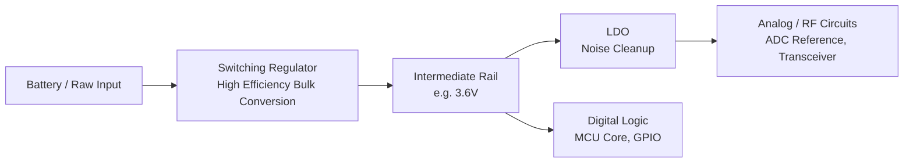

## Voltage Regulators: Linear and Switching

### Overview

Voltage regulators are circuits that maintain a constant output voltage regardless of variations in input voltage or load current. In embedded systems, they convert a raw power source (battery, USB, wall adapter, solar cell) into the stable, precise voltage rails required by microcontrollers, sensors, radios, and other components. The two dominant families are **linear regulators** (LDOs and standard linear regulators) and **switching regulators** (buck, boost, buck-boost converters). Choosing between them is one of the most consequential decisions in embedded power system design, affecting efficiency, noise, board space, cost, and thermal behavior.

### Why Regulation Is Necessary

Raw power sources are rarely suitable to feed directly to electronics:

- **Battery voltage sags and drifts.** A single-cell Li-ion battery ranges from about 4.2 V fully charged to 3.0 V discharged, but a microcontroller may require a stable 3.3 V.
- **Digital logic requires tight tolerances.** Most MCUs specify a supply tolerance of ±5% or ±10%; exceeding it risks brownouts, corrupted flash writes, or undefined behavior.
- **Noise-sensitive analog circuits** (ADCs, RF front-ends, sensors) need low-ripple, low-noise supplies to achieve rated performance.
- **Multiple voltage domains** are common on one board — e.g., 3.3 V for the MCU, 1.8 V for a camera sensor, 5 V for a USB transceiver — each requiring its own regulated rail.

### Linear Regulators

#### Operating Principle

A linear regulator works as a variable resistor in series with the load, continuously adjusting its resistance to drop the excess voltage between input and output. An internal error amplifier compares a fraction of the output voltage (via a feedback divider) against a stable reference voltage, and adjusts a pass transistor to hold the output constant.

$$V_{DROPOUT} = V_{IN} - V_{OUT}$$

The excess energy is dissipated as heat, not delivered to the load:

$$P_{DISS} = (V_{IN} - V_{OUT}) \times I_{LOAD}$$

#### Types of Linear Regulators

**Standard linear regulators** (e.g., the classic 7805 family) use a bipolar pass transistor and typically require 2–3 V of headroom between input and output to maintain regulation.

**Low-Dropout regulators (LDOs)** use a PMOS or PNP pass element that can operate with much smaller headroom — often as low as 100–300 mV at rated current. This is essential in battery-powered embedded designs where the input voltage may be close to the desired output (e.g., regulating a nearly-depleted Li-ion cell down to 3.3 V).

**Quasi-LDOs / very-low-dropout regulators** push dropout even lower, sometimes below 100 mV, for applications where every millivolt of battery life matters.

#### Key Parameters

- **Dropout voltage**: minimum $V_{IN} - V_{OUT}$ needed to maintain regulation.
- **Quiescent current ($I_Q$)**: current the regulator itself consumes, critical for battery-powered/always-on designs. Modern ultra-low-power LDOs achieve $I_Q$ in the range of hundreds of nanoamps.
- **PSRR (Power Supply Rejection Ratio)**: ability to reject noise/ripple present on the input rail, important when powering analog or RF circuits from a noisy switching supply.
- **Output noise**: typically very low (tens of µV RMS), a major advantage over switching regulators.
- **Load/line regulation**: how much output voltage shifts in response to load current changes or input voltage changes.
- **PSRR and noise generally degrade at higher frequencies and lower headroom; exact figures are datasheet-specific.** [Unverified for any particular part without checking its datasheet]

#### Advantages

- Simple design: often just an input capacitor, output capacitor, and the regulator IC.
- Low output noise and ripple — ideal for analog/RF supply rails.
- No switching noise or EMI — no external inductor or high-frequency switching node.
- Fast transient response.
- Low cost and small footprint for low-current applications.

#### Disadvantages

- **Poor efficiency when the input-to-output differential is large.** Efficiency is approximately:

$$\eta \approx \frac{V_{OUT}}{V_{IN}} \times 100\%$$

Regulating 5 V down to 3.3 V gives roughly 66% efficiency; regulating 12 V down to 3.3 V gives only about 27%, wasting the rest as heat.

- All excess power becomes heat, which can require thermal management (heatsinking, copper pour, thermal vias) in higher-current designs.
- Not practical for boosting voltage (linear regulators can only step down).

#### When to Use Linear Regulators in Embedded Design

- Powering noise-sensitive analog front-ends, ADC references, or RF transceivers from a "quieter" version of a digital rail (often as a post-regulator after a switching converter — a common "switcher + LDO" cascade).
- Low current draw (tens of mA) where efficiency loss is negligible in absolute terms.
- Small $V_{IN} - V_{OUT}$ differential, such as regulating a 3.6 V battery down to 3.0 V.
- Cost- and space-constrained designs where the simplicity outweighs efficiency concerns.
- Always-on rails in battery products where ultra-low $I_Q$ LDOs can outperform switchers at very light loads.

### Switching Regulators

#### Operating Principle

A switching regulator (switch-mode power supply, SMPS) rapidly switches a power transistor on and off (typically hundreds of kHz to several MHz), storing and transferring energy via an inductor (and sometimes a transformer) and smoothing capacitor. Because energy is transferred rather than dissipated, switching regulators can achieve much higher efficiency and can step voltage up, down, or invert polarity.

A feedback loop adjusts the **duty cycle** ($D$), the fraction of each switching period the transistor is ON, to regulate the output.

#### Buck (Step-Down) Converter

Reduces a higher input voltage to a lower output voltage. Ideal duty cycle relationship (continuous conduction mode, ignoring losses):

$$D = \frac{V_{OUT}}{V_{IN}}$$

Common use: stepping a 12 V or 5 V rail down to 3.3 V or 1.8 V for MCUs and digital logic, at much higher efficiency than an LDO would achieve over the same differential.

#### Boost (Step-Up) Converter

Increases a lower input voltage to a higher output voltage — essential for single-cell battery systems that must supply a higher rail (e.g., 1.5 V AA cell boosted to 3.3 V, or Li-ion boosted to 5 V for USB). Ideal duty cycle:

$$D = 1 - \frac{V_{IN}}{V_{OUT}}$$

#### Buck-Boost Converter

Produces an output voltage that can be higher or lower than the input — critical when a battery's voltage range straddles the target output. A Li-ion cell (4.2 V to 3.0 V) powering a fixed 3.3 V rail is a classic case: the input starts above the target and ends below it, so a simple buck or boost alone cannot cover the full range.

#### Topology Diagram

<svg xmlns="http://www.w3.org/2000/svg" viewBox="0 0 900 380" font-family="Helvetica, Arial, sans-serif">
<text x="450" y="28" text-anchor="middle" font-size="20" font-weight="bold" fill="#1a1a1a">Switching Regulator Topologies (svg_diagram)</text>

<g>
<text x="150" y="60" text-anchor="middle" font-size="15" font-weight="bold" fill="#1a4d8f">Buck (Step-Down)</text>
<line x1="40" y1="120" x2="90" y2="120" stroke="#333" stroke-width="2" />
<text x="30" y="110" font-size="12" fill="#333">Vin</text>
<rect x="90" y="95" width="30" height="50" fill="none" stroke="#333" stroke-width="2" />
<text x="105" y="180" text-anchor="middle" font-size="11" fill="#333">SW</text>
<line x1="120" y1="120" x2="170" y2="120" stroke="#333" stroke-width="2" />

<path d="M170,120 q10,-15 20,0 q10,-15 20,0 q10,-15 20,0" fill="none" stroke="#333" stroke-width="2" />
<text x="200" y="105" text-anchor="middle" font-size="11" fill="#333">L</text>
<line x1="230" y1="120" x2="270" y2="120" stroke="#333" stroke-width="2" />
<line x1="270" y1="120" x2="270" y2="200" stroke="#333" stroke-width="2" />
<line x1="255" y1="200" x2="285" y2="200" stroke="#333" stroke-width="2" />
<text x="270" y="220" text-anchor="middle" font-size="11" fill="#333">Cout</text>
<line x1="270" y1="120" x2="290" y2="120" stroke="#333" stroke-width="2" />
<text x="300" y="110" font-size="12" fill="#333">Vout</text>
<line x1="40" y1="120" x2="40" y2="260" stroke="#333" stroke-width="2" />
<line x1="105" y1="145" x2="105" y2="260" stroke="#333" stroke-width="2" />
<line x1="270" y1="200" x2="270" y2="260" stroke="#333" stroke-width="2" />
<line x1="40" y1="260" x2="270" y2="260" stroke="#333" stroke-width="2" />
<text x="450" y="270" text-anchor="middle" font-size="0" fill="#333" />
</g>

<g>
<text x="480" y="60" text-anchor="middle" font-size="15" font-weight="bold" fill="#8f4d1a">Boost (Step-Up)</text>
<line x1="370" y1="120" x2="420" y2="120" stroke="#333" stroke-width="2" />
<text x="360" y="110" font-size="12" fill="#333">Vin</text>
<path d="M420,120 q10,-15 20,0 q10,-15 20,0 q10,-15 20,0" fill="none" stroke="#333" stroke-width="2" />
<text x="450" y="105" text-anchor="middle" font-size="11" fill="#333">L</text>
<line x1="480" y1="120" x2="520" y2="120" stroke="#333" stroke-width="2" />
<rect x="520" y="95" width="30" height="50" fill="none" stroke="#333" stroke-width="2" />
<text x="535" y="180" text-anchor="middle" font-size="11" fill="#333">SW</text>
<line x1="480" y1="120" x2="480" y2="150" stroke="#333" stroke-width="2" />
<line x1="550" y1="120" x2="600" y2="120" stroke="#333" stroke-width="2" />
<line x1="600" y1="120" x2="600" y2="200" stroke="#333" stroke-width="2" />
<line x1="585" y1="200" x2="615" y2="200" stroke="#333" stroke-width="2" />
<text x="600" y="220" text-anchor="middle" font-size="11" fill="#333">Cout</text>
<line x1="600" y1="120" x2="640" y2="120" stroke="#333" stroke-width="2" />
<text x="650" y="110" font-size="12" fill="#333">Vout</text>
<line x1="370" y1="120" x2="370" y2="260" stroke="#333" stroke-width="2" />
<line x1="535" y1="145" x2="535" y2="260" stroke="#333" stroke-width="2" />
<line x1="600" y1="200" x2="600" y2="260" stroke="#333" stroke-width="2" />
<line x1="370" y1="260" x2="600" y2="260" stroke="#333" stroke-width="2" />
</g>

<text x="450" y="330" text-anchor="middle" font-size="12" fill="#555">Buck: D = Vout / Vin Boost: D = 1 - (Vin / Vout)</text>

<text x="450" y="355" text-anchor="middle" font-size="12" fill="#555">SW = controlled power switch (MOSFET), L = energy-storage inductor, Cout = output filter capacitor</text>

</svg>

#### Key Parameters

- **Switching frequency**: typically 200 kHz–5 MHz in modern embedded-grade converters. Higher frequency allows smaller inductors/capacitors but increases switching losses and EMI.
- **Efficiency**: commonly 85–95% across a wide range of input/output differentials, largely independent of the differential (unlike linear regulators).
- **Output ripple**: switching action inherently produces ripple at the switching frequency, typically tens of mV, filtered by the output LC network.
- **EMI/noise**: the switching node generates high-frequency noise that can radiate or couple into nearby sensitive traces, requiring careful layout (short switching loops, ground planes, shielding).
- **Load transient response**: generally slower than LDOs due to the control loop bandwidth and inductor dynamics, though modern designs mitigate this with fast control loops (e.g., hysteretic or COT — constant on-time — control).
- **Quiescent current in light-load/burst modes**: many modern buck converters include pulse-frequency modulation (PFM) or burst modes that keep $I_Q$ low (µA range) at light loads for battery-powered designs.

#### Advantages

- High efficiency (often >85%) across wide input/output ranges, minimizing wasted energy and heat — critical for battery life and thermal budgets.
- Can step up, step down, or invert voltage.
- Efficiency remains relatively flat even with a large $V_{IN}$-to-$V_{OUT}$ differential, unlike linear regulators.

#### Disadvantages

- More complex circuit: requires inductor, output/input capacitors, and often a compensation network or is integrated but still needs external passives.
- Generates switching noise and ripple on the output, and radiates EMI from the switching node — problematic for noise-sensitive analog or RF sections nearby.
- Larger board footprint due to the inductor (though modern integrated-inductor "power modules" reduce this).
- Generally higher cost than a simple linear regulator for low-current applications.
- PCB layout is more critical — poor layout can cause instability, excess noise, or reduced efficiency.

#### When to Use Switching Regulators in Embedded Design

- Any rail with significant current draw (hundreds of mA and above) where linear regulation would waste too much power as heat.
- Battery-powered systems where efficiency directly determines battery life.
- Any case requiring voltage step-up (boost) or a range that straddles the output (buck-boost), such as single-cell Li-ion or alkaline battery systems.
- Systems with tight thermal budgets or no room for heatsinking.
- Main system power rail generation (e.g., 5 V USB input down to 3.3 V core logic) in most modern embedded products.

### Comparison Summary

| Characteristic | Linear (LDO) | Switching (Buck/Boost) |
| --- | --- | --- |
| Efficiency | Low when $V_{IN} \gg V_{OUT}$ (≈ $V_{OUT}/V_{IN}$) | High (typically 85–95%), fairly flat across differentials |
| Output noise/ripple | Very low | Higher; switching-frequency ripple present |
| EMI | Minimal | Significant; requires careful layout |
| Complexity | Simple (few external parts) | More complex (inductor, compensation) |
| Board area | Small (low current) | Larger (inductor), though shrinking with integration |
| Heat generation | High at large differentials | Low, distributed via high efficiency |
| Step-up capability | No (step-down only) | Yes (boost/buck-boost topologies) |
| Cost (low current) | Lower | Higher |
| Typical embedded use | Analog/RF post-regulation, low-current rails, battery near-target voltage | Main power rails, battery-to-system conversion, high-current loads |

### Hybrid Approach: Switcher + LDO Cascade

A very common embedded power architecture uses a switching regulator for the bulk, high-efficiency voltage conversion (e.g., battery to an intermediate 3.6 V rail), followed by a low-dropout linear regulator to clean up that rail for noise-sensitive circuitry (e.g., an ADC reference or RF transceiver). This captures the efficiency of switching conversion while still delivering the low-noise output an LDO provides, at the cost of a small additional efficiency loss and component count.

### Practical Design Considerations

- **Capacitor selection**: LDOs often require specific ESR ranges on the output capacitor for stability (check datasheet — some are stable only with ceramic caps, others need a minimum ESR). Switching regulators require input/output capacitors sized for ripple current handling, not just capacitance value.
- **Inductor selection for switchers**: must be rated for the peak inductor current (not just average) and have low DCR (DC resistance) to minimize conduction losses; saturation current rating must exceed worst-case peak current.
- **Thermal design for LDOs**: at high current with large dropout, junction temperature rise can be significant; check the package's thermal resistance ($\theta_{JA}$) against worst-case power dissipation.
- **PCB layout for switchers**: minimize the loop area of the high-current switching path (input cap → switch → inductor → output cap → ground return) to reduce EMI and ringing; keep the feedback trace away from the switching node.
- **Enable/sequencing pins**: many embedded designs require specific power-up sequencing between rails (e.g., core voltage before I/O voltage); most regulator ICs provide an enable pin and sometimes a power-good output for sequencing logic.
- **Dropout margin**: always design with margin above minimum dropout voltage to account for battery discharge curves, temperature effects, and load transients — running right at the dropout edge risks intermittent regulation loss.

**Related Topics**

- Power Management — Buck-boost topology deep dive and inductor selection
- Power Management — Battery chemistries and discharge curve characterization
- Power Management — Power sequencing and supervisory circuits (brownout detection, power-good signaling)
- Power Management — Low-power/sleep modes and dynamic voltage scaling
- Power Management — EMI mitigation techniques for switching converters
- Power Management — PCB layout guidelines for power regulator circuits
- Power Management — Battery charging circuits (linear vs. switching chargers)