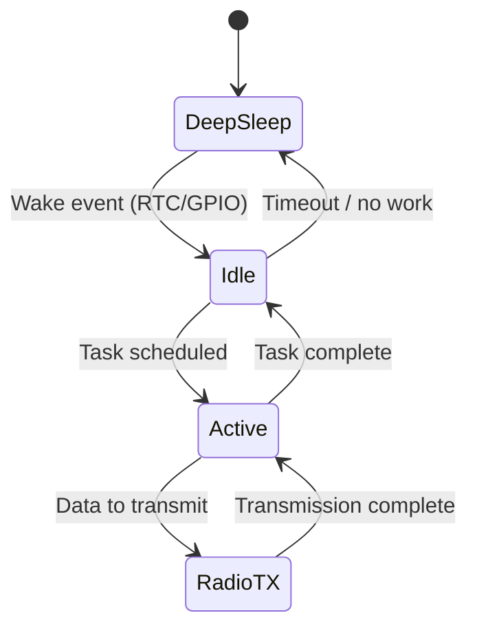
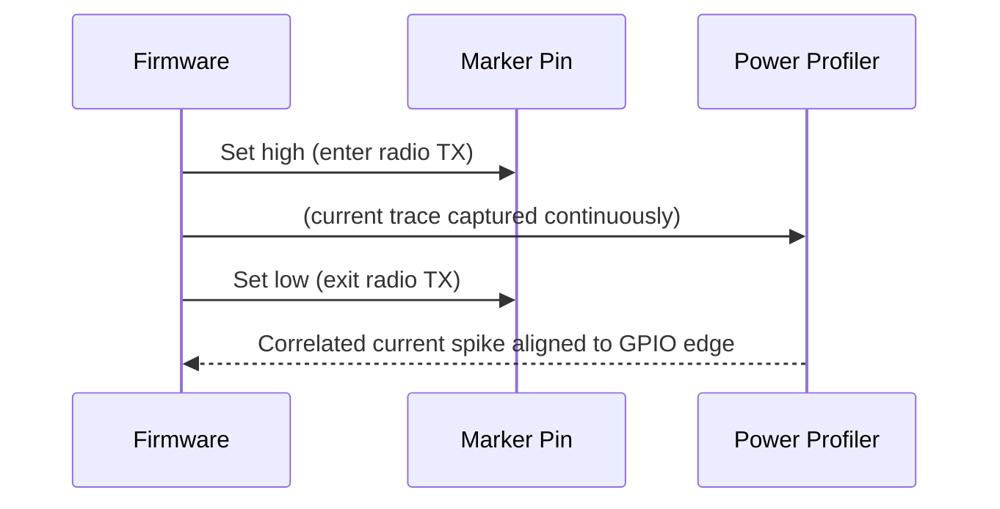

## Measuring and Profiling Power Consumption

### Overview

Power consumption measurement and profiling is the practice of quantifying how much energy an embedded system draws over time, at what points in its operation, and why. This discipline underpins battery life estimation, thermal design, compliance with energy budgets, and the identification of software or hardware inefficiencies. Unlike a simple multimeter reading of average current, true profiling captures the *dynamic* current behavior of a system as it transitions between sleep, idle, and active states — often across current ranges spanning six or more orders of magnitude (nanoamps in deep sleep to hundreds of milliamps during radio transmission).

### Why Power Profiling Matters

- **Battery life prediction**: A product's real-world battery life depends on its duty cycle across power states, not just its peak or average current in isolation.
- **Thermal budget validation**: Sustained high current draw dictates heatsinking, enclosure design, and derating margins.
- **Firmware optimization feedback loop**: Profiling reveals which functions, peripherals, or code paths consume disproportionate energy, guiding low-power firmware design.
- **Regulatory and certification requirements**: Some products (e.g., IoT devices, medical wearables) have contractual or regulatory energy budgets that must be validated empirically.
- **Debugging unexpected drain**: Profiling can expose bugs such as a peripheral left enabled, a polling loop that should be interrupt-driven, or a radio stuck in an active state.

### Fundamental Electrical Quantities

- **Instantaneous current** ($I(t)$): current drawn at a specific moment, which can vary dramatically as the device switches between sleep and active states.
- **Average current** ($I_{avg}$): the time-weighted mean current over a measurement window:

$$I_{avg} = \frac{1}{T}\int_0^T I(t)\,dt$$

- **Charge consumed** ($Q$): the integral of current over time, often the most useful quantity for battery-life estimation:

$$Q = \int_0^T I(t)\,dt$$

- **Energy consumed** ($E$): accounts for voltage as well, important when voltage varies (e.g., battery discharge curve) or when comparing designs at different voltages:

$$E = \int_0^T V(t) \, I(t)\,dt$$

- **Battery life estimate**: for a battery of capacity $C$ (in mAh) and a known average current draw:

$$t_{life} \approx \frac{C}{I_{avg}}$$

This is a simplifying approximation. [Inference — actual battery life depends on discharge curve nonlinearity, temperature, self-discharge, and cutoff voltage, which this formula does not capture]

### Power States in Embedded Systems

Most embedded systems cycle through multiple discrete power states, each with a characteristic current draw:

| State | Typical Current Range | Description |
| --- | --- | --- |
| Deep sleep / shutdown | nA – low µA | Core logic off, only wake-up circuitry (RTC, watchdog) powered |
| Standby / stop mode | µA – tens of µA | RAM retained, clocks mostly gated, fast wake possible |
| Idle / sleep with peripherals active | tens of µA – low mA | CPU halted, select peripherals (timers, low-power UART) running |
| Active / run mode | mA – tens of mA | CPU executing instructions, peripherals clocked |
| Peak / burst (e.g., radio TX, flash write) | tens – hundreds of mA | Short-duration high-current events |

Because these states can differ by five or six orders of magnitude, capturing all of them with a single measurement technique or instrument range is difficult — this is the central technical challenge in power profiling.

### Measurement Techniques

#### Shunt Resistor (Current Sense) Method

The most fundamental technique: insert a small, precise resistor in series with the power supply path and measure the voltage drop across it.

$$I = \frac{V_{SHUNT}}{R_{SHUNT}}$$

- **Trade-off**: A larger shunt resistance gives better measurement resolution at low currents but introduces more voltage drop (burden voltage) that can affect the device under test, especially problematic when the device has a low dropout margin (e.g., an LDO close to its minimum headroom).
- **Multi-range/auto-ranging shunts**: To handle both nanoamp sleep currents and hundred-milliamp bursts, specialized instruments dynamically switch between a large shunt (for high sensitivity at low current) and a small shunt (for low burden voltage at high current), or use logarithmic/multi-decade amplifier front ends.
- Common in dedicated power profilers such as the Nordic Power Profiler Kit II, Qoitech Otii, and Keysight/Joulescope-class instruments, which use this technique combined with high-speed ADCs to capture current transients in real time.

#### Digital Multimeter (DMM) Method

The simplest approach — place a DMM in series (current mode) or across a shunt (voltage mode) and read average current.

- **Limitations**: Most DMMs sample too slowly (a few readings per second) to capture short current transients (radio bursts, flash writes lasting microseconds to milliseconds), and their fixed current range often can't span both sleep and active currents accurately. A DMM is adequate for coarse average-current estimates but inadequate for true dynamic profiling.

#### Coulomb Counting

Uses a dedicated fuel-gauge IC (many of which are designed for battery-powered products) to integrate current over time directly in hardware, yielding accumulated charge (mAh/µAh) without requiring high-speed sampling and post-processing.

- **Advantage**: Naturally produces the $Q = \int I\,dt$ quantity most relevant to battery life, and can run continuously in the field (not just on the bench).
- **Limitation**: Typically reports accumulated charge or averaged current rather than fine-grained instantaneous waveforms, so it complements but does not replace transient-capture instruments during development.

#### Oscilloscope with Current Probe

A current probe (Hall-effect or shunt-based) combined with an oscilloscope can capture fast transients with high time resolution, useful for characterizing switching regulator ripple, radio TX/RX current spikes, or brief flash-write current pulses.

- **Limitation**: Oscilloscope current probes often have limited low-current sensitivity and dynamic range compared to dedicated power profilers, and long-duration capture (minutes to hours, needed for duty-cycle analysis) is constrained by the scope's memory depth.

#### Dedicated Power Profiling Instruments

Purpose-built tools (e.g., Nordic Power Profiler Kit II, Qoitech Otii Ace/Arc, Keysight N6705 with current-sense modules, Joulescope) combine wide dynamic range (nA to hundreds of mA), high sampling rates (tens of kHz to MHz), and software for visualizing, marking, and analyzing current waveforms against firmware events.

- Many support **synchronized digital markers/GPIO capture**, allowing correlation of current spikes with specific firmware states (e.g., "radio TX started" flagged on the same timeline as the current trace) — extremely valuable for tying current draw to specific code paths.

### Correlating Power Data with Firmware Behavior

Raw current-vs-time data becomes actionable when correlated with what the firmware was doing at each moment. Common techniques:

- **GPIO toggling**: Firmware toggles a spare GPIO pin at the entry/exit of functions or states of interest; this pin is captured alongside the current trace (via a logic analyzer channel or a profiler's digital input) to mark exact timing boundaries.
- **UART/RTT logging**: Lightweight logging (e.g., SEGGER RTT, which has minimal timing overhead) can emit state-change markers that some profiling tools can time-align with the current waveform.
- **Software timestamping**: The firmware itself can record timestamps of state entry/exit (using a hardware timer) into a log later correlated offline with the current capture, useful when no free GPIO or debug channel is available.
- **Vendor SDK power analysis tools**: many silicon vendors (Nordic, STMicroelectronics, Silicon Labs, Texas Instruments) provide profiling software integrated with their debug probes to visualize energy alongside source-level execution.

### Profiling Methodology

1. **Define the representative duty cycle.** Determine the realistic mix and duration of power states the device will experience in the field (e.g., 99.9% deep sleep, periodic 50 ms wake-and-sense, occasional 20 ms radio transmission).
2. **Capture full-resolution current waveforms** for each individual state and transition using an instrument with sufficient dynamic range and sample rate.
3. **Identify and isolate transients**, including wake-up current spikes (often larger than steady-state active current due to clock/PLL startup, peripheral initialization) and shutdown/sleep-entry current.
4. **Compute weighted average current** across the full duty cycle using the measured per-state currents and their time fractions:

$$I_{avg} = \sum_{i} I_i \times \frac{t_i}{T_{total}}$$

5. **Estimate battery life** using the computed average current against the battery's rated capacity, ideally validated against the battery's actual discharge curve rather than a flat nominal capacity.
6. **Iterate on firmware/hardware** to reduce dominant contributors — often the wake-up transient or a peripheral inadvertently left enabled dominates the energy budget more than the nominally "active" processing time.

### Common Sources of Unexpected Power Drain

- **Peripherals left clocked or powered** after use (ADC, timers, communication peripherals) due to missing clock-gating or power-domain shutdown in firmware.
- **Pull-up/pull-down resistors** left enabled on GPIO pins driving current continuously, especially on pins connected to external circuitry.
- **Floating input pins**, which can cause internal input buffers to draw excess current due to indeterminate logic levels (particularly relevant on CMOS inputs, where a mid-rail floating voltage can cause both the pull-up and pull-down transistors to partially conduct).
- **Polling loops instead of interrupt-driven wake**, keeping the CPU in active mode unnecessarily rather than allowing it to sleep between events.
- **Debug/JTAG interfaces left active**, which can prevent the MCU from entering its lowest power states — profiling should generally be performed with the debug probe disconnected and running from a standalone power source, since debugger-attached measurements can be unrepresentative.
- **Crystal oscillator startup time**, where the wake-up transient before a stable clock is available can dominate energy cost for short, frequent wake cycles.
- **Sensor or radio module residual current** in states that are not fully powered down (e.g., a radio in a low-power idle listening mode rather than true shutdown).

### Statistical and Long-Duration Profiling

For products with highly variable or infrequent events (e.g., a sensor that transmits only on threshold crossing), short bench captures may not represent real-world average consumption. Techniques to address this include:

- **Long-duration coulomb-counting logs** run over hours or days on representative hardware in representative conditions.
- **Statistical sampling** across many duty-cycle instances to capture variability in wake-up timing, radio retry behavior, or environmental-dependent sensor read times.
- **Field data logging** via an onboard fuel gauge reporting back accumulated charge over the product's actual deployment, used to validate lab-bench estimates against real-world behavior.

### Practical Considerations

- **Measurement location matters**: measuring current at the battery terminals captures total system draw including the regulator's own losses, while measuring downstream of a regulator captures only the load's draw — both are useful depending on whether the goal is validating battery life or optimizing a specific subsystem.
- **Temperature effects**: many current consumption figures (leakage current in particular) are temperature-dependent, so bench measurements at room temperature may not represent field conditions in colder or hotter environments. [Inference — magnitude of this effect is device- and process-dependent and should be checked against the specific MCU's datasheet]
- **Measurement instrument loading**: even a well-chosen shunt resistor introduces some burden voltage and can slightly perturb the very low-power states it's trying to measure; this effect should be accounted for, especially near an LDO's dropout margin or a switching regulator's light-load efficiency knee.
- **Repeatability**: current draw during radio operation can vary based on RF environment (retries, channel conditions), so profiling should average over multiple trials rather than relying on a single capture.

**Related Topics**

- Power Management — Voltage regulators: linear and switching
- Power Management — Low-power/sleep modes and dynamic voltage scaling
- Power Management — Battery chemistries and discharge curve characterization
- Power Management — Clock gating and peripheral power domains
- Power Management — Wireless protocol duty cycling (BLE, Zigbee, LoRa power profiles)
- Power Management — Energy harvesting and ultra-low-power system design
- Debugging — Using logic analyzers and RTT for firmware event correlation