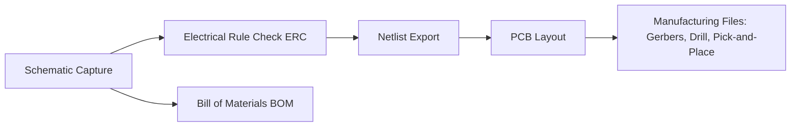
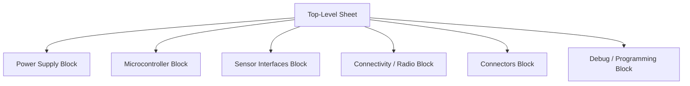

## Schematic Capture Fundamentals

### Overview

Schematic capture is the process of creating a formal, machine-readable representation of an electronic circuit's connectivity and components using electronic design automation (EDA) software. It is the foundational step in the hardware design flow for embedded devices, translating a circuit concept into a structured document that defines every component, its electrical connections (nets), and its properties — which then drives downstream processes like PCB layout, bill-of-materials (BOM) generation, and simulation.

### Purpose and Role in the Design Flow

A schematic serves several simultaneous functions:

- **Design intent documentation**: a human-readable diagram showing how a circuit is intended to work.
- **Netlist source**: the schematic's connectivity data is exported as a netlist, which drives the PCB layout tool's ratsnest (the initial unrouted connection guide) and enforces which pins must ultimately be connected by copper traces.
- **BOM generation**: component metadata (part number, footprint, manufacturer, value) attached to schematic symbols feeds directly into the bill of materials used for procurement and assembly.
- **Design verification**: automated electrical rule checks (ERC) catch common errors — unconnected pins, conflicting outputs driving the same net, missing power connections — before layout begins.

### Core Building Blocks

#### Symbols

A symbol is the graphical representation of a component in the schematic — not to be confused with its physical footprint (the PCB land pattern), which is a separate concept linked to the symbol for layout purposes. Each symbol defines:

- **Pin count and pin names/numbers**, matching the actual IC or component pinout.
- **Pin electrical type**: input, output, bidirectional, power, passive, open-collector/open-drain, no-connect (NC), etc. This classification is what enables electrical rule checking.
- **Graphical shape**: standardized shapes exist for common component classes (resistors, capacitors, transistors, logic gates), while ICs are typically drawn as labeled rectangles with pins arranged for readability rather than to mirror physical package pinout.
- **Reference designator prefix**: the letter prefix used for automatic numbering (e.g., R for resistors, C for capacitors, U for ICs, Q for transistors, D for diodes, J for connectors).

#### Nets and Wires

A **net** is a set of pins that are electrically connected. In schematic capture, connectivity is established through:

- **Wires**: explicit graphical lines drawn between pins, the most direct way to show connection.
- **Net labels**: named tags applied to a wire or pin; any two points sharing the same net label are considered connected even without a drawn wire between them, which is essential for reducing visual clutter on complex schematics (e.g., connecting a signal across multiple sheets).
- **Global labels/ports**: net labels with wider scope, connecting nets across different schematic sheets in a multi-sheet (hierarchical) design.
- **Buses**: a grouped representation of multiple related signals (e.g., an 8-bit data bus `DATA[0..7]`) drawn as a single thick line, which is expanded into individual nets during netlist generation — used to keep multi-bit signals (data buses, address buses) visually manageable.

#### Power Symbols and Ground

Power and ground nets are typically represented by dedicated symbols (e.g., a symbol labeled `3V3` or `VCC`, and a ground symbol) rather than wires routed to a physical power source symbol on the same sheet. This is a convention, not a strict rule — some tools/schools of practice do route power explicitly. Multiple ground symbol types are common in mixed-signal designs (e.g., separate `GND` and `AGND`/analog ground symbols) to visually distinguish domains that may be joined at a single point in layout, an important consideration for noise-sensitive analog or RF sections.

#### Component Properties/Attributes

Each schematic symbol instance carries metadata beyond its graphical pins:

- **Reference designator** (e.g., R14, U3) — a unique identifier for that specific component instance on the board.
- **Value** (e.g., 10kΩ, 100nF, or a specific part number for ICs).
- **Footprint association**: a link to the specific PCB land pattern the part will use, critical because a single symbol (e.g., a generic resistor) might map to many possible footprints (0402, 0603, 0805 package sizes).
- **Manufacturer part number (MPN) and other BOM fields**: used for procurement, often including secondary/alternate part numbers for supply-chain flexibility.
- **Datasheet link**: many tools allow attaching a reference URL or file for quick lookup during design.

### Hierarchical and Multi-Sheet Design

For embedded systems of even moderate complexity — a microcontroller with power management, sensors, connectors, and a radio — a single flat schematic sheet becomes unwieldy. Two common organizational strategies:

- **Flat multi-sheet design**: the design is split across several sheets connected by global labels or off-page connectors, without formal hierarchy — each sheet is simply a visual partition of one large netlist.
- **Hierarchical design**: sheets are organized as reusable blocks (hierarchical sheets/symbols) with defined input/output pins, similar to function calls in software. A hierarchical block (e.g., a "Power Supply" sub-sheet) can, depending on the tool, potentially be instantiated multiple times if the same sub-circuit repeats.

A typical embedded product schematic set is organized by functional block:

### Design Practices for Readable Schematics

- **Signal flow orientation**: conventionally, signal flow is drawn left-to-right and power flow top-to-bottom (power symbols at top, ground at bottom), matching common reading conventions and making the design easier to review.
- **Grouping related components**: passive support components (decoupling capacitors, pull-up resistors) are typically drawn adjacent to the IC pin they serve, rather than scattered, so their purpose is visually obvious.
- **Consistent net naming conventions**: descriptive, consistent net names (e.g., `SPI1_MOSI`, `I2C1_SCL`) rather than generic labels make the schematic self-documenting and simplify cross-referencing with the PCB layout and firmware pin definitions.
- **Decoupling capacitor placement notation**: many designers annotate schematics with intended physical placement notes (e.g., "place within 2mm of pin") even though the schematic itself has no inherent physical dimension — this bridges design intent to the layout engineer.
- **Avoiding wire/label ambiguity**: crossing wires without a junction dot are conventionally understood as NOT connected, while a junction dot indicates an actual electrical connection — a critical convention that, if misapplied or omitted, is a common source of connectivity errors.
- **Title blocks and revision history**: every schematic sheet typically includes a title block with project name, sheet number, revision, author, and date, supporting version control and manufacturing traceability.

### Electrical Rules Checking (ERC)

Most EDA tools provide an automated ERC pass that flags likely errors before layout, such as:

- Unconnected pins (excluding those explicitly marked no-connect).
- Two or more output pins driving the same net (a potential contention/short condition).
- Power pins with no path to a power symbol.
- Mismatched net label spelling (a very common source of "invisible" open circuits, since a typo like `SPI_M0SI` vs `SPI_MOSI` creates two separate, unconnected nets that look identical at a glance).

ERC catches many classes of connectivity mistakes, but it cannot verify that the *intended* circuit behavior is correct — it only confirms internal consistency of the drawn connections. [Inference — the exact rule set and strictness vary by EDA tool and configuration]

### Common EDA Tools for Embedded Hardware Design

- **KiCad**: free, open-source, widely used across hobbyist and increasingly professional embedded design.
- **Altium Designer**: a professional-grade tool common in commercial embedded product development, with strong hierarchical design and library management features.
- **Eagle (Autodesk)**: historically popular, particularly in maker/prototyping communities.
- **OrCAD / Cadence Allegro**: common in larger enterprise and high-complexity board design environments.
- **EasyEDA / Altium 365**: cloud-based tools with integrated component sourcing, popular for fast prototyping workflows.

Tool-specific feature sets and terminology vary; the concepts above (symbols, nets, hierarchy, ERC) are common across essentially all mainstream schematic capture tools, though exact menu names and workflow differ. [Unverified for any specific tool version without checking current documentation]

### Typical Schematic Capture Workflow for an Embedded Board

1. **Define functional blocks** (power, MCU, sensors, connectivity, connectors, debug interface) based on the system requirements.
2. **Select and place symbols** for each component, sourced from vendor libraries or created/verified against the component's actual datasheet pinout.
3. **Wire connections and apply net labels**, following a consistent naming convention that will carry through to layout and firmware.
4. **Add component values and footprint associations**, ensuring every symbol has a footprint assigned before netlist export.
5. **Run ERC** and resolve all flagged issues.
6. **Annotate reference designators** (many tools auto-number components, e.g., R1, R2, R3, in placement or sheet order).
7. **Generate the netlist and BOM**, then hand off to PCB layout.
8. **Peer review / design review**, since a second set of eyes often catches logical errors ERC cannot detect (e.g., a pull-up resistor on the wrong signal, or an incorrect voltage divider ratio).

### Common Pitfalls for Embedded Designs Specifically

- **Missing decoupling capacitors** on IC power pins in the schematic, which is easy to overlook when a symbol has multiple power pins that are not immediately adjacent in the graphical layout.
- **Incorrect symbol pin mapping**, especially for complex ICs (MCUs, FPGAs) where a symbol sourced from an unverified third-party library may not match the actual datasheet pinout — always cross-check against the datasheet before finalizing.
- **Unassigned or mismatched footprints**, which will not be caught by ERC (a purely electrical check) and can only be caught by a separate footprint/package verification step or careful manual review.
- **Ambiguous net names across sheets** in hierarchical designs, where a net label intended to be local is accidentally treated as global (or vice versa), silently merging or splitting nets that should not be.
- **Missing pull-up/pull-down resistors** on open-drain or open-collector signals (common on I2C buses, some reset lines), which will pass ERC but fail to function correctly on the physical board.

**Related Topics**
- PCB Layout — Component placement and routing fundamentals
- PCB Layout — Footprint creation and land pattern standards (IPC-7351)
- Design Verification — Design rule checking (DRC) in PCB layout
- Power Management — Decoupling and bypass capacitor placement
- Signal Integrity — High-speed signal routing considerations
- Manufacturing — Bill of materials (BOM) management and component sourcing
- Debugging — Reading datasheets and interpreting pin descriptions