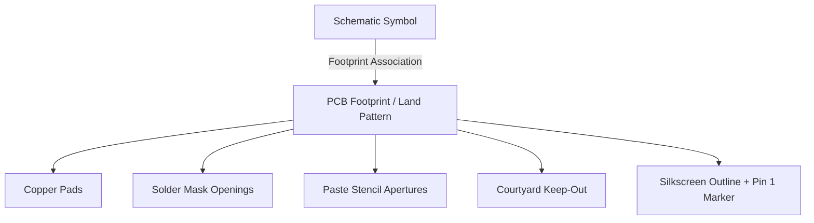

## Component Selection and Footprints

### Overview

Component selection and footprint definition are two tightly linked activities in embedded hardware design: choosing which physical part will fulfill a schematic's electrical role, and defining the exact copper/solder-mask/silkscreen land pattern that part requires on the PCB. A mismatch or poor decision at this stage — an unavailable part, an incorrect footprint, or a component unsuited to the manufacturing process — is one of the most common sources of costly board respins.

### Component Selection Criteria

#### Electrical Requirements

- **Voltage and current ratings**: components must be rated with margin above worst-case operating conditions (supply tolerance, transient spikes, inrush current), not just nominal values.
- **Tolerance**: resistors, capacitors, and other passives are specified with a tolerance band (e.g., ±1%, ±5%, ±20%); the required tolerance depends on the circuit's sensitivity (a voltage-divider feedback network typically needs tighter tolerance than a simple pull-up resistor).
- **Temperature coefficient**: especially relevant for capacitors, where dielectric type (C0G/NP0, X7R, Y5V) determines how much capacitance shifts with temperature and applied DC bias — critical in timing circuits, analog filters, or precision references.
- **Frequency response / parasitic behavior**: at high frequencies, real components deviate from their ideal behavior due to parasitic inductance/capacitance (e.g., a ceramic capacitor's effective impedance rises above its self-resonant frequency), which matters for RF matching networks and high-speed decoupling.

#### Environmental and Reliability Requirements

- **Operating temperature range**: components are commonly graded as Commercial (0°C to 70°C), Industrial (−40°C to 85°C), or Automotive/Extended (−40°C to 125°C or higher); the product's deployment environment dictates the minimum acceptable grade.
- **Humidity/moisture sensitivity**: ICs carry a Moisture Sensitivity Level (MSL) rating that dictates storage, floor life, and baking requirements before reflow — relevant for manufacturing planning, not just design.
- **Vibration and mechanical stress**: connectors, large components, and through-hole parts subject to mechanical loading may need additional mechanical fastening or underfill in high-vibration embedded applications (automotive, industrial).
- **Lifecycle/obsolescence risk**: selecting parts with a stable, long-term supply outlook is especially important for embedded products with multi-year production runs; parts flagged as end-of-life (EOL) or "not recommended for new designs" (NRND) should generally be avoided.

#### Sourcing and Supply Chain Considerations

- **Availability and lead time**: especially critical after industry-wide component shortages have demonstrated how single-sourced or low-stock parts can stall production for months.
- **Second-source options**: designing with pin-compatible or footprint-compatible alternate parts (from a different manufacturer) reduces single-point-of-failure risk in the supply chain.
- **Cost at production volume**: unit price often drops significantly at higher order quantities; component selection for a product intended for mass production should reference volume pricing tiers, not just prototype-quantity pricing.
- **Package availability**: the same silicon die is often offered in multiple package options (e.g., QFN, LQFP, BGA) with different cost, size, and assembly complexity trade-offs.

#### Manufacturability Considerations

- **Package/assembly complexity**: fine-pitch packages (e.g., 0.4mm pitch QFN or BGA) require tighter PCB fabrication tolerances and more capable assembly equipment, potentially increasing cost or restricting which contract manufacturers can build the board.
- **Hand-assembly feasibility**: for prototyping or low-volume builds without reflow equipment, package choice matters significantly — 0603 or larger passives and non-BGA ICs are far more hand-solderable than 0201 passives or fine-pitch BGAs.
- **Reflow profile compatibility**: components must be rated for the solder paste/reflow temperature profile used in assembly (e.g., lead-free reflow typically peaks around 245–260°C); mixing components with mismatched thermal ratings on one board is a manufacturing risk.

### Passive Component Package Sizes

Surface-mount passives (resistors, capacitors) follow standardized imperial package size codes, with metric equivalents used in many regions:

| Imperial Code | Metric Code (mm) | Typical Use Case |
|---|---|---|
| 0201 | 0603 | Extreme space-constrained designs; hand-assembly very difficult |
| 0402 | 1005 | Common in compact modern designs; requires reflow assembly |
| 0603 | 1608 | Good balance of size and hand-solderability |
| 0805 | 2012 | Easier hand assembly; higher power/voltage rating headroom |
| 1206 | 3216 | Used where higher power dissipation or voltage rating is needed |

Smaller packages generally offer lower parasitic inductance (beneficial for high-speed decoupling) at the cost of reduced power dissipation capability and assembly difficulty.

### Understanding Footprints (Land Patterns)

A footprint (also called a land pattern or PCB footprint) defines the exact copper pads, solder mask openings, paste stencil apertures, and silkscreen outline that correspond to a physical component package on the PCB. The footprint is distinct from — but associated with — the schematic symbol; one schematic symbol (e.g., a generic MCU symbol) is always linked to exactly one specific footprint per design, even though the same symbol could theoretically map to multiple package options across different variants of a design.

#### Footprint Elements

- **Copper pads**: the exposed copper areas where solder attaches the component leads/terminals to the board.
- **Solder mask openings**: define where solder mask (the protective coating) is absent, exposing pads for soldering; mask openings are typically slightly larger than the copper pad (mask expansion) to accommodate registration tolerance.
- **Paste stencil apertures**: define the solder paste stencil openings used during SMT assembly; these are sometimes reduced relative to the pad size (paste reduction) for fine-pitch components to prevent solder bridging.
- **Courtyard**: a keep-out boundary around the footprint used to prevent adjacent components from being placed too close, ensuring clearance for assembly equipment and rework access.
- **Silkscreen outline and reference designator**: the printed outline and label visible on the assembled board, aiding visual inspection, rework, and manual assembly.
- **Pin 1 indicator**: a critical marking (dot, notch, or angled corner) showing component orientation — a wrong or ambiguous pin 1 marking is a common cause of reversed-component assembly errors.

#### Footprint Land Pattern Diagram (Two-Pad Passive Example)

<svg xmlns="http://www.w3.org/2000/svg" viewBox="0 0 500 260" font-family="Helvetica, Arial, sans-serif">
  <text x="250" y="26" text-anchor="middle" font-size="18" font-weight="bold" fill="#1a1a1a">0603 Passive Land Pattern (svg_diagram)</text>

  
  <rect x="100" y="70" width="300" height="120" fill="none" stroke="#999" stroke-width="1.5" stroke-dasharray="6,4" />
  <text x="250" y="65" text-anchor="middle" font-size="11" fill="#888">Courtyard (keep-out)</text>

  
  <rect x="175" y="105" width="150" height="50" fill="#d9d9d9" stroke="#666" stroke-width="1" />

  
  <rect x="110" y="95" width="70" height="70" fill="#c9a24b" stroke="#8a6d1f" stroke-width="1.5" />
  
  <rect x="320" y="95" width="70" height="70" fill="#c9a24b" stroke="#8a6d1f" stroke-width="1.5" />

  <text x="145" y="200" text-anchor="middle" font-size="12" fill="#333">Pad 1</text>
  <text x="355" y="200" text-anchor="middle" font-size="12" fill="#333">Pad 2</text>

  
  <line x1="110" y1="215" x2="390" y2="215" stroke="#333" stroke-width="1" />
  <line x1="110" y1="210" x2="110" y2="220" stroke="#333" stroke-width="1" />
  <line x1="390" y1="210" x2="390" y2="220" stroke="#333" stroke-width="1" />
  <text x="250" y="235" text-anchor="middle" font-size="11" fill="#333">Overall pad span (per IPC-7351 density level)</text>

  <text x="250" y="252" text-anchor="middle" font-size="11" fill="#555">Gray = component body, Gold = copper pads, Dashed = courtyard boundary</text>
</svg>

### Footprint Standards: IPC-7351

Most modern EDA tool libraries base surface-mount footprint dimensions on the **IPC-7351** standard (land pattern generation standard published by IPC), which defines pad geometry based on:

- **Component body dimensions** from the manufacturer's datasheet mechanical drawing.
- **Density level**: IPC-7351 defines Most (Level A/dense), Nominal (Level B), and Least (Level C/wide) density options, trading off pad size/spacing against solder joint reliability and rework ease. Denser levels save board space but leave less margin for placement tolerance.
- **Toe, heel, and side fillet requirements**: minimum solder fillet dimensions needed for a mechanically and electrically reliable joint, derived from IPC guidelines rather than arbitrary designer choice.

Because footprint geometry directly affects solder joint reliability and manufacturability, footprints should generally be verified against the specific component's datasheet mechanical drawing rather than assumed correct from a generic library part — datasheet package dimensions can vary between manufacturers even for "equivalent" parts. [Inference — the degree of variation depends on the specific part family and manufacturer]

### Footprint Verification Workflow

1. **Obtain the component's mechanical drawing** from the datasheet, noting body size, pin pitch, pin count, and any package variants (e.g., different lead lengths for the same die).
2. **Compare against the library footprint** (if using a pre-existing library part) pad-by-pad, or generate a new footprint using an IPC-7351 calculator/wizard if unavailable.
3. **Verify pin 1 orientation** matches both the schematic symbol's pin numbering and the physical part marking.
4. **Check courtyard clearance** against neighboring components planned for the layout, particularly for fine-pitch or tall components.
5. **Cross-check thermal pad requirements** for power components with an exposed thermal pad (common on QFN packages) — the pad often requires specific via patterns (thermal vias) for heat dissipation, which must be included in the footprint definition.
6. **3D model association** (where supported) to visually verify component height and placement clearance, especially important for enclosure-constrained embedded products.

### Common IC Package Types in Embedded Design

| Package | Description | Typical Use |
|---|---|---|
| SOIC / SOP | Gull-wing leads, moderate pitch (1.27mm typical) | Simple logic ICs, small MCUs, easier hand assembly |
| TSSOP | Thinner, finer-pitch variant of SOIC | Space-constrained designs needing more pins |
| QFN / DFN | No-lead, pads on underside, often with exposed thermal pad | Power management ICs, RF modules; requires reflow, difficult hand assembly |
| LQFP / TQFP | Leaded, four-sided, gull-wing | Microcontrollers, FPGAs with moderate-to-high pin count |
| BGA | Solder balls on underside grid array | High pin-count MCUs, SoCs, memory; requires precise reflow and often X-ray inspection |
| WLCSP | Wafer-level chip-scale package, very small BGA-like | Extremely space-constrained wearable/mobile designs |

### Component Selection Pitfalls Specific to Embedded Design

- **Selecting a part without checking long-term availability**, leading to a forced redesign mid-production when the part is discontinued.
- **Ignoring package thermal resistance** ($\theta_{JA}$) when selecting a power regulator or driver IC, resulting in thermal issues only discovered after board bring-up.
- **Using a generic/placeholder footprint** from an unfamiliar or auto-generated library without datasheet verification, a common source of "tombstoning" (a passive component lifting on one end during reflow due to imbalanced pad geometry or thermal mass) or unreliable solder joints.
- **Overlooking minimum order quantities (MOQs) or reel-only availability** for prototype-stage builds, where a part may only be purchasable in large reel quantities unsuitable for small prototype runs.
- **Neglecting mechanical fit** — verifying a component's physical footprint and height against the enclosure and neighboring components' 3D bodies before committing to layout, avoiding late-stage mechanical conflicts.
- **Mismatched decoupling capacitor voltage rating**, especially relevant for ceramic capacitors where effective capacitance drops significantly under DC bias as the rated voltage is approached — a capacitor rated exactly at the rail voltage may deliver substantially less effective capacitance than its nominal value suggests. [Inference — the magnitude of this derating is dielectric- and manufacturer-specific and should be checked against the capacitor's DC bias derating curve]

**Related Topics**
- Schematic Capture — Fundamentals and symbol/netlist concepts
- PCB Layout — Component placement and routing fundamentals
- Manufacturing — Bill of materials (BOM) management and component sourcing
- Manufacturing — Design for manufacturability (DFM) and design for assembly (DFA)
- Thermal Management — Package thermal resistance and heat dissipation
- Power Management — Decoupling and bypass capacitor placement
- Quality — Solder joint reliability and reflow profile fundamentals