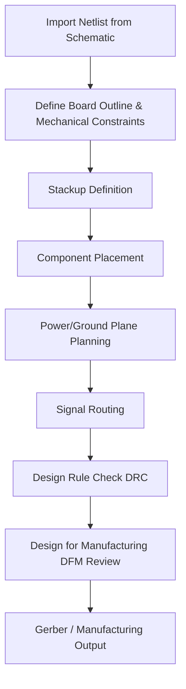

## PCB Layout Principles

### Overview

PCB layout is the process of translating a schematic's electrical connectivity into a physical arrangement of components and copper traces on a printed circuit board. It is where electrical design intent meets physical, manufacturing, thermal, and signal-integrity constraints. Good layout practice directly affects whether a board functions reliably, meets EMI/EMC regulations, can be manufactured at acceptable yield, and survives its intended operating environment — decisions at this stage are often far more consequential to a design's success than the schematic itself.

### The Layout Design Flow

### Board Stackup

The **stackup** defines the number and arrangement of copper layers, dielectric materials, and their thicknesses through the board's cross-section. Even simple embedded boards commonly use 2 or 4 layers; more complex designs (dense MCUs, high-speed interfaces, RF) often require 6 or more.

- **2-layer boards**: top and bottom copper only, no dedicated internal planes; ground and power must share routing space with signals, making clean return paths harder to achieve.
- **4-layer boards**: a very common configuration for embedded designs, typically Signal / Ground / Power / Signal, giving a solid ground reference plane directly beneath the primary routing layer — significantly improving signal integrity and EMI performance versus 2-layer.
- **6+ layer boards**: used when higher routing density, dedicated multiple power domains, or controlled-impedance high-speed signals (USB, Ethernet, high-speed SPI/QSPI, DDR memory) require additional dedicated plane and routing layers.
- **Layer thickness and dielectric constant** ($\varepsilon_r$) of the substrate material (commonly FR-4) affect controlled-impedance trace width calculations and are specified by the fabricator as part of the stackup.

### Component Placement

Placement decisions made before routing begins strongly influence how clean, short, and manufacturable the eventual routing will be.

- **Functional grouping**: components belonging to the same subsystem (power supply, MCU + decoupling, sensor interface, connectors) are typically placed together, mirroring the schematic's functional block organization and shortening critical routing paths.
- **Signal flow orientation**: placement often follows the same logical flow as the schematic (e.g., power input to power output, sensor to MCU to connector), reducing crossed and convoluted routing.
- **Decoupling capacitor proximity**: bypass/decoupling capacitors should be placed as close as physically possible to the IC power pin they serve, minimizing the loop inductance between the capacitor and the pin — a longer path increases parasitic inductance, degrading the capacitor's effectiveness at filtering high-frequency noise.
- **Connector and mechanical component placement**: driven first by the enclosure and mechanical constraints (connector positions often fixed by an external mating requirement), then other components are placed relative to these fixed points.
- **Thermal component spacing**: heat-generating components (power regulators, high-current drivers) should be spread out or positioned near board edges/vents where possible, rather than clustered, to avoid compounding thermal issues.
- **Crystal/oscillator placement**: crystals and their load capacitors should be placed close to the oscillator pins of the driving IC with short, direct traces, since these are high-impedance, noise-sensitive nodes particularly susceptible to coupled interference.
- **Test point accessibility**: probe points for key signals (power rails, reset, programming/debug interfaces) should be placed with physical access in mind for bring-up and manufacturing test.

### Power and Ground Plane Strategy

- **Solid ground reference planes** (typical on 4+ layer boards) provide a low-impedance return path for signal currents, which is essential for signal integrity and EMI control — high-frequency return current naturally follows the path of least inductance, which is directly beneath the signal trace on an unbroken reference plane.
- **Plane splits/cuts**: dividing a plane into separate regions (e.g., analog ground vs. digital ground) can isolate noisy digital return currents from sensitive analog sections, but if a high-speed signal trace crosses a plane split, its return current is forced to find a longer path around the gap, which can significantly increase radiated emissions and crosstalk — a frequently cited layout mistake.
- **Star grounding vs. plane grounding**: single-point (star) grounding, common in analog/RF or lower-frequency designs, ties separate ground regions together at one deliberate point; solid-plane grounding, more common in modern digital designs, keeps ground largely unified with careful component placement to manage current flow.
- **Power plane/pour sizing**: adequate copper cross-section for power distribution reduces IR drop and impedance at high current draw; thermal relief patterns on plane connections balance solderability against thermal conduction during assembly.

### Trace Routing Fundamentals

- **Trace width and current capacity**: trace width must be sized to handle the expected current without excessive temperature rise, following established current-capacity guidelines (commonly based on IPC-2221) that account for copper weight (oz/ft²), ambient temperature, and allowable temperature rise.
- **Controlled impedance routing**: high-speed signals (USB differential pairs, Ethernet, memory buses) require trace geometry (width, spacing, reference plane distance) calculated to hit a target characteristic impedance (commonly 50Ω single-ended or 90–100Ω differential, depending on the interface standard), calculated using the stackup's dielectric properties.
- **Differential pair routing**: paired signals (USB D+/D−, differential clock lines) should be routed with matched length and tightly, consistently coupled spacing along their entire length to maintain signal integrity and common-mode noise rejection.
- **Trace length matching**: for parallel bus interfaces or differential pairs with tight timing requirements, trace lengths are matched (often using serpentine/meander routing) to minimize skew between signals.
- **Via usage**: vias (plated holes connecting layers) introduce some parasitic inductance/capacitance and impedance discontinuity; high-speed signal routing generally minimizes unnecessary layer transitions, and where vias are required, adjacent ground return vias are often added to maintain a continuous return path.
- **45-degree/curved trace angles**: routing traces at 45° angles or with curved corners (rather than sharp 90° corners) is a widely followed convention, historically justified by manufacturing/etching concerns and signal integrity at very high frequencies; at typical embedded-board frequencies the practical impact is often minor, but the convention remains standard practice. [Inference — the actual electrical significance of trace corner angle is frequency- and application-dependent, and is debated for lower-speed digital designs]

### Design Rule Check (DRC)

DRC is an automated verification pass ensuring the physical layout adheres to fabrication and design constraints before generating manufacturing files:

- **Minimum trace width and spacing**: enforced against the fabricator's process capability (a low-cost fabricator may only reliably support wider minimums than an advanced/high-density fabricator).
- **Minimum drill size and annular ring**: via and hole dimensions must meet the fabricator's drilling capability, with adequate copper annular ring remaining around each drilled hole.
- **Clearance rules**: minimum spacing between copper features of different nets, preventing unintended shorts and meeting voltage-isolation requirements for higher-voltage sections.
- **Courtyard/placement overlap checks**: ensuring components are not placed too close together for assembly equipment or rework access, as defined by each footprint's courtyard boundary.
- **Unrouted net detection**: flags any net from the imported netlist that has not been fully connected in copper — analogous to ERC's role at the schematic stage, but for physical connectivity.

### EMI/EMC Considerations

- **Loop area minimization**: minimizing the physical area enclosed by a signal's outbound path and its return current path reduces radiated emissions, since loop antennas radiate proportionally to enclosed area and current — this principle underlies many of the placement and routing guidelines above (decoupling proximity, solid reference planes, avoiding plane splits under traces).
- **Switching regulator layout discipline**: the high-current switching loop of a buck or boost converter (input capacitor, switch node, inductor, output capacitor) should be kept as physically tight as possible, since this loop is a primary source of both conducted and radiated EMI in most embedded power designs.
- **Clock and oscillator containment**: high-frequency clock traces are common EMI sources and are often routed with adjacent ground stitching, kept short, and avoided from running near board edges or connectors that could act as unintentional radiating structures.
- **Connector and cable shielding/grounding**: cable-attached connectors are common paths for both emitted and received interference; proper chassis/shield grounding at the connector, following manufacturer guidance, helps control this coupling path.

### Thermal Layout Considerations

- **Copper pour as heat spreader**: large copper areas (power/ground planes, dedicated thermal pours) conduct heat away from hot components across the board area, reducing peak junction temperatures.
- **Thermal vias**: arrays of vias beneath a component's thermal pad (common on QFN power ICs) conduct heat from the top-layer pad down to internal or bottom-layer copper, often filled or capped depending on the fabricator's process to prevent solder wicking during reflow.
- **Component spacing for airflow/convection**: in designs without forced airflow, adequate spacing and copper pour distribution reduce the risk of localized hot spots compounding between adjacent heat-generating components.

### Manufacturing Constraints (DFM)

- **Panelization**: boards are typically manufactured in panels (arrays of the same board) with breakaway tabs or v-scoring, a consideration that affects board outline and edge component placement.
- **Silkscreen legibility and placement**: text and markings must not overlap pads or vias, remain legible at production print resolution, and typically avoid extending under components.
- **Solder mask and paste layer clearances**: mask and paste apertures must meet the fabricator's minimum feature size and registration tolerance, particularly for fine-pitch components.
- **Fabricator capability alignment**: routing rules, minimum via size, and layer count should be chosen with the intended fabricator's standard capability in mind — pushing beyond standard capability (e.g., very small vias, tight spacing) increases cost and can reduce yield.

### Common Layout Pitfalls in Embedded Design

- **Splitting ground planes unnecessarily** or routing high-speed traces across plane gaps, degrading signal integrity and increasing EMI.
- **Placing decoupling capacitors too far from IC power pins**, or routing the capacitor through a long, high-inductance path rather than a short direct connection.
- **Underestimating trace width for high-current paths** (battery charging, motor drivers, power distribution), leading to excessive voltage drop or localized heating.
- **Ignoring controlled-impedance requirements** on high-speed interfaces, resulting in reflections, signal integrity failures, or EMC compliance failures discovered late in development.
- **Placing crystals/oscillators near noisy switching regulators or digital buses**, coupling noise into the frequency reference and potentially causing clock jitter or instability.
- **Neglecting DFM review before submitting for fabrication**, discovering late that the design exceeds the chosen fabricator's process capability, requiring a costly and time-consuming board respin.

**Related Topics**
- Schematic Capture — Fundamentals and symbol/netlist concepts
- Component Selection and Footprints
- Power Management — Voltage regulators: linear and switching
- Signal Integrity — Controlled impedance and differential pair routing
- Thermal Management — Package thermal resistance and heat dissipation
- Manufacturing — Design for manufacturability (DFM) and design for assembly (DFA)
- EMC/EMI — Regulatory compliance testing and pre-compliance techniques