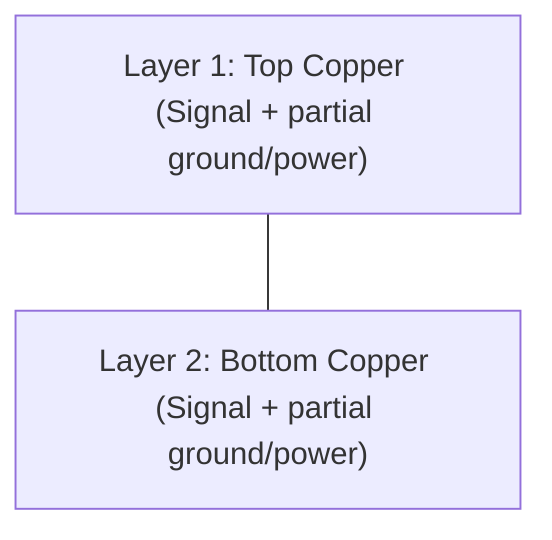
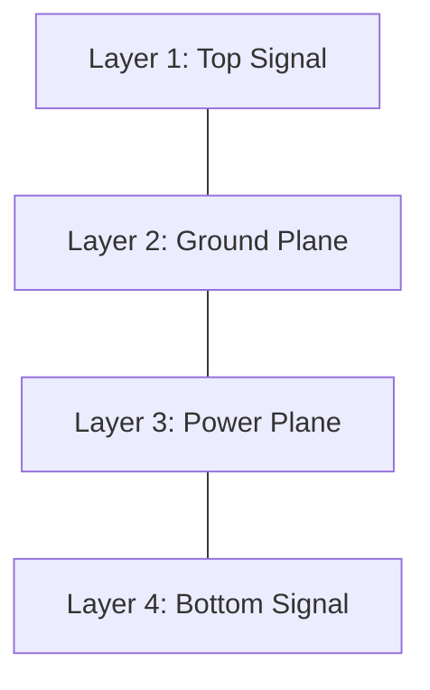
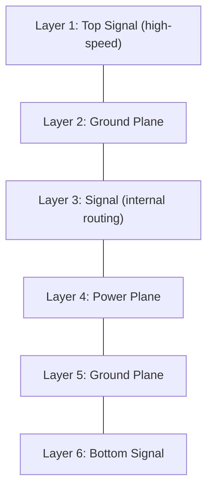
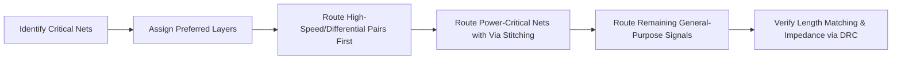

## Layer Stackup and Routing Strategies

### Overview

Layer stackup design and routing strategy determine how signal, power, and ground copper layers are arranged through a PCB's cross-section, and how traces are organized across those layers to meet electrical, thermal, and manufacturing requirements. While placement (covered separately) determines *where* components sit, stackup and routing strategy determine *how* connections between them are physically realized — and this decision has first-order effects on signal integrity, EMI, manufacturing cost, and design complexity.

### Why Stackup Matters

The stackup is typically one of the earliest decisions in PCB layout because it constrains nearly everything downstream:

- It determines how many independent routing layers are available, directly affecting routing density and feasibility for a given component count and pin pitch.
- It determines the presence, position, and continuity of reference planes, which governs signal return-path quality and controlled-impedance calculations.
- It sets the physical spacing between signal layers and reference planes (dielectric thickness), which is a primary input to impedance and crosstalk calculations.
- It affects manufacturing cost — more layers, tighter tolerances, or exotic materials all increase fabrication cost and lead time.

### Basic Stackup Configurations

#### 2-Layer Stackup

The simplest configuration: top and bottom copper, no internal layers.

- Ground and power must be routed as traces or partial pours sharing space with signals, since there is no dedicated internal plane.
- Signal return paths are less predictable and can have larger loop areas, generally resulting in worse EMI performance and signal integrity than a plane-based stackup.
- Lowest-cost option, commonly used for simple, low-pin-count, low-speed embedded designs (basic sensor boards, simple breakout boards).

#### 4-Layer Stackup

The most common configuration for mainstream embedded MCU-based designs, typically arranged as:

- Provides a solid ground reference immediately beneath the primary (top) routing layer, giving good signal integrity and return-path control for most digital signals.
- The power plane on layer 3 can be split into multiple isolated regions for different voltage rails, since a full unbroken plane is less critical for power distribution than for a signal return reference.
- Balances cost against performance well enough that it is a common default starting point for embedded designs with a moderate-pin-count MCU, several peripherals, and no extreme high-speed interfaces. [Inference — "common default" reflects general industry practice; the appropriate layer count is ultimately design-specific]

#### 6-Layer and Higher Stackups

Used when routing density, multiple isolated planes, or high-speed controlled-impedance interfaces demand more resources:

- Common in designs with DDR memory, Ethernet, USB 3.x, high pin-count BGAs, or multiple isolated power domains requiring dedicated planes.
- Additional internal signal layers ("buried" routing) let dense fine-pitch BGA breakout routing occur without consuming top/bottom layer space needed for other components.
- Every signal layer benefits from having an adjacent reference plane (ground or power) directly above or below it, minimizing return-path loop area — a key design goal when arranging layer order in higher layer-count stacks.

### Stackup Layer Ordering Principles

- **Every signal layer should have an adjacent reference plane** wherever possible, since this gives high-frequency return current the shortest, lowest-inductance path directly beneath the signal trace.
- **Symmetric stackups** (mirror-image copper/dielectric distribution around the board's center) are generally preferred for manufacturing reasons — an asymmetric copper distribution can cause the board to warp during the fabrication and reflow thermal cycles.
- **Critical high-speed layers** are typically placed adjacent to a solid reference plane and, where possible, buried between two planes (stripline configuration) rather than on an outer layer (microstrip configuration), since stripline routing is more shielded from external EMI at the cost of being harder to access for probing/rework.
- **Power plane placement** adjacent to a ground plane (forming a tight power-ground "sandwich" with thin dielectric between them) creates useful high-frequency decoupling capacitance intrinsic to the stackup itself, supplementing discrete decoupling capacitors.

### Microstrip vs. Stripline

| Characteristic | Microstrip (outer layer) | Stripline (internal layer) |
|---|---|---|
| Reference planes | One (below the trace) | Two (above and below) |
| EMI shielding | Less shielded — exposed to external coupling | More shielded — enclosed between planes |
| Accessibility | Easy to probe/rework | Not accessible without layer removal |
| Impedance calculation | Depends on trace width, height above plane, $\varepsilon_r$ | Depends on trace width, spacing to both planes, $\varepsilon_r$ |
| Typical use | General-purpose routing, most signals | Highest-speed or most EMI-sensitive signals |

### Controlled Impedance Routing

For interfaces with defined electrical specifications (USB, Ethernet, high-speed SPI/QSPI, differential clocks), trace geometry must be calculated to hit a target impedance, commonly:

- **Single-ended impedance**: often targeted around 50Ω, though the exact figure depends on the interface specification.
- **Differential impedance**: often targeted around 90Ω (USB 2.0) or 100Ω (Ethernet, many differential clock/data standards), depending on the specific standard's requirement.

The characteristic impedance of a microstrip trace depends on trace width ($W$), copper thickness ($t$), height above the reference plane ($H$), and the dielectric constant of the substrate ($\varepsilon_r$). A commonly referenced simplified microstrip approximation (valid within certain width-to-height ratio ranges) is:

$$Z_0 \approx \frac{87}{\sqrt{\varepsilon_r + 1.41}} \ln\left(\frac{5.98H}{0.8W + t}\right)$$

In practice, embedded designers typically use their PCB fabricator's field-solver-based impedance calculator (which accounts for stackup-specific dielectric properties and manufacturing tolerances) rather than hand calculation, since fabricators can adjust trace width/spacing recommendations to their process's actual measured dielectric constant. [Inference — formula presented is a standard simplified approximation; exact fabricator tools use full field-solver methods for higher accuracy]

### Routing Strategy Approaches

#### Layer Assignment Strategy

- **Dedicate specific layers to specific signal classes** where practical — for example, keeping high-speed differential pairs on one layer with a clean adjacent reference, while lower-speed GPIO and control signals route on another layer with more routing congestion tolerance.
- **Route critical nets first**: high-speed, length-matched, or controlled-impedance nets are typically routed early (often manually) while routing space and via budget are still flexible, before lower-priority nets consume the remaining resources.
- **Orthogonal routing between adjacent layers**: routing traces on adjacent signal layers at roughly perpendicular angles to each other reduces layer-to-layer crosstalk compared to parallel routing directly stacked on adjacent layers.

#### Power Distribution Network (PDN) Routing

- **Plane-based power distribution** (dedicated power plane layer) is preferred over trace-based power routing wherever layer count allows, since a plane offers much lower impedance and more uniform voltage distribution across the board.
- **Power plane splitting**: on boards with multiple voltage rails, a single power layer is commonly split into isolated copper regions per rail; care must be taken that no signal trace on an adjacent layer crosses over a plane split, which would force its return current path to detour around the gap.
- **Via stitching for power/ground**: multiple vias connecting a component's power/ground pins to their respective plane reduce localized inductance and improve current distribution, especially for higher-current components.

#### Differential Pair and Length-Matched Routing

- **Consistent spacing**: differential pair traces should maintain constant spacing along their entire length to hold a consistent differential impedance; spacing changes that only occur locally (e.g., to route around an obstacle) should be minimized in length and kept as symmetric as possible.
- **Intra-pair length matching**: the two traces within a differential pair are matched in length (often within a small tolerance specified by the interface standard) to minimize skew, which otherwise degrades common-mode rejection and can convert differential signal energy into common-mode noise.
- **Inter-signal length matching**: parallel bus signals (address/data buses, memory interfaces) with tight timing budgets are matched to each other's length across the group, not just within pairs.

### Via Strategy in Multi-Layer Routing

- **Through-hole vias**: span the entire board thickness regardless of which layers actually need connecting, consuming routing space on all layers they pass through; simplest and cheapest option.
- **Blind vias**: connect an outer layer to an internal layer without passing through the whole board, useful for dense BGA breakout on higher layer-count boards but adds fabrication cost and complexity.
- **Buried vias**: connect two internal layers without reaching either outer surface, invisible from outside the board; typically reserved for the highest-density, highest-layer-count designs due to added fabrication cost and process complexity.
- **Via-in-pad**: placing a via directly within a component pad (common for fine-pitch BGA breakout) requires the via to be filled and capped/plated to prevent solder wicking into the via during reflow, an additional fabrication process step.

### Stackup Selection Guidance by Design Complexity

| Design Characteristic | Suggested Stackup Starting Point |
|---|---|
| Simple sensor board, low pin count, no high-speed interfaces | 2-layer |
| Mainstream MCU design with moderate peripherals, SPI/I2C/UART | 4-layer |
| Design with USB, moderate BGA pin count, or multiple power domains | 4- to 6-layer |
| High pin-count BGA, DDR memory, Ethernet, multiple high-speed interfaces | 6- to 8-layer or higher |
| RF-heavy design requiring dedicated RF ground and shielding layers | 4-layer minimum, often 6+ with specific RF-optimized stackup |

This table reflects general practice; the correct stackup for any specific design depends on exact pin count, package types, interface requirements, and cost targets, and should be validated with the chosen fabricator's capability and, ideally, a signal integrity review for any high-speed interfaces. [Inference]

### Common Stackup and Routing Pitfalls

- **Choosing too few layers for the actual pin/routing density**, resulting in excessive vias, awkward routing detours, and degraded signal integrity as designers are forced to compromise reference plane continuity to complete routing.
- **Asymmetric stackup causing board warp**, particularly problematic for boards with fine-pitch BGAs where even slight warp can cause assembly yield issues.
- **Running high-speed traces on outer layers unnecessarily** when a stripline (internal, doubly-shielded) option was available, increasing susceptibility to EMI and external interference.
- **Splitting ground/power planes without accounting for signal return paths**, forcing high-speed signals to cross plane discontinuities.
- **Ignoring the fabricator's actual measured dielectric constant and copper weight** when calculating controlled impedance, relying instead on generic formula assumptions that may not match the physical board's real electrical properties.
- **Inconsistent differential pair spacing** introduced while routing around obstacles, degrading impedance consistency exactly where it matters most.

**Related Topics**
- PCB Layout Principles
- Signal Integrity — Controlled impedance and differential pair routing
- Power Management — Decoupling and bypass capacitor placement
- EMC/EMI — Regulatory compliance testing and pre-compliance techniques
- Manufacturing — Design for manufacturability (DFM) and design for assembly (DFA)
- High-Speed Design — DDR memory and Ethernet layout considerations
- Thermal Management — Package thermal resistance and heat dissipation