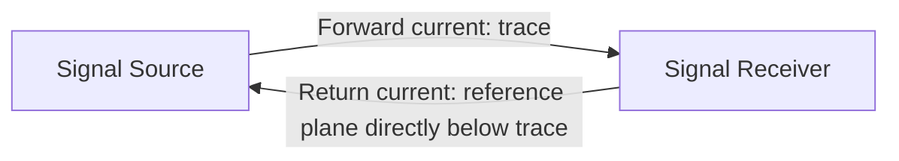

## Signal Integrity in PCB Design

### Overview

Signal integrity (SI) is the study and practice of ensuring that electrical signals travel through a PCB's traces, vias, and connectors with acceptable fidelity — preserving timing, voltage levels, and waveform shape well enough for a receiver to correctly interpret the intended digital or analog information. As embedded systems adopt faster clock speeds, higher-speed serial interfaces, and denser boards, signals increasingly behave like transmission lines rather than ideal wires, and signal integrity analysis becomes essential rather than optional.

### Why Signal Integrity Matters in Embedded Design

At low frequencies and short trace lengths, a PCB trace behaves approximately like an ideal, lossless wire — voltage appears essentially the same at both ends. As frequency increases and/or trace length grows relative to the signal's wavelength, this assumption breaks down, and the trace must be treated as a **transmission line** with distributed inductance, capacitance, and resistance. A useful rule of thumb: a trace should be treated as a transmission line requiring impedance control when its length approaches roughly one-sixth of the signal's electrical wavelength (or, more practically, when the signal's rise/fall time is comparable to the trace's propagation delay). [Inference — the specific threshold ratio varies by source and design margin philosophy; some references use 1/10 or other fractions]

Failure to account for signal integrity can cause:

- **Data corruption** from reflections, ringing, or excessive noise causing a receiver to misinterpret a logic level.
- **Timing violations** in synchronous interfaces (memory buses, high-speed SPI) where signal skew or delay exceeds the timing budget.
- **EMI/EMC compliance failures**, since poor signal integrity practices (uncontrolled return paths, ringing, overshoot) often correlate directly with excess radiated emissions.
- **Intermittent, hard-to-debug failures** that appear only under specific conditions (temperature, supply voltage, specific data patterns), often the hallmark of a marginal signal integrity issue rather than a purely logical design bug.

### Transmission Line Fundamentals

#### Characteristic Impedance

Every trace routed over a reference plane has a **characteristic impedance** ($Z_0$), determined by its physical geometry (width, thickness, height above the reference plane) and the surrounding dielectric material's permittivity. A signal traveling down a trace "sees" this impedance; if it encounters a change in impedance along its path (a via, a connector, a plane split, an unmatched receiver), a portion of the signal energy reflects back toward the source.

#### Reflections

Reflections occur at any impedance discontinuity. The magnitude and polarity of a reflection is described by the **reflection coefficient**:

$$\Gamma = \frac{Z_L - Z_0}{Z_L + Z_0}$$

where $Z_L$ is the load impedance and $Z_0$ is the trace's characteristic impedance. When $Z_L = Z_0$ (a perfectly matched load), $\Gamma = 0$ and no reflection occurs. When $Z_L \neq Z_0$, part of the signal reflects, potentially causing overshoot, undershoot, or ringing at the receiver — effects that can be severe enough to violate a receiver's absolute maximum voltage rating or cause false logic-level transitions.

#### Propagation Delay

Signals travel through PCB dielectric at a finite speed, typically expressed as propagation delay per unit length. For a typical FR-4 stripline, propagation delay is roughly 170–180 ps/inch; microstrip (outer layer, partially exposed to air) propagates somewhat faster due to the lower effective dielectric constant of the air/substrate mixture. [Unverified — exact figure depends on the specific dielectric material, and modern PCB laminates other than standard FR-4 will differ]

### Signal Integrity Concerns in Embedded Design

#### Ringing and Overshoot

Underdamped reflections cause the signal to oscillate around its final value before settling — visible on an oscilloscope as ringing following a transition edge. Excessive ringing can push a signal beyond a receiver's absolute maximum voltage rating (risking long-term damage) or cause a false secondary transition if the ringing crosses the logic threshold multiple times.

#### Crosstalk

Energy coupled from one signal trace ("aggressor") into a neighboring trace ("victim") via mutual capacitance and inductance between them.

- **Near-end crosstalk (NEXT)**: coupled noise appearing at the aggressor's driving end.
- **Far-end crosstalk (FEXT)**: coupled noise appearing at the far end of the victim trace, in the same direction as the aggressor's signal propagation.
- Crosstalk magnitude increases with parallel trace length, decreases with spacing between traces, and increases with proximity to the reference plane distance (closer coupling to a reference plane reduces trace-to-trace coupling by providing a preferential return path) — this is part of the rationale behind the "3W rule" (maintaining trace-to-trace spacing of at least 3 times the trace width) as a general crosstalk mitigation guideline.

#### Ground Bounce / Simultaneous Switching Noise (SSN)

When multiple output drivers switch simultaneously, the transient current through shared package and PCB ground inductance causes a momentary voltage shift on the local ground reference, which can appear as noise on other signals referenced to that same ground — particularly relevant on wide parallel buses (memory interfaces, parallel data buses) with many pins switching together.

#### Skew

Timing misalignment between signals that are intended to arrive simultaneously (differential pair legs, parallel bus bits, clock vs. data). Skew arises from unequal trace lengths, differing via counts, or dielectric inconsistencies across the board, and directly consumes a synchronous interface's timing margin.

### Return Path Integrity

A signal's return current does not travel through "ground" in the abstract — it flows through whatever adjacent conductor offers the lowest-impedance path, which at high frequencies is the reference plane directly beneath (or above) the signal trace, following the signal's path as closely as physically possible.

- **Plane splits/gaps beneath a trace** force return current to detour around the discontinuity, increasing loop area, increasing radiated emissions, and often introducing crosstalk into whatever other signal happens to share the return path detour.
- **Layer transitions (vias)** interrupt the return path unless a nearby return via (stitching via) provides continuity for the return current on the new reference layer — a common and important SI/EMI mitigation practice for high-speed vias.
- **Connector return path continuity** matters as much as trace return paths; a connector pinout that separates signal and ground pins poorly can introduce a significant return path discontinuity right at the board edge.

### Termination Strategies

Termination resistors are used to match a transmission line's impedance at the source, load, or both, minimizing reflections:

| Termination Type | Description | Typical Use |
|---|---|---|
| Series (source) termination | Resistor placed near the driver, in series with the trace | Point-to-point single-driver, single-receiver digital signals |
| Parallel (end) termination | Resistor placed at the receiver, to ground or a voltage reference | Signals needing DC-accurate termination, some bus topologies |
| Differential termination | Resistor placed across the two legs of a differential pair at the receiver | USB, differential clocks, high-speed serial links |
| AC termination | Resistor in series with a capacitor, placed at the receiver | Reduces DC power dissipation compared to plain parallel termination |

Correct termination value and placement depend on the specific interface standard and driver/receiver characteristics; termination is typically specified by the interface standard (e.g., USB, Ethernet PHY reference designs) or calculated to match the trace's characteristic impedance. [Inference — exact termination requirements are interface- and IC-specific and should be verified against the relevant datasheet or standard]

### Signal Integrity Analysis Approaches

- **Rule-of-thumb design guidelines**: for many embedded designs (moderate-speed SPI, I2C, GPIO, UART), following established layout best practices (short traces, solid reference planes, adequate spacing, proper termination where specified) is sufficient without formal simulation.
- **Field-solver impedance calculation**: using the fabricator's or an EDA tool's 2D field solver to calculate trace geometry for a target impedance based on the actual stackup, rather than relying on simplified formulas.
- **SPICE-based simulation**: modeling trace segments as transmission line elements (using measured or estimated $R$, $L$, $C$, $G$ per-unit-length parameters) to predict reflections, ringing, and eye diagrams before fabrication.
- **Full 3D electromagnetic simulation**: reserved for the most demanding high-speed designs (multi-gigabit serial links, DDR4/DDR5 memory interfaces) where 2D approximations are insufficient to capture via and connector discontinuities accurately.
- **Post-fabrication validation**: oscilloscope measurement (ideally with a high-bandwidth probe) of actual signal waveforms on the built board, comparing rise/fall time, overshoot, and eye-diagram quality (for serial links) against the interface specification's requirements.

### When Signal Integrity Becomes Critical in Embedded Design

Not every embedded design requires rigorous SI analysis. It becomes increasingly important as:

- **Clock speeds increase** (particularly MCU core/bus clocks above roughly tens of MHz, and any interface in the hundreds of MHz to GHz range).
- **Rise/fall times decrease**, since faster edges contain higher-frequency harmonic content, making even modestly long traces electrically "long" relative to the signal's effective bandwidth.
- **High-speed serial interfaces are used**: USB (especially USB 3.x), Ethernet, HDMI/DisplayPort, DDR memory, and high-speed SPI/QSPI/OSPI flash interfaces all warrant explicit SI consideration.
- **Board size and trace lengths grow**, since longer traces are more likely to become electrically "long" relative to signal wavelength/rise time.
- **Regulatory EMC compliance is required**, since SI and EMI are closely linked — a board with poor SI practices is statistically more likely to also fail radiated/conducted emissions testing.

### Common Signal Integrity Pitfalls in Embedded Design

- **Routing high-speed traces across plane splits**, forcing a detoured return path and increasing both crosstalk and radiated emissions.
- **Insufficient spacing between parallel high-speed traces**, causing crosstalk that manifests as intermittent data errors under specific data patterns.
- **Missing or incorrectly valued termination** on point-to-point high-speed links, causing reflections severe enough to corrupt data at the receiver.
- **Excessive stub length** from unused via barrel segments (particularly on high-speed vias passing through many unused layers), which can act as a resonant stub causing signal degradation at specific frequencies — often mitigated by back-drilling on very high-speed designs.
- **Ignoring rise/fall time when judging "how fast is fast"**, assuming a signal is "slow enough" to ignore SI based on clock frequency alone, when a fast-edge-rate driver on even a modest-frequency signal can still exhibit transmission-line behavior.
- **Assuming default EDA autorouter output preserves signal integrity intent**, when in practice autorouted traces often need manual review and adjustment for return path continuity, spacing, and length matching on any SI-sensitive net.

**Related Topics**
- Layer Stackup and Routing Strategies
- PCB Layout Principles
- Power Management — Decoupling and bypass capacitor placement
- EMC/EMI — Regulatory compliance testing and pre-compliance techniques
- High-Speed Design — DDR memory and Ethernet layout considerations
- Debugging — Oscilloscope measurement techniques for digital signals
- Component Selection and Footprints