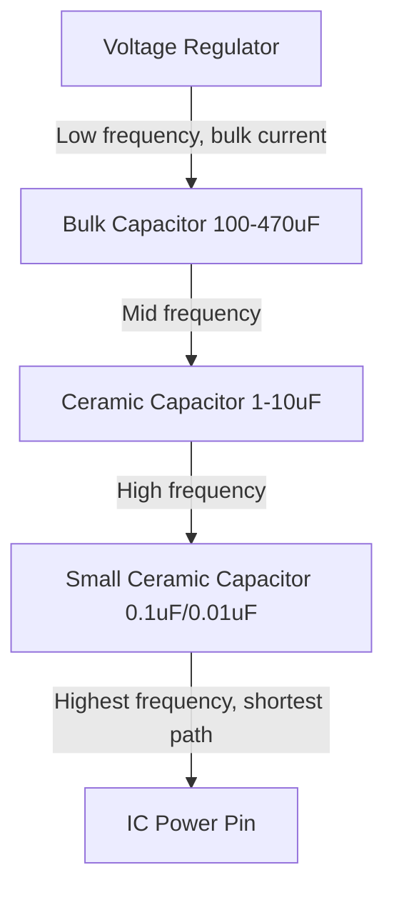

## Power Distribution Network Design

### Overview

A power distribution network (PDN) is the complete electrical path that delivers current from a voltage source (battery, regulator, connector) to every component on a board that consumes power — encompassing regulators, planes, traces, vias, and decoupling capacitors. PDN design is fundamentally about maintaining a stable voltage at every load point despite constantly varying current demand, particularly the fast, high-amplitude current transients that modern digital ICs (especially MCUs and FPGAs during clock edges) draw. A poorly designed PDN causes voltage droop, noise coupling, and can be a root cause of otherwise unexplainable intermittent system instability.

### Why PDN Design Is Its Own Discipline

Simply connecting a regulator's output to a component's power pin is not sufficient for modern digital designs because:

- **Load current is highly dynamic**, not static — a microcontroller's current draw can swing dramatically within nanoseconds as internal logic switches on a clock edge, demanding current far faster than a regulator's control loop can respond.
- **Every physical element in the power path has impedance** — plane resistance, trace inductance, via inductance — and a non-zero impedance PDN causes voltage to sag proportionally to the current transient's magnitude and rate of change ($V = L\frac{di}{dt}$), even if the regulator itself is otherwise ideal.
- **Multiple loads share the same distribution network**, meaning noise generated by one component's switching activity can couple into another component's supply if the PDN impedance is not adequately controlled across the relevant frequency range.

### The PDN as a Frequency-Dependent System

A well-designed PDN is best understood not as a single static resistance, but as a network whose impedance must remain low across a wide frequency range — from DC up to the highest-frequency current transients the load will generate (which can extend into the hundreds of MHz for fast digital switching edges).

$$Z_{PDN}(f) = \frac{V_{ripple}(f)}{I_{transient}(f)}$$

Different elements of the PDN are effective at controlling impedance in different frequency ranges:

| Frequency Range | Dominant PDN Element | Reason |
|---|---|---|
| DC – tens of kHz | Voltage regulator control loop | Regulator feedback loop actively corrects output voltage |
| kHz – low MHz | Bulk/electrolytic decoupling capacitors | Large capacitance supplies charge faster than the regulator loop can react |
| Low MHz – tens of MHz | Ceramic decoupling capacitors (larger values, e.g., 1–10 µF) | Lower ESR/ESL than bulk caps at these frequencies |
| Tens of MHz – hundreds of MHz | Small ceramic decoupling capacitors (0.1 µF, 0.01 µF) placed very close to IC pins | Minimal parasitic inductance from short physical connection |
| Hundreds of MHz+ | PCB plane capacitance (power/ground plane pair) and IC package/die capacitance | Physical proximity of plane pair and on-die capacitance dominates at these frequencies |

This layered, multi-value decoupling strategy is why embedded designs commonly place several different capacitor values at each IC's power pin rather than a single value — each size targets a different portion of the frequency spectrum. [Inference — the specific frequency breakpoints depend on the exact capacitor's ESR/ESL and mounting parasitic inductance]

### Decoupling Capacitor Placement Principles

- **Proximity minimizes loop inductance**: the physical loop formed by the capacitor, its connecting traces/vias, and the IC power/ground pins contributes parasitic inductance proportional to loop area; placing the capacitor as close as physically possible to the pin it serves directly reduces this inductance.
- **Via placement**: decoupling capacitor vias should be placed as close to the capacitor pad as possible (not routed through a long trace first) and ideally use short, wide connections rather than long thin traces to the power/ground planes.
- **Multiple vias per capacitor pad**: using two vias (one per pad) rather than a single shared via, and keeping them close together, reduces the effective loop inductance of the capacitor's connection to the planes.
- **Value selection per IC pin**: high-speed digital ICs commonly specify a decoupling scheme in their datasheet or reference design (e.g., "one 0.1 µF and one 0.01 µF per power pin, plus one bulk capacitor per power domain") — following the manufacturer's specific recommendation is generally preferable to a generic rule of thumb. [Inference — decoupling scheme requirements are highly IC-specific]
- **One capacitor per power pin, where the IC has multiple**: many modern MCUs and FPGAs have multiple physically separate power pins for the same internal rail (to reduce package/die inductance); each should generally receive its own local decoupling capacitor rather than relying on a single capacitor shared across all of them.

### Bulk Capacitance and Regulator-Side Decoupling

In addition to per-IC local decoupling, a PDN needs **bulk capacitance** near the voltage regulator output and at major current-consuming subsystems:

- **Regulator output capacitor**: sized per the regulator's datasheet stability requirements (both switching and linear regulators typically specify a minimum output capacitance and, for some, an ESR range for loop stability).
- **Bulk capacitance near high-current transient loads**: subsystems with large, fast current steps (a radio transitioning to transmit, a motor driver, a display backlight) benefit from local bulk capacitance to supply the transient current without excessively loading the main PDN or causing voltage droop elsewhere on the board.
- **Bulk capacitor technology trade-offs**: electrolytic capacitors offer high capacitance per volume at lower cost but have higher ESR and lower ripple current tolerance than tantalum or polymer capacitors, while ceramic capacitors in larger values (bulk MLCCs) offer low ESR but can be more expensive at higher capacitance values and are subject to DC bias derating.

### Plane Capacitance and Power/Ground Plane Pairs

A power plane and an adjacent ground plane, separated by a thin dielectric layer, form a distributed capacitor across the entire board area — sometimes called "plane capacitance" or the board's intrinsic decoupling.

- This distributed capacitance is most effective at very high frequencies (hundreds of MHz and above) where discrete capacitors' mounting inductance makes them ineffective, making the plane pair a critical contributor to PDN performance in that frequency range.
- **Thinner dielectric between power and ground planes increases plane capacitance** and lowers the plane pair's characteristic impedance, which is one reason some high-performance stackups deliberately place power and ground planes on adjacent layers with minimal dielectric spacing between them.
- Plane capacitance alone is generally insufficient at low-to-mid frequencies (its capacitance per unit area is small compared to discrete capacitors), which is why it supplements rather than replaces a proper multi-value discrete decoupling strategy.

### Current Distribution and IR Drop

Beyond high-frequency transient response, a PDN must also deliver adequate DC current with acceptable voltage drop (IR drop) across the board:

$$\Delta V = I \times R_{path}$$

- **Plane resistance vs. trace resistance**: a solid copper plane offers dramatically lower resistance for a given current path than an equivalent-current-carrying trace, which is why high-current power distribution favors dedicated planes or wide pours over traces wherever layer count allows.
- **Via current capacity**: a single via has a current-carrying limit dependent on its plated barrel diameter and length; high-current connections between layers (e.g., a power plane to a connector pin) typically use multiple vias in parallel to share the current and reduce localized heating.
- **Voltage margin budgeting**: the cumulative IR drop from the regulator output to the farthest load must be accounted for in the overall voltage tolerance budget, ensuring the load still receives voltage within its specified operating range even under worst-case current draw and trace/plane resistance.

### Multi-Rail PDN Considerations

Embedded designs commonly have several voltage rails (e.g., 3.3 V digital, 1.8 V core, 1.2 V DDR termination, 5 V USB) that must each have their own well-designed PDN while also managing interactions between rails:

- **Independent decoupling per rail**: each voltage rail requires its own decoupling strategy at each load; capacitors cannot be shared across different voltage rails.
- **Power sequencing interactions**: some multi-rail ICs require specific power-up/power-down ordering between rails (e.g., core voltage must be stable before I/O voltage is applied, or vice versa); a supervisory/sequencing IC or careful regulator enable-pin timing is used to enforce this, and getting it wrong can cause excessive inrush current, latch-up risk, or unreliable startup behavior.
- **Cross-rail noise coupling**: physically adjacent planes for different rails can couple noise between them, especially if a noisy digital rail's plane is directly adjacent (in the stackup) to a sensitive analog rail's plane, reinforcing the case for careful stackup layer ordering.

### PDN Design and Verification Workflow

1. **Identify all voltage rails and their loads**, including each load's expected static current draw and, where known, its transient current profile (magnitude and rate of change).
2. **Select decoupling values per IC per manufacturer guidance**, defaulting to a multi-value strategy (bulk + mid-range ceramic + small high-frequency ceramic) where explicit guidance is unavailable.
3. **Plan plane allocation and stackup layer ordering** to give each rail (where layer count allows) a dedicated plane, or a well-managed split region, with attention to adjacent-layer noise coupling.
4. **Place decoupling capacitors during component placement**, prioritizing proximity to IC power pins over routing convenience.
5. **Route/via power connections with adequate current capacity**, using multiple vias for high-current paths and wide, direct connections rather than long thin traces.
6. **Verify with PDN impedance analysis** (where design complexity warrants it) — some EDA tools offer PDN impedance simulation across frequency, predicting whether the decoupling strategy adequately controls impedance across the load's expected transient spectrum.
7. **Validate empirically post-fabrication** using an oscilloscope to measure actual voltage ripple/droop at critical load points under realistic operating conditions, comparing against the IC's specified supply noise tolerance.

### Common PDN Design Pitfalls in Embedded Design

- **Relying on a single decoupling capacitor value** per IC power pin when the manufacturer's reference design specifies multiple values for different frequency ranges.
- **Placing decoupling capacitors on the wrong side of the board or too far from the pin**, adding parasitic inductance that defeats the capacitor's high-frequency effectiveness even though it appears "close" in 2D layout view.
- **Undersizing bulk capacitance near subsystems with large current transients** (radio TX bursts, motor start-up, display backlight switching), causing voltage droop that can reset or destabilize other components sharing the same rail.
- **Routing power through narrow traces instead of planes/pours** when layer count would have allowed a dedicated plane, causing unnecessary IR drop and higher PDN impedance.
- **Ignoring power sequencing requirements** on multi-rail ICs, risking excessive inrush current or undefined behavior during power-up/power-down transitions.
- **Assuming DC bias derating doesn't apply**, using a decoupling capacitor's nominal capacitance value in analysis when the applied DC voltage significantly reduces its effective capacitance — particularly relevant for small-case-size, high-nominal-value ceramic capacitors.

**Related Topics**
- Power Management — Voltage regulators: linear and switching
- Power Management — Decoupling and bypass capacitor placement
- Layer Stackup and Routing Strategies
- Signal Integrity in PCB Design
- Component Selection and Footprints
- Measuring and Profiling Power Consumption
- Thermal Management — Package thermal resistance and heat dissipation