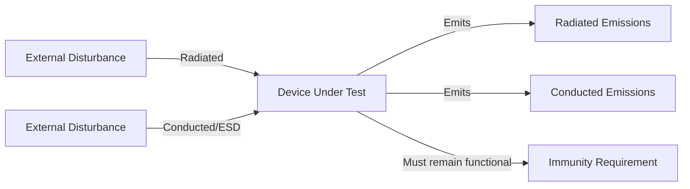
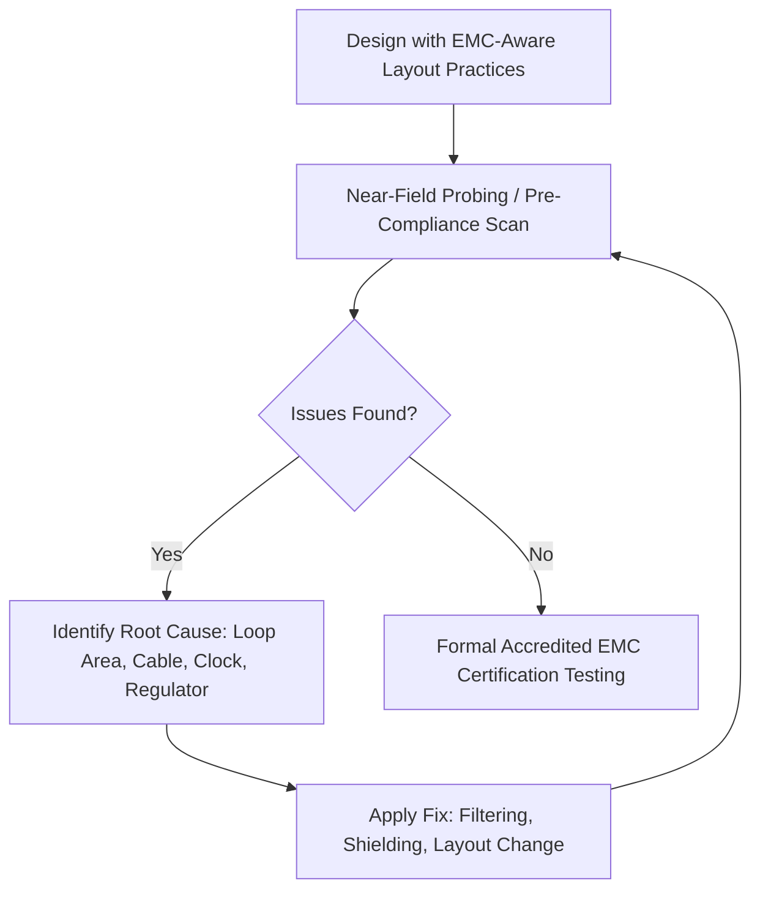

## EMI and EMC Considerations

### Overview

Electromagnetic interference (EMI) refers to unwanted electrical noise or energy — conducted or radiated — that can disrupt the operation of nearby electronic equipment. Electromagnetic compatibility (EMC) is the broader discipline of ensuring a device both limits its own emissions to acceptable levels and remains functionally robust in the presence of external electromagnetic disturbances. For embedded devices, EMC is not optional polish — it is typically a legal/regulatory requirement for market entry, and it is deeply intertwined with the signal integrity, PDN, and layout decisions made throughout the design process.

### EMI vs. EMC: Two Sides of the Same Discipline

- **Emissions**: energy unintentionally radiated or conducted from the device that could interfere with other equipment (radios, other electronics, communication infrastructure).
- **Immunity/susceptibility**: the device's ability to continue operating correctly when exposed to external electromagnetic disturbances (nearby radio transmitters, electrostatic discharge, power line transients, other equipment's emissions).
- **EMC compliance** requires managing both directions simultaneously — a device that emits acceptably but is easily disrupted by external noise (or vice versa) fails to be truly electromagnetically compatible with its operating environment.

### Coupling Mechanisms

Interference travels from a source to a victim circuit through one or more coupling paths:

- **Conducted coupling**: interference travels along a shared physical conductor — a power cable, ground connection, or signal wire — directly connecting source and victim.
- **Radiated coupling**: interference propagates as an electromagnetic wave through free space, coupling into nearby traces, cables, or enclosures acting as unintentional antennas.
- **Capacitive (electric field) coupling**: coupling through parasitic capacitance between two nearby conductors at different potentials, dominant for high-impedance victim circuits.
- **Inductive (magnetic field) coupling**: coupling through mutual inductance between two current loops, dominant for low-impedance victim circuits and particularly relevant near switching regulators and their inductors.

### Common EMI Sources in Embedded Devices

- **Switching regulators**: the high di/dt switching node and its associated current loop (input capacitor, switch, inductor, output capacitor) is one of the most significant broadband EMI sources on a typical embedded board, radiating both at the fundamental switching frequency and its harmonics.
- **Digital clock and bus signals**: fast edge-rate digital signals (MCU clocks, high-speed buses, oscillators) generate harmonic energy extending well beyond their fundamental frequency, and any trace or cable that acts as an efficient antenna at those harmonic frequencies becomes a radiating source.
- **Connectors and cables**: cables are often the most efficient unintentional antennas on a product, since their length is frequently comparable to the wavelength of harmonics generated by onboard digital circuitry — poor cable shielding/grounding is a very common root cause of emissions failures.
- **Crystal oscillators**: high-Q resonant circuits that, if inadequately shielded or routed near noisy traces, can both radiate their own energy and be susceptible to coupled interference affecting frequency stability.
- **Motor drivers and other high-current switching loads**: any circuit rapidly switching significant current (motor drivers, relay drivers, LED PWM dimming at high current) is a potential broadband emission source through the same $di/dt$ mechanism as switching regulators.

### Common Immunity Threats

- **Electrostatic discharge (ESD)**: a rapid, high-voltage transient (potentially several kV) from human contact or triboelectric charging, capable of damaging unprotected IC inputs or causing transient logic upsets; embedded designs commonly include ESD protection components (TVS diodes, series resistors) on externally accessible connectors and user-facing interfaces.
- **Electrical fast transients (EFT/burst)**: rapid bursts of transient noise, often coupled onto power or signal lines from nearby switching equipment (relays, motor contactors), tested via standards such as IEC 61000-4-4.
- **Radiated immunity**: susceptibility to external RF fields (from nearby transmitters, wireless devices, or intentional test fields during compliance testing), evaluated per standards such as IEC 61000-4-3.
- **Conducted immunity**: susceptibility to noise injected onto cables/power lines from external sources, evaluated per standards such as IEC 61000-4-6.
- **Power line surge/transients**: momentary high-energy voltage spikes on AC or DC power input lines (e.g., from lightning-induced surges or load switching), tested via standards such as IEC 61000-4-5.

### Design Techniques for Emissions Control

Most emissions-reduction techniques trace back to the same underlying principle: **minimize the loop area and rate of change of current in any path that could act as a radiating source**, and **provide low-impedance, continuous return paths for all signal and power currents**.

- **Solid, unbroken reference planes** beneath signal traces minimize return-path loop area — a recurring theme connecting layout, signal integrity, and EMI practice.
- **Tight switching regulator layout**: keeping the high-current switching loop (input cap – switch – inductor – output cap) physically compact directly reduces the loop's radiating efficiency.
- **Clock and oscillator containment**: routing high-frequency clock signals with adjacent ground stitching, minimizing trace length, and avoiding routing near board edges or connectors reduces their contribution to radiated emissions.
- **Cable and connector shielding/grounding**: properly grounding cable shields (ideally at both ends, or per the specific interface standard's recommendation) and using ferrite beads/common-mode chokes on cables prone to carrying high-frequency noise reduces cable-radiated emissions.
- **Filtering at I/O boundaries**: placing filter components (ferrite beads, common-mode chokes, capacitors to ground) at the point where a signal or power line exits the board/enclosure prevents onboard noise from escaping via the cable, and conversely blocks external noise from entering.
- **Enclosure shielding**: a conductive (metal or metallized-plastic) enclosure can significantly attenuate both emissions and susceptibility, provided seams, vents, and cable entry points are designed to preserve shielding continuity (gaps and slots can otherwise act as slot antennas, undermining the shield's effectiveness).
- **Spread-spectrum clocking**: some oscillators/PLLs support dithering the clock frequency slightly over time, spreading the emitted energy across a wider frequency band rather than concentrating it at a single frequency — this can help meet peak emission limits (which are typically what regulatory tests measure) without reducing total radiated energy.

### Design Techniques for Immunity

- **ESD protection components**: TVS (transient voltage suppressor) diodes placed at externally accessible connectors and user-interface pins (buttons, USB, exposed headers) clamp transient voltage spikes before they reach sensitive IC inputs.
- **Series resistors/ferrite beads on signal lines**: added impedance on signal paths, particularly those exiting the board to external connectors, can reduce the coupling of injected transients into sensitive circuitry.
- **Robust grounding and shielding architecture**, matching the emissions-side techniques above, since a board with good return-path integrity and proper shielding is generally also more immune to externally coupled noise.
- **Software/firmware robustness**: watchdog timers, brown-out detection, and defensive input validation help a system recover gracefully from a transient upset (e.g., a bit flip or momentary logic glitch caused by an EMI event) rather than entering an undefined or locked-up state.
- **Isolation techniques**: galvanic isolation (optocouplers, isolated DC-DC converters, digital isolators) breaks a direct conductive path between circuit sections, preventing conducted transients from propagating across the isolation boundary — common in designs with connections to noisy or hazardous external environments (industrial control, mains-adjacent circuitry).

### Regulatory Context

Embedded products intended for commercial sale are typically subject to regional EMC regulations, which vary by target market:

- **FCC Part 15** (United States): governs unintentional and intentional radiators, with different emission limits and procedures depending on device classification.
- **CE marking / EN standards** (European Union): EMC Directive compliance is required for electronic products sold in the EU, referencing harmonized EN standards for specific emissions and immunity test methods.
- **Other regional requirements** (e.g., Japan's VCCI, various national requirements elsewhere) may apply depending on target markets, and a product sold globally often needs to meet the most stringent applicable requirement across all target regions, or be tested/certified separately per region.

Compliance requirements are region- and product-category-specific, and exact applicable standards and limits should be verified against current regulatory guidance for the specific product type and target market rather than assumed. [Unverified — regulatory requirements are subject to change and vary significantly by product classification and jurisdiction]

### Pre-Compliance Testing

Because formal EMC certification testing (in an accredited lab) is expensive and typically scheduled late in a program, many embedded design teams perform **pre-compliance testing** earlier in development to catch problems while they are cheaper to fix:

- **Near-field probing**: using small H-field or E-field probes connected to a spectrum analyzer, moved across the board's surface to identify localized emission "hot spots" (often revealing exactly which component or trace is the dominant emitter), without requiring a full anechoic chamber setup.
- **Pre-compliance chambers or open-area test sites**: lower-cost or shared-access radiated emissions measurement setups that approximate (though not with full certified accuracy) the formal test environment, giving an early read on whether the design is likely to pass formal certification.
- **ESD gun testing**: applying controlled ESD events to accessible connectors and enclosure points during development to verify protection component effectiveness before formal immunity testing.
- **Iterative fix-and-retest cycles**: pre-compliance testing is most valuable when performed early enough in the design cycle that layout or component changes (adding a filter, adjusting a ground connection) remain feasible without requiring a full board respin.

### Common EMC Pitfalls in Embedded Design

- **Treating EMC as a late-stage checkbox** rather than a layout-time consideration, leading to expensive respins when formal certification testing reveals failures that trace back to fundamental layout decisions (plane splits, loop areas, reference plane discontinuities).
- **Under-filtering or ungrounded cables**, leaving the single most efficient antenna on the product (an external cable) essentially unmitigated.
- **Neglecting enclosure shielding continuity**, where a metal enclosure's seams, vents, or cable entry points undermine its shielding effectiveness through unintentional slot-antenna behavior.
- **Missing ESD protection on user-accessible interfaces**, resulting in field failures or intermittent resets triggered by ordinary human contact with connectors or buttons.
- **Assuming a design that "passed" informal near-field probing will automatically pass formal certification**, when pre-compliance testing is inherently approximate and cannot fully substitute for accredited testing under the exact required test conditions.
- **Ignoring firmware-level robustness**, assuming hardware mitigation alone is sufficient, when a well-designed watchdog and defensive coding practice can meaningfully improve real-world immunity resilience against transient upsets that hardware filtering alone does not fully eliminate.

**Related Topics**
- Signal Integrity in PCB Design
- Power Distribution Network Design
- Layer Stackup and Routing Strategies
- PCB Layout Principles
- Power Management — Voltage regulators: linear and switching
- Reliability — ESD protection component selection
- Manufacturing — Regulatory certification and compliance testing workflow