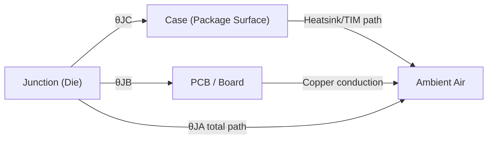

## Thermal Management on PCBs

### Overview

Thermal management on PCBs is the practice of controlling heat generation, conduction, and dissipation so that every component operates within its rated temperature range, the board's reliability is not compromised, and the enclosure/environment interface stays within acceptable limits. In embedded devices, thermal design is often underestimated relative to electrical design, yet excessive temperature is one of the most common root causes of both immediate component failure and long-term reliability degradation.

### Why Thermal Management Matters

- **Component reliability**: semiconductor failure rates roughly follow an Arrhenius-type relationship with temperature — sustained operation closer to a component's maximum rated junction temperature significantly increases long-term failure probability, even if the device functions correctly at that temperature in the short term. [Inference — the exact acceleration factor is failure-mechanism- and component-specific; this is a general reliability engineering principle, not a universal fixed formula]
- **Parametric performance drift**: many electrical parameters shift with temperature — oscillator frequency stability, analog reference voltage accuracy, battery internal resistance, and semiconductor leakage current all vary with temperature, which can degrade system accuracy or efficiency well before outright failure occurs.
- **Thermal runaway risk**: some failure modes (certain battery chemistries, some power semiconductor faults) can become self-reinforcing, where rising temperature increases current draw or resistance in a way that further raises temperature — thermal design margin is a key mitigation for this class of risk.
- **Mechanical and enclosure effects**: sustained high temperature can degrade adhesives, connectors, plastic enclosures, and solder joints over the product's service life, and user-facing surface temperature is often subject to safety regulations limiting how hot an enclosure may become during normal operation.

### Heat Generation Sources on Embedded Boards

- **Voltage regulators**, particularly linear regulators operating with significant input-to-output differential, where all dropped voltage becomes dissipated heat (see Voltage Regulators topic).
- **Power semiconductors**: MOSFETs, motor drivers, and power ICs dissipate heat proportional to their conduction losses ($I^2R$) and switching losses.
- **High-speed digital ICs**: MCUs, FPGAs, and SoCs dissipate power roughly proportional to clock frequency, supply voltage squared, and switching activity — a relationship generally described by the dynamic power equation $P \approx C V^2 f$, though static/leakage power also contributes and can dominate in some process nodes or at elevated temperature. [Inference — modern process nodes and power-gating techniques significantly complicate this simplified relationship]
- **RF power amplifiers**: transmitter output stages, particularly in cellular or higher-power wireless modules, can be a concentrated and significant heat source during transmission bursts.
- **Resistive/passive elements**: current-sense resistors, snubber resistors, and any component intentionally dissipating power as part of its function.

### Heat Transfer Fundamentals

Heat leaves a component through three physical mechanisms, all of which are relevant to PCB thermal design:

- **Conduction**: heat transfer through direct physical contact — from the die, through the package, into the PCB copper, and onward to a heatsink or enclosure. This is typically the dominant and most controllable path for PCB-mounted components.
- **Convection**: heat transfer to a moving fluid (typically air) — either natural convection (buoyancy-driven airflow) or forced convection (fan-driven airflow), relevant to how heat ultimately leaves the enclosure into the ambient environment.
- **Radiation**: heat transfer via electromagnetic (infrared) emission — generally a smaller contributor at the temperatures typical of embedded electronics compared to conduction and convection, though it becomes more significant at higher temperature differentials.

### Thermal Resistance Model

Component and system-level thermal behavior is commonly modeled using an electrical-circuit analogy, where thermal resistance ($\theta$, in °C/W) is analogous to electrical resistance, heat flow (power, in watts) is analogous to current, and temperature difference is analogous to voltage:

$$\Delta T = P \times \theta$$

- **$\theta_{JA}$ (junction-to-ambient)**: total thermal resistance from the die junction to the surrounding ambient air, encompassing the package, PCB, and any heatsinking — the figure most directly useful for estimating junction temperature in a specific application, but highly dependent on the actual PCB copper area and airflow conditions used during the datasheet's characterization.
- **$\theta_{JC}$ (junction-to-case)**: thermal resistance from the die junction to the package's exterior surface, useful when an external heatsink is directly attached to the package case.
- **$\theta_{JB}$ (junction-to-board)**: thermal resistance from the die junction to the PCB itself, useful for evaluating how effectively a component's heat can be conducted into the board's copper.

The overall junction temperature can be estimated as:

$$T_J = T_A + (P \times \theta_{JA})$$

where $T_A$ is ambient temperature and $P$ is the component's power dissipation. **This estimate should be treated as approximate**, since $\theta_{JA}$ figures published on datasheets are typically characterized under specific standardized test board conditions (defined copper area, layer count, no airflow) that often differ substantially from the actual product's PCB design and enclosure environment. [Inference — the degree of deviation from datasheet conditions is design-specific and can be significant; a full thermal simulation or empirical measurement is more reliable for critical designs]

### PCB-Level Thermal Design Techniques

- **Copper pour as heat spreader**: large, unbroken copper areas (ground/power planes, dedicated thermal copper pours) conduct heat away from a hot component across a wider board area, reducing localized temperature rise by increasing the effective heat-dissipating surface.
- **Thermal vias**: an array of plated vias placed beneath a component's exposed thermal pad (common on QFN, DFN, and many power ICs) conducts heat from the top copper layer down through the board to internal or bottom-layer copper, dramatically improving $\theta_{JA}$ compared to a design relying on top-layer copper alone.
- **Via filling/capping considerations**: thermal vias directly under a component's solder pad may need to be filled or capped (per the fabricator's process) to prevent solder from wicking down into the via during reflow, which could otherwise create solder voids or an unreliable joint.
- **Copper weight selection**: heavier copper (2 oz/ft² or higher, versus the common 1 oz/ft² default) reduces both electrical resistance and thermal resistance of copper conduction paths, useful for high-current or high-heat-dissipation designs, at increased fabrication cost.
- **Component placement for thermal distribution**: spreading heat-generating components across the board rather than clustering them prevents compounding local hot spots, and placing them away from temperature-sensitive components (crystals, precision analog references) prevents thermal coupling from degrading those components' accuracy.
- **Dedicated thermal relief to enclosure**: in fully enclosed products without active cooling, a thermal pathway from the hottest component through the PCB to a metal enclosure wall or dedicated heat-spreading structure can be necessary to keep junction temperatures within budget.

### External Thermal Management Elements

- **Heatsinks**: attached (via thermal adhesive, clip, or screw with thermal interface material) directly to a component's package to increase its effective surface area for convective heat transfer to ambient air.
- **Thermal interface materials (TIMs)**: thermal pads, thermal paste/grease, or phase-change materials fill microscopic air gaps between a component and a heatsink or enclosure wall, since air is a poor thermal conductor and even small gaps significantly degrade heat transfer if left unfilled.
- **Forced-air cooling (fans)**: used when natural convection is insufficient for the design's total heat dissipation, common in higher-power embedded systems (industrial controllers, higher-performance compute modules) but adds cost, noise, reliability concerns (moving parts), and power consumption that must be weighed against passive alternatives.
- **Heat pipes and vapor chambers**: passive two-phase heat transfer devices that can move heat efficiently over a distance from a concentrated hot source to a larger dissipation area, more commonly seen in higher-power or space-constrained embedded compute products than in typical low-power embedded designs.

### Thermal Design Workflow

1. **Identify all significant heat sources** and estimate each component's worst-case power dissipation under the product's actual operating profile (not just datasheet typical conditions).
2. **Gather thermal resistance data** ($\theta_{JA}$, $\theta_{JC}$, or full thermal models) for each significant heat-generating component from its datasheet.
3. **Estimate junction temperatures** under worst-case ambient conditions and duty cycle, applying appropriate margin given the approximate nature of datasheet $\theta_{JA}$ figures.
4. **Apply PCB-level mitigation** (copper pour, thermal vias, copper weight, placement) proportional to each component's dissipation and thermal budget.
5. **Consider external thermal elements** (heatsink, TIM, forced air) if PCB-level techniques alone are insufficient to meet the temperature budget.
6. **Validate with thermal simulation** (where design complexity and risk warrant it) using PCB thermal simulation tools that model the actual copper layout, component placement, and enclosure boundary conditions.
7. **Empirically verify** using thermal imaging (IR camera) or thermocouples on a built prototype under realistic worst-case operating conditions and ambient temperature, comparing measured junction/case temperatures (or a close proxy) against the component's rated limits.

### Thermal Imaging and Empirical Validation

- **Infrared (IR) thermal cameras** provide a fast, visual way to identify hot spots across an entire board during operation, though surface emissivity differences between materials (bare copper vs. solder mask vs. component packages) require calibration or emissivity-matched reference points for accurate absolute temperature readings.
- **Thermocouples or embedded temperature sensors** provide more accurate point measurements at specific locations of interest (e.g., directly on a component's case, or embedded near a critical junction), useful for validating simulation predictions or continuous field monitoring.
- **Worst-case condition testing**: thermal validation should be performed under the product's actual worst-case combination of ambient temperature, sustained load/duty cycle, and enclosure configuration, since thermal issues often only manifest under conditions not represented by brief bench testing at room temperature.

### Common Thermal Pitfalls in Embedded Design

- **Relying on datasheet $\theta_{JA}$ without accounting for the actual PCB's copper area**, since datasheet $\theta_{JA}$ figures assume a specific standardized test board that may not resemble the actual product's smaller or differently-configured copper layout.
- **Omitting or under-sizing thermal vias** beneath a component's exposed thermal pad, leaving the pad's heat-dissipation potential largely unused.
- **Clustering multiple heat-generating components together** without considering their compounding thermal effect on each other and on the surrounding board area.
- **Placing temperature-sensitive components (crystals, precision analog) too close to heat sources**, causing frequency drift or accuracy degradation that may not manifest as an obvious "failure" but rather a subtle performance issue.
- **Validating thermal performance only at room temperature and light load**, missing failures that only appear under the product's actual worst-case ambient and duty-cycle combination.
- **Neglecting enclosure-level thermal design**, where even a well-thermally-designed PCB can still overheat if the enclosure has inadequate ventilation or thermal pathway to ambient, particularly in fully sealed or IP-rated enclosures.

**Related Topics**
- Power Management — Voltage regulators: linear and switching
- Component Selection and Footprints
- Power Distribution Network Design
- PCB Layout Principles
- Reliability — Accelerated life testing and failure rate estimation
- Measuring and Profiling Power Consumption
- Manufacturing — Design for manufacturability (DFM) and design for assembly (DFA)