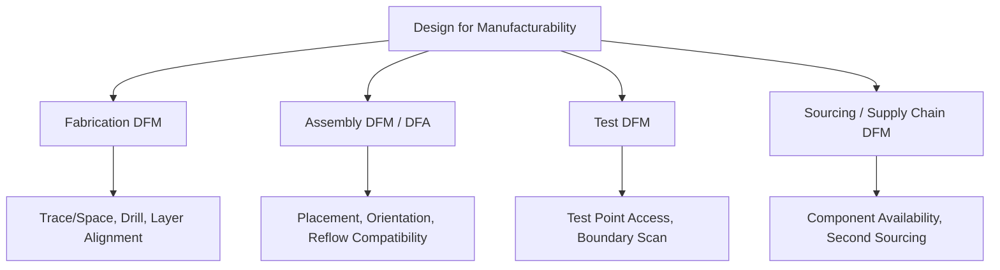
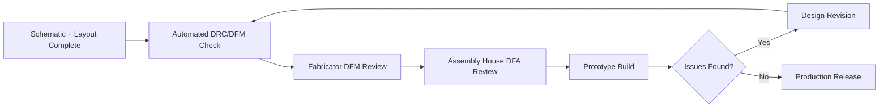

## Design for Manufacturability

### Overview

Design for Manufacturability (DFM) is the practice of designing a PCB and product so that it can be fabricated, assembled, and tested reliably, efficiently, and at acceptable cost and yield. DFM is not a single checklist applied at the end of design — it is a set of considerations that should influence decisions from component selection through layout, ideally applied continuously rather than as a final gate before release. A design that is electrically perfect but manufacturing-unfriendly can still result in low yield, high cost, or production delays.

### Why DFM Matters for Embedded Devices

- **Yield impact**: manufacturing defects (solder bridges, tombstoning, insufficient solder, misregistration) directly reduce the percentage of boards that pass functional test on the first attempt, and low yield inflates effective per-unit cost even if component cost itself is low.
- **Cost sensitivity at scale**: a manufacturability issue that is a minor inconvenience at prototype quantities (1–10 units) can become a significant cost multiplier at production volumes (thousands to millions of units), where even small per-unit process time or rework costs compound.
- **Time-to-market risk**: DFM issues discovered late (during pilot production or full-scale manufacturing) often require a board respin, directly delaying product launch and consuming engineering resources that could otherwise focus on new development.
- **Different fabricators/assemblers have different capabilities**: a design that is fine for one manufacturing partner's process may exceed another's capability, so DFM decisions should be made with the intended (or realistically likely) manufacturing partner's capability in mind.

### DFM Categories

### Fabrication DFM (Bare Board Manufacturing)

Concerns related to whether the bare PCB itself can be reliably fabricated:

- **Minimum trace width and spacing**: every fabricator publishes a minimum feature size their process can reliably achieve; designing at or near this minimum increases cost and reduces yield compared to designing with margin above it.
- **Minimum drill size and aspect ratio**: smaller drill diameters and higher board-thickness-to-drill-diameter ratios (aspect ratio) are more expensive and yield-sensitive to manufacture; very small vias on thick boards push toward the edge of standard process capability.
- **Annular ring**: the minimum copper ring remaining around a drilled hole after accounting for drill registration tolerance; insufficient annular ring risks a via losing its connection to the pad ("breakout") if drilling registration is imperfect.
- **Layer-to-layer registration tolerance**: on multi-layer boards, each layer must align precisely with the others during lamination; tighter registration requirements (needed for very fine-pitch BGA breakout, for example) increase cost and reduce yield margin.
- **Copper weight and etch tolerance**: heavier copper weights require wider etch compensation, since the etching process removes copper somewhat unevenly at trace edges proportional to copper thickness — thin, closely-spaced traces on heavy copper are particularly challenging.
- **Board thickness and material selection**: standard thicknesses and standard laminate materials (e.g., standard FR-4) are generally lower-cost and higher-yield than non-standard thicknesses or exotic high-frequency laminates, which should only be specified when the design genuinely requires their properties.
- **Panelization design**: how individual boards are arranged within a manufacturing panel (with breakaway tabs, v-scoring, or routed slots) affects both fabrication and assembly efficiency; boards should be designed with adequate edge clearance and consideration for how they will be depanelized without damaging edge components.

### Assembly DFM / Design for Assembly (DFA)

Concerns related to whether components can be reliably placed and soldered onto the fabricated board:

- **Component orientation consistency**: aligning similar components (especially polarized parts like diodes, electrolytic capacitors, and ICs) in a consistent orientation across the board simplifies visual inspection and reduces the chance of assembly errors, compared to a design where similar parts point in many different directions.
- **Adequate component-to-component spacing**: sufficient clearance between components (respecting each footprint's courtyard) is necessary for pick-and-place equipment nozzles and for post-reflow rework/inspection access; violating courtyard clearances is a common cause of assembly defects or inability to rework a failed component.
- **Avoiding mixed reflow profile requirements on one board**: components with significantly different maximum reflow temperature ratings, or a mix of components requiring different soldering processes (e.g., some parts needing wave soldering while most use reflow), complicate the assembly process and may require additional manual steps.
- **Paste stencil design**: solder paste aperture size and shape (often reduced relative to the copper pad for fine-pitch parts, or modified for particular pad shapes) significantly affects solder joint quality; this is typically handled by the footprint library but should be reviewed for unusual or fine-pitch components.
- **Fiducial markers**: reference marks placed on the PCB (and sometimes on individual fine-pitch component footprints as local fiducials) allow pick-and-place equipment to precisely calibrate board position and rotation before placing components — omitting global fiducials is a common oversight that degrades placement accuracy.
- **Tombstoning risk on small passives**: an imbalance in thermal mass or pad geometry between the two ends of a small two-terminal passive (particularly 0402 and smaller) during reflow can cause one end to lift off the board while the other remains soldered; symmetric pad design and considered component orientation relative to the reflow oven's thermal profile direction can mitigate this.
- **Through-hole and mixed-technology considerations**: boards combining surface-mount and through-hole components typically require either a separate wave/selective soldering step or hand soldering for the through-hole parts, adding process steps and cost compared to an all-SMT design.
- **BGA and fine-pitch inspection access**: components with hidden solder joints (BGAs, some QFN packages) cannot be visually inspected after reflow and typically require X-ray inspection to verify joint quality, which should be planned for if such packages are used.

### Test DFM (Design for Testability)

Concerns related to whether the assembled board can be effectively verified during and after production:

- **Test point accessibility**: key signals (power rails, reset, critical communication buses, programming/debug interfaces) should have physically accessible test points for bed-of-nails in-circuit testing (ICT) or manual probing during bring-up and production test, without requiring the enclosure to be opened in a way that damages the product.
- **Programming/debug header placement**: firmware programming and debug interfaces should be placed with test fixture access in mind, and ideally support automated programming during production rather than requiring a manual, per-unit process.
- **Boundary scan (JTAG) support**: for boards with limited physical test point access (very dense, high pin-count designs), designing in boundary-scan-capable ICs and providing JTAG chain access can substitute for some physical test point coverage.
- **Functional test fixture design considerations**: connectors, mounting holes, and mechanical features intended to mate with a production test fixture should be planned early enough in the design to avoid constraining the fixture design unnecessarily late in the program.
- **Panel test strategy**: whether boards will be tested individually or while still in panel form affects panelization design and test fixture requirements.

### Sourcing and Supply Chain DFM

- **Avoiding single-sourced or scarce components**: designing with parts that have multiple qualified manufacturers or readily available pin-compatible alternates reduces the risk of a production stoppage due to a single supplier's shortage or discontinuation.
- **Checking lifecycle status before finalizing a design**: components flagged NRND (Not Recommended for New Designs) or nearing end-of-life should generally be avoided or, if unavoidable, flagged for early redesign planning.
- **Minimum order quantities and packaging format**: some components are only available in large reel quantities or specific packaging (tape-and-reel vs. cut tape vs. tray) that may not suit prototype-quantity builds, a consideration relevant when planning both prototype and production sourcing separately.
- **Regional sourcing and tariff/export considerations**: for products manufactured or sold across multiple regions, component origin and applicable trade regulations can affect both cost and lead time, and are increasingly relevant given global supply chain volatility. [Unverified — specific trade regulation impacts are jurisdiction- and time-dependent and should be verified against current guidance]

### DFM Review Process

1. **Automated DRC/DFM checks within the EDA tool**, catching baseline fabrication rule violations (trace width, spacing, drill size) before file export.
2. **Fabricator-specific DFM check**: many PCB fabricators offer a DFM analysis service (sometimes automated, sometimes with manual review) upon file submission, flagging issues specific to their process capability before committing to production.
3. **Assembly house DFA review**: similarly, contract manufacturers often review a design for assembly-specific concerns (component spacing, orientation, reflow compatibility) before committing to a build, especially valuable before a first production run.
4. **Design review with manufacturing stakeholders**: involving manufacturing/production engineering perspective in design review (not just electrical/firmware review) surfaces issues that a purely electrical review might miss.
5. **Prototype build feedback loop**: issues discovered during small-batch prototype assembly (difficult rework, marginal solder joints, awkward test point access) should feed back into the design before committing to full production tooling and volume orders.

### Cost Drivers Influenced by DFM Decisions

- **Layer count**: directly affects fabrication cost; unnecessary layers add cost without corresponding benefit, while too few layers can force compromises elsewhere (routing density, signal integrity) that create their own cost/yield issues.
- **Board size and panel utilization**: how efficiently individual boards tile within a standard manufacturing panel affects the effective cost per board — awkward board dimensions or shapes can waste panel area and increase per-unit fabrication cost.
- **Surface finish selection**: different PCB surface finishes (HASL, ENIG, immersion silver, OSP) carry different costs and offer different trade-offs in shelf life, solderability, and suitability for fine-pitch components; ENIG is commonly used for fine-pitch/BGA designs despite higher cost than HASL, due to its flatter surface.
- **Special process requirements**: controlled impedance certification, blind/buried vias, via-in-pad with fill/cap, heavy copper, or exotic laminate materials all add cost and should be specified only where the design genuinely requires them.
- **Assembly process complexity**: mixed-technology boards (SMT + through-hole), components requiring hand assembly, or extensive rework needs all increase per-unit assembly labor cost, particularly impactful at lower production volumes where labor cost is not amortized across large batches.

### Common DFM Pitfalls in Embedded Design

- **Designing at the absolute minimum feature size** the fabricator's process nominally supports, leaving no margin and risking yield issues, rather than designing with reasonable margin above the stated minimum.
- **Ignoring courtyard/clearance requirements** during placement, leading to components that pick-and-place equipment cannot reliably place or that cannot be reworked without disturbing neighbors.
- **Selecting components without checking supply chain risk**, only discovering availability problems when production ordering begins.
- **Deferring DFM review until after layout is "finished"**, treating it as a final gate rather than an ongoing consideration, which maximizes the cost and disruption of any issues found.
- **Mixing incompatible reflow-temperature-rated components** on a single board without planning for the process implications, discovered only during first assembly attempt.
- **Omitting fiducial markers or adequate test point access**, only realizing the impact once the board reaches a contract manufacturer's assembly and test line and process efficiency suffers.
- **Assuming a design that succeeded at prototype scale will scale cleanly to production volume**, without validating that yield-sensitive elements (fine-pitch components, tight tolerances) remain manufacturable at the throughput and process consistency required for volume production.

**Related Topics**
- PCB Layout Principles
- Component Selection and Footprints
- Layer Stackup and Routing Strategies
- Schematic Capture Fundamentals
- Quality — Solder joint reliability and reflow profile fundamentals
- Manufacturing — Bill of materials (BOM) management and component sourcing
- Reliability — Accelerated life testing and failure rate estimation